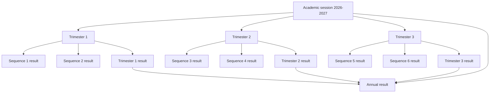
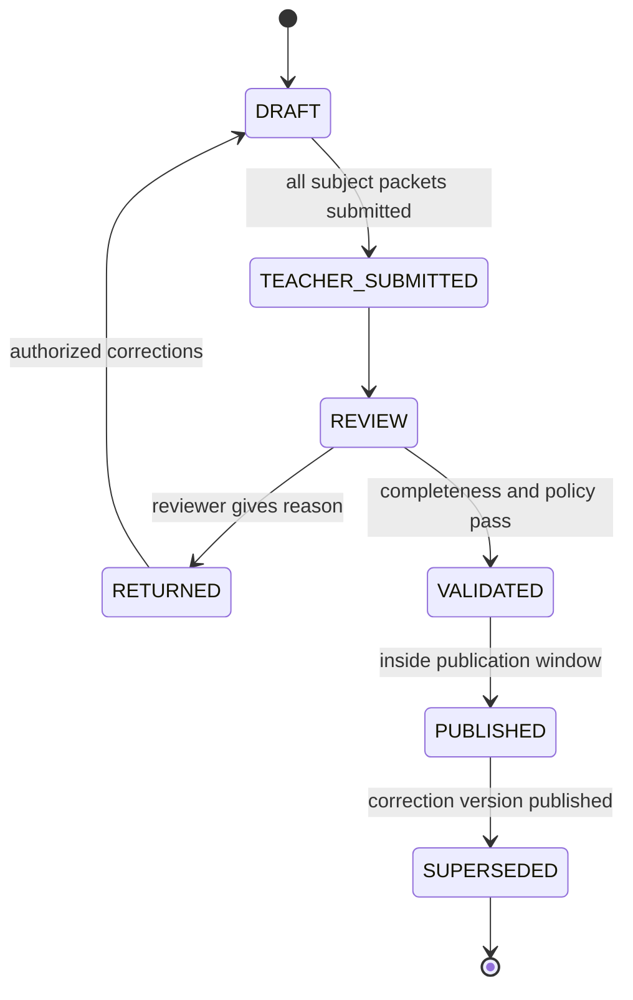

# BAY-10 — Academic Results and Report Cards Master Implementation Plan

## 1. Purpose of this document

This is the implementation handoff for the complete BAY-10 epic. It is intentionally more detailed than a normal product specification because another implementation agent must be able to execute it without inventing business rules.

The implementation must deliver:

- session-aware and enrollment-aware marks;
- three trimesters per academic session;
- two sequences inside each trimester;
- independent sequence, trimester, and annual results;
- teacher-owned subject marks and remarks;
- student identity and profile photo integration;
- attendance, discipline, class statistics, awards, and council decisions;
- controlled validation, publication, correction, and parent visibility;
- official bilingual, versioned PDF report cards and class PV exports;
- an annual published result that becomes the authoritative input for promotion.

This planning pass does **not** authorize replacing the existing session, enrollment, attendance, timetable, document, or promotion foundations. The new academic workflow must integrate with them.

### 1.1 Linear handoff map

- Epic: [BAY-10](https://linear.app/bbcomplex/issue/BAY-10/epic-academic-and-report-cards-session-aware-grades-remarks-photos-and)
- Reporting hierarchy and windows: [BAY-66](https://linear.app/bbcomplex/issue/BAY-66/story-configure-reporting-periods-result-milestones-and-academic)
- Session-aware grades and curriculum: [BAY-33](https://linear.app/bbcomplex/issue/BAY-33/story-make-grades-and-sequences-sessionterm-aware)
- Teacher marks, assignments, and remarks: [BAY-34](https://linear.app/bbcomplex/issue/BAY-34/story-add-teacher-mark-and-subject-remark-entry-workflow)
- Attendance, conduct, honors, and council decisions: [BAY-67](https://linear.app/bbcomplex/issue/BAY-67/story-integrate-attendance-conduct-honors-and-council-decisions-into)
- Complete calculation and bulletin snapshot: [BAY-35](https://linear.app/bbcomplex/issue/BAY-35/story-add-student-profile-photo-and-complete-bulletin-data-model)
- Controlled bilingual templates and PDFs: [BAY-36](https://linear.app/bbcomplex/issue/BAY-36/story-implement-bilingual-maternelle-primary-and-secondary-bulletin)
- Validation, publication, and correction: [BAY-37](https://linear.app/bbcomplex/issue/BAY-37/story-add-bulletin-validation-publication-versioning-and-correction)
- Batch generation, PV, and acceptance: [BAY-38](https://linear.app/bbcomplex/issue/BAY-38/story-add-bulletin-batch-export-pv-output-and-academic-acceptance)
- Linear copy of this document: [Master implementation handoff](https://linear.app/bbcomplex/document/bay-10-academic-results-and-report-cards-master-implementation-handoff-a44d35244bfc)

## 2. Reference material analyzed

### 2.1 Primary trimester bulletin — `bulletin_ecotech_Trimestre.jpg`

Observed requirements:

- bilingual Cameroon government header and school identity;
- school logo, school name, telephone, academic year, and trimester title;
- student name, matricule, date/place of birth, class, class teacher, and class size;
- subject rows with `SEQ1`, `SEQ2`, `COMP`, subject average, coefficient, weighted total, subject rank, and teacher appreciation;
- grouped subject domains with subtotal rows;
- student average/rank and class average/minimum/maximum/success rate;
- attendance hours, unjustified hours, exclusions, conduct warnings, and conduct blame;
- honor-table/encouragement/congratulation/work-warning/work-blame outcomes;
- parent visa, class council decision, and head-of-school visa.

Important calculation observation: for Mathematics, `(18.50 + 18.50 + 11.50) / 3 = 16.17`. Therefore the implementation cannot assume that a trimester always contains exactly two numeric components. It must support the normal two-sequence model plus optional configured components such as composition, competence, practical, or term examination.

### 2.2 Secondary Trimester 3 bulletin — `1.webp`

Observed requirements:

- subject, mark, coefficient, weighted total (`N*C`), appreciation, and responsible teacher;
- configurable subject groups with group totals;
- Sequence 5 average, trimester average, rank, mention, general/annual average, and decision;
- discipline indicators: lateness, absences, punishments, conduct warning, exclusion;
- class teacher, parent, and principal signature areas.

The Sequence 5 average and trimester average are distinct fields even when they happen to contain the same value. The system must never collapse them into one database field.

### 2.3 Annual technical-secondary bulletin — `1 (1).webp`

Observed requirements:

- all six evaluation/sequence values on one annual document;
- annual subject mark, coefficient, weighted total, subject rank, appreciation;
- per-subject class minimum, class average, and class maximum;
- reminder of all three trimester averages;
- annual total points, total coefficients, average, annual rank, number of subjects passed;
- annual attendance: total, justified, unjustified, punishments, exclusions;
- warnings, blames, honor roll, encouragements, congratulations;
- parent visa, class-council observation, head-of-school signature/stamp.

### 2.4 Bilingual annual secondary bulletin — `1 (2).webp`

Observed requirements:

- the explicit academic chain `SEQ1 + SEQ2 → TRIM1`, `SEQ3 + SEQ4 → TRIM2`, `SEQ5 + SEQ6 → TRIM3`;
- teacher name displayed next to each subject;
- grouped subject families and group averages/ranks;
- recap of points, averages, and ranks per trimester;
- annual subject average and overall annual average;
- class profile per trimester and annually;
- annual rank and class-council promotion/repeat/exclusion decision;
- disciplinary and work distinctions;
- bilingual labels and official signatures/stamps.

### 2.5 Roster-based absence-hours entry — `WhatsApp Image 2026-08-06 at 9.08.28 PM.jpeg`

Observed requirements:

- class and trimester are selected first;
- category is “absence hours”;
- the whole student roster is actionable;
- unjustified (`Nbr`), justified (`Justif`), and total hours are visible;
- a bulk save action is expected.

The existing Attendance module remains the primary source. A separate audited correction/import workflow is still required because administrative absence totals may need adjustment or import without rewriting finalized roll calls.

## 3. Current application baseline and gaps

### 3.1 Existing foundations to reuse

- `academic_session` and `academic_term` already store dates, status, grade-entry windows, and publication windows.
- `student_enrollment` already preserves session/class history.
- `school_class`, `subject`, `subject_class_coef`, `teacher_class`, and `teacher_subject` exist.
- Timetable configuration identifies homeroom versus departmental teaching and published teacher/subject/class slots.
- Attendance has DAILY/PERIOD policies, expected sessions, finalized roll calls, absent/excused/late states, and analytics.
- Student photos are stored in `profile_photo` and exposed through tenant-checked APIs.
- Generated documents already have immutable number, template version, SHA-256, storage, visibility, issue/revoke metadata, and audit support.
- Student Journey and promotion batches already exist.

### 3.2 Gaps verified in code and live data

- `grade` is keyed only by student, subject code, and integer sequence.
- Grades have no session, trimester, reporting period, enrollment, class, assessment, responsible teacher, workflow status, or version.
- Academic APIs take `sequence=1..6`; they do not use `AcademicContextService`.
- `academic_term` is a single level. There are currently no sequence records under a trimester.
- The session/term grade and publication windows are stored but AcademicService, BulletinService, and ParentService do not enforce them.
- Parent Portal currently returns raw grades, including unvalidated/unpublished data.
- Bulletin validation is a single boolean and general appreciation.
- Subject remarks are inferred in Angular rather than persisted from the responsible teacher.
- APC bulletin data contains hard-coded frameworks, blank marks, and a JavaScript-current-year label.
- Existing official PDF generation is a generic text renderer, not a table/layout report-card renderer.
- Coefficients are mutable and not session-versioned; changing a coefficient can reinterpret historical results.
- Subject groups and display order are not modeled.
- Teacher assignment is broad and not a session/class/subject responsibility record.
- Bulletin calculations use mutable `student.className` rather than the historical enrollment.
- Ranking has no explicit tie policy and does not protect against incomplete students.
- Attendance is not snapshotted into report cards, and period duration is not converted into absence hours.
- The live database currently has no terms or publication windows configured for any session.
- The live demo contains 14 legacy grades for two students, only for sequences 1 and 2.

## 4. Canonical academic hierarchy

The implementation must use this hierarchy everywhere:

### 4.1 Definitions

- **Academic session:** the managed school year, for example 2026-2027.
- **Academic term:** one trimester. The existing `academic_term` table is retained for this purpose.
- **Reporting period:** a publishable result milestone: Sequence 1–6, Trimester 1–3, or Annual.
- **Assessment:** a configured source of marks inside a sequence, such as evaluation, composition, practical, oral, written, or competence.
- **Grade:** one student's score/status for one assessment and subject.
- **Subject result:** calculated result for one student/subject/reporting period.
- **Bulletin version:** immutable snapshot of all student, academic, attendance, conduct, and template data for one reporting period.

### 4.2 Required standard structure

| Trimester | Child sequence periods | Trimester result inputs | Annual contribution |
|---|---|---|---|
| T1 | S1, S2 | S1 + S2 + optional configured term components | T1 |
| T2 | S3, S4 | S3 + S4 + optional configured term components | T2 |
| T3 | S5, S6 | S5 + S6 + optional configured term components | T3 |
| Annual | — | T1 + T2 + T3 | authoritative final result |

T3 and Annual are separate outputs. The UI may offer “publish both” after T3 validation, but they have distinct IDs, snapshots, PDF document numbers, statuses, and publication windows.

## 5. Period and publication-window model

### 5.1 Keep the existing session and term windows

Existing session windows become outer defaults/limits:

- session grade-entry open/close;
- session bulletin-publication open/close.

Existing term windows apply to the trimester result unless a more specific reporting-period window exists.

### 5.2 Add child reporting-period windows

Each Sequence, Trimester Result, and Annual Result needs:

- start and end date;
- grade-entry open and close timestamps;
- teacher-submission open and close timestamps;
- review/validation open and close timestamps;
- publication open and close timestamps;
- optional correction window;
- timezone, inherited from the school (`Africa/Douala` default);
- status: DRAFT, OPEN, CLOSED, ARCHIVED;
- display order and code.

### 5.3 Window precedence

For every action, backend policy resolves:

1. reporting-period-specific window;
2. parent trimester window;
3. academic-session window;
4. deny with a precise configuration error when no usable window exists.

The most specific window must also remain inside the parent term/session dates and outer windows.

### 5.4 Enforcement rules

- Grade create/update is allowed only inside the resolved grade-entry window.
- Teacher submission is allowed only after required fields are complete and inside the submission window.
- Review/return/validation is allowed only inside the review window.
- Publication is allowed only inside the publication window.
- Preview/calculation may be allowed before publication but must display “not publishable yet”.
- Parent visibility requires a PUBLISHED bulletin version and a currently valid publication policy; raw grades are never parent-visible.
- Closed/archived sessions remain read-only.
- Principal emergency override is a separate permission and always requires a reason; it creates an audit event and never silently bypasses a window.
- Frontend disables unavailable actions and explains the exact window; backend remains authoritative.

### 5.5 Standard-structure setup interaction

In **Settings → Academic years & periods → Périodes et fenêtres de publication** add:

1. A button **Generate standard 3-trimester / 6-sequence structure**.
2. A preview showing all proposed terms, sequences, result milestones, and windows.
3. Editable dates/times before confirmation.
4. Validation for overlaps, gaps, out-of-session dates, and child periods outside their trimester.
5. A confirmation modal explaining exactly what will be created.
6. Idempotent generation: rerunning proposes updates and never duplicates periods.
7. A “configuration completeness” panel listing missing windows or milestones.

Do not divide the year blindly in production. The wizard proposes dates; an administrator confirms school-specific examination and holiday dates.

## 6. Curriculum, classes, subjects, teachers, and courses

### 6.1 Session-versioned curriculum

Add a curriculum version for each session/subsystem/level, with class-specific rows containing:

- class ID;
- subject ID;
- subject group/domain ID;
- display order;
- coefficient;
- maximum score/default scale;
- mandatory/optional flag;
- pass threshold;
- whether subject ranking is displayed;
- whether a teacher remark is required;
- active-from/to periods;
- version and audit fields.

Existing `subject_class_coef` becomes migration input/compatibility data. Historical bulletins must use snapshotted curriculum values, never today's coefficient.

### 6.2 Subject groups

Model groups such as Literary Subjects, Scientific Subjects, Arts and Sports, Languages, Technical Subjects, or APC competencies.

Each group has:

- bilingual label;
- display order;
- subtotal display policy;
- group-average calculation policy;
- optional group rank;
- template visibility.

### 6.3 Responsible teacher assignment

Create a session-aware class-subject teaching assignment:

- session, class, subject, employee;
- role: RESPONSIBLE, ASSISTANT, HOMEROOM;
- effective dates;
- source: TIMETABLE, HOMEROOM, MANUAL;
- active/version/audit.

Rules:

- Primary/Homeroom: the configured homeroom teacher is the default responsible teacher for all class subjects, with explicit exceptions allowed by an administrator.
- Secondary/Departmental: the published timetable and teacher-subject/class assignments propose the responsible teacher; an administrator confirms unresolved or multiple-teacher cases.
- Only the responsible/authorized teacher can edit marks and subject remarks.
- A teacher name printed on a bulletin comes from the bulletin snapshot, not the employee's current name/assignment.

## 7. Grade-entry and teacher workflow

### 7.1 Teacher landing flow

1. Teacher opens **Academic → Grade entry**.
2. The current session is selected from `AcademicContextService`.
3. The UI lists only reporting periods whose grade-entry window is open or whose returned work requires correction.
4. Teacher selects trimester → sequence → class → assigned subject.
5. Backend returns the enrollment-based roster and assessment columns.
6. Each row displays student photo/initials, matricule, name, score fields, absent/exempt control, teacher remark, save state, and validation messages.

### 7.2 Draft editing

- Autosave is debounced per row and supports a manual “Save all” action.
- Batch endpoint is atomic per request and reports row-specific validation failures.
- Score accepts decimal values and is validated against assessment maximum.
- `MISSING` means no decision yet and blocks submission.
- `ABSENT` is explicit and requires an optional/required reason according to policy.
- `EXEMPT` is explicit and excluded from relevant denominator calculations.
- A numeric zero is a real mark and must never be confused with missing.
- Concurrent edits use optimistic versions and return the conflicting student/field.
- Draft edit history and actor are audited.

### 7.3 Teacher remarks

- One persisted subject remark per student/subject/reporting period/version.
- Reusable controlled appreciation phrases plus free text.
- Configurable maximum length; plain text only.
- Remark may be required by curriculum or only when score is below threshold.
- The UI shows a character counter and unsaved/error state.
- The bulletin displays the persisted remark; it must not infer text from the mark in Angular.

### 7.4 Submission and return

Before teacher submission, backend checks:

- every active eligible enrollment is represented;
- every mandatory assessment is numeric, absent, or exempt;
- required remarks exist;
- assessment maximum and score scale are valid;
- teacher is still responsible for class/subject/period;
- grade-entry/submission window is valid.

Submission locks that teacher's class/subject packet. Reviewer can return it with a mandatory reason. Returned work reopens only the affected packet and retains previous submissions in audit history.

## 8. Calculations

All calculations occur server-side using `BigDecimal`. Store raw source values and full-precision intermediate results; round only at declared output boundaries.

### 8.1 Normalized assessment score

`normalizedScore20 = score / maxScore × 20`

This allows assessments marked over 10, 20, 40, 100, or competency totals to coexist.

### 8.2 Sequence subject result

Default formula:

`sequenceSubject = Σ(normalized assessment score × assessment weight) / Σ(included assessment weights)`

- Missing required assessment blocks finalization.
- Exempt assessment is removed from numerator and denominator.
- Explicit absent assessment follows configured policy: zero, excluded with reason, or blocks pending makeup. Default: blocks until a reviewer confirms zero or makeup outcome.

### 8.3 Trimester subject result

Default Cameroon profile:

`termSubject = weightedMean(sequenceA subject, sequenceB subject, optional term components)`

Default weights are 1:1 for the two sequences. Optional term components such as `COMP` are configured with their own weight. This reproduces the primary reference without hard-coding `COMP` into every class.

### 8.4 Overall period average

`studentAverage = Σ(subject result × curriculum coefficient) / Σ(included coefficients)`

Mandatory incomplete subjects block validation. Optional/exempt subjects follow curriculum policy.

### 8.5 Annual subject and overall results

Default:

`annualSubject = weightedMean(T1 subject, T2 subject, T3 subject)`

`annualAverage = Σ(annual subject × coefficient) / Σ(included coefficients)`

Default trimester weights are 1:1:1. The policy is configurable, but a published session must retain the selected formula version.

An alternate “mean of six sequences” formula may be offered only as an explicit school policy. The chosen formula and inputs are stored in calculation evidence.

### 8.6 Group totals

- Group weighted points = sum of subject weighted points.
- Group coefficient = sum of included subject coefficients.
- Group average = group weighted points / group coefficient.
- Group rows use session-snapshotted subject membership/order.

### 8.7 Class statistics and ranking

For each publishable period calculate:

- student rank and class size;
- class average;
- minimum and maximum average;
- count and percentage at/above pass threshold;
- per-subject class min/mean/max/rank when template enables them;
- group rank when enabled.

Default tie policy is standard competition rank: `1, 2, 2, 4`. Equal values are compared after configured display precision, and the bulletin can display `ex aequo`.

Students with incomplete mandatory data are excluded from ranking and shown in a reviewer exception list. The denominator/class size policy must be visible in calculation evidence.

### 8.8 Appreciation, mention, awards, and decision rules

Store configurable scales rather than hard-coding Angular labels:

- appreciation/mention ranges;
- acquired/in-progress/not-acquired competency ranges;
- honor roll, encouragement, congratulations;
- work warning/blame;
- conduct warning/blame;
- pass/repeat/review recommendation.

Automatic values are recommendations. Authorized reviewers may override with a mandatory reason. Final annual class-council decision is snapshotted and can feed the promotion workflow.

## 9. Attendance integration

### 9.1 Source of truth

- Use only finalized attendance sessions inside the reporting period date range.
- DAILY policy aggregates days and converts to hours only when a configured daily-duration rule is needed.
- PERIOD policy uses `timetable_period.end_time - start_time` for the period duration.
- Draft/reopened/unmarked attendance is not silently counted as absence. It appears as a validation blocker or warning according to school policy.

### 9.2 Status conversion

- PRESENT: zero absence minutes.
- LATE: add late minutes to late total; optionally convert repeated lateness by policy, never silently.
- ABSENT: full expected session duration as unjustified until justification is approved.
- EXCUSED: full expected session duration as justified.
- Cancelled expected sessions: excluded.

### 9.3 Bulletin ranges

- Sequence bulletin: attendance within sequence start/end.
- Trimester bulletin: attendance within trimester start/end.
- Annual bulletin: attendance within session/reporting-year range.

### 9.4 Administrative correction/import screen

Add **Academic → Attendance for report cards** based on the fifth reference:

- selectors: session, trimester/reporting period, class, category;
- full enrollment roster;
- derived justified, unjustified, late, exclusion/punishment values;
- correction fields and resulting totals;
- reason and optional evidence/reference;
- submit, approve, reject, and audit history.

Corrections are additive adjustments in a dedicated table. They never rewrite finalized attendance marks. Bulletin snapshot records derived values, adjustments, and source evidence.

## 10. Discipline, conduct, honors, and council decisions

### 10.1 Discipline source

Read period-bounded discipline events/actions that are finalized or approved. Map them to report-card categories:

- punishments/detentions;
- exclusions/suspension days;
- conduct warning;
- conduct blame;
- discipline council indicator.

Until the future full discipline lifecycle is available, provide an audited period conduct record that can store the official summary without mutating incident history.

### 10.2 Work distinctions

Calculate recommendations from academic/attendance/conduct rules, then allow authorized council override:

- honor roll;
- encouragement;
- congratulations;
- work warning;
- work blame.

### 10.3 Council decision

- Sequence/trimester: general observation and academic advice.
- Annual: PROMOTE, REPEAT/HOLD, REVIEW, GRADUATE, EXCLUDE, or configured equivalent.
- Annual published decision is linked to the promotion candidate.
- Promotion must consume the published annual bulletin average and decision evidence; Journey/legacy-grade fallback is migration-only after BAY-10 rollout.

## 11. Bulletin version lifecycle

Rules:

- DRAFT/RETURNED is recalculable.
- TEACHER_SUBMITTED/REVIEW is frozen except reviewer return.
- VALIDATED stores a complete immutable calculation snapshot but is not parent-visible.
- PUBLISHED has one immutable official PDF and is parent-visible according to policy.
- Correction clones a prior snapshot into a new draft version with an explicit reason.
- Publishing the correction supersedes, but never deletes, the prior version/document.
- Revoking a generated document does not delete its bulletin version or audit evidence.

## 12. Parent Portal and finance policy

- Replace raw-grade parent endpoints with published-reporting-period summaries and official downloads.
- Parent sees only children linked through GuardianAccessService.
- Parent sees no draft, submitted, review, validated, returned, or superseded-as-current result.
- If school policy blocks download for unpaid fees, calculation/validation/publication still occurs; only visibility/download is restricted. This policy must be explicit and audited, not mixed into academic calculation.
- Parent notification is emitted only after publication transaction commits.

## 13. Official document requirements

### 13.1 Controlled template families

At minimum:

- Primary/APC sequence;
- Primary/APC trimester;
- Primary/APC annual;
- Secondary sequence;
- Secondary trimester;
- Secondary annual;
- French and English label variants;
- optional technical-secondary variant.

### 13.2 Configurable but safe fields

- school logo and stamp;
- bilingual government/ministry/delegation text;
- school name, motto, address, telephone, email, website;
- principal/head teacher/class teacher signatory names/titles;
- page size/orientation/margins;
- subject-group visibility;
- profile photo visibility and crop;
- attendance/conduct/award section visibility;
- grading/appreciation scale;
- signature boxes and footer notice.

Use approved renderer layouts and style tokens. Never execute arbitrary administrator HTML/JavaScript.

### 13.3 Rendering requirements

- Server-side deterministic PDF, not `window.print()`.
- Embed bounded/cropped student photo or initials fallback.
- Correct accented French and bilingual text using embedded Unicode fonts.
- Repeat table headers after page breaks.
- Keep group subtotal rows with their first subject when possible.
- Handle long student, school, subject, teacher, and remark text.
- Store template version, bulletin version, SHA-256, document number, locale, and generated-by metadata.

## 14. Proposed database changes

Use new Flyway migrations after current V45. Exact file numbering may be adjusted only if another migration lands first.

### 14.1 `academic_reporting_period`

- id, school_id, academic_session_id, academic_term_id nullable;
- code, label, type (`SEQUENCE`, `TRIMESTER`, `ANNUAL`), ordinal;
- start_date, end_date;
- grade/submission/review/publication/correction windows;
- status, timezone, formula_policy_id, version, audit timestamps;
- unique session/code and validated parent/date constraints.

### 14.2 `assessment_definition`

- reporting sequence period, subject/class or curriculum scope;
- code/label/type, max_score, weight, mandatory, display_order;
- responsible assignment, status/version/audit.

### 14.3 Grade evolution

Evolve or replace legacy `grade` with:

- school/session/term/reporting period/assessment IDs;
- student/enrollment/class/subject IDs;
- teacher assignment and recorded-by IDs;
- score, max-score snapshot, value status (`SCORED`, `ABSENT`, `EXEMPT`, `MISSING`);
- reason/note;
- workflow status and version;
- submitted/returned metadata;
- created/updated timestamps;
- school-scoped uniqueness for student + assessment + subject.

### 14.4 Curriculum tables

- `curriculum_version`;
- `subject_group`;
- `curriculum_subject` with class, group, coefficient, order, requirements;
- `class_subject_teacher_assignment`.

### 14.5 Result and bulletin tables

- `subject_period_result` with formula inputs/evidence;
- `student_period_result` with totals, average, rank, class statistics, completeness;
- `subject_result_comment` with teacher/workflow/version;
- `bulletin_version` with state, full JSON snapshot, template, actors, reasons, version;
- `bulletin_publication` or publication metadata on version;
- `bulletin_batch_job` and per-student job item;
- link to `generated_document`.

### 14.6 Attendance/conduct snapshot support

- `attendance_period_adjustment` with justified/unjustified/late minutes, reason, evidence, approval/version;
- `student_period_conduct` with counts, awards, sanctions, observations, council decision, override reason/version.

### 14.7 Branding/template support

- controlled `bulletin_template` and immutable versions;
- school assets for logo/stamp/signatures, separate from student/employee profile photos;
- effective scope by subsystem, level, reporting-period type, locale, and session.

## 15. Backend services and APIs

### 15.1 Period configuration

- `GET /api/settings/academic-sessions/{sessionId}/reporting-periods`
- `POST /api/settings/academic-sessions/{sessionId}/reporting-periods/standard-preview`
- `POST /api/settings/academic-sessions/{sessionId}/reporting-periods/standard-apply`
- `POST/PUT /api/settings/reporting-periods`
- `GET /api/academic/windows/effective?periodId=...`

### 15.2 Curriculum and assignment

- curriculum version CRUD/activate/clone;
- subject-group CRUD/reorder;
- class curriculum grid and import;
- responsible teacher assignment resolve/confirm endpoints;
- assignment exception report.

### 15.3 Grade roster

- `GET /api/academic/grade-rosters?periodId&classId&subjectId`
- `PATCH /api/academic/grade-rosters/{packetId}/draft`
- `POST /api/academic/grade-rosters/{packetId}/submit`
- `POST /api/academic/grade-rosters/{packetId}/return`
- `GET /api/academic/grade-rosters/{packetId}/history`

The class PV must use the same reporting-period calculation service as the
student bulletin. The compatibility endpoint may remain for legacy data, but
the session-aware screen uses:

- `GET /api/academic/classes/{classId}/pv-snapshot?reportingPeriodId=...`

The response includes every active enrollment, the snapshot state, completion
flag, blockers, rank, and average. Incomplete students remain visible in the
PV but do not contribute to its class average or ranking.

### 15.4 Results and workflow

- preview/recalculate student and class results;
- completeness/exception endpoints;
- create bulletin draft/version;
- submit-to-review, return, validate, publish, create-correction, supersede;
- individual and batch PDF generation/download;
- PV PDF/CSV export from identical snapshots.

### 15.5 Attendance/conduct

- derived report-period attendance roster;
- create/approve/reject adjustments;
- conduct/award/council draft and approval endpoints.

Every mutation requires explicit tenant ownership, action permission, version, window check, audit actor, and precise error messages.

## 16. Frontend information architecture

### 16.1 Settings

**Settings → Academic years & periods**

- session list/status;
- trimester cards;
- nested sequence/result milestones;
- all windows with timezone and effective-fallback indicator;
- standard-structure wizard;
- completeness/overlap warnings;
- historical read-only behavior.

**Settings → Academic setup → Curriculum**

- session/subsystem/level/class filters;
- subject groups and order;
- coefficient/max/required/remark rules;
- responsible teacher resolution;
- clone from previous session and import/export.

**Settings → Bulletin templates**

- template family/scope/locale;
- branding/signatories/scales/section toggles;
- sample-data preview and activation.

### 16.2 Academic workspace

Tabs:

1. **Grade entry** — teacher roster grid.
2. **Submissions** — packet completeness and return reasons.
3. **Validation** — class/student exception queue and preview.
4. **Publication** — validated versions, publication windows, confirmation, supersession.
5. **Report cards** — student history and official downloads.
6. **PV & batch export** — eligibility preview, jobs, progress, retry, ZIP/PDF/CSV.
7. **Attendance & conduct summary** — derived totals and approved corrections.

All forms follow the application's improved UX standard: visible bordered fields, required markers, inline red errors, custom confirmation modals, consequence text, loading/disabled state, and server error details.

## 17. Role and permission matrix

Add fine-grained actions:

- `ACADEMIC_PERIOD_CONFIGURE`;
- `CURRICULUM_CONFIGURE`;
- `TEACHING_ASSIGNMENT_CONFIGURE`;
- `GRADE_ROSTER_VIEW`;
- `GRADE_DRAFT_EDIT`;
- `GRADE_PACKET_SUBMIT`;
- `GRADE_PACKET_RETURN`;
- `RESULT_RECALCULATE`;
- `BULLETIN_REVIEW`;
- `BULLETIN_VALIDATE`;
- `BULLETIN_PUBLISH`;
- `BULLETIN_CORRECT`;
- `BULLETIN_BATCH_EXPORT`;
- `ATTENDANCE_REPORT_ADJUST`;
- `ATTENDANCE_REPORT_APPROVE`;
- `CONDUCT_REVIEW`;
- `ACADEMIC_WINDOW_OVERRIDE`.

Suggested defaults:

- Teacher: assigned rosters, draft edit, submit.
- Homeroom/Form teacher: assigned rosters plus class-level general observation draft.
- Dean/Academic head: return/review/recalculate.
- Principal: validate/publish/correct/override.
- Administrator: configuration and operational permissions according to role policy.
- Parent: published child bulletins only.

## 18. Legacy migration and compatibility

### 18.1 Migration steps

1. Create the standard reporting hierarchy for each open/current session when unambiguous.
2. Create/clone a curriculum version from current subjects and class coefficients.
3. Map legacy integer sequences 1–6 to reporting-period codes S1–S6.
4. Resolve each grade to the student's enrollment/class for that session.
5. Resolve subject by tenant/code and teacher where possible.
6. Store unresolved records in a migration exception table/report; never discard them.
7. Keep old APIs as read/write adapters only during a deprecation window.
8. Switch Parent Portal away from raw legacy grades before enabling publication.

### 18.2 Live demo migration facts

- Current session: `2026-2027`, OPEN.
- Target/future session: `2027-2028`, DRAFT.
- The live database now contains ten reporting periods: `S1`-`S6`,
  `T1_RESULT`-`T3_RESULT`, and `ANNUAL`.
- Grade-entry, review, validation, publication, and correction windows are
  configured for all ten periods and are visible/editable from Settings.
- The current CE1 session curriculum contains five assigned courses with
  class-specific coefficients and subject-group memberships.
- The three original CE1 students have published annual evidence and completed
  promotion history; one clearly labelled `Attendance Demo` enrollment remains
  active so the live attendance and grade-entry screens remain testable.

The migration preview was reviewed before applying the backfill; unresolved
legacy assessment scope was corrected by `V57` without discarding the generic
compatibility definition.

## 19. Proposed live configuration for Session 2026-2027

These are demonstration defaults, editable before application. Use school timezone `Africa/Douala`.

| Period | Academic dates | Suggested grade-entry window | Suggested publication window |
|---|---|---|---|
| T1 | 2026-09-01 → 2026-12-18 | outer fallback | 2026-12-18 → 2027-01-15 |
| S1 | 2026-09-01 → 2026-10-23 | 2026-09-01 06:00 → 2026-10-30 18:00 | 2026-11-02 06:00 → 2026-11-13 18:00 |
| S2 | 2026-10-26 → 2026-12-18 | 2026-10-26 06:00 → 2026-12-18 18:00 | optional sequence publication before/with T1 |
| T1 result | 2026-09-01 → 2026-12-18 | inherited/calculation only | 2026-12-18 06:00 → 2027-01-15 18:00 |
| T2 | 2027-01-04 → 2027-03-26 | outer fallback | 2027-03-26 → 2027-04-16 |
| S3 | 2027-01-04 → 2027-02-12 | 2027-01-04 06:00 → 2027-02-19 18:00 | 2027-02-22 → 2027-03-05 |
| S4 | 2027-02-15 → 2027-03-26 | 2027-02-15 06:00 → 2027-03-26 18:00 | optional sequence publication before/with T2 |
| T2 result | 2027-01-04 → 2027-03-26 | inherited/calculation only | 2027-03-26 06:00 → 2027-04-16 18:00 |
| T3 | 2027-04-05 → 2027-06-18 | outer fallback | 2027-06-18 → 2027-07-16 |
| S5 | 2027-04-05 → 2027-05-14 | 2027-04-05 06:00 → 2027-05-21 18:00 | 2027-05-24 → 2027-06-04 |
| S6 | 2027-05-17 → 2027-06-18 | 2027-05-17 06:00 → 2027-06-18 18:00 | optional sequence publication before/with T3 |
| T3 result | 2027-04-05 → 2027-06-18 | inherited/calculation only | 2027-06-18 06:00 → 2027-07-16 18:00 |
| Annual | 2026-09-01 → 2027-06-18 | calculation/review after T3 | 2027-06-25 06:00 → 2027-07-23 18:00 |

Before applying these values, verify holidays, actual examination dates, and administrative publication policy. The final implementation task must leave all required terms, sequences, and windows configured in the live Docker database and show them in the Settings screen.

## 20. Implementation order by ticket

### BAY-66 — reporting periods, result milestones, and academic windows

1. Add hierarchical reporting-period schema and formula/window policy.
2. Extend Settings APIs/UI and standard-structure wizard.
3. Add backend window-resolution/enforcement service.
4. Configure the 2026-2027 live session structure only after preview.

### BAY-33 — session/term/reporting-period-aware grades

1. Add assessments and evolved grade schema.
2. Add migration adapters and exception report.
3. Add session-versioned curriculum and subject groups.
4. Add responsible-teacher assignment resolution.
5. Build ID-based roster APIs.
6. Integrate AcademicContextService selectors.
7. Add draft autosave, absent/exempt/missing states, and optimistic versions.
8. Enforce entry windows and historical read-only behavior.

### BAY-34 — teacher marks and remarks

1. Add subject comments and packet workflow.
2. Enforce class/subject teacher ownership.
3. Implement submit/return/resubmit and immutable audit.
4. Build teacher roster remark UX and controlled appreciation snippets.

### BAY-67 — attendance, conduct, honors, and council integration

1. Implement finalized-attendance aggregation and duration conversion.
2. Add adjustment/import roster with approval.
3. Add conduct/award/council period summary.
4. Feed complete evidence into result snapshots.

### BAY-35 — complete bulletin snapshot DTO

1. Implement sequence, trimester, and annual calculation services.
2. Implement ranking/ties/class/subject/group statistics.
3. Snapshot student identity, enrollment, photo, curriculum, teachers, attendance, conduct, remarks, decisions, and formulas.
4. Expose preview/completeness/exception APIs.

### BAY-36 — controlled templates and renderer

1. Add template/branding assets and configuration UI.
2. Implement reference-derived template families.
3. Implement deterministic Unicode PDF renderer.
4. Add visual/golden fixtures.

### BAY-37 — validation/publication/correction

1. Implement state machine and role permissions.
2. Add validation queue and precise blockers.
3. Enforce review/publication windows.
4. Publish immutable generated document and parent notification.
5. Add correction/supersession workflow.
6. Replace raw parent grade visibility with published bulletin APIs.

### BAY-38 — batch/PV/acceptance

1. Implement eligibility preview and asynchronous/resumable batch jobs.
2. Generate one artifact per student and manifest/ZIP.
3. Generate PV from the exact same snapshots.
4. Add retries, progress, checksums, and archives.
5. Run full calculation, PDF, performance, security, and role acceptance suites.

## 21. Test matrix

### 21.1 Calculation

- two sequences with equal and unequal weights;
- optional COMP/term-exam component;
- assessments over 10/20/40/100;
- missing versus numeric zero;
- absent, makeup, exempt;
- changed coefficients across sessions;
- subject groups and optional subjects;
- T1/T2/T3 and annual formulas;
- rounding boundaries;
- tie ranks and incomplete students;
- class statistics and success percentage.

### 21.2 Enrollment/class

- student enrolled for full session;
- late enrollment;
- withdrawal;
- transfer between classes between sequences;
- promotion target enrollment does not rewrite old bulletin;
- class renamed after publication;
- student profile/name/photo changes after publication.

### 21.3 Teacher/security

- homeroom teacher access;
- departmental teacher access;
- assistant versus responsible teacher;
- teacher assignment change mid-period;
- unauthorized cross-class/subject/tenant attempts;
- reviewer return and concurrent edits;
- emergency window override audit.

### 21.4 Windows and states

- before/open/after every entry, submission, review, publication window;
- child-window fallback and containment;
- session CLOSED/ARCHIVED;
- invalid overlaps/gaps;
- publish only VALIDATED;
- correction supersession;
- parent sees only current PUBLISHED version.

### 21.5 Attendance/conduct

- daily and period models;
- justified/unjustified hours;
- lateness minutes;
- cancelled sessions;
- draft/unmarked attendance blockers;
- approved adjustment and rejected adjustment;
- sequence, term, and annual date ranges;
- conduct/award overrides and evidence.

### 21.6 Documents

- all template families and locales;
- long names/subjects/remarks;
- profile photo crop and fallback;
- logo/stamp/signatures;
- many subjects and page breaks;
- Unicode/accents;
- deterministic hash for the same snapshot/template;
- document number, verification, revoke, supersede;
- PV/bulletin numeric equality;
- class batch with partial failure and retry.

## 22. Definition of done

The epic is complete only when all of the following are true:

- Session 2026-2027 visibly contains T1–T3, S1–S6, trimester-result milestones, Annual, and valid windows.
- Teachers enter marks/remarks from enrollment rosters scoped to their assignments.
- Every mark is tied to session, term, reporting period, assessment, enrollment, class, subject, and actor.
- Sequence, trimester, and annual results are independently calculable and publishable.
- T3 and Annual can be published together but remain separate immutable versions/documents.
- Report cards include photo/fallback, teacher remarks, teacher names, groups, coefficients, class statistics, attendance, conduct, awards, and decisions according to template policy.
- Window enforcement occurs in the backend and is explained in the UI.
- Parent Portal exposes only published versions.
- Corrections supersede; they never overwrite history.
- Promotion reads the published annual result/decision evidence.
- Official PDFs and PVs are server-generated, versioned, reproducible, visually tested, and numerically identical to their snapshots.
- Live Docker contains safe demo data for S1/T1/Annual testing and documented test paths.
- Backend, frontend, migration, calculation, role, visual, and live acceptance tests pass.

## 23. Current implementation audit and completion plan

This section is the authoritative audit for the current branch. It prevents the
epic from being considered complete merely because the first bulletin preview
and one PDF work.

### 23.1 Already evidenced on the current branch

- The 2026-2027 session has the standard `S1`–`S6`, `T1_RESULT`–`T3_RESULT`,
  and `ANNUAL` reporting hierarchy.
- Session-aware curriculum assignment, class coefficients, subject groups,
  responsible-teacher records, grade-entry rosters, remarks, packet workflow,
  bulletin snapshots, validation/publication, parent published-bulletin
  endpoints, attendance-duration aggregation, and a session-aware PV endpoint
  exist and have been exercised with CE1 fixture data.
- A deterministic one-student bilingual PDF renderer exists and has been
  rendered and visually inspected in A4 format.

### 23.2 Original gaps (implemented on this branch)

The following list was the implementation audit at the start of the work. It is
retained as traceability for the epic, but it is no longer an unimplemented
backlog. The concrete live evidence is recorded in 23.4.

1. Scope every assessment definition to its subject and class (while retaining
   an explicit generic-assessment compatibility mode); grade entry and
   calculation must never show or consume another subject's assessment.
2. Add the administrative **Attendance for report cards** roster: derived
   finalized-session totals, justified/unjustified/late corrections, reason and
   evidence, submit/approve/reject workflow, audit trail, and snapshot
   invalidation after an approved correction.
3. Add the period-bounded conduct, work distinction, honor, sanction, and
   council-decision editor with role-restricted approval and mandatory override
   reasons.
4. Complete result evidence: curriculum ordering, group subtotals and group
   averages, subject/class statistics, tie policy, optional/exempt behavior,
   annual result evidence, and clear incomplete-data blockers.
5. Make correction a first-class clone/supersession workflow. A correction must
   create a new draft with a reason and preserve the old validated/published
   snapshot and official document.
6. Make the promotion batch consume the published annual bulletin snapshot and
   annual council decision, with an explicit legacy fallback flag only for
   migrated records.
7. Deliver the report-card output set: controlled primary/secondary sequence,
   trimester, and annual layouts, French/English labels, actual profile photo
   embedding, grouped rows, teacher names, conduct/attendance/signature areas,
   and a class batch export with manifest, checksums, retries, and PV values
   sourced from the same snapshots.
8. Finish backend/frontend/role/visual acceptance tests across at least two
   classes, multiple students, multiple subjects, complete/incomplete data,
   daily/period attendance, correction, publication, parent visibility, and
   promotion scenarios. Host-JDK-only failures do not count as test evidence;
   the Docker Java 21 test environment is authoritative.

### 23.3 Execution order (completed)

The branch executed the required order: assessment scope;
attendance/conduct inputs; result evidence and correction lifecycle; annual
promotion handoff; output/batch templates; then the live acceptance matrix and
flow documentation. Completion evidence is recorded in 23.4.

### 23.4 Live closure evidence — 2026-08-08

#### Configuration and data model

- Flyway migrations `V46` through `V58` are applied in Docker. `V54` adds
  nullable class/subject scope to assessment definitions; `V56` removes the
  retained legacy display-order constraint; `V57` backfills unambiguous legacy
  assessment codes such as `SEQ1_FR` and `SEQ1_EN` to the correct subject;
  `V58` adds durable bulletin batch jobs and per-student retry/archive state.
- The current session is `2026-2027` (`OPEN`) with the ten-period hierarchy
  above. All ten periods have review-open/review-close values and the other
  lifecycle windows. Empty child values still inherit the configured parent
  policy.
- CE1 has five session curriculum assignments: EN coefficient 1, FR 2, MATH
  6, PC 3, and SVT 3. Language/science groups, responsible teachers, and
  scoped assessment definitions are persisted on the session/class relation.
- The acceptance fixture also contains a secondary `6ème` class with five
  session curriculum assignments, class-specific coefficients, two subject
  groups, and three responsible teachers. Its three students cover complete,
  late, absent, and initially incomplete data paths.

#### End-to-end live paths exercised

1. **Settings:** `Paramètres → Années & périodes → Configurer les fenêtres`
   displays and persists review, validation, publication, and correction
   windows. Labels are readable even for legacy mojibake records.
2. **Grade entry:** `Académique → Saisie des notes` with CE1 + English shows
   exactly the generic assessment plus the English-scoped assessment; French
   shows the generic plus the French-scoped definition. Cross-subject scoped
   definitions are not shown.
3. **Report-card inputs:** `Académique → Assiduité & conseil` enforces the
   required reason, saves a draft, submits it, and supports the own confirmation
   modal for approve/return. A live demo row was saved with one justified hour,
   five late minutes, evidence reason, and approved conduct/attendance state.
4. **Bulletins:** `Académique → Bulletin` calculates and exposes sequence,
   trimester, and annual snapshots with coefficients, teacher remarks/names,
   subject groups, class statistics, attendance, conduct, decision, and
   correction lineage. The annual snapshots for John Wick, MANGA Estelle, and
   SONE Aminatou are complete and published.
5. **Promotion:** `Parcours → Promotion` preview reads the published annual
   average and council decision, shows the evidence source, accepts a manual
   override with a reason, commits the batch, and preserves completed source
   enrollment history while creating target-session enrollments.
6. **Parent boundary:** the parent children endpoint remains available, while
   the raw child-grade endpoint returns HTTP 403; parent bulletins are derived
   from published snapshots only.
7. **Batch/PV:** the CE1 S1 batch endpoint returns a ZIP containing one PDF and
   `manifest.csv` with `PUBLISHED`, SHA-256, byte count, and empty error. The
   batch PDF is generated from the same snapshot source used by the bulletin.
8. **Durable batch generation:** `Academic -> Batch generation` creates a
   queued job for the selected session period and class, exposes progress and
   per-student statuses, retains history, downloads an archive, and retries
   blocked/error rows without rerunning successful rows. The secondary fixture
   first completed as `2 published / 1 blocked`, then completed as `3 published`
   after the missing student grades were entered. The final archive contains
   three PDFs plus `manifest.csv`.

#### Calculation and output evidence

- Annual published results used in the live regression: John Wick 15.3333 /
  PROMOTE, MANGA Estelle 13.0222 / REPEAT, and SONE Aminatou 14.2778 /
  PROMOTE. Each has two subject-group summaries.
- Correction workflow preserves the earlier validated/published version and
  creates a new draft with reason, actor, timestamp, `correctsBulletinVersionId`,
  and supersession behavior on publication.
- Final rendered artifacts are in `output/pdf/`:
  - `bulletin-sequence-1-john.pdf`
  - `bulletin-trimester-1-john.pdf`
  - `bulletin-annual-john.pdf`
  - `bulletin-batch-sequence-1-demo.zip`
- Poppler inspection verified sequence, trimester, annual, primary, and
  secondary photo-embedded PDFs as one-page A4 output. The primary template
  uses `NOTE / COEF / TOTAL / COMPOSANTES / APPRECIATION`; the secondary
  template uses `MATIERE / PROF. / EVALUATIONS / MOY / COEF / TOTAL / APPRECIATION`.
  The secondary evaluation cell uses compact readable codes (`S1E`, `C`, `X`)
  instead of exposing long internal assessment identifiers.
- The profile-photo branch was tested by uploading an allowed PNG through the
  student photo endpoint, rendering a bulletin with the image in the profile
  box, inspecting the rasterized page, and deleting the transient fixture. A
  student with no uploaded photo intentionally falls back to initials.

#### Verification commands

- `docker compose -f docker-compose.yml -f docker-compose.local.yml build
  backend` — passed with Java 21.
- Same compose stack restarted and `/actuator/health` returned `UP`.
- Frontend production build passed; only the pre-existing optional-chaining
  warning in `staff.ts` remains.
- Live API regression passed for ten periods/windows, scoped grade entry,
  approved report-card inputs, three published annual snapshots, parent HTTP
  403, batch HTTP 200/ZIP manifest, and profile-photo cleanup HTTP 404.

#### Completion evidence for the residuals — 2026-08-08 continuation

- **Durable/resumable batch generation is complete.** `V58` persists one job and
  one item per active student. The worker runs asynchronously, records attempts,
  status, error text, PDF storage key/hash/size, job progress, and an archive
  manifest. The frontend exposes launch, progress, history, download, and retry.
  Live job `15e66157-e2f0-4a51-9b39-ab5286b98108` demonstrated the blocked-row
  path and retry; job `7406c382-11c8-43b6-85c5-53ce25d6b67d` demonstrated a
  clean three-student completion after the backend restart.
- **Primary and secondary template families are complete.** Template selection
  is driven by the immutable snapshot's persisted educational level/subsystem.
  Primary renders sequence/term components and grouped rows; secondary renders
  evaluation/term evidence with teacher attribution. Both include the student
  photo/fallback, remarks, coefficient-weighted totals, attendance, conduct,
  class statistics, and signature areas.
- **Multi-level acceptance fixtures are complete.** CE1 exercises the primary
  model; secondary `6ème` exercises five class/course relationships, three
  teachers, subject groups, class coefficients, period attendance, present/late/
  absent outcomes, an initially incomplete student, a successful retry, and a
  real uploaded synthetic portrait. The live PDFs are retained under
  `tmp/fixtures/` for repeatable inspection.
- School-specific branding and pixel-level variations can still be configured
  later without changing the completed session, calculation, publication,
  snapshot, parent-visibility, or batch-job contracts.
