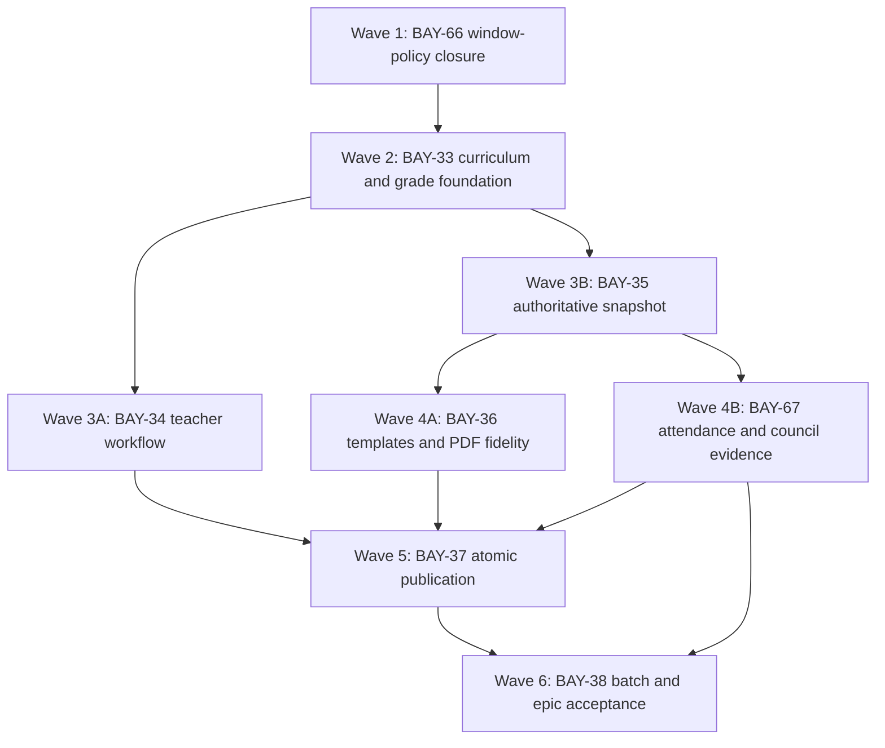

# BAY-10 Epic Completion Execution Plan

## 1. Mission and authoritative starting point

This document is the execution contract for finishing **BAY-10 — Academic & report cards** and every child story: BAY-66, BAY-33, BAY-34, BAY-35, BAY-36, BAY-67, BAY-37, and BAY-38.

Implementation starts from:

- branch: `codex/settings-readiness-fix`;
- commit: `63502601e3c8b70fa1db7906845de1200bd7d9d3`;
- clean worktree: `C:\Users\joe tech\.codex\worktrees\1e56\bbcomplex`;
- live acceptance stack: frontend `http://localhost:8085`, backend port `8084`, PostgreSQL port `5436`;
- current migration level: Flyway V87.

The older user worktree at `C:\Users\joe tech\bbcomplex` is not an integration base. It is on `feature/BAY-11-student-journey-promotions`, stops at `80dfbc0`, and contains unrelated uncommitted timetable and presentation work. Do not modify, clean, stage, reset, or copy those files.

Every implementation session must read this file and the relevant Linear story before changing code. Existing implementation is substantial; agents must close the audited residuals without rebuilding or regressing working flows.

## 2. Non-negotiable product decisions

These decisions supersede older wording where a Linear description or the original master plan conflicts with the latest accepted behavior.

1. An academic year has three trimesters. T1 contains S1/S2, T2 contains S3/S4, and T3 contains S5/S6. Annual consumes T1/T2/T3.
2. A trimester result is computed from its sequence results. It is not a separate raw grade-entry period.
3. T3 and Annual remain separate snapshots, documents, validation records, and parent-visible products, even when selected together in one batch action.
4. Academic access uses at most one optional management window per trimester. Each boundary is independently optional: null/null is unrestricted, opening-only begins restriction until that instant and is open afterward, closing-only is open until that instant, and both dates form a bounded window. Do not restore per-action entry/review/publication windows.
5. A class sees only its assigned class-subject curriculum. Class language/subsystem prevents irrelevant French/English duplicate subjects from appearing.
6. The coefficient printed and calculated is the coefficient on the session/class/subject relationship. A subject-level coefficient is only a default when assigning it to a class.
7. The responsible teacher comes from the effective class-subject assignment. The timetable and grade-entry UI must not accept an arbitrary client-selected teacher.
8. `mandatory` means required for packet/result completeness. It is not an independent subject pass gate. Promotion uses the configured final overall average and approved council decision/rules.
9. One default evaluation per assigned subject per sequence is the normal template. Administrators may review/edit it and may add additional assessments where policy requires.
10. Parents see only published immutable bulletin versions, never raw or merely validated grades.
11. Production database evolution is Flyway-only. Never manually add/drop columns, edit an already-applied migration, or rely on data patched by hand.
12. User experience is an acceptance requirement: visible field boundaries, explicit labels, required indicators, inline red errors, custom confirmations, actionable repair links, friendly explanations, loading/empty/success states, and no unexplained hashes or internal codes.
13. French and English data must remain Unicode end to end. Never transliterate official report-card content to work around a font or encoding defect.

## 3. Audited baseline

### 3.1 Working implementation already present

- Session hierarchy, standard 3-trimester/6-sequence generation, dependencies, optional trimester management windows, reuse preview/apply, and readiness diagnostics.
- Session/class curriculum, class-specific coefficients, responsible-teacher assignments, homeroom defaults, and curriculum reuse.
- Default assessment generation for S1-S6 and grade entry restricted to assigned subjects.
- Teacher roster entry, remarks, packet submission/review, accepted locking, and provenance.
- Sequence snapshots and computed T1/T2/T3/Annual snapshots with source hashes, ranks, class statistics, correction, and supersession.
- Attendance/conduct/council roster, additive adjustments, approval states, and inclusion in bulletin snapshots.
- Server-side PDF generation, QR/hash metadata, generated documents, parent published-only views, and batch ZIP/PV/manifest generation.
- Exact-period batch eligibility, partial completion, blocker diagnostics, recheck, technical retry, and repair links.

### 3.2 Verified residuals that define this plan

- BAY-66: batch create/recheck/retry paths do not uniformly enforce the central trimester window policy; the Linear story still describes obsolete per-action windows.
- BAY-33: no independently published immutable curriculum version; used curriculum rows remain directly mutable/deletable; migration exception evidence and row-safe grade autosave are incomplete.
- BAY-34: no explicit `IN_REVIEW` packet state/queues/deadlines; row-specific conflict and retry behavior plus dedicated workflow tests are incomplete.
- BAY-35: snapshot identity is incomplete; mutable-photo fallback remains; curriculum authority is not frozen through a published version; cross-output equality evidence is incomplete.
- BAY-36: V87 production-simulation data has zero report-card templates. V76 only seeds schools present when the migration runs, and Settings cannot create a first report template. Golden PDF coverage is incomplete.
- BAY-67: expected attendance sessions/hours, finalized coverage, missing dates/source IDs, completeness blockers, and immutable annual rollup are incomplete.
- BAY-37: publishing the snapshot and issuing the PDF/generated document are separate transactions; parent visibility can be registered from VALIDATED evidence; no transactional outbox ties publication together.
- BAY-38: no combined T3+Annual request/UI; cancellation/resume/history and the complete academic acceptance matrix are incomplete.

## 4. Dependency graph and dispatch rule

Dispatch rules:

- Do not create a session for a downstream wave before all incoming dependency arrows have been integrated into the consolidation branch and passed their gate.
- BAY-34 and BAY-35 may run in parallel only after BAY-33 is integrated.
- BAY-36 and BAY-67 may run in parallel only after BAY-35 is integrated. They must consume the frozen snapshot contract from that integration point.
- BAY-37 runs alone after BAY-34, BAY-36, and BAY-67 are integrated because it owns the transaction boundary shared by their data.
- BAY-38 runs last because it is both a feature and the epic-level acceptance harness.
- Parallel sessions must use separate worktrees/branches from the same verified base. They must not share a working directory or edit the consolidation branch directly.

## 5. Integration protocol for every wave

1. Record the consolidation HEAD before dispatch.
2. Create the implementation session from that exact existing branch/ref using Luna with high reasoning.
3. Session creates additive migrations only, implements backend and frontend together, and adds tests. Documentation-only completion is prohibited.
4. Session commits all intended changes and reports commit SHA, changed files, migrations, tests, live paths, and known residuals.
5. The coordinator reviews the complete diff and rejects scope expansion or unrelated formatting.
6. Cherry-pick/merge the session commit(s) into `codex/settings-readiness-fix` only after targeted tests pass in the session worktree.
7. Run affected tests again in the consolidation worktree after integration.
8. For parallel lanes, integrate one lane, retest, integrate the second, resolve the contract deliberately, then rerun both suites. Never resolve conflicts by taking an entire side blindly.
9. Build/redeploy the 8085 stack after each completed wave, run the listed live gate, and inspect database migration/data invariants.
10. Update the corresponding Linear story with commit, test, and live evidence. Mark Done only when every acceptance item in this plan and the non-superseded ticket acceptance is proven.
11. Push the consolidated branch, not the temporary session branches, as the final product branch.

## 6. Wave 1 — BAY-66 reporting hierarchy and window-policy closure

### 6.1 Database and domain

- Do not add back per-action windows. V85's `academic_term.management_opens_at` and `management_closes_at` remain authoritative.
- Confirm T1 governs S1/S2/T1_RESULT, T2 governs S3/S4/T2_RESULT, and T3 governs S5/S6/T3_RESULT/ANNUAL.
- If a batch-policy audit record needs persistence, add a new additive migration after V87. Store action, effective window mode, governing term, actor, server time, and override evidence; do not duplicate old window columns.
- Preserve all four valid modes: null/null `UNRESTRICTED`, opening-only, closing-only, and bounded opening+closing. Reject only an invalid bounded range whose closing instant is not after its opening instant, with field-specific errors.

### 6.2 Backend

Primary files:

- `backend/src/main/java/com/bbc/sms/foundation/session/AcademicWindowPolicyService.java`
- `backend/src/main/java/com/bbc/sms/foundation/session/TermManagementWindowService.java`
- `backend/src/main/java/com/bbc/sms/academic/ReportCardBatchJobService.java`
- `backend/src/main/java/com/bbc/sms/academic/ReportCardBatchEligibilityService.java`
- `backend/src/main/java/com/bbc/sms/academic/ReportCardBatchJobWorker.java`
- batch/controller DTOs in `backend/src/main/java/com/bbc/sms/academic/dto/`

Required behavior:

1. Batch preview remains read-only and always available, but returns the effective governing-term window and whether launch is currently allowed.
2. Batch create enforces `AcademicWindowPolicyService` on the selected reporting period before persisting a job.
3. Recheck-blocked and retry-technical operations re-evaluate the current window because they initiate new mutations/rendering attempts.
4. A job validly started while the window is open may finish if the window closes during processing. Record the authorization decision at creation; do not strand half an archive.
5. A cancelled job does not resume automatically. A manual retry after closure must be denied with the same structured window error.
6. All denials include code, governing trimester, affected milestones, server timezone/time, configured dates, and a repair target for Settings → Sessions & terms → trimester access.
7. Preview and create must agree under a fixed clock. Add tests for unrestricted, scheduled, open, closed, T3/Annual governance, retry after closure, and closure during an already-started job.
8. Ensure readiness treats absent optional dates as informational, not blocked.

### 6.3 Frontend and UX

Primary files:

- `frontend/src/app/features/academic/academic-batch.ts`
- `frontend/src/app/features/academic/academic.api.ts`
- `frontend/src/app/features/settings/term-management-windows.ts`
- `frontend/src/app/features/setup/academic-setup.ts`

Required behavior:

1. Show `Unrestricted`, `Scheduled`, `Open until …`, or `Closed` beside the selected batch milestone.
2. Disable launch/retry when the backend says the governing window is closed; keep preview and existing archive downloads usable.
3. The disabled explanation names the trimester and provides a Settings repair link.
4. Backend rejection remains visible as an inline actionable message, not only a toast.
5. Null dates show “No date restriction”; do not render fake defaults.
6. Add Angular tests for each state and repair navigation.

### 6.4 Wave 1 gate

- Targeted backend window and batch tests pass.
- Frontend window/batch tests and production build pass.
- Live: with T1 unrestricted, S1 batch launch is enabled; with a future T1 opening it is disabled with the correct message; restoring null/null re-enables it; an existing archive stays downloadable.
- Linear BAY-66 description/comment is reconciled to the approved single optional trimester-window model.

## 7. Wave 2 — BAY-33 immutable curriculum and row-safe grades

This wave starts only after Wave 1 is integrated and BAY-66's policy contract is stable.

### 7.1 Database model

Add an additive migration introducing a real curriculum aggregate rather than treating mutable rows as the version:

- `academic_curriculum_version`: school, session, class or reusable scope, version number, state (`DRAFT|PUBLISHED|SUPERSEDED`), source version/copy run, effective dates, created/published actors/times, optimistic version, canonical content hash.
- Link every `academic_curriculum_subject` row to its curriculum version.
- Published versions are immutable through database trigger/constraint and service checks.
- Only one active published version may govern a school/session/class/period date at a time.
- Existing rows are backfilled into deterministic version 1 per school/session/class without changing coefficients or IDs used by existing evidence.
- Assessments and bulletin trace evidence must resolve the published version ID/hash.
- Add a migration exception table/export service for legacy grades whose session/enrollment/period/assessment mapping is ambiguous. Do not guess or silently discard.
- Preserve compatibility reads during the transition, but every new write uses the canonical IDs.

### 7.2 Curriculum services and Settings UX

Primary files:

- `backend/src/main/java/com/bbc/sms/setup/SetupService.java`
- `backend/src/main/java/com/bbc/sms/setup/CurriculumCopyService.java`
- `backend/src/main/java/com/bbc/sms/academic/CurriculumQueryService.java`
- `backend/src/main/java/com/bbc/sms/academic/AssessmentDefaultsService.java`
- Setup controller/DTOs and `frontend/src/app/features/setup/academic-setup.ts`

Required behavior:

1. Editing a DRAFT version is allowed with optimistic locking.
2. Publishing runs an impact/readiness preview: missing teachers, duplicate display order, invalid coefficient/max, subject language mismatch, assessment references, and existing packets/snapshots.
3. Publishing freezes the rows and makes that version authoritative for new assessments, grades, calculations, and snapshots.
4. Editing a published curriculum means “Create revision”, never direct UPDATE/DELETE.
5. Revision preview shows added/removed/changed subjects, coefficients, teacher effects, existing grade/snapshot impact, and effective period.
6. Historical snapshots continue to reference the version they used.
7. Session reuse copies into a new DRAFT version and preserves provenance. It never mutates the source.
8. The UI clearly shows Draft/Published/Superseded, version, effective scope, unsaved state, publish confirmation, and impact warnings.

### 7.3 Row-safe grade API and UX

Primary files:

- `backend/src/main/java/com/bbc/sms/academic/GradeEntryService.java`
- `backend/src/main/java/com/bbc/sms/academic/SessionAcademicService.java`
- academic grade/packet repositories and DTOs
- `frontend/src/app/features/academic/academic.ts`
- `frontend/src/app/features/academic/academic.api.ts`

Required behavior:

1. Add idempotent row/batch save using a request id plus each row's optimistic version.
2. Return one result per student/assessment/remark: `SAVED|UNCHANGED|CONFLICT|INVALID|FORBIDDEN`, current server value/version, field errors, and retryability.
3. One invalid row must not hide successful rows. Define transaction behavior explicitly and make the UI match it.
4. Distinguish numeric zero, missing, absent, and exempt in persistence, validation, rendering, and keyboard entry.
5. Conflicts show the server value and choices to reload that row or intentionally resubmit where permitted.
6. Autosave state is visible per row: Unsaved → Saving → Saved or Conflict/Error. “Save all” retries only unsaved/retryable rows.
7. Every grade retains session, enrollment, period, assessment, subject, curriculum version/subject, responsible teacher, actor, policy decision, and version.
8. Legacy adapter responses announce deprecation and never create new integer-sequence-only grades.

### 7.4 Wave 2 tests and gate

- Migration test from a pre-V88 production-shaped dump proves deterministic backfill and emits ambiguity exceptions.
- Tests cover tenant scope, transfers, changed curriculum revisions, normalization, zero/missing/absent/exempt, uniqueness, optimistic conflicts, idempotency, and window enforcement.
- Angular tests cover selector scoping, row states, keyboard navigation, inline errors, conflict recovery, and batch retry.
- Live: publish the 4ème A curriculum, enter and save mixed row outcomes, create a revision without changing the already-published T1 snapshot, and export the migration exception report even when it contains zero rows.

## 8. Wave 3A — BAY-34 complete teacher/reviewer workflow

Wave 3A may run in parallel with Wave 3B after Wave 2 is integrated.

### 8.1 Backend workflow

- Extend packet state to the explicit chain `DRAFT → SUBMITTED → IN_REVIEW → RETURNED | ACCEPTED`; preserve existing history during migration.
- A reviewer claims/opens a submitted packet into IN_REVIEW. Concurrent claim/accept/return operations use optimistic locking.
- Return requires a reason and records reviewer, time, before/after state, and affected rows.
- Returned packets become editable only for the effective responsible teacher or authorized replacement.
- Accepted/published evidence remains locked; correction creates a new revision rather than reopening evidence silently.
- Authorization is derived from effective class-subject assignment and reviewer permissions, never a client teacher ID.
- Persist subject comments with sanitized plain text, controlled appreciation code, length policy, author, state, version, and immutable history.
- Submit readiness returns row-specific missing mandatory marks/remarks and a summary before transition.

### 8.2 Frontend workflow

- Add teacher queue cards grouped by period/class/subject with completion, due/window state, returned reason, and action.
- Add reviewer queue for Submitted/In review/Returned/Ready.
- Reviewer view shows changed values, completeness, comment history, teacher provenance, accept/return controls, and required return reason.
- Use custom confirmations for submit, accept, and return. Cancel sends no request.
- Preserve sticky identity, field borders, required markers, keyboard navigation, per-row autosave status, and actionable errors.

### 8.3 Gate

- Tests cover assignment conflicts/effective dates, homeroom and departmental ownership, unauthorized writes, sanitization, missing remark policy, concurrent review, submit/claim/return/resubmit/accept, windows, and immutable accepted comments.
- Live: teacher submits 4ème A French; principal claims, returns one row with reason; teacher corrects and resubmits; principal accepts; packet locks and bulletin uses the persisted remark.

## 9. Wave 3B — BAY-35 complete authoritative snapshot

Wave 3B may run in parallel with Wave 3A after Wave 2 is integrated.

### 9.1 Frozen snapshot contract

Expand the typed snapshot and JSON to freeze:

- student name, matricule, date/place of birth, gender, repeater status, enrollment and class IDs/labels, class size;
- guardian/parent display identity permitted for the official document;
- class master and responsible subject-teacher identities;
- profile photo asset ID, hash, MIME, dimensions, and fallback decision;
- school names/contacts/authorities/branding assets;
- curriculum version ID/hash and ordered curriculum rows;
- assessment evidence, source packet/comment versions, formula/policy versions;
- sequence/component/trimester/annual inputs and precise/display values;
- groups, coefficients, totals, subject and overall ranks, class statistics and completeness;
- attendance/conduct/council evidence contract consumed later by BAY-67;
- template version, generation actor/time, source-version IDs, and canonical snapshot hash.

Never read mutable profile/class/curriculum/teacher/school data when rendering a historical snapshot. If a photo was absent at snapshot creation, freeze the fallback; do not later substitute a newly uploaded photo.

### 9.2 Calculation and APIs

- Keep all intermediate values unrounded; define display rounding in one policy.
- Preserve zero/missing/absent/exempt behavior and standard-competition ties.
- Ensure computed trimester results use configured dependency snapshots/evidence and Annual uses official T1/T2/T3 versions.
- Recalculation after a dependency correction creates a new draft/version and preserves the previous version.
- Preview, PDF, PV, parent, batch, verification, and promotion APIs consume the same snapshot DTO/version, not parallel recalculation logic.
- Add formula drill-down and source-version diff endpoints with tenant/role checks.

### 9.3 Gate

- Fixture tests cover every product, COMP, groups, coefficients, statuses, ties, incomplete ranking, transfers, identity/photo freeze, curriculum freeze, class stats, deterministic hash, query count, and photo authorization.
- Contract tests prove numeric/text identity across preview DTO, PDF extraction, PV, parent response, batch manifest, and promotion evidence.
- Live: create a snapshot, then change student photo/name, teacher, and curriculum draft; historical output stays byte/evidence stable while a deliberate correction produces a new version.

## 10. Wave 4A — BAY-36 report templates and PDF fidelity

Wave 4A may run in parallel with Wave 4B only after Wave 3B is integrated.

### 10.1 Reliable template provisioning

- Add an idempotent runtime provisioning service or explicit “Install standard report-card templates” workflow for every existing/restored school.
- Do not rely on `INSERT ... SELECT FROM school` executing before a school exists.
- Ensure four standard families exist per applicable school: French term, French annual, English term, English annual, with Nursery/Primary/Secondary layout selection and effective versions.
- Settings must allow an authorized administrator to preview and install the first standard templates when none exist, then copy/revise/publish them.
- Provisioning is safe to rerun and never overwrites a customized published version.

### 10.2 Renderer fidelity

- Render from the Wave 3B frozen DTO only.
- Include bilingual institutional header, identity/photo/class/effectif/class master, grouped subjects/subtotals, sequence/component/term/annual columns, coefficient/weighted total/ranks, responsible teacher, subject remark, class statistics, trimester recap, attendance/discipline/honors/council, signatures/stamp, document number, version/hash, and verification QR.
- Use embedded Unicode fonts and preserve accents. Remove transliterating helpers such as `pdfSafe` from official content.
- Make page breaks deterministic: repeating headers, no orphan subtotal/signature blocks, bounded images, controlled wrapping, and stable margins.
- Freeze template and resolved asset versions on generated documents.
- Settings preview uses representative fixture students and reports missing assets/labels before publication.

### 10.3 Golden suite and gate

- Generate and retain approved golden renders for Nursery/Primary/Secondary × sequence/term/annual × FR/EN where applicable.
- Test long names, long subjects/remarks, many rows/page breaks, accents, missing/present photo/logo/stamp/signature, template effective-date selection, margins, deterministic hashes, and text/numeric equality with snapshot.
- Render PDFs to PNG with Poppler and compare with a documented tolerance; also extract text and assert key fields/numbers.
- Live on a restored V87 database with no report templates: Settings offers installation, installs safely, preview works, and official 4ème A T1/Annual PDFs contain the expected frozen data.

## 11. Wave 4B — BAY-67 attendance, conduct, honors, and council evidence

Wave 4B may run in parallel with Wave 4A only after Wave 3B is integrated.

### 11.1 Aggregation contract

Return and snapshot:

- expected session count and expected hours;
- finalized session count/hours and coverage percentage;
- missing/unfinalized session dates/IDs;
- present, absent, excused, and late counts;
- justified/unjustified absence minutes/hours and late minutes;
- exclusions and source roll-call IDs;
- approved adjustment amounts plus reason/evidence/version;
- raw precise values and display values;
- policy version and completeness blockers/warnings.

Rules:

- Only finalized, non-cancelled sessions contribute.
- DAILY uses configured school-day duration; PERIOD uses timetable duration.
- Missing or zero duration is incomplete, never silently zero attendance.
- Approved justification moves hours from unjustified to justified without changing total absence.
- Adjustments are additive and never rewrite roll calls.
- Annual equals the non-overlapping sum of immutable official T1/T2/T3 attendance snapshots. A corrected trimester creates a new Annual draft/version.

### 11.2 Workflow and UX

- Add row-safe adjustment batch save with optimistic versions and per-row errors.
- Complete DRAFT/SUBMITTED/APPROVED/RETURNED/LOCKED_BY_PUBLICATION history for attendance adjustments and council decisions.
- Separate calculated award/discipline recommendations from approved council choices; override requires actor and reason.
- Official bulletin readiness blocks according to policy on missing coverage, pending adjustments, missing duration, or incomplete council decision. The UI names exact students/dates and links to Attendance or Academic → Attendance & council.
- Provide roster filters for missing sessions, pending justification, pending adjustment, missing decision, and ready.
- Show source breakdown drill-down without overwriting approved adjustments.

### 11.3 Gate

- Unit/integration/permission/UI tests cover DAILY/PERIOD duration, cancelled/draft/unmarked sessions, justification transitions, adjustments, rounding, annual rollup, row errors, approval, publication lock, correction, roles, keyboard entry, and source breakdown.
- Live: finalize roll calls for a trimester, approve one justified adjustment and council decision, show traceable T1 totals, demonstrate a missing-duration blocker, repair it, publish, and prove Annual equals official T1+T2+T3 evidence.

## 12. Wave 5 — BAY-37 atomic validation, publication, and correction

Wave 5 starts only after Waves 3A, 4A, and 4B are integrated.

### 12.1 Atomic publication boundary

- One application transaction must validate source versions, transition the bulletin to PUBLISHED, render/freeze the PDF, create/issue the GeneratedDocument, assign parent visibility, write audit history, and enqueue notification/outbox work.
- If rendering/document persistence fails, the bulletin must not become parent-visible or remain partially published.
- The generated official parent document may only originate from PUBLISHED evidence. Preview from VALIDATED may exist but is visibly watermarked/non-official and never parent-visible.
- Use a transactional outbox for asynchronous parent notification; retries are idempotent and cannot duplicate publication/documents/messages.
- Store document ID/hash/template/assets on the published bulletin evidence.

### 12.2 Lifecycle

- Enforce legal state transitions and role/window permissions server-side.
- Correction starts from a published version, records reason and source, creates a new editable version, preserves old document/evidence, and publishes by atomically superseding the old version/document.
- Parent history clearly identifies current versus superseded/revoked versions according to retention policy.
- Concurrent validate/publish/correct actions use optimistic locks and idempotency keys.
- Every failure returns a friendly code/message, failed stage, correlation ID, and safe next action.

### 12.3 Gate

- Tests cover all legal/illegal transitions, tenant/role/window enforcement, stale source, concurrent publish, renderer/storage/outbox failure rollback, retry idempotency, correction/supersession/revoke, and parent visibility.
- Live fault injection: force storage failure and prove no published/parent document exists; restore storage and retry once; then correct and republish, proving old evidence remains superseded and the parent sees only the current official version.

## 13. Wave 6 — BAY-38 batch products and full epic acceptance

Wave 6 starts only after Wave 5 and BAY-67 are integrated.

### 13.1 Combined product selection

- Batch request accepts one or more compatible milestones. The required combined option is T3_RESULT + ANNUAL.
- Each product keeps its own snapshot, validation/publication state, template, document number/hash, item status, and manifest row.
- Preflight groups readiness by student and product; one blocked product does not hide another ready product.
- UI presents product checkboxes/cards, dependency explanation, counts, and an explicit confirmation summary.

### 13.2 Durable job semantics

- Start is idempotent by school/session/class/product set/template/source fingerprint.
- Worker isolates per-student/per-product failure and never regenerates successful published evidence silently.
- Cancel stops unstarted work safely, preserves completed items/artifacts, and records actor/reason.
- Resume/retry processes only eligible interrupted/failed items after rechecking authorization, window, source versions, and storage.
- Historical list exposes product set, creator, start/end, progress, cancellation, attempts, counts, archive/document links, and diagnostics.
- Persist artifact rows for ZIP, manifest, PV PDF/CSV, diagnostics, and individual documents with hashes/sizes/storage keys.
- Manifest and PV derive from the exact frozen snapshots and include failures without falsifying totals.

### 13.3 Complete acceptance matrix

Automate fixtures for:

- all S1-S6 sequence products;
- T1/T2/T3 and Annual dependency formulas;
- optional COMP and alternate configured weights;
- zero/missing/absent/exempt;
- ties and incomplete-student ranking exclusion;
- class-specific coefficients and subject groups;
- teacher remarks and teacher provenance;
- attendance/conduct/council evidence and correction;
- Nursery/Primary/Secondary and FR/EN template families;
- long data and multi-page large classes;
- concurrent/idempotent jobs, partial failure, cancel, resume, retry, and storage failure;
- tenant/role isolation;
- PDF/PV/manifest/parent/promotion equality;
- publication correction and supersession;
- exact-period eligibility;
- combined T3+Annual generation.

### 13.4 Wave 6 gate

- Full backend and frontend suites pass from a clean build.
- Flyway upgrades a restored pre-epic production-shaped database through the final migration without manual SQL.
- Live Docker run completes the complete click flow in Section 15.
- Archive inspection verifies expected files, hashes, UTF-8 CSV, readable PDFs, and separate T3/Annual products.
- No unresolved blocker, unexplained internal error, stale template, or manual database repair remains.

## 14. Consolidation and regression checks

After each integration and again at the end:

1. `git status --short` contains only intended files.
2. Review every new migration for additive/idempotent production-safe behavior and tenant-scoped indexes/constraints.
3. Run backend targeted tests, then `mvn test` for the complete backend.
4. Run frontend unit tests and production build.
5. Build Docker images from the consolidation branch and recreate services without deleting the production-simulation volume.
6. Confirm `/actuator/health` and login stability over repeated requests/restarts.
7. Query Flyway history, invalid constraints, duplicate assignments, orphan curriculum/grade/snapshot/document rows, and template provisioning.
8. Inspect PDF pages visually and through text extraction; verify accents and snapshot values.
9. Exercise FR and EN UI modes, empty/loading/error/success states, keyboard forms, custom confirmations, and repair links.
10. Verify existing attendance, timetable, student-family, session reuse, and promotion flows are not regressed.
11. Compare live API values against stored snapshots/documents, not against a fresh client-side calculation.

## 15. Final live click flow

Use `admin/admin` only in the local test stack.

1. **Settings → Sessions & terms**
   - Open 2026-2027.
   - Confirm T1/T2/T3, S1-S6, T1/T2/T3 results, Annual, and dependencies.
   - Leave one trimester unrestricted and configure another temporary restricted window; verify readiness remains accurate.
   - Preview session reuse and confirm no source data changes before apply.
2. **Settings → Academics → Class subjects**
   - Select 2026-2027 and 4ème A.
   - Confirm only appropriate-language subjects, relationship coefficients, responsible teachers, and published curriculum version.
   - Create a draft revision and inspect impact without changing historical snapshots.
3. **Settings → Academics → Evaluations**
   - Select 4ème A and each S1-S6.
   - Confirm one default evaluation per assigned subject and no unrelated subjects.
4. **Academic → Grade entry**
   - Select S1, 4ème A, French.
   - Save valid, zero, absent, exempt, invalid, and conflict examples; inspect per-row outcomes.
   - Submit, review, return with reason, correct, resubmit, and accept.
5. **Attendance → Roll call**
   - Finalize daily/period attendance including present, late, absent, and excused cases.
   - Demonstrate missing duration/coverage diagnostics and repair them.
6. **Academic → Attendance & council**
   - Review calculated source breakdown.
   - Add justified/unjustified adjustment with evidence, submit/approve it, enter conduct/honors/council decision, and verify lock after publication.
7. **Academic → Bulletin**
   - Calculate/publish S1 and S2.
   - Calculate T1 from S1/S2 and verify subject/overall arithmetic, ranks, comments, photo, attendance, and council evidence.
   - Repeat S3/S4→T2 and S5/S6→T3, then Annual from T1/T2/T3.
   - Preview and download FR/EN official PDFs; inspect all identity and reference-layout sections.
8. **Academic → Batch generation**
   - Preflight exact-period eligibility.
   - Generate S1 for the class, inspect diagnostics/PV/manifest/ZIP.
   - Select T3 + Annual together and verify separate items/documents.
   - Exercise cancel, resume, blocked recheck, technical retry, and historical downloads.
9. **Parent portal**
   - Verify raw grade endpoints/screens are unavailable.
   - Confirm only published current official versions are visible and downloadable; superseded versions follow policy.
10. **Student Journey → Promotion**
    - Preview using the published Annual snapshot, formula evidence, and council decision.
    - Verify automatic decision and authorized manual override remain traceable.
11. **Correction regression**
    - Correct one published dependency, regenerate the affected result, republish atomically, and verify old snapshots/documents remain superseded while Annual/promotion evidence updates only through an explicit new version.

## 16. Linear and completion policy

- Add implementation evidence to each story after its wave: commits, migrations, test counts, live screens, and database/document evidence.
- Keep a story In Progress if any acceptance item is untested, indirectly inferred, or contradicted by live state.
- Mark BAY-10 Done only after BAY-66, BAY-33, BAY-34, BAY-35, BAY-36, BAY-67, BAY-37, and BAY-38 are all Done and the final acceptance matrix passes on the consolidated pushed branch.
- The final report must list every screen to test, expected result, created fixture, document/archive location, migration range, commit SHA, and any deliberately deferred out-of-scope item. “Tests pass” without mapped acceptance evidence is insufficient.

## 17. Session handoff template

Every dispatched session receives:

1. The exact story/wave and the prerequisite commit SHA.
2. This plan's relevant section and non-negotiable decisions.
3. Instruction to inspect current code before editing and preserve existing behavior.
4. Exact database, backend, frontend, UX, test, and live gate.
5. Prohibition on manual database changes, editing old migrations, touching unrelated files, or declaring completion from narrow tests.
6. Requirement to commit and report SHA, diff summary, commands/results, live evidence, and residuals.

The coordinator—not an implementation session—owns cross-wave merging, final Docker deployment, full acceptance, Linear closure, and the single consolidated push.
