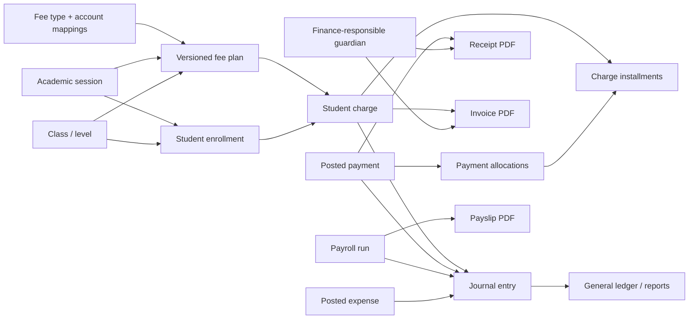

# BAY-12 Finance & Accounting — master implementation blueprint

**Prepared:** 2026-08-12  
**Implementation baseline:** branch `feature/BAY-11-student-journey-promotions`, commit `80dfbc0`  
**Linear scope:** BAY-12 with BAY-44, BAY-45, BAY-46, BAY-47, BAY-48, BAY-49, BAY-50, and BAY-51  
**Application audited:** `http://localhost:8085` as an administrator  
**Purpose:** a build-ready handoff for another engineer or coding agent. This is a plan, not an implementation.

---

## 1. Executive outcome

Replace the current fee-grid and running-balance implementation with an auditable, session-aware finance system that supports:

- a reusable catalogue of fee types;
- versioned fee plans by academic session, level, and class;
- generated student charges and installment schedules;
- allocation-aware collections, credits, reversals, and refunds;
- server-generated invoices, receipts, reversal documents, and payslips;
- payroll runs with review, approval, payment, and privacy controls;
- a balanced, immutable double-entry general ledger;
- reconciled finance and accounting reports with drill-down to source transactions;
- an easy, guided workflow for bursars, cashiers, accountants, administrators, and parents.

This must be delivered as a controlled migration. Existing production payments, fee balances, expense rows, payment channels, academic sessions, enrollments, documents, and staff salaries must remain traceable. No production column or table is to be altered manually: every change and backfill must be a forward-only Flyway migration starting after the current `V58` schema.

### Recommended business defaults

These defaults make the epic implementable without blocking on another workshop. Keep them configurable where noted.

| Decision | Default | Why |
|---|---|---|
| Accounting basis | Accrual | Charges recognize receivables and revenue; collections settle receivables. This gives meaningful debt and revenue reports. |
| School currency | XAF, stored as integer minor units | The existing application uses FCFA integers. Store `amount_minor BIGINT` plus ISO currency; never use floating-point money. |
| Overpayment | Create student credit | Never silently increase a charge or discard excess money. |
| Allocation | User-selected or oldest due first | Cashier sees and can change the proposal before confirmation. |
| Posted records | Immutable | Correct them with a reversal, refund, waiver, or adjustment—not edit/delete. |
| Dates | Academic session controls billing; accounting period controls posting | A session answers “which school year/class”; an accounting period answers “may this dated entry be posted?” |
| Invoice trigger | Manual or batch after charges exist | Charge generation does not silently publish documents. |
| Receipt trigger | Automatic after a payment is posted | A successful collection always has a reproducible server PDF. |
| Payroll deductions | Configurable fixed/percentage/manual lines | Do not hard-code Cameroon statutory formulas until the school validates them. |
| Optional fees | Explicit acceptance per student | An optional plan line does not become receivable until accepted. |

---

## 2. What exists today

### 2.1 Live user experience observed

The current `/finance` screen contains five tabs:

1. **Payments** — 30-day KPIs, chart, payment list, and a “New payment” modal.
2. **Debtors** — school-wide outstanding totals, class chips, student search, and debt list.
3. **Expenses** — simple expense creation, list, CSV export, and deletion.
4. **Fees** — one annual grid per level or a class override, with three default installments.
5. **Payment methods** — enable/disable channels and edit parent-facing instructions.

Related functions are elsewhere:

- `/staff` → **Payroll** only computes a display total from employee salary fields. There are no runs, approvals, payments, or payslips.
- `/reports` shows lifetime revenue, expenses, balance, and a recovery percentage. It has no session, date, class, fee-type, cashier, or as-of filters.
- the parent portal shows the current grid, installments, payment channels, and payment rows, but not authoritative downloadable invoices/receipts.

Observed UX problems that the implementation must deliberately correct:

- setup, daily collection, debt follow-up, and accounting are mixed in one oversized component;
- the current tab strip clips on a narrow viewport;
- there is no visible academic-session context in Finance;
- empty screens state that nothing exists but do not provide a guided next action or prerequisite checklist;
- payment starts with class then student, instead of supporting direct name/matricule/guardian/phone search;
- no pre-posting review summarizes allocations, resulting balance, document number, or journal effect;
- the UI calls an HTML print view a receipt even though no immutable server document exists;
- labels and seeded payment-channel text show encoding corruption such as `Esp??ces` in the current database;
- deletion is offered for financial expenses, which is unsafe after posting;
- all finance writers effectively share the same power, despite existing action-code placeholders.

### 2.2 Current code and schema baseline

| Area | Current implementation | Limitation to replace |
|---|---|---|
| Finance UI | `frontend/src/app/features/finance/finance.ts` (about 1,493 lines) and `finance.api.ts` | Single component and five coarse tabs; no routable detail screens. |
| Collections | `FinanceController`, `FinanceService`, `Payment` | `recordPayment` creates a count-based `RCT-2026-...` number and directly increments `student_fee`. No allocation, idempotency, concurrency guard, reversal, refund, or journal. |
| Fees | `FeeController`, `FeeService`, `FeeConfig`, JSONB `tranches/items` | Grid is not session-bound or versioned; changing it rewrites expected balances. |
| Receivables | `StudentFee` | One mutable total/paid/balance row per student; no charge history or installment identity. |
| Expenses | `Expense` and DELETE endpoint | No approval/posting/journal; posted data can be deleted. |
| Payment methods | `PaymentChannel` | Useful catalogue to retain, but it needs ledger account mapping and provider reconciliation. |
| Payroll | salary fields on `Employee`; computed rows in `staff.ts` | No payroll domain or documents. |
| Reporting | `ReportService.finance()` | Lifetime sums over `payment`, `expense`, and `student_fee`; no filters or accounting reconciliation. |
| Documents | `GeneratedDocument`, `OfficialDocumentService` | Strong reusable hash/storage/audit base, but generic numbering/rendering is insufficient for financial documents. |
| Foundations | academic sessions, terms, enrollments, audit events, idempotency keys, action grants | These should be reused rather than recreated. |

### 2.3 Existing foundations to reuse

- `academic_session` and `student_enrollment` are the authoritative session and class-history sources.
- `school_class` supplies level, subsystem, and class identity.
- `audit_event` is append-only and must receive every financial lifecycle action.
- `idempotency_key` is available for command deduplication.
- `generated_document` and `DocumentStorage` provide immutable storage, SHA-256 verification, visibility, revocation, and audit.
- guardian relationships identify `finance_responsible` and `receives_finance` recipients.
- `Employee` supplies staff identity, employment type, hire date, base monthly salary, hourly rate, and default monthly hours.
- `PaymentChannel` supplies CASH/OM/MOMO/MPGS/TRANSFER/SARA and parent instructions.
- `PermissionActions` already names initial actions such as `FEE_CONFIGURE`, `PAYMENT_COLLECT`, `PAYMENT_REVERSE`, `LEDGER_POST`, `LEDGER_CLOSE`, `PAYROLL_APPROVE`, and `PAYROLL_PAY`; the catalogue must be expanded.

---

## 3. Target information architecture and UX contract

### 3.1 Finance workspace

Change `/finance` from one giant page into a finance shell with routable areas. Keep the navigation understandable to a non-accountant.

| Route | User label | Primary job |
|---|---|---|
| `/finance/overview` | Overview | Readiness, current-session KPIs, alerts, quick actions. |
| `/finance/fee-types` | Fee types | Maintain reusable tuition, registration, transport, exam, uniform, and other types. |
| `/finance/plans` | Fee plans | Build and activate session/level/class fee plans and installments. |
| `/finance/charges` | Student charges | Preview/generate charges, inspect schedules, waivers, overrides, debt and ageing. |
| `/finance/collections` | Collections | Search a learner, allocate a payment, issue a receipt, inspect/reverse/refund. |
| `/finance/documents` | Invoices & receipts | Search, batch-generate, download, void, supersede, or resend documents. |
| `/finance/expenses` | Expenses | Draft, post, reverse, and reconcile expenses. |
| `/finance/accounting` | Accounting | Accounts, mappings, periods, journals, trial balance, general ledger, failures. |
| `/finance/payroll` | Payroll | Calculate, review, approve, pay, and issue payslips. |
| `/finance/reports` | Reports | Receivables, collections, payroll, accounting, and reconciliation reports. |
| `/finance/settings/payment-methods` | Payment methods | Configure channels, provider references, parent instructions, and debit accounts. |

Keep “New collection” as a prominent global action in the Finance header. On mobile, replace the clipped horizontal tab row with a labelled section selector or horizontally scrollable tabs with visible overflow controls and a sticky active label.

### 3.2 Persistent context bar

Every finance page must show the same context bar:

- **Academic session** selector, defaulting to the current session;
- optional **class/level** selector when relevant;
- **as-of date/date range** when relevant;
- visible currency;
- accounting-period status for transaction pages;
- “current/live” badge versus “historical/read-only” badge.

Store filters in URL query parameters so refresh, back/forward, bookmarks, and shared internal links preserve context. Changing context with an unsaved form must open the project’s custom confirmation modal; never use a browser prompt.

### 3.3 First-run readiness experience

The Overview page must calculate and show a setup checklist:

1. current academic session exists and is OPEN;
2. open accounting periods exist for the intended posting dates;
3. required chart-of-account mappings are valid;
4. active fee types exist;
5. an active fee plan covers each class or level;
6. charges have been generated for enrolled students;
7. at least one payment method is active and mapped;
8. payroll earning/deduction mappings exist before payroll is approved.

Each failed item must include plain-language impact and a direct “Fix now” link. Raw codes such as `CURRICULUM_ASSIGNMENT_MISSING` are not acceptable user-facing text; follow the same rule for all finance blockers.

### 3.4 Form and interaction standard

Every create/edit/reversal flow must follow these rules:

- visible field border and background in default, focus, disabled, error, and read-only states;
- required fields marked with `*` and explained once at the top;
- on submit, every invalid field receives a red border and an inline message; show a summary banner that scrolls/focuses the first invalid field;
- disabling a field must be accompanied by helper text explaining why;
- use searchable comboboxes for students, guardians, employees, accounts, fee types, and classes;
- show skeleton/loading, empty, error/retry, success, blocked, and permission-denied states;
- preserve valid entries after an API error;
- show server conflict details in context, including the record and corrective action;
- use optimistic locking and tell the user when a record changed elsewhere;
- destructive or irreversible actions require a custom confirmation modal with entity, amount, consequence, and mandatory reason where appropriate;
- posted financial objects are never edited inline;
- previews are side-effect-free and clearly labelled “Preview—nothing has been posted”;
- long-running batch actions return a visible job with progress, processed/blocked/error counts, downloadable error rows, and reasons for every blocked item;
- all success states offer the logical next action, such as “Download receipt”, “Open journal”, or “Collect another payment”.

### 3.5 Accessibility and cashier ergonomics

- Maintain a logical heading hierarchy and real `<label>` associations.
- Support full keyboard entry in collections: focus search, choose student, accept proposed allocation, enter amount/reference, review, confirm.
- Never communicate paid/overdue/blocked state by colour alone.
- Keep touch targets at least 40 px.
- Make tables usable at 320–768 px via priority columns plus a row detail drawer, not squeezed columns.
- Announce validation, async completion, and batch progress through an ARIA live region.
- Keep bilingual FR/EN labels; store and render all text as UTF-8 and embed a Unicode font in PDFs.

---

## 4. Domain boundaries and invariants



The implementation must enforce the following rules in the database/service layer, not only in Angular:

1. Every row is school-scoped; cross-tenant IDs return not found/forbidden without revealing data.
2. Money is integer minor units plus ISO currency; a transaction cannot mix currencies.
3. An active fee plan is immutable. A change creates a new draft version; already-posted charges keep their snapshots.
4. Charge generation is idempotent for enrollment + plan version + fee-plan line + installment.
5. A posted payment is immutable and its allocations sum to the applied amount.
6. Unapplied overpayment is represented as student credit, never hidden in a larger `paid` total.
7. A posted journal entry has at least two lines and total debit equals total credit.
8. Posted journals, documents, payments, charges, and approved payroll results cannot be deleted.
9. Reversal creates linked opposite records; it does not rewrite history.
10. A closed accounting period rejects posting and backdating unless an authorized reopen action occurs.
11. One source event produces at most one posted journal entry, enforced by a unique idempotency key.
12. Receipt/invoice/payslip numbering is allocated atomically per school, document type, and configured year/sequence.
13. Historical reports use snapshots and posting dates, not current student class or current fee configuration.
14. A user cannot approve their own sensitive action where segregation is configured (payroll and refund at minimum).
15. Every post, reverse, refund, waiver, plan activation, period close/reopen, document void, and payroll approval/payment writes an audit event.

---

## 5. Target data model

### 5.1 Accounting foundation — BAY-49

| Table | Essential fields and constraints |
|---|---|
| `chart_of_account` | `id`, `school_id`, `code`, bilingual name, `type` (ASSET/LIABILITY/EQUITY/REVENUE/EXPENSE), optional parent, `normal_side`, currency/null, `posting_allowed`, active/effective dates, version; unique school+code. |
| `accounting_period` | school, code/name, start/end, optional academic session, status OPEN/CLOSED, close/reopen metadata and reason; no overlapping OPEN periods of the same book. |
| `journal_entry` | school, number, date, status DRAFT/POSTED/REVERSED, source type/id/event key, description, currency, period, reversal links, posted metadata, version; unique school+source event and school+number. |
| `journal_line` | journal, line number, account, debit minor, credit minor, student/enrollment/employee/class/fee-type analytic dimensions, description; exactly one side positive. |
| `posting_rule` | school, event type, debit/credit role, optional fee type/payment channel/earning/deduction scope, target account, priority, effective dates, enabled/version. |
| `reconciliation_item` | school, source type/id, expected amount, posted amount, state MATCHED/MISSING/MISMATCH/IGNORED, reason, resolution metadata. |
| `document_sequence` | school, document type, period key, prefix, next number, padding, version; row-locked allocation. |
| `finance_outbox` | school, event key/type, aggregate, payload, status, attempts, next attempt, last error, timestamps; unique event key. |

Add database checks/triggers for journal balance and immutability. The service must also validate before posting so users receive a friendly error rather than a database exception.

### 5.2 Fee catalogue and plans — BAY-44/BAY-45

| Table | Essential fields and constraints |
|---|---|
| `fee_type` | stable identity: school, code, lifecycle ACTIVE/INACTIVE, current revision, created metadata; unique school+code. |
| `fee_type_revision` | fee type, revision number, FR/EN name/description, category, default amount/currency, frequency, mandatory/refundable/tax flags, tax basis points, receivable/revenue accounts, effective dates, created metadata; immutable once active. |
| `installment_template` | school, code/name, optional source session, lifecycle/version. |
| `installment_template_line` | template, sequence, label FR/EN, percentage basis points or fixed amount, due-rule type, relative offset/term reference/absolute date. |
| `fee_plan` | school, session, scope LEVEL/CLASS, level/subsystem/class, version number, status DRAFT/ACTIVE/RETIRED, superseded plan, activation metadata; one active effective plan per scope. |
| `fee_plan_line` | plan, fee-type revision, amount/currency, priority, mandatory/optional, refundable override, installment template, snapshot labels/mappings. |
| `student_fee_override` | school, enrollment, plan line/charge, type AMOUNT/DISCOUNT/EXEMPTION/WAIVER, amount/percentage, effective dates, reason, requested/approved metadata, status/version. |
| `student_fee_election` | enrollment + optional plan line, ACCEPTED/DECLINED/PENDING, actor/date/reason. |

Due rules should be relative to a session or term wherever possible. That is what makes “Copy previous session” safe: an installment “30 days after session start” shifts automatically, whereas a copied literal 2026 date does not.

### 5.3 Charges, collections, and documents — BAY-46/BAY-47/BAY-48

| Table | Essential fields and constraints |
|---|---|
| `student_charge` | school, enrollment/session/student, fee plan+line+fee type, snapshot labels/accounts/class, original/adjusted amount, currency, charge/due dates, status DRAFT/POSTED/PARTIAL/PAID/WAIVED/REVERSED, paid/waived/outstanding read values, journal, version; idempotent generation key. |
| `charge_installment` | charge, sequence/label, due date, amount, paid/waived/outstanding, status; unique charge+sequence. |
| `charge_adjustment` | charge/installment, type, signed amount, reason, approval, journal/reversal links, created metadata. |
| `payment` (evolve existing) | add session, payer/guardian, currency, status PENDING/POSTED/REVERSED/REFUNDED/PARTIAL_REFUND, channel, provider/reference, received/posted timestamps, cashier session, idempotency key, journal, reversal links, version. Preserve current IDs and receipt references during migration. |
| `payment_allocation` | payment, installment/charge, allocated/refunded amount, status, created metadata; unique allocation identity. |
| `student_credit` | student/session/currency, source payment, original/remaining amount, status; allocations consume it explicitly. |
| `payment_reversal` | original payment, reversal payment/journal, reason, actor/approved metadata. |
| `payment_refund` | payment/credit, amount/channel/reference, status REQUESTED/APPROVED/POSTED/REJECTED, reason, requester/approver, journal/document. |
| `cashier_session` | school/user/register, opened/closed timestamps, opening/expected/count/declared cash, variance, status, approval. |
| `provider_transaction` | channel, provider reference, amount/currency, payer metadata, provider status/payload hash, matched payment, received timestamp; unique school+channel+reference. |
| `fee_invoice` / `fee_invoice_line` | number, session/student/enrollment, finance-responsible recipient snapshot, issue/due dates, status, totals/currency, charge links, generated document, void/supersede metadata. |
| `payment_receipt` | number, payment, recipient snapshot, totals/currency, generated document, reversal/supersede links. |

`student_fee` must become a compatibility/read model calculated from charges, allocations, waivers, and credits. `fee_config` must become legacy/read-only after cutover; do not let new screens write it.

### 5.4 Expenses and payroll — BAY-49/BAY-50

| Table | Essential fields and constraints |
|---|---|
| `expense` (evolve existing) | add currency, status DRAFT/POSTED/REVERSED, payee, reference, expense account, payment account, journal, posted/reversed metadata, version. DELETE remains allowed only for DRAFT. |
| `payroll_component_type` | school, code/name, EARNING/DEDUCTION/EMPLOYER_CONTRIBUTION, calculation mode, default value/rate, expense/liability accounts, active/effective dates. |
| `payroll_period` | school, code, start/end, payment date, accounting period, status OPEN/CLOSED, unique dates/code. |
| `payroll_run` | period, run number/version, status DRAFT/CALCULATED/REVIEWED/APPROVED/PAID/VOID, totals, calculation snapshot hash, lifecycle actors/timestamps, journals. |
| `employee_payroll` | run, employee snapshot, employment mode, base salary/hourly rate/hours, gross/deductions/net/employer cost, exception state, version. |
| `employee_payroll_line` | employee payroll, component snapshot, quantity/rate/amount, source DEFAULT/MANUAL, reason, account mappings. |
| `payroll_payment` | employee payroll, channel/account/reference, amount/date/status, journal, reversal link. |
| `payslip` | employee payroll, number, locale, generated document, issue/void/supersede metadata. |

---

## 6. Permissions and segregation of duties

Extend `PermissionActions.CATALOG`, the settings permission UI, bootstrap grants, and migrations with these explicit actions:

- `FINANCE_OVERVIEW_VIEW`
- `FEE_TYPE_MANAGE`
- `FEE_PLAN_DRAFT`
- `FEE_PLAN_ACTIVATE`
- `CHARGE_PREVIEW`
- `CHARGE_GENERATE`
- `CHARGE_ADJUST`
- `FEE_WAIVE_REQUEST`
- `FEE_WAIVE_APPROVE`
- `PAYMENT_COLLECT`
- `PAYMENT_REVERSE`
- `REFUND_REQUEST`
- `REFUND_APPROVE`
- `CASHIER_SESSION_CLOSE`
- `FINANCE_DOCUMENT_GENERATE`
- `FINANCE_DOCUMENT_VOID`
- `ACCOUNT_MANAGE`
- `POSTING_RULE_MANAGE`
- `LEDGER_POST`
- `LEDGER_REVERSE`
- `LEDGER_CLOSE`
- `LEDGER_REOPEN`
- `PAYROLL_CALCULATE`
- `PAYROLL_REVIEW`
- `PAYROLL_APPROVE`
- `PAYROLL_PAY`
- `PAYSLIP_VIEW_ALL`
- `FINANCE_REPORT_VIEW`
- `FINANCE_EXPORT`

Recommended role presets:

| Role | Capabilities |
|---|---|
| Cashier/econome | collect, view charges, issue receipt, close own cashier session; cannot configure plans/accounts, approve refund, or close ledger. |
| Finance manager | fee catalogue/plans/charges, waivers, documents, reports, refund approval; no payroll approval unless separately granted. |
| Accountant | accounts, posting rules, journals, reconciliation, period close/reopen, accounting reports; may not collect by default. |
| HR/payroll officer | calculate/review payroll and see payroll details; cannot approve own run or post unrelated journals. |
| Principal | activate plans, approve waivers/refunds/payroll, view reports; payment collection optional. |
| Parent | only their authorized children’s published invoices, receipts, schedule, balance, and school payment instructions. |
| Employee | only their own issued payslips. |

Backend annotations must use action permissions for every command. Hiding a button in Angular is only a convenience, never the authorization control.

---

## 7. API and service conventions

### 7.1 Package structure

Refactor the current flat `com.bbc.sms.finance` package into cohesive subpackages without moving everything in one commit:

```text
com.bbc.sms.finance
  accounting/       accounts, periods, journals, posting, reconciliation
  fees/             fee types, plans, overrides, elections
  charges/          charge generation, schedules, adjustments, ageing
  collections/      payments, allocations, credits, cashier sessions, refunds
  invoicing/        invoices, receipts, numbering and PDF assemblers
  expenses/         draft/post/reverse expense workflow
  payroll/          periods, runs, components, payments and payslips
  reporting/        finance read models and exports
  legacy/           temporary adapters/backfill verification only
```

### 7.2 HTTP conventions

- Use plural REST resources under `/api/finance/v2/...` during migration.
- List endpoints require server-side pagination, sorting, and filters; return `items`, `page`, `size`, `totalItems`, and `totalPages`.
- Commands that can be retried require `Idempotency-Key`: charge generation, payment posting, reversal, refund posting, invoice batch, payroll calculation/payment, and ledger posting.
- Mutating an editable draft requires an optimistic-lock `version`; return HTTP 409 with current version and a friendly resolution.
- Preview endpoints are POST commands ending in `/preview` and must never persist domain rows.
- Batch apply endpoints return HTTP 202 with `jobId`; provide `/jobs/{id}`, `/jobs/{id}/failures`, and retry endpoints.
- Document downloads return the stored PDF with no-store headers and a meaningful filename.

### 7.3 Error contract

Use the existing platform error envelope, but populate it consistently:

```json
{
  "code": "ACCOUNT_MAPPING_MISSING",
  "message": "Tuition cannot be activated because its revenue account is missing.",
  "fieldErrors": { "revenueAccountId": "Choose a posting account." },
  "blockers": [
    { "entityType": "FEE_TYPE", "entityId": "...", "label": "Tuition", "action": "OPEN_FEE_TYPE" }
  ],
  "correlationId": "..."
}
```

Angular must map `fieldErrors` to controls, render blocker labels rather than codes, and retain the correlation ID behind a “Technical details” expander for support.

---

## 8. Story-by-story implementation plan

### BAY-49 — Chart of accounts, journals, posting rules, periods, and reconciliation

This is the first implementation wave because BAY-44 fee types cannot be activated without valid account mappings.

#### Backend steps

1. Add the accounting tables, constraints, indexes, and default action grants in `V59__finance_accounting_foundation.sql`.
2. Seed a **draft default school chart**, not posted balances: Cash, Bank, Orange Money clearing, MoMo clearing, Card clearing, Accounts Receivable—Students, Student Credits, Tuition Revenue, Registration Revenue, Other Fee Revenue, Payroll Payable, Salary Expense, Expense Control, Opening Balance Equity, and Suspense.
3. Mark seeded accounts editable until first use; once referenced by a posted journal, code/type cannot change.
4. Add repositories and DTOs for accounts, periods, posting rules, journals, lines, and reconciliation items.
5. Implement `AccountingPeriodService` with create, generate monthly periods, close preview, close, and controlled reopen. A close preview lists drafts, posting failures, imbalances, and unreconciled sources.
6. Implement `JournalValidationService`: tenant, currency, open date, postable account, dimensions, nonzero lines, and balanced totals.
7. Implement `LedgerPostingService.post(event)` with a unique source event key and database transaction. Calling twice returns the first journal.
8. Implement posting-rule resolution in this order: exact fee/component/channel rule → category rule → school default. Missing/ambiguous mapping creates a reconciliation item and a user-facing blocker.
9. Implement draft, post, reverse, trial-balance, general-ledger, and source-drill APIs.
10. Add database protection that rejects UPDATE/DELETE of POSTED journal entries/lines. Permit corrections only by reversal.
11. Add outbox retry handling so a failed asynchronous document/report update never duplicates the journal. For synchronous source posting, fail the source transaction atomically if its required journal cannot be posted.
12. Write audit events for account/mapping changes, post/reverse, and period close/reopen.

#### Frontend steps

1. Build `/finance/accounting` with tabs: **Accounts**, **Posting mappings**, **Periods**, **Journals**, **Trial balance**, **General ledger**, **Reconciliation**.
2. Accounts: tree/table toggle, search, type/status filters, create/edit drawer, clear “posting account” indicator, usage count, and “cannot change because used” explanation.
3. Mappings: show event cards with debit and credit account selectors; surface incomplete mappings at the top; include a “Test mapping” preview with sample amount.
4. Periods: year strip plus monthly rows, OPEN/CLOSED state, close-readiness count, and close/reopen modal with consequence and reason.
5. Journals: paginated list with number/date/source/status/total; row opens a dedicated detail route showing balanced lines and links back to payment, charge, expense, or payroll.
6. Trial balance/general ledger: persistent as-of/date filters, account range, zero-balance toggle, totals pinned at bottom, export action.
7. Reconciliation: grouped queue for missing mapping, missing journal, mismatched amount, and legacy exception; every row explains the repair action.

#### Required tests

- balanced/imbalanced journal validation;
- unique source event/idempotent retry;
- missing and incompatible account mapping;
- posting to closed period and authorized reopen;
- exact reversal lines and links;
- concurrent journal/document number allocation;
- tenant isolation and action permissions;
- trial-balance debit equals credit;
- live browser flow: configure mapping → post sample expense → open linked journal → close-period preview.

#### Completion evidence

- No fee/payment/payroll story is considered integrated until its source transaction opens the matching balanced journal.
- Trial balance total debits and credits are equal for test data.

### BAY-44 — Custom fee-type catalogue

#### Backend steps

1. Add `fee_type` and `fee_type_revision` in `V60__finance_fee_catalogue_and_plans.sql`.
2. Implement catalogue CRUD as lifecycle operations: create draft, update draft, activate revision, create new revision, deactivate stable fee type.
3. Normalize codes to uppercase letters/numbers/underscore; reject duplicates per school with a field-level message.
4. Validate amount, ISO currency, date range, tax basis points, and compatible receivable/revenue accounts.
5. Prevent deactivation when an active plan uses the type; return the exact plans/classes/sessions blocking it.
6. Calculate usage count from plans and charges.
7. Create a migration preview service that extracts distinct legacy `fee_config.items`. Because current JSON items may lack codes/descriptions, generate suggested codes but require review for ambiguous names.
8. Migrate legacy fee items only after mapping approval. Unresolved rows go to `reconciliation_item`, never silently to “Other”.
9. Audit every revision activation and deactivation with before/after snapshots.

#### Frontend steps

1. Build `/finance/fee-types` as a searchable table/card view with code, bilingual name, category, default amount, flags, mappings, lifecycle, and usage.
2. The primary empty-state action is “Create first fee type”; secondary action is “Review legacy fee items” when migration candidates exist.
3. Use a multi-section drawer: Identity, Pricing, Rules, Accounting, Effective dates, Review.
4. Account selectors show account code, name, type, and compatibility; invalid choices are disabled with an explanation.
5. Activation opens a review modal summarizing what will become available and any blockers.
6. In-use deactivation opens a blocked modal listing dependent plans with deep links; do not show a generic conflict.
7. Include a comparison view between revisions and an “Effective on” status.

#### Required tests

- code normalization/uniqueness;
- effective-date and account compatibility rules;
- active-plan deactivation block;
- revision immutability;
- legacy extraction, accepted mapping, ambiguous exception;
- read/write permission and tenant isolation;
- form validation and keyboard-accessible account selection.

### BAY-45 — Versioned fee plans by session, level, and class

#### Backend steps

1. Complete plan, plan-line, installment-template, override, and election tables in `V60`.
2. Resolve a student’s applicable plan in this order: active class plan → active level+subsystem plan → explicit no-plan blocker. Resolve against the enrollment snapshot, not current `student.class_name`.
3. Implement draft creation for one session and scope.
4. Implement add/update/reorder/remove plan lines only while DRAFT.
5. Support reusable installment templates and relative due rules; validate percentages/fixed amounts equal each plan line amount after rounding.
6. Implement copy-from-previous-session preview: source plan, target coverage, fee-type revision changes, date shifts, missing classes, changed amounts, and existing target drafts.
7. Copy with merge modes: fill missing only, replace target drafts, or create a new draft version. Never replace ACTIVE plans.
8. Implement activation preview: affected enrollment count, optional-fee count, missing catalogue/account mapping, duplicate coverage, and charge impact.
9. Activation retires the prior active version for the same scope atomically and never rewrites posted charges.
10. Implement student overrides with request/approval/reason/effective date and calculated impact preview.
11. Audit copy, activate, retire, and override actions.

#### Frontend steps

1. Build `/finance/plans` with a left session/level/class tree and a right plan workspace.
2. The header always states the selected session, scope, inherited source, version, and status.
3. Plan editor supports “Add fee type” via catalogue search, inline amount override, required/optional flag, priority, and installment template.
4. Show live total and installment timeline. If rounding leaves a difference, highlight the exact final installment adjustment before save.
5. Add “Copy previous session” wizard: choose source → compare → adjust dates/amounts → preview affected scopes → apply.
6. Add class inheritance visualization: level plan inherited, class override active, or uncovered. Avoid the vague term “grid”.
7. Activation modal shows enrollment count and states that future charges use this version while posted charges remain unchanged.
8. Student finance detail shows inherited plan, accepted optional fees, override history, and who approved each exception.

#### Required tests

- class-over-level resolution;
- subsystem isolation;
- one active plan per scope;
- copy modes and relative-date shifting;
- immutable active plan and new version workflow;
- no posted-charge mutation;
- override approval and effective date;
- browser flow: copy prior session → edit → preview → activate.

### BAY-46 — Student charges, installments, waivers, and debt ageing

#### Backend steps

1. Add charge, installment, adjustment, and generation-job tables in `V61__finance_charges_collections_documents.sql`.
2. Implement `ChargeGenerationPreviewService` for session plus level/class filters. Return enrollment count, plan coverage, line/installment counts, optional-fee decisions, transfers, prorations, already-generated rows, and blockers.
3. Define proration rules explicitly: no automatic proration by default; plan line can opt into DAILY or MONTHLY proration. Preview must show the formula and rounded amount.
4. Generate charges from ACTIVE plan snapshots and ACTIVE enrollment dates. Use the idempotent generation key so rerun reports “already exists”, not duplicates.
5. Split each charge into normalized installments using the plan template and preserve due dates/labels.
6. Post charge journals under accrual accounting: debit fee-type receivable, credit fee-type revenue. Optional fees post only after acceptance.
7. Implement adjustment/waiver request and approval. A posted waiver uses a configured contra-revenue/scholarship account and reduces outstanding without pretending cash was paid.
8. Handle transfers: historical charge remains with source class snapshot; target class plan can generate incremental charges according to configured transfer policy. Never relabel old debt to the new class.
9. Replace `student_fee` writes with a projector/read query over charges, allocations, waivers, and credits. Keep legacy endpoints temporarily backed by the new read model.
10. Implement ageing buckets from installment due date: current, 1–30, 31–60, 61–90, 90+ days.
11. Every blocked job row must include student, enrollment, plan/scope, code, plain explanation, and fix link.

#### Frontend steps

1. Build `/finance/charges` with tabs **Generate**, **All charges**, **Student accounts**, **Debtors & ageing**, and **Adjustments**.
2. Generate flow: select session/scope → preview → review blockers and samples → confirm → progress screen → results. Confirmation states exact number and total amount to post.
3. All charges: filters by status, class, fee type, due date, student, and amount; row opens charge detail and linked journal/document.
4. Student account route: chronological ledger of charges, installments, allocations, waivers, credits, invoices, and receipts with a running balance.
5. Waiver/adjustment uses a guided drawer with type, amount, reason, evidence/reference, impact preview, and approval state.
6. Ageing screen uses KPI totals plus drillable buckets; clicking a bucket filters the table rather than navigating to an unexplained report.
7. Batch job screen never says only “Completed with issues”; it lists and exports all blocked reasons.

#### Required tests

- repeated generation idempotency;
- plan snapshot/version retention;
- installment split and rounding;
- transfers, enrollment date, and optional-fee acceptance;
- waiver journal and approval;
- no negative outstanding;
- legacy read-model equality;
- large-class batch progress and retry;
- browser flow: preview → generate → inspect student schedule and journal.

### BAY-47 — Allocation-aware collections, reversals, refunds, and cashier control

#### Backend steps

1. Evolve `payment` safely and add allocation, credit, reversal, refund, cashier-session, and provider-transaction tables in `V61`.
2. Implement universal student search by name, matricule, class, guardian name, guardian phone, or guardian email; return only active/relevant enrollment context for the selected session.
3. Implement a payment quote endpoint that returns open installments, proposed oldest-due allocation, existing credit, overpayment result, channel requirements, and postable-period status.
4. Validate payment amount, school/session/student, active channel, required reference, unique provider reference where required, open accounting period, and cashier session for cash.
5. Post payment and allocations in one transaction. Accounting: debit the channel cash/bank/clearing account; credit student receivable for allocated value; credit Student Credits liability for excess.
6. Replace count-based receipt numbering with atomic `document_sequence` allocation. Preserve old numbers as legacy numbers.
7. Require `Idempotency-Key`; concurrent submissions of the same key return the same payment and receipt.
8. Implement reversal preview and post. Reverse remaining allocations, credit, and journal exactly; issue a reversal document. Block reversal when refunds/credit consumption require a more specific workflow and explain why.
9. Implement refund request/approve/post with maker-checker control, amount availability, channel/reference, open period, opposite journal, and refund document.
10. Implement cashier session open/close: expected cash from posted CASH payments/refunds, declared amount, variance, note, manager approval above configured tolerance.
11. Implement provider callback ingestion as idempotent transactions, initially match-only/manual-confirm unless a provider contract is implemented. Never trust a client callback as posted cash without validation.
12. Remove update/delete APIs for posted payments. Keep a restricted migration-only adapter until cutover.

#### Frontend steps

1. “New collection” opens a full task drawer/page, not a cramped modal on top of an unrelated tab.
2. Step 1 **Find account**: one search box, recent students, class filter as optional narrowing. Show learner name, photo/matricule/class, finance-responsible guardian, current balance, and overdue amount.
3. Step 2 **Allocate**: list open installments with due date/status; preselect oldest due; offer “Apply automatically” and manual checkboxes/amounts; live totals show received, allocated, credit/change, and resulting balance.
4. Step 3 **Payment details**: channel cards, required transaction reference, received date, payer, optional note. Cash requires an open cashier session.
5. Step 4 **Review & post**: plain summary, allocation rows, resulting credit, accounting date, and statement that posting cannot be edited. Disable confirmation with a visible blocker explanation.
6. Success screen: receipt number, download/print/email action, linked journal, new balance, “Collect another”, and “Open student account”.
7. Collections list: filters for session/date/status/channel/cashier/student/reference; row opens dedicated detail with allocations, receipt, journal, audit timeline, reversal/refund actions.
8. Reversal/refund modals show original transaction, allowed amount, consequence, mandatory reason, and approval requirement.
9. Cashier drawer shows open time, running expected cash, close reconciliation fields, variance, and printable close report.

#### Required tests

- partial, multi-installment, exact, and overpayment allocations;
- student credit creation and later consumption;
- duplicate key and concurrent cashier submissions;
- channel reference uniqueness and provider callbacks;
- closed period;
- exact reversal and partial/full refund;
- ledger failure rolls back payment;
- tenant/permissions/maker-checker;
- browser flow: search → allocate → post → download receipt → reverse/refund.

### BAY-48 — One-click invoices, receipts, and financial documents

#### Backend steps

1. Add invoice/receipt domain tables and links to `generated_document` in `V61`.
2. Implement atomic numbering with configurable formats such as `INV/{session}/{000001}`, `RCT/{year}/{000001}`, `CRN/{year}/{000001}`, and `PAY/{period}/{000001}`.
3. Determine the recipient from an active guardian marked `finance_responsible`; if multiple exist, require selection. Fall back to legal guardian only with an explicit warning and recipient snapshot.
4. Generate invoices from posted charge/installment snapshots; never re-read a changed plan for an old invoice.
5. Automatically generate the receipt only after payment and journal posting succeed.
6. Build dedicated PDF renderers on top of `OfficialDocumentService.registerPdf`, including school profile/logo, bilingual labels, student/guardian/session/class, lines, totals, amount in words where validated, payment/channel/reference, balance, document number, SHA/verification URL, and QR code.
7. Bundle a Unicode font such as Noto Sans and verify French accents. Do not use browser `window.print()` as the source document.
8. Support issue, void, reversal, and supersede states. A voided number remains in the sequence and links to its replacement/reason.
9. Implement single-student and class-batch invoice generation with preview, idempotent jobs, failures export, and retry only failed rows.
10. Extend parent endpoints to list/download only PARENT-visible documents for authorized children. Extend staff self-service to own payslips only.
11. Record generation, download, send, void, and supersede audit events.

#### Frontend steps

1. Build `/finance/documents` with filters for type, number, status, session, date, class, student, amount, and recipient.
2. Provide “Create invoice” from student account and charge list; use a preview that shows included lines and recipient before issuance.
3. Provide “Batch invoices” from class/session with affected count and blocked reasons.
4. After collection, show the server receipt preview and download link; printing opens the PDF, not a styled section of the application.
5. Document detail shows immutable snapshot, linked source, linked journal, integrity hash/verification, audit history, and allowed void/supersede action.
6. Parent portal “My payments” rows gain a receipt download; add an invoices list with status and due balance.
7. Use clear status labels: Draft, Issued, Partially paid, Paid, Voided, Reversed, Superseded.

#### Required tests

- concurrent numbering uniqueness;
- invoice line/total equality with charge snapshot;
- partial-payment receipt allocation detail;
- bilingual text, school assets, accents, multi-page layout, QR verification;
- void/reversal/supersede lineage;
- batch idempotency/retry;
- parent ownership and staff payslip privacy;
- PDF SHA verification and browser download.

### BAY-50 — Payroll runs, approvals, payments, and payslips

#### Backend steps

1. Add payroll component, period, run, employee result/line, payment, and payslip tables in `V62__finance_payroll.sql`.
2. Create default component types: Base salary, Hourly work, Bonus, Allowance, Advance recovery, Other deduction, and Employer contribution. Leave legal/tax formula activation to configured rules validated by the school.
3. Create payroll periods from date ranges, normally monthly, linked to an accounting period.
4. Calculate eligible staff using active state and hire/exit dates. Snapshot employee identity, employment type, salary/rate/hours, and component configuration.
5. Permanent default: monthly salary with optional join/leave proration. Hourly default: hourly rate × approved/default hours. Show the formula.
6. Put missing salary/rate/hours, zero/negative net, missing accounts, inactive employee, and overlapping run into an exception list.
7. Permit manual line adjustment only in DRAFT/CALCULATED with mandatory reason and permission; recalculation shows which manual overrides will be retained or reset.
8. Enforce lifecycle DRAFT → CALCULATED → REVIEWED → APPROVED → PAID, plus VOID by controlled reversal. Approval locks the calculation snapshot.
9. Enforce maker-checker: calculator/reviewer cannot be final approver when segregation is enabled; approver cannot silently modify values.
10. Approval posts payroll accrual: debit salary/component expense accounts; credit payroll/deduction liabilities. Payment: debit payroll payable and credit bank/cash account.
11. Prevent duplicate employee payment and require reference for non-cash channels.
12. Generate a payslip per paid employee and a batch ZIP/job result.
13. Add employee self-only payslip endpoints and administrator audited access.

#### Frontend steps

1. Move operational payroll to `/finance/payroll`; retain a read-only salary-summary link in Staff so HR users understand where payroll is processed.
2. Payroll landing page lists periods/runs, lifecycle, employee/exception counts, gross/deductions/net, payment status, and owner.
3. New run wizard: period → employee scope → calculation settings → preview → calculate.
4. Run detail: sticky totals, exception banner, employee table, filters, and row drawer with formula/component lines.
5. Adjustment drawer shows original value, new value, effect on gross/net/employer cost, and mandatory reason.
6. Review action provides a difference summary from last calculation. Approve modal states lock and journal effect.
7. Pay wizard chooses payment account/channel/date, validates open period, shows references and duplicates, then posts in batch with per-employee results.
8. Payslip actions: download one, batch download, regenerate superseding version, and view issue history.
9. Employee profile gains a Payroll history section governed by privacy permission; staff self-service sees only own issued payslips.

#### Required tests

- permanent/hourly modes and join/leave proration;
- zero salary and missing hours exceptions;
- earnings/deductions and rounding;
- adjustment/recalculation/approval lock;
- segregation and privacy;
- duplicate payment prevention;
- accrual/payment/reversal journals;
- payslip generation and batch retry;
- browser flow: calculate → resolve exception → review → approve → pay → payslip.

### BAY-51 — Reconciled finance, payroll, and accounting reports

#### Backend steps

1. Create `FinanceReportingService` over posted domain rows and journals; do not extend the current lifetime-sum query.
2. Require a session/as-of/date context as appropriate and return applied filter metadata with every response/export.
3. Implement billed, collected, outstanding, waived, credited, refunded, and recovery metrics by fee type, class snapshot, level, session, and date.
4. Implement ageing, installment performance, invoice/receipt status, payment channel/provider, cashier variance, and refund reports.
5. Implement expense, payroll, trial balance, general ledger, income statement, and posting/reconciliation exception reports.
6. Every aggregate response includes drill-down dimensions or source IDs so the UI can open the underlying rows.
7. Reconcile headline metrics: charge total = paid allocations + waivers + outstanding; payment total = allocations + remaining credits + refunds/reversals as defined; trial balance debits = credits.
8. For materialized summaries, expose `generatedAt`, `dataThrough`, refresh status, and lag. Never show stale data as live.
9. Generate server-side CSV/PDF exports for large reports and audit exports containing sensitive payroll data.
10. Keep the old `/api/reports/finance` endpoint as a temporary adapter to the new service, then deprecate it.

#### Frontend steps

1. Build `/finance/reports` with report groups: Receivables, Collections, Documents, Expenses, Payroll, Accounting, Reconciliation.
2. Use one consistent filter bar with session/date/as-of/class/level/fee type/channel/status; preserve it in the URL.
3. Put a definition/info tooltip on every KPI, including exact formula and date basis.
4. Clicking a chart segment or KPI applies a table filter and reveals source rows.
5. Add ageing bars, collection trends, fee/class breakdown, cashier reconciliation, payroll trend, trial balance, and income statement.
6. Show “Data through …” and refresh state for cached reports.
7. Gate payroll and ledger details independently; a finance-report viewer does not automatically see employee pay.
8. Export dialogue states file type, filters, row count, and sensitive-data warning.

#### Required tests

- all reports reconcile to source transactions and journal lines;
- historical class/session and as-of accuracy;
- transfer, credit, waiver, reversal, refund, and closed-period cases;
- currency rounding and zero-data states;
- export content/filter metadata;
- performance against production-scale fixtures;
- filter persistence and drill-down browser flows.

---

## 9. End-to-end user workflows

### 9.1 Start a new academic session and reuse finance configuration

1. Administrator opens **Settings → Sessions & terms**, creates or selects the target session, and opens it.
2. Finance Overview detects no target fee plans and offers **Reuse previous finance setup**.
3. User selects prior session and previews fee types/revisions, level/class plans, relative installment due dates, payment methods, and posting mappings.
4. Existing fee types and accounts are reused by stable identity; the preview does not duplicate them.
5. User chooses fill-missing or create-new-draft behavior for plans.
6. Relative due dates shift to the target session; literal dates are highlighted and require confirmation/edit.
7. Apply creates DRAFT plans only.
8. User opens each uncovered/changed scope, adjusts amounts or installments, and runs activation preview.
9. User activates the plans.
10. Finance Overview now offers **Generate student charges** for active enrollments.
11. User previews, fixes uncovered enrollments, generates, and reviews the result job.
12. Accounting period generation can use monthly periods across the session, but the accountant confirms/opens them separately.

### 9.2 Collect one installment and issue a receipt

1. Cashier opens Finance and clicks **New collection**.
2. If CASH is selected and no cashier session is open, the UI offers **Open cash drawer** before continuing.
3. Search student by name, matricule, guardian, or phone.
4. Select the account; see photo/identity, session/class, outstanding and overdue totals, finance-responsible guardian, and recent receipts.
5. System proposes oldest-due installments.
6. Cashier enters received amount and optionally changes allocations.
7. Selects channel; required reference appears immediately.
8. Review shows allocation, any resulting credit, new balance, posting date/period, and recipient.
9. Post once. The backend atomically creates payment, allocations/credit, journal, receipt number/PDF, and audit event.
10. Success screen opens the authoritative receipt and offers download/print, student account, or another collection.

### 9.3 Reverse a mistaken collection

1. Authorized user opens collection detail and chooses **Reverse payment**.
2. Preview explains affected allocations, credit already consumed, documents, journal, and whether full reversal is possible.
3. If credit was consumed or money left the school, route to refund/compound correction with a precise reason.
4. User enters mandatory reason and confirms.
5. Backend creates opposite allocations/journal, reversal document, linked statuses, and audit; original rows remain immutable.
6. Student balance and reports update from derived data.

### 9.4 Generate class invoices

1. Finance manager opens Documents → Batch invoices.
2. Selects session, class, issue/due date, and charge scope.
3. Preview lists students, finance recipients, totals, already-issued invoices, and blocked recipient/charge rows.
4. User fixes or excludes blocked rows, then confirms.
5. Batch job issues numbers and PDFs idempotently.
6. Result screen offers ZIP/download, failures CSV, retry failed rows, and parent visibility status.

### 9.5 Run monthly payroll

1. Payroll officer opens Payroll, creates/selects a monthly period, and starts a DRAFT run.
2. Preview lists eligible staff and salary/hour formulas.
3. Calculate produces employee rows and an exception queue.
4. Officer resolves missing hours/mappings and adds authorized adjustments with reasons.
5. Recalculate, then Review. Difference view confirms changes.
6. A distinct authorized approver approves; the run locks and accrual journal posts.
7. Payroll payer selects bank/cash account and payment date, enters/loads references, and posts payments.
8. Payment journals and payslip PDFs are generated.
9. Employee sees only their own issued payslip; finance manager sees totals; detailed payroll remains permission-gated.

### 9.6 Close an accounting period

1. Accountant opens Accounting → Periods and clicks **Preview close**.
2. System lists draft journals, posting failures, unreconciled provider items, unposted approved payroll, and imbalances.
3. Each blocker has a direct fix link; optional warnings require acknowledgement.
4. When blockers are zero, custom modal shows the period, date range, consequences, and requires a reason.
5. Close locks new/backdated postings and records audit metadata.
6. Reopen is separate, permission-gated, reasoned, and audited.

---

## 10. Accounting posting matrix

| Source event | Debit | Credit | Notes |
|---|---|---|---|
| Fee charge posted | Fee-type Accounts Receivable | Fee-type Revenue | Use charge snapshot mappings. |
| Charge waiver | Scholarship/Fee-waiver contra revenue | Accounts Receivable | Requires approval; not a payment. |
| Cash collection | Cash on hand | Accounts Receivable | Excess credits Student Credits liability. |
| Mobile money collection | Provider clearing | Accounts Receivable | Reconcile clearing to settlement/bank later. |
| Bank/card collection | Bank or provider clearing | Accounts Receivable | Channel posting rule decides account. |
| Consume student credit | Student Credits liability | Accounts Receivable | No new cash. |
| Payment reversal | Exact opposite of original payment journal | Exact opposite | Link to original journal. |
| Refund of available credit | Student Credits liability | Cash/bank | For allocated refund, first reverse/adjust receivable as defined. |
| Expense posted | Configured expense account | Cash/bank/payable | Draft may be deleted; posted expense only reversed. |
| Expense reversal | Exact opposite of expense journal | Exact opposite | Mandatory reason. |
| Payroll approved/accrued | Salary and component expenses | Payroll/deduction liabilities | One run journal or summarized lines with employee dimensions. |
| Payroll paid | Payroll payable | Bank/cash | One batch journal with traceable payment dimensions or one per payment. |
| Payroll payment reversal | Exact opposite of payout | Exact opposite | Does not silently reopen approved calculation. |
| Legacy receivable opening | Accounts Receivable | Opening Balance Equity | Never recognize old balance as current revenue. |
| Legacy cash/payment opening | Cash/bank/clearing | Accounts Receivable or Opening Balance Equity | Determined by migration reconciliation to avoid double recognition. |

Postings must be configurable through roles/rules, but the UI should present friendly business mappings rather than requiring a user to understand event-code internals.

---

## 11. Safe production migration and cutover

### 11.1 Migration files

Use sequential, forward-only Flyway files after `V58`:

1. `V59__finance_accounting_foundation.sql`
2. `V60__finance_fee_catalogue_and_plans.sql`
3. `V61__finance_charges_collections_documents.sql`
4. `V62__finance_payroll.sql`
5. `V63__finance_legacy_backfill_and_reconciliation.sql`
6. `V64__finance_action_permissions_and_indexes.sql`

If implementation splits a migration further, preserve order and never edit an applied migration. Production/demo fixtures belong in an idempotent repeatable demo seed such as `db/seed/R__finance_v2_demo.sql`, not in production migrations.

### 11.2 Preflight report

Before cutover, produce a read-only migration report per school:

- counts and sums for `fee_config`, `student_fee`, `payment`, and `expense`;
- duplicate/invalid receipt numbers and payment references;
- payments for inactive/missing students;
- `student_fee.paid` versus sum of payment rows;
- balance equation errors;
- fee grid JSON parse errors and tranche/total differences;
- unrecognized legacy fee item names;
- payments without applicable session/enrollment/class;
- dates outside any accounting period;
- corrupted text candidates containing `??`, replacement characters, or mojibake patterns;
- salary records with zero or inconsistent permanent/hourly configuration.

Do not automatically “repair” ambiguous financial data. Put it in the reconciliation queue with suggested actions.

### 11.3 Backfill order

1. Back up and restore a production copy; run all migrations there first.
2. Create default draft chart and posting mappings.
3. Map legacy `fee_config.items` to fee types; use a reviewed mapping table for name variants.
4. Convert each legacy fee grid into a historical plan version associated with the best matching academic session and class/level.
5. Convert legacy student expected totals into opening charges. If no reliable line split exists, use a clearly labelled `LEGACY_OPENING_BALANCE` fee type and reconciliation status.
6. Evolve legacy payment rows in place, preserving IDs, receipt numbers, dates, methods, and references.
7. Allocate legacy payments to opening/known charges oldest due first only when the equation is provable. Record any residual as opening student credit or exception.
8. Create opening journal entries that reproduce balances without double-counting historical revenue.
9. Convert expenses to posted legacy expenses only when account/date mapping is known; otherwise create draft/reconciliation entries.
10. Compare old and new totals per student, class, session, channel, and school.
11. Repair verified UTF-8 source/seed data through a migration with exact expected old/new values and an audit report; never broad string replacement.
12. Activate Finance v2 only when reconciliation is within zero tolerance for money and all exceptions are explicitly accepted.

### 11.4 Compatibility and feature flags

- Add `finance.v2.enabled` per school.
- While disabled, legacy UI remains read-only or operational according to deployment phase.
- New services may write only after cutover; avoid long-lived dual-write because partial failures will diverge balances.
- Temporarily adapt `/api/finance/summary`, `/situation`, `/debtors`, dashboard KPIs, bulletin financial block, and parent fee statement to the new read model.
- After an agreed stabilization period, remove legacy write endpoints; keep source tables for audit until a separate retention decision.

### 11.5 Rollback strategy

- Schema migrations are forward-only; rollback is application feature-flag rollback, not dropping new tables.
- Before first v2 post, reverting to old UI is safe.
- After first v2 post, do not resume legacy writes. Fix forward or keep v2 commands disabled while read-only reconciliation continues.
- Every release runbook records backup identifier, migration checksum, reconciliation totals, enabled schools, and first/last posted event keys.

---

## 12. Concrete frontend file plan

Keep reusable presentational pieces small and route-specific state outside the 1,493-line legacy component.

```text
frontend/src/app/features/finance/
  finance.routes.ts
  finance-shell.ts
  finance-context.service.ts
  finance.models.ts
  shared/
    money-input.ts
    finance-filter-bar.ts
    readiness-checklist.ts
    lifecycle-timeline.ts
    blocker-list.ts
    batch-job-panel.ts
    journal-link.ts
  overview/
  fee-types/
  plans/
  charges/
  collections/
  documents/
  expenses/
  accounting/
  payroll/
  reports/
```

Each area should contain a page component, API service, form/detail components, and focused Vitest specifications. Do not create another single file containing all templates and behavior.

Update:

- `app.routes.ts` to lazy-load finance child routes;
- `nav-items.ts` only if sub-navigation is exposed outside the shell;
- `AuthService`/permissions model for new actions;
- `staff.ts` to replace the current payroll total with a summary and link;
- parent portal/API for invoices and receipt downloads;
- dashboard and `/reports` to use the new reporting adapter;
- common UI styles/components for mandatory/error/read-only/combobox/modal/job states.

---

## 13. Concrete backend file plan

For each subdomain create entity/repository, command/query DTOs, service, controller, mapper, validation, and tests. Important named services:

- `Money` value object (`amountMinor`, `currency`);
- `FinanceReadinessService`;
- `AccountService`, `AccountingPeriodService`, `JournalValidationService`, `LedgerPostingService`, `PostingRuleResolver`, `ReconciliationService`;
- `FeeTypeService`, `FeePlanService`, `FeePlanResolver`, `InstallmentScheduleService`, `StudentFeeOverrideService`;
- `ChargeGenerationPreviewService`, `ChargeGenerationService`, `StudentAccountQueryService`, `AgeingService`;
- `PaymentQuoteService`, `PaymentPostingService`, `AllocationService`, `StudentCreditService`, `PaymentReversalService`, `RefundService`, `CashierSessionService`, `ProviderReconciliationService`;
- `FinancialDocumentNumberService`, `InvoiceService`, `ReceiptService`, dedicated PDF renderers;
- `ExpensePostingService`;
- `PayrollCalculationService`, `PayrollWorkflowService`, `PayrollPaymentService`, `PayslipService`;
- `FinanceReportingService`, export services, and compatibility adapters.

Reuse `AuditService`, `IdempotencyService`, `TenantContext`, `DocumentStorage`, academic-session/enrollment repositories, guardian access, and school profile. Do not duplicate tenant, audit, document, or session concepts inside Finance.

---

## 14. Delivery sequence for an implementation agent

The dependency graph in Linear is real. Implement in vertical slices that end in a visible, tested result.

### Wave 0 — Guardrails and architecture

- [ ] Capture old-table preflight/reconciliation queries and golden totals.
- [ ] Add feature flag and `/api/finance/v2/readiness` skeleton.
- [ ] Add Money type, API paging/error conventions, and test fixtures.
- [ ] Split Angular finance shell/routes without changing legacy behavior.
- [ ] Add common validated controls, blocker list, batch panel, and URL context service.
- [ ] Verify legacy Finance still works before domain changes.

### Wave 1 — BAY-49 minimum accounting foundation

- [ ] Apply V59 on empty, demo, and restored production-copy databases.
- [ ] Implement default accounts, mappings, periods, journal post/reverse, and trial balance.
- [ ] Build Accounts/Mappings/Periods/Journals UI.
- [ ] Post/reverse one controlled test expense and verify balance/audit.
- [ ] Do not expose fee-type activation until this wave passes.

### Wave 2 — BAY-44 fee catalogue

- [ ] Apply fee catalogue portion of V60.
- [ ] Implement revision lifecycle/account validation/migration preview.
- [ ] Build fee-type list/editor/comparison/blockers.
- [ ] Approve legacy fee-name mapping fixture.
- [ ] Activate sample fee types and verify usage/readiness.

### Wave 3 — BAY-45 fee plans

- [ ] Apply plan/template/override portion of V60.
- [ ] Implement scope resolver, copy preview/apply, activation, and overrides.
- [ ] Build session/scope tree, line editor, timeline, copy wizard, and activation preview.
- [ ] Create active level plan plus one class override in demo data.

### Wave 4 — BAY-46 charges

- [ ] Apply charge tables/jobs from V61.
- [ ] Implement preview, idempotent generation, schedules, proration, optional elections, waivers, and ageing.
- [ ] Integrate charge journals.
- [ ] Build generation/results/student-account/debt screens.
- [ ] Prove old and new per-student balances reconcile in fixture.

### Wave 5 — BAY-47 collections

- [ ] Evolve payment and add allocation/credit/reversal/refund/cashier/provider tables.
- [ ] Implement quote/post/reverse/refund/cashier commands and journal posting.
- [ ] Build guided collection and transaction detail flows.
- [ ] Disable legacy direct balance mutation and payment delete/edit.
- [ ] Run concurrency/idempotency and browser acceptance tests.

### Wave 6 — BAY-48 documents

- [ ] Add invoice/receipt tables and sequence service.
- [ ] Implement Unicode PDF/QR renderers and parent authorization.
- [ ] Build document archive, previews, batch jobs, receipt success integration.
- [ ] Replace `window.print()` receipts.
- [ ] Visually verify PDFs in FR and EN, one-page and multi-page cases.

### Wave 7 — Expenses integration

- [ ] Evolve expense workflow to DRAFT/POSTED/REVERSED.
- [ ] Map accounts and post/reverse journals.
- [ ] Replace delete of posted rows with reversal.
- [ ] Include expense in period close/reconciliation/reporting.

### Wave 8 — BAY-50 payroll

- [ ] Apply V62 and configure component/account defaults.
- [ ] Implement calculation/lifecycle/maker-checker/payment/payslips.
- [ ] Build payroll run UI and staff self-service history.
- [ ] Verify accrual and payment journals plus privacy.

### Wave 9 — BAY-51 reporting

- [ ] Implement reconciled read models, as-of semantics, drill-down, caching metadata, and exports.
- [ ] Build finance report groups and filters.
- [ ] Replace legacy dashboard/report queries through adapter.
- [ ] Run source-vs-report equality and production-scale performance tests.

### Wave 10 — Migration and release

- [ ] Apply V59–V64 to restored production database.
- [ ] Run V63 backfill and resolve/accept every exception.
- [ ] Compare golden totals with zero monetary variance.
- [ ] Run full backend, frontend, PDF visual, permission, and browser suites.
- [ ] Pilot with one school/role set behind feature flag.
- [ ] Train cashier, finance manager, accountant, payroll officer, and principal using the workflows in section 9.
- [ ] Enable production, record cutover metadata, monitor posting failures and reconciliation.

---

## 15. Test data and acceptance environment

Create an idempotent demo-only fixture after the versioned schema has loaded. Minimum coherent data:

- session `2026-2027`, OPEN, with monthly accounting periods August 2026–July 2027;
- classes `4eme A` and `CE1 A`, with at least three active enrollments each;
- one transferred learner and one late enrollee;
- finance-responsible guardians, including one family with siblings;
- fee types: Registration, Tuition, Exam, Transport (optional/refundable rule), and Legacy Opening Balance;
- level fee plan plus a `4eme A` override, each with three installments and relative due rules;
- generated charges including unpaid, partial, paid, waived, overdue, and optional-pending cases;
- CASH, OM, MOMO, TRANSFER channels with account mappings;
- posted partial/multi-installment/overpayment/reversed/refunded collections;
- one draft and one posted/reversed expense;
- permanent employee, hourly employee, mid-month hire, missing-hours exception;
- payroll run in each lifecycle state where valid;
- invoices, receipt, reversal document, and payslips in FR and EN;
- one deliberately missing mapping and one legacy mismatch for reconciliation UI.

Do not put these rows in production migrations. Use the demo Flyway location/repeatable seed or test builders.

### Backend test layers

1. Pure unit tests for money, due rules, allocation, proration, payroll formulas, and posting-rule resolution.
2. Repository/constraint tests for uniqueness, immutability, and tenant keys.
3. Testcontainers integration tests per story, following `SharedFoundationIntegrationTest` conventions.
4. Security tests for every action and cross-tenant ID.
5. Concurrency tests for numbering, idempotency, payment posting, and plan activation.
6. Migration tests against an empty database and the restored production schema/data.
7. PDF content/integrity plus rendered-page visual checks.

### Frontend test layers

1. Vitest API contract tests for URLs, query parameters, idempotency headers, and error mapping.
2. Component tests for mandatory/error/read-only states, blocker actions, allocation totals, and lifecycle buttons.
3. State tests for context/query persistence and unsaved-change confirmation.
4. Accessibility tests for labels, focus, keyboard order, modal trapping, and status text.
5. Browser end-to-end smoke flows for each workflow in section 9 at desktop and narrow viewport.

### Mandatory reconciliation assertions

- journal debit total equals credit total;
- charge amount equals paid allocations + waived amount + outstanding;
- payment amount equals active allocations + remaining credit + refunded/reversed treatment under the defined formula;
- invoice totals equal linked charge snapshots;
- receipt totals equal posted payment/allocation snapshots;
- payroll run totals equal employee results and journals;
- report headline numbers equal source queries for the same filters/as-of date;
- migration old totals equal new opening totals per school and student, with every nonzero difference documented.

---

## 16. Performance, security, and operability

- Index every list/filter path by `school_id` first; include session/date/status/class/student/source as required.
- Avoid loading all students/payments into memory as current services do; paginate and use projection queries.
- Use database locking only around short critical sections such as sequence allocation, payment posting, and plan activation.
- Add metrics: journal-post failures, reconciliation queue size, batch duration/failures, duplicate-idempotency hits, document-generation failures, period-close blockers, and report lag.
- Log correlation ID, school, actor, source event, aggregate IDs, and outcome; never log guardian banking details, full provider payloads, salary lines, or document bytes.
- Encrypt/secrets-manage provider credentials; do not store them in payment-channel instruction fields.
- Validate all IDs within tenant and authorize parent/employee ownership separately.
- Rate-limit public verification/provider endpoints and verify provider signatures when integrations are added.
- Retain audit, posted ledger, documents, and payroll according to an explicit school/legal retention policy; deletion is not part of this epic.
- Back up document storage together with the database and periodically verify stored SHA-256 hashes.

---

## 17. Definition of done for BAY-12

BAY-12 can be marked complete only when all of the following are true:

- [ ] BAY-44 through BAY-51 meet their individual acceptance tests.
- [ ] A user can reuse prior-session finance setup, activate plans, generate charges, collect installments, and see the result without technical knowledge.
- [ ] Every posted charge, payment, reversal/refund, expense, payroll accrual, and payroll payment has exactly one balanced journal.
- [ ] Invoices, receipts, reversal documents, and payslips are immutable, downloadable server PDFs with unique numbers, hashes, correct school/session/person data, and readable FR/EN accents.
- [ ] Posted financial data cannot be edited or deleted; correction flows preserve complete history.
- [ ] Cashier, accountant, finance manager, payroll, principal, parent, and employee permissions are independently verified.
- [ ] Parent access is limited to authorized children and employee access to own payslips.
- [ ] Current and historical reports reconcile to source records and support session/date/as-of filters and drill-down.
- [ ] Restored production data migrates with zero unexplained monetary difference.
- [ ] All migration exceptions are visible, assigned, and resolved or explicitly accepted with reason.
- [ ] Empty, loading, error, validation, blocked, success, batch, and narrow-screen UX states are tested.
- [ ] No manual database alteration is required for deployment.
- [ ] Operational runbook covers migration, feature flag, reconciliation, close/reopen, reversal/refund, document recovery, and monitoring.

---

## 18. Scope boundaries and follow-ups

- BAY-48 must expose secure parent invoice/receipt access, but broader parent-portal redesign remains BAY-58.
- BAY-51 supplies finance data needed by downstream operational analytics such as BAY-64; do not duplicate analytics stores in this epic.
- Payment-provider API contracts, automatic bank settlement feeds, statutory Cameroon payroll/tax formula certification, inventory accounting, purchase orders, budgeting, multi-school consolidation, and multi-currency revaluation require separate validated stories.
- The current character corruption in payment-channel rows should be repaired as a controlled migration prerequisite because it directly affects parent instructions and financial PDFs.

This plan intentionally favors traceability and a guided user workflow over shortcuts. The critical path is **accounting foundation → fee catalogue → plans → charges → collections/documents → payroll → reconciled reports**.
