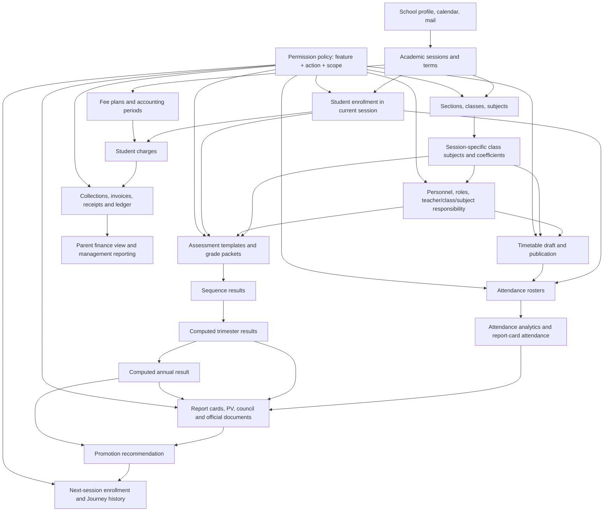

# BBC SMS — Full School Lifecycle E2E Acceptance and System Reference Plan

> **Purpose:** execution handoff for an agent or human tester who must configure a school from an empty database, exercise every operational lifecycle, verify permissions as real users, repair defects immediately, and leave behind an evidence-backed reference for how the application works.
>
> **Prepared:** 2026-08-14; deployment assumptions corrected 2026-08-16  
> **Repository:** `DeusData/bbcomplex` workspace  
> **Newest inspected code:** `origin/feature/academic-teacher-access-control` at `c7dc074` (`Implement Permission Policy V2`)  
> **Authoritative E2E application for this plan:** `http://localhost:8100` (frontend) / `http://localhost:8101` (backend), isolated `bbc-full-e2e` database  
> **Separate comparison environment:** `http://localhost:8085` (frontend) / `http://localhost:8084` (backend), production-simulation data and a different schema/image  
> **Other comparison environment:** `http://localhost:8096` (frontend) / `http://localhost:8095` (backend), Permission Policy V2 workspace and a separate fresh database

---

## 1. What this document is—and is not

This is not a shallow smoke checklist and it is not permission to report “the page opens” as a successful test. It is a controlled school-year simulation.

The executing agent must:

1. deploy one authoritative build containing all delivered epics;
2. start from a controlled, empty E2E database migrated only through Flyway;
3. configure Nursery, Primary, and Secondary for both Francophone and Anglophone subsystems;
4. create real test users and sign in as each of them;
5. perform daily school work from configuration through end-of-year promotion;
6. verify every mutation in its immediate screen, its API result, its persisted state, and all downstream modules that consume it;
7. attempt forbidden actions through both the UI and direct authenticated API calls;
8. document every screen, rule, dependency, state transition, and recovery path;
9. stop, diagnose, fix, redeploy, and rerun whenever a product defect is found; and
10. deliver a final system reference and traceable test report—not merely screenshots.

The test is complete only when the final exit criteria in section 33 are satisfied.

---

## 2. Critical precondition: use one unified build

### 2.1 Current local reality

The live inspection found three useful but different deployments. They must not be treated as one application/database:

| Deployment | What it proves | What it does not prove |
|---|---|---|
| `8100` frontend / `8101` backend (`bbc-full-e2e`) | Current full-E2E candidate: isolated database, current unified workflow candidate, editable class-subject configuration, and the environment to use for the lifecycle plan. Its database is separate from the production-like data. | It does not prove that the populated 8085 database can be upgraded safely or that production-derived data is compatible. |
| `8085` frontend / `8084` backend (`bbcomplex-wave1`) | Existing students, classes, academic results, attendance, finance documents, accounting, and historical operational data render and can be inspected. | It is not the authoritative build for this plan. It uses a different backend image/database schema; a curriculum-lock error reproduced there must not be attributed to 8100 without retesting. |
| `8096` frontend / `8095` backend (`bbcomplex-ppv2`) | Permission Policy V2 workspace, role templates, scoped policies, user overrides, session wizard, curriculum reuse, evaluation setup, and access-control UI can be inspected. | It is a separate database/build and is not sufficient as the single lifecycle runtime. |

**It is invalid to mark the E2E test as passed by testing half the flow on each deployment.** For the current planning handoff, 8100/8101 is the authoritative runtime. If the branch is rebuilt later, the agent must record the new image and migration versions and rerun the baseline checks rather than assuming equivalence.

### 2.2 Authoritative source and branch discipline

1. Fetch the remote repository.
2. Start from `origin/feature/academic-teacher-access-control` at or after `c7dc074`, unless a newer explicitly approved integration branch contains that commit.
3. Record:
   - exact branch;
   - exact commit SHA;
   - merge-base with `origin/main`;
   - dirty/clean status;
   - Docker image digests;
   - frontend build identifier if exposed;
   - backend `/actuator/health` output; and
   - Flyway schema version.
4. Do not execute the lifecycle test from the dirty primary workspace unless its unrelated changes have been reviewed and intentionally included.
5. Create an E2E branch named for the run, for example `feature/full-school-lifecycle-e2e-2026-08`.
6. Commit product fixes separately by defect. Do not mix fixture notes, screenshots, and unrelated source changes into one opaque commit.

### 2.3 Isolated runtime

The currently running isolated runtime already follows this shape:

- Compose project: `bbc-full-e2e`
- Frontend: an unused local port such as `8100`
- Backend: an unused local port such as `8101`
- Database: private Compose network only
- Database container: `bbc-full-e2e-db-1`
- Mailpit: `http://localhost:8125`

Before starting or rebuilding, resolve the absolute Compose project and volume names. Never delete or recreate the populated `bbcomplex-wave1` or production-derived volume. If 8100 is rebuilt, keep its database volume isolated and record whether it was fresh or reused.

### 2.4 Database rules

- The 8100 E2E database currently reports migrations through `V149`; the 8085 production-simulation database reports through `V122`. These are different schema states and must be recorded separately.
- A fresh authoritative E2E database must migrate automatically from `V1` through the newest migration packaged by the selected backend image.
- Never add, drop, rename, or update schema columns by hand.
- Every schema correction must be a forward-only Flyway migration with a migration test.
- Operational fixture data must be created through supported APIs/UI or a clearly labelled, repeatable fixture loader—not ad hoc SQL.
- SQL may be used read-only for evidence and reconciliation.
- If a production-like upgrade is tested, clone/sanitize the source first, back it up, run Flyway, and compare pre/post counts and constraints.

---

## 3. Known observations that must be retested first

These are not assumptions. They were observed during the preparation audit and must become explicit test cases.

| ID | Observation | Required disposition |
|---|---|---|
| `OBS-P0-01` | On the newest `8096` build, the fresh `admin` account displayed **Accès refusé** on several school-setup actions such as sections/classes/subjects even though it could open the Settings page. | Treat as release blocking if reproducible. A bootstrap administrator must be able to configure a new tenant before ordinary role restrictions are applied. Fix defaults/migration/bootstrap, then retest all setup APIs and UI actions. |
| `OBS-P0-02` | Permission Policy V2 safe-template preview returned `Une règle héritée doit avoir le périmètre` for built-in templates. | Reproduce from **Contrôle des accès → Profils → Modèles sûrs → Prévisualiser**. Fix inherited-rule validation or template payload. Verify preview is non-mutating, readable, and apply is audited. |
| `OBS-P1-03` | The populated build and latest permission build are split across two runtimes. | Deploy one unified runtime before functional acceptance. |
| `OBS-P1-04` | **Settings → General** exposes name, motto, city, country, phone, email, currency, authority, and hours, but no obvious street/postal address or logo field. | Confirm product requirement. If “address” cannot be represented on official documents, log and fix the data model/form/template before branding acceptance. |
| `OBS-P1-05` | Existing migrated data visibly contains mojibake such as `4??me`, `A??CHA`, and malformed accented subject names. | Run fresh UTF-8 creation and production-like migration tests. Verify database, API, HTML, CSV, XLSX, and PDF encodings. Do not normalize accents away as a workaround. |
| `OBS-P1-06` | With `T1_RESULT` selected, one populated report-card view still displayed `REPORT CARD — SEQ. 1` while its blocker details correctly referred to S1 and S2. | Reproduce with fully entered S1/S2 data. The heading, period label, calculations, and PDF must all identify Trimestre 1. |
| `OBS-P1-07` | A published class timetable produced attendance period choices labelled `Draft` in one populated data set. | Determine whether that label represents attendance-session state or timetable state. Make wording unambiguous and verify only published timetable occurrences are offered. |
| `OBS-P2-08` | Batch report-card blocked rows now show status rows such as `REPORT_NOT_CREATED`, but that code is not yet a helpful user explanation. | Verify stable code plus localized human reason, corrective action, student, period, and retry behavior. |
| `OBS-P2-09` | Legacy Finance and Finance V2 coexist. | Establish authoritative workflows. Test V2 end to end and run legacy regression without creating double-ledger or duplicate receipt behavior. |

No later phase may silently bypass `OBS-P0-01` or `OBS-P0-02` with direct SQL grants.

---

## 4. Product dependency map



### 4.1 Consequence for testing

When a source object changes, retest every downstream consumer:

- school identity → header, documents, report cards, invoices, receipts, payslips;
- session dates/status → enrollment, attendance generation, grade windows, finance context, promotion;
- class-subject coefficient → grade entry, weighted averages, ranking, PV, report card snapshot;
- responsible teacher → timetable auto-fill, teacher grade scope, teacher attendance period scope;
- timetable publication → teacher personal schedule and Secondary attendance periods;
- enrollment → rosters, grade sheets, fees, parent portal, reports, promotion;
- finalized attendance → analytics, alerts, report cards, dashboard;
- posted payment → charge balance, receipt, invoice status, journal, ledger, trial balance, parent portal, reports;
- published report card → parent visibility and immutable document history;
- committed promotion → source enrollment closure, target enrollment creation, Journey event, next-session class roster.

---

## 5. Domain rules the test must enforce

### 5.1 School structure

- `subsystem`: Francophone (`FR`) or Anglophone (`EN`).
- `level`: Nursery/Maternelle, Primary/Primaire, or Secondary/Secondaire.
- `section`: groups classes by subsystem and level/grade.
- `class`: the real student placement, not free text.
- `class subject`: a session-specific relationship among class, subject, coefficient, optional group, and responsible teacher.
- The subject catalogue coefficient is only a default. The coefficient used in calculations and report cards is the class-subject coefficient.

### 5.2 Academic session and result hierarchy

The canonical current-year structure is:

| Product | Inputs | Editable grades? | Result behavior |
|---|---|---:|---|
| Sequence 1 (`S1`) | one or more assessments per assigned class subject | Yes | Sequence subject and overall results |
| Sequence 2 (`S2`) | one or more assessments per assigned class subject | Yes | Sequence subject and overall results |
| Trimestre 1 (`T1_RESULT`) | S1 + S2 | **No independent trimester marks** | Computed average, statistics, ranking, attendance, council |
| Sequence 3 (`S3`) | assessments | Yes | Sequence result |
| Sequence 4 (`S4`) | assessments | Yes | Sequence result |
| Trimestre 2 (`T2_RESULT`) | S3 + S4 | No | Computed result |
| Sequence 5 (`S5`) | assessments | Yes | Sequence result |
| Sequence 6 (`S6`) | assessments | Yes | Sequence result |
| Trimestre 3 (`T3_RESULT`) | S5 + S6 | No | Computed result |
| Annual (`ANNUAL`) | T1 + T2 + T3, according to configured dependency/weight rules | No | Final annual result used by promotion |

Term access windows are optional. If a trimester has no opening or closing date, work remains unrestricted by date but is still governed by session state, workflow state, and user permissions. One trimester window governs its sequences and result product; do not require separate validation/publication/review windows for every child period.

### 5.3 Attendance

- Nursery and Primary: exactly one `DAILY` roll call per class per teaching day.
- Secondary: `PERIOD` roll call for each published timetable occurrence/subject period.
- A teacher may only mark an authorized roster:
  - Nursery/Primary homeroom teacher: their class daily roster;
  - Secondary responsible subject teacher: their own published class-subject occurrence;
  - titular/form teacher: read all class attendance by default; write only if policy explicitly allows it beyond their own teaching occurrences;
  - administration: according to configured action and scope.
- Finalize only when all enrolled students have a status.
- Reopen requires a reason and audit entry.
- Analytics denominator includes expected but unmarked sessions.
- Attendance percentage is `(present + late) / expected` unless a configured, documented policy supersedes it.

### 5.4 Timetable

- Nursery/Primary use `HOMEROOM`; all subjects inherit the homeroom teacher and the teacher control is locked.
- Secondary uses `DEPARTMENTAL`; the responsible teacher is inherited from class-subject assignment and cannot be replaced in a timetable slot.
- No teacher or room may be double-booked.
- Draft schedules do not create usable Secondary attendance occurrences.
- Published schedules are locked. Reopen requires a reason, changes create a new auditable state/version, and republish is required.
- A teacher sees their own published weekly schedule, not an arbitrary teacher selector.

### 5.5 Academic authority

- Nursery/Primary homeroom teacher may see and enter grades for every assigned subject and enrolled student in their class.
- Secondary subject teacher sees only their responsible class-subject grade sheets and cannot view or edit another subject's marks, even for a student they teach elsewhere.
- A Secondary titular may view the whole class result by default but cannot edit another teacher's grades unless explicitly granted `GRADE_EDIT_ANY_SUBJECT_IN_TITULAIRE_CLASS` or a bounded academic delegation.
- Accepted/published historical grade packets and report cards are immutable; correction uses an audited correction workflow.

### 5.6 Finance

- Fee types are reusable, versioned catalogue entries with accounting mappings.
- Active fee plans are scoped by session + subsystem/level, with optional class override. Class scope wins over broader scope.
- Charges snapshot the enrollment, class, fee plan, and fee type revision used at generation time.
- Re-running generation is idempotent.
- Collections allocate to open installments according to the quoted allocation; cash collection and fee waiver are different operations.
- Every posted collection, reversal, refund, expense, and payroll payment must create a balanced, immutable accounting journal through a unique source-event key.
- Invoice, receipt, and payslip PDFs are immutable snapshots; void/supersede creates history rather than rewriting the original.

### 5.7 Promotion

- Final average drives a recommendation, not an irreversible decision.
- Mapping defines the exact next class per source class and target session.
- Administrative override is always possible with a mandatory reason and audit trail.
- Commit is transactional and idempotent: close source enrollment, create at most one target enrollment, and append immutable Journey evidence.

---

## 6. Required test evidence and run artifacts

Create an ignored run directory such as `qa/e2e-runs/2026-08-14-full-school/`. It must contain:

```text
00-environment/
01-bootstrap-access/
02-school-settings/
03-academic-structure/
04-staff/
05-students-families/
06-timetable/
07-attendance/
08-academic-results/
09-finance/
10-parent-portal/
11-daily-operations/
12-promotion/
13-permission-sweep/
14-migration-regression/
defects/
final/
```

For every test case capture:

- test ID;
- date/time and timezone;
- build SHA and policy version;
- actor username and role profile (never the password);
- selected parcours/session/class/subject/student;
- route and exact click path;
- starting state;
- user action;
- expected UI result;
- observed UI result;
- HTTP method/path/status/correlation ID for important writes and denials;
- read-only database reconciliation where material;
- downstream screens checked;
- screenshot before and after material state transitions;
- PASS, FAIL, BLOCKED, or NOT APPLICABLE;
- defect ID and fix commit when applicable.

Keep credentials in a local ignored file or a secret manager. Do not commit passwords, invitation tokens, reset tokens, SMTP secrets, payment provider secrets, or student PII.

---

## 7. Defect response loop—fix issues on the fly

### 7.1 Severity

| Severity | Definition | Execution rule |
|---|---|---|
| P0 | Cannot bootstrap/login, data loss, permission bypass, unbalanced ledger, migration failure, cross-tenant leak | Stop the entire run. Fix and rerun from a clean database. |
| P1 | Core lifecycle blocked or materially wrong: enrollment, timetable publication, attendance, grades, report calculation, payment, document, promotion | Stop the affected dependency chain. Fix, add regression test, redeploy, and rerun from the source phase. |
| P2 | Workaround exists but UX, diagnostics, localization, or a secondary operation is wrong | Log immediately; fix during the run unless it risks the baseline. Rerun affected scenario. |
| P3 | Cosmetic or low-impact consistency issue | Record with screenshot and proposed acceptance criterion; batch only if no data/security impact. |

### 7.2 Required defect workflow

1. Preserve the failing state and correlation ID.
2. Reproduce once with browser devtools/network and once at the API boundary if safe.
3. Identify whether the failure is UI validation, API contract, authorization, domain logic, migration/data, concurrency, or rendering.
4. Write a failing automated test at the lowest useful layer.
5. Implement the smallest complete fix, including user-facing error communication.
6. Run focused tests, full affected module tests, frontend production build, backend compile/tests, and migration test when relevant.
7. Rebuild and redeploy the same E2E stack.
8. Re-execute the original test and all downstream tests identified in section 4.
9. Commit with the defect/test ID.
10. Update the run report with before/after evidence.

Never “fix” a scenario by editing a row directly in PostgreSQL unless the defect is specifically a documented data-repair tool—and even then, the repair must be a versioned, repeatable application operation.

---

## 8. Canonical fixture catalogue

Use synthetic names and `example.test` email addresses. The exact UUIDs are generated by the application; record them after creation.

### 8.1 School profile

| Field | Value |
|---|---|
| Name | `BBC E2E Demonstration School` |
| Motto | `Knowledge · Integrity · Service` |
| Street/address | `12 Test Avenue, Bastos`—if no field supports it, open `OBS-P1-04` |
| City | `Yaoundé` |
| Country | `Cameroon` |
| Phone | `+237 600 000 001` |
| Email | `office@bbc-e2e.example.test` |
| Currency | `XAF`/`FCFA` |
| Authority | `Ministry of Secondary Education / Ministry of Basic Education` as supported |
| School hours | `07:30`–`16:30` |
| Timezone | `Africa/Douala` |

### 8.2 Sessions

| Code | Dates | Initial state | Purpose |
|---|---|---|---|
| `2025-2026` | `2025-09-01`–`2026-07-31` | Closed/archived after rollover copy test | Previous configuration source and historical isolation |
| `2026-2027` | `2026-08-01`–`2027-07-31` | Open and current | Main operational lifecycle |
| `2027-2028` | `2027-08-01`–`2028-07-31` | Draft | Promotion target and session reuse |

Only one session may be current. Test Cancel on every state-transition modal before confirming with a reason.

### 8.3 Terms, reporting milestones, and optional access

| Term | Academic dates | Child products | Access-window scenario |
|---|---|---|---|
| T1 | `2026-09-01`–`2026-12-18` | S1, S2, T1_RESULT | No opening/closing restriction |
| T2 | `2027-01-04`–`2027-03-26` | S3, S4, T2_RESULT | Opening only during a controlled clock/date test, then remove restriction |
| T3 | `2027-04-05`–`2027-07-16` | S5, S6, T3_RESULT, ANNUAL | Closing-only test, then unrestricted for main flow |

Standard dependencies:

- `T1_RESULT = mean(S1, S2)`;
- `T2_RESULT = mean(S3, S4)`;
- `T3_RESULT = mean(S5, S6)`;
- `ANNUAL = mean(T1_RESULT, T2_RESULT, T3_RESULT)` unless the configuration explicitly uses different weights; record and verify the configured formula.

### 8.4 Calendar and bell periods

- Teaching days: Monday–Friday.
- Optional Saturday: disabled for the main run; enable briefly to test preview delta, then revert.
- Holidays:
  - `2026-10-01` — E2E Founders Day;
  - `2026-12-21` through term break as supported;
  - `2027-05-20` — National Day.
- Bell periods:
  - P1 `07:30–08:20`
  - P2 `08:25–09:15`
  - P3 `09:20–10:10`
  - Break `10:10–10:30` represented as no instructional period
  - P4 `10:30–11:20`
  - P5 `11:25–12:15`
  - P6 `13:00–13:50`
  - P7 `13:55–14:45`
  - P8 `14:50–15:40`

Attempt one overlapping period and verify it is rejected with both conflicting labels/times.

### 8.5 Sections and classes

| Code | Display name | Subsystem | Level | Model | Minimum students |
|---|---|---|---|---|---:|
| `MAT-FR-MS-A` | Moyenne Section A | FR | Nursery | HOMEROOM/DAILY | 3 |
| `NUR-EN-N2-A` | Nursery 2 A | EN | Nursery | HOMEROOM/DAILY | 3 |
| `PRI-FR-CE1-A` | CE1 A | FR | Primary | HOMEROOM/DAILY | 4 |
| `PRI-EN-C3-A` | Class 3 A | EN | Primary | HOMEROOM/DAILY | 3 |
| `SEC-FR-6E-A` | 6ème A | FR | Secondary | DEPARTMENTAL/PERIOD | 4 |
| `SEC-FR-4E-A` | 4ème A | FR | Secondary | DEPARTMENTAL/PERIOD | 4 |
| `SEC-EN-F1-A` | Form 1 A | EN | Secondary | DEPARTMENTAL/PERIOD | 3 |

Create at least one additional empty class in each level to verify empty-state behavior and forbidden cross-class leakage. Create progression mappings later from Nursery 2 → Class 1/SIL as locally appropriate, CE1 → CE2, 6ème → 5ème, 4ème → 3ème, and Form 1 → Form 2.

### 8.6 Subject catalogue and class-subject coefficients

Create separate FR and EN catalogue entries; never show both language curricula after a class is selected.

| Class group | Class subjects (sample) | Class coefficient rule |
|---|---|---|
| Nursery FR | Langage, Pré-mathématiques, Motricité, Découverte du monde | 1 each |
| Nursery EN | Language Activities, Pre-Mathematics, Motor Skills, Environmental Awareness | 1 each |
| Primary FR | Français, Mathématiques, Sciences, Anglais, Histoire/Géographie, EPS | FR 3, Math 4, Science 2, others 1 |
| Primary EN | English, Mathematics, Science, French, Social Studies, Physical Education | English 3, Math 4, Science 2, others 1 |
| Secondary FR | Français, Mathématiques, Anglais, Histoire, Géographie, SVT, Physique, Informatique, EPS | set per class; 4ème Math 4, French 3, sciences 2–3 |
| Secondary EN | English Language, Mathematics, French, History, Geography, Biology, Physics, Computer Science, PE | set per class; Form 1 Math 4, English 3 |

For one subject, set catalogue default coefficient `1` and class-subject coefficient `4`; verify all calculations and PDFs use `4` while a different class may still use `2`.

### 8.7 Personnel and login personas

| Persona ID | Role/profile | Assignment | Positive authority | Mandatory negative checks |
|---|---|---|---|---|
| `USR-BOOT` | Bootstrap administrator | Whole tenant | Initial configuration and access recovery | No cross-tenant data |
| `USR-DIR` | Direction | Whole school reporting | Dashboard, reports, approvals, permitted access-control actions | Settings mutations denied unless explicitly granted |
| `USR-PRINC` | Principal limited profile | Whole-school operational oversight | Council/report validation as configured | No session/class/course creation by default |
| `USR-REG` | Registrar/custom | FR+EN enrollment operations | Student/family/enrollment management | No finance posting or grade editing |
| `T-NUR-FR` | Nursery teacher/titular | Moyenne Section A | All subjects/children in that class; daily attendance | No other class, level, finance, settings |
| `T-NUR-EN` | Nursery teacher/titular | Nursery 2 A | Same within EN class | No FR class visibility |
| `T-PRI-FR` | Primary teacher/titular | CE1 A | All CE1 A subjects/grades/daily attendance | No Class 3/Secondary data |
| `T-PRI-EN` | Primary teacher/titular | Class 3 A | All Class 3 subjects | No CE1 data |
| `T-SEC-FR` | Secondary French teacher **and 4ème A titular** | French in 4ème A and 6ème A; titular of 4ème A | Edit French in both classes; view all 4ème A results as titular | Cannot edit 4ème A Math without override; cannot see 6ème A Math; cannot manage timetable |
| `T-SEC-MATH` | Secondary Math teacher | Math in 4ème A, 6ème A, Form 1 A if cross-subsystem assignment is intentionally allowed | Edit only assigned Math sheets and attendance periods | No French grades; no unrelated student profile mutation |
| `T-SEC-SCI` | Secondary Science teacher | Sciences in 6ème A only | Own grade/period rosters | No 4ème or EN data |
| `USR-ACC` | Accountant | All students' finance | Fee/charge/payment/document/report operations granted to accountant | No grades, attendance marks, student transfer, school structure |
| `USR-CASH` | Cashier/collector | Collection scope | Open cashier session, collect, close | No fee-plan activation, refund approval, ledger reopen |
| `USR-ECON` | Bursar/finance approver | Finance | Activate plan, approve refunds/close/payroll as configured | Cannot enter grades |
| `USR-HR` | HR manager | Staff and payroll preparation | Staff, leave, payroll preparation | No student grades or accounting close unless granted |
| `USR-NURSE` | Health officer/custom | Scoped student health | Health records for authorized students | No academic/finance writes |
| `PAR-FAM-A` | Parent | Three linked children across Nursery, Primary, Secondary | Only linked-child portal data according to relationship permissions | No unrelated child, staff UI, admin APIs |
| `PAR-FAM-B` | Parent | Two siblings across FR and EN | Both linked children | No family A data |

Use distinct email inboxes. Staff creation currently states that credentials are e-mailed when “Create a login account” is selected, so configure a local mail catcher or working test SMTP before creating accounts. If credentials cannot be retrieved safely, test and document the admin reset/invitation path; do not invent database passwords.

### 8.8 Students and family structures

Create at least 24 students so every class has enough rows for roster operations and ranking. Include these special families:

| Family | Children | Required behavior |
|---|---|---|
| `FAM-A` | Amina (Moyenne Section A), Benoît (CE1 A), Chantal (4ème A) | One existing parent account linked to three children across levels; parent search avoids duplicates; portal shows all three. |
| `FAM-B` | Daniel (Nursery 2 A), Esther (Class 3 A), Florence (Form 1 A) | Cross-subsystem siblings; relationship permissions may differ by child. |
| `FAM-C` | two Secondary siblings in 6ème A/4ème A | Existing parent linked on second registration by email and phone; ambiguous-name search requires explicit selection. |
| `FAM-D` | one CE1 student | Mother and father have separate accounts; guardian has pickup/emergency rights but no academic/finance portal. |
| `FAM-E` | one Nursery student | Invitation flow; account remains pending until token acceptance. |
| `FAM-F` | one Form 1 student | Immediate account creation with compliant password; forced-change behavior if configured. |

Include accented names (`Élodie`, `Aïcha`, `François`, `Nkoué`) to validate UTF-8 end to end. Include one same-name pair to test identity disambiguation. Use synthetic birth dates, NIUs, phones, and photos.

### 8.9 Grade data with known expected results

For one 4ème A student, use at least these two subjects while completing all other required assessments with controlled values:

| Subject | Coef | S1 | S2 | Expected T1 subject | S3 | S4 | Expected T2 | S5 | S6 | Expected T3 | Expected annual subject |
|---|---:|---:|---:|---:|---:|---:|---:|---:|---:|---:|---:|
| Mathématiques | 4 | 12 | 16 | 14 | 10 | 14 | 12 | 15 | 17 | 16 | 14 |
| Français | 3 | 14 | 10 | 12 | 11 | 13 | 12 | 16 | 14 | 15 | 13 |

With only those subjects, the expected weighted T1 overall is `(14×4 + 12×3) / 7 = 13.142857…`, displayed according to the product's rounding rule. For the real report, include every assigned required subject and independently calculate the expected overall, rank, class average, min, max, and pass rate in a verification sheet.

### 8.10 Finance catalogue and scenarios

| Fee code | Description | Default amount | Scope/use |
|---|---|---:|---|
| `REGISTRATION` | Annual registration | 25,000 XAF | All students or level plan |
| `TUITION` | Tuition | 150,000 XAF | Base; overridden by plan |
| `TRANSPORT` | School transport | 60,000 XAF | Optional election |
| `EXAM` | Examination fee | 15,000 XAF | Secondary only |
| `UNIFORM` | Uniform | 35,000 XAF | Optional/selected students |

Plans:

- Secondary FR level plan: tuition `150,000` in three `50,000` installments + registration + exam.
- 4ème A class override: tuition `180,000` in three `60,000` installments; verify override wins.
- Secondary EN plan: tuition `165,000` in three `55,000` installments.
- Primary plan: tuition `120,000` in three `40,000` installments + registration.
- Nursery plan: tuition `90,000` in three `30,000` installments + registration.
- Optional transport only for selected students.

Payment cases:

- Student A pays one installment only.
- Student B pays two installments in one collection if supported, otherwise two posted collections.
- Student C pays the entire open balance.
- Student D attempts an overpayment; verify configured behavior and clear warning.
- Student E has a waiver request approved by a different authorized user.
- One mistaken payment is reversed; one approved refund is processed.
- One cash collection and one provider/channel collection are reconciled.

---

## 9. Run-wide UX and quality contract

Every screen must satisfy the following while the functional flow is tested:

- Inputs have visible borders/backgrounds in view, edit, and add modes.
- Required fields have a clear `*` or equivalent before submission.
- Submitting an incomplete form marks every invalid field with a red border and local message, focuses or scrolls to the first invalid field, and preserves valid data already entered.
- Errors explain what failed, why, the affected object, and the next corrective action. Raw constraint names, hashes, UUID-only messages, or `Internal Server Error` are failures.
- Destructive/state transitions use application modals—not `prompt()`, `confirm()`, or `alert()`.
- Cancel closes the modal and causes no request/state change.
- Required reasons are validated inline.
- Loading, empty, success, warning, locked, and denied states are distinguishable.
- Long-running jobs show progress and per-row outcomes.
- All FR/EN labels are encoded correctly and do not mix languages unexpectedly.
- Keyboard navigation, focus indicator, labels, and accessible names work.
- A read-only user sees useful content without disabled management controls that imply authority.
- Hidden UI is not considered authorization; direct API access must also be denied.
- Responsive layouts remain usable at desktop and a narrow/mobile viewport for teacher roll call, grade entry, parent portal, and cashier collection.

---

## 10. Phase 0 — environment, migration, and baseline gate

### Objective

Prove that the exact candidate build starts cleanly, migrates without manual intervention, exposes healthy services, and is isolated from other local databases.

### Procedure

| ID | Exact procedure | Expected result and evidence |
|---|---|---|
| `ENV-001` | Record branch, SHA, working-tree status, Java/Node/Docker/PostgreSQL versions, Compose project, ports, image IDs, and volume name. | One environment manifest; no ambiguity about what was tested. |
| `ENV-002` | Run backend compile/tests and frontend CI tests/build before deployment. | All pass. Existing warnings are recorded separately and do not hide failures. |
| `ENV-003` | Start the isolated Compose project against a brand-new volume. | Database becomes healthy; backend starts; frontend serves; no dependency on another stack. |
| `ENV-004` | Inspect backend startup logs and Flyway history. | All migrations apply once, in order, through the candidate version; no checksum mismatch, failed migration, manual repair, or encoding warning. |
| `ENV-005` | Call `/actuator/health`, frontend root, unauthenticated protected API, and login page. | Health 200/UP; root 200; protected API 401; login renders without console error. |
| `ENV-006` | Log in using only the documented bootstrap credential, then change it if first-login policy requires. | Authentication succeeds; token refresh and `/api/auth/me` agree on tenant/user/role. No secret appears in logs or API response. |
| `ENV-007` | Open every top-level route once as bootstrap admin and collect console/network failures. | No unhandled exception, blank route, redirect loop, or generic 500. Permission-denied states are evaluated in Phase 1. |
| `ENV-008` | Restart backend and frontend without recreating the volume. | Configuration/data remain; Flyway performs no duplicate writes. |

### Gate 0

Do not create school data until all P0 environment problems are fixed. Preserve a database snapshot immediately after this gate so a clean post-migration baseline can be restored.

---

## 11. Phase 1 — bootstrap access and Permission Policy V2

### 11.1 Bootstrap administrator

1. Sign in as `USR-BOOT`.
2. Select **Tous les parcours / All parcours**.
3. Open **Paramètres / Settings**.
4. Visit each tab: **Scolarité**, **Années & périodes**, **Général**, **Calendrier**, **Discipline**, **Permissions**, **Rôles**, and **Messagerie**.
5. Verify the bootstrap administrator can perform first-school setup actions:
   - create section;
   - create class;
   - create subject;
   - assign class subject;
   - create/edit session;
   - manage school profile/calendar/mail;
   - view and manage roles/access policy.
6. If **Accès refusé** appears for these bootstrap necessities, reproduce at the corresponding API and resolve `OBS-P0-01` before continuing.

### 11.2 Access-control profile workflow

Path: **Applications → Pilotage → Contrôle des accès** (`/access-control`).

The inspected UI contains two main tabs: **Profils** and **Utilisateurs**; a policy version; safe templates; action groups; effects; data scopes; validity dates; risk level; preview; apply; and audit journal.

| ID | Action | Expected result |
|---|---|---|
| `ACL-001` | Open **Profils**, choose each built-in profile, and record its effective action count. | Profiles load with stable action codes grouped by domain. No raw loading/error state remains. |
| `ACL-002` | Choose **Direction — pilotage** safe template and click **Prévisualiser**. | Preview succeeds without mutation and lists additions/removals/scope changes/high-risk changes. `Une règle héritée doit avoir le périmètre` must not occur. |
| `ACL-003` | Cancel/leave after preview, reload, and compare policy version/rules. | No rule or policy version changed. |
| `ACL-004` | Apply a low-risk disposable template change with justification. | Confirmation names role and impact; apply is atomic; policy version increments once; audit stores actor/time/reason/before/after. |
| `ACL-005` | Attempt stale apply from a second admin browser using the old policy version. | HTTP 409/stale-policy response with instruction to refresh/re-preview; no partial write. |
| `ACL-006` | Set a temporary rule with start/end dates; verify before, during, and after effective period using controlled clock or bounded dates. | Capability activates and expires exactly as configured. Permanent rules do not require dates. |
| `ACL-007` | Try to allow a critical action such as enrollment transfer or ledger reopen. | UI requires explicit high-risk confirmation and justification; audit marks risk. |
| `ACL-008` | Choose **Utilisateurs**, assign multiple role profiles to a disposable account, choose primary role, dates, justification, and save. | Roles are saved together; primary role is valid; expired role does not grant authority. |
| `ACL-009` | Add a user-specific allow and deny override, preview, apply, and inspect effective decision. | Explicit deny wins according to documented precedence; decision endpoint explains profile, override, scope, and expiry. |
| `ACL-010` | Open the audit journal and filter/search the changes if supported. | Every mutation is attributable and immutable. No secret or full sensitive payload is exposed. |

### 11.3 Scope modes to test

For at least one read and one write action, verify each applicable scope:

- whole school;
- allowed parcours;
- assigned classes;
- titular classes;
- assigned class-subjects;
- assigned published occurrences;
- linked children.

The UI must not accept a scope that the action cannot resolve. An inherited rule must either have a valid inherited scope representation or omit a concrete scope according to the fixed contract—never fail ambiguously.

### Gate 1

- Bootstrap setup authority works.
- Template preview/apply works.
- Policy changes are previewed, confirmed, versioned, and audited.
- A direct API denial returns 403 with a stable code and does not leak unauthorized data.

---

## 12. Phase 2 — school identity, communication, calendar, and catalog foundations

### 12.1 General school profile

Path: **Paramètres → Général**.

The inspected form contains **Name, Motto, City, Country, Phone, E-mail, Currency, Authority, School start, School end**.

1. Enter the fixture values from section 8.1.
2. Attempt Save with the required name blank.
3. Verify red border, field-level message, and no request.
4. Enter accented text (`Établissement`, `Yaoundé`) and save.
5. Reload the browser and backend; values must persist exactly.
6. Sign out/in and verify the shell identity updates.
7. Later verify the same identity on:
   - report-card preview/PDF;
   - invoice/receipt;
   - official student document;
   - payroll slip;
   - exported report where branding is expected.
8. Determine where full street address and logo are configured. If absent, implement the missing profile fields and document-design integration before document acceptance.

### 12.2 Calendar

Path: **Paramètres → Calendrier**.

1. Confirm school hours reflect General settings.
2. Add each holiday from section 8.4.
3. Attempt duplicate date and invalid/blank label.
4. Cancel deletion; no record changes.
5. Confirm deletion of a disposable holiday through an app modal if deletion exists.
6. Verify attendance-generation preview excludes holidays and includes ordinary teaching days.
7. Verify a published timetable may display a holiday date as non-teaching/no attendance occurrence rather than silently generating a roster.

### 12.3 Discipline catalogue

Path: **Paramètres → Discipline**.

Create at least:

- Incident types: Late, Unjustified absence, Disruption, Violence, Property damage.
- Sanctions: Verbal warning, Written warning, Parent summons, Detention, Exclusion.

Verify duplicate labels/codes, inactive catalog entries, and use by the operational Discipline module.

### 12.4 E-mail/SMTP

Path: **Paramètres → Messagerie / E-mail**.

1. Configure a local mail catcher or approved test SMTP: host, port, username, password, From address/name, STARTTLS as applicable.
2. Save, leaving password blank on a later edit; existing password must remain unchanged.
3. Send a test message and verify receipt, From identity, encoding, and no secret in logs.
4. Enable the “User created” notification.
5. Later verify staff credentials, parent invitations, resets, event notices, and attendance alerts through the outbox and mailbox.
6. Simulate mail failure. The business transaction must follow documented behavior and clearly report queued/failed delivery without duplicating the account or event.

### Gate 2

School identity persists, UTF-8 is intact, calendar influences generation, catalogs are usable, and test e-mail delivery is observable.

---

## 13. Phase 3 — academic sessions, terms, result structure, and reuse

Path: **Paramètres → Années & périodes / Sessions & terms**.

### 13.1 Session lifecycle

| ID | Procedure | Expected result |
|---|---|---|
| `SES-001` | Create `2025-2026`, `2026-2027`, and `2027-2028` with section 8.2 dates. | Dates do not overlap illegally; all appear with code, state, term count, and version. |
| `SES-002` | Mark `2026-2027` current/open. | Exactly one current session; shell and enrollment default use it. |
| `SES-003` | Attempt a second current session. | Blocked with explicit reference to current session and corrective action. |
| `SES-004` | Click a state action (Open/Close/Archive), read consequence modal, then Cancel. | No request/state/version change. No native browser prompt. |
| `SES-005` | Confirm a valid state change with mandatory reason. | State/version/audit update once. Dependent operations respect state. |
| `SES-006` | Attempt to close current session with unresolved blockers. | Readiness lists precise blockers and links/screens to correct them. |

### 13.2 Academic configuration wizard

On `2026-2027`, use the five-step wizard observed in the newest UI:

1. **Session / trimestres**
   - define T1/T2/T3 and dates;
   - enforce ordering, non-overlap, and session boundaries;
   - preserve entries while moving Back/Next.
2. **Dates des résultats**
   - configure sequence/result dates where the model requires them;
   - do not create independent trimester marks.
3. **Dépendances / calculs**
   - map S1+S2→T1, S3+S4→T2, S5+S6→T3, T1+T2+T3→Annual;
   - display weights/formula plainly.
4. **Accès par trimestre (facultatif)**
   - leave T1 unrestricted;
   - configure temporary opening-only and closing-only cases for T2/T3;
   - verify blank dates mean no date restriction, not a readiness blocker.
5. **Vérification et confirmation**
   - display an editable diff and all blockers;
   - confirmation is one atomic write;
   - Cancel/back does not save partially.

### 13.3 Standard structure

1. Before apply, click **Preview structure / Prévisualiser**.
2. Verify ten products: S1, S2, T1_RESULT, S3, S4, T2_RESULT, S5, S6, T3_RESULT, ANNUAL.
3. Verify type, date range, parent term, dependencies, and access inheritance for each row.
4. Confirm preview writes nothing by reloading and checking API/database counts.
5. Click **Create standard structure** and confirm once.
6. Rerun apply/preview. It must be idempotent and show no duplicate products.

### 13.4 Readiness semantics

The readiness panel must:

- consider missing terms/reporting products/curriculum actual blockers;
- treat unrestricted trimester access as valid and display a green informational statement such as “No date restriction is configured”;
- never list a raw code without a human explanation and corrective navigation;
- refresh after a fix;
- avoid counting class-subject configuration from another session.

### 13.5 Reuse previous session

After configuring `2025-2026`, exercise reuse into `2026-2027` and later `2027-2028`:

1. Choose source session.
2. Select scopes: terms, reporting milestones, dependencies, optional trimester access limits.
3. Choose date-shift strategy.
4. Choose merge behavior: fill missing only, update selected, or update all.
5. Preview the diff.
6. Edit permitted target values in preview.
7. Cancel and verify no write.
8. Apply and verify only selected rows changed.
9. Repeat to prove idempotency.
10. Verify used/published historical configuration cannot be destructively overwritten.

### 13.6 Attendance expected-session preview

The screen explains that preview calculates expected class days and generation persists/synchronizes them.

1. Run preview before classes/calendar are complete and record understandable blockers/zero counts.
2. After Phase 6 timetable setup, rerun preview.
3. Verify counts by day/class/model and excluded holidays.
4. Ensure no opaque hash is shown without a label. If a fingerprint/idempotency key is displayed, label it as a technical run reference and hide it from primary success copy.
5. Do not generate until Phase 7 instructs it.

### Gate 3

The current session is uniquely established; standard period hierarchy and formulas are correct; optional windows are truly optional; previews are non-mutating; reuse is safe and auditable.

---

## 14. Phase 4 — sections, classes, subjects, curriculum, and evaluations

Path: **Paramètres → Scolarité / Academics setup**.

### 14.1 Sections

1. Open **Sections**.
2. Create the section/grade groups required by section 8.5 for FR and EN across all three levels.
3. Verify labels can contain `6ème`, `Moyenne Section`, and other accents without corruption.
4. Switch global parcours filter between All, FR, and EN; list counts and available actions must match.
5. Attempt duplicate section code/name in the same subsystem; verify precise validation.
6. Verify deletion is blocked if classes depend on the section and names the dependent classes.

### 14.2 Classes

1. Open **Classes**.
2. Create each fixture class with section, subsystem, level, display name, capacity/room if supported.
3. Confirm level-derived model:
   - Nursery/Primary → Homeroom / daily roll;
   - Secondary → Departmental / period roll.
4. Create empty control classes for leakage tests.
5. Verify FR/EN and level filters.
6. Attempt a class attached to an incompatible section/subsystem.
7. Confirm a class with enrolled students cannot be silently deleted.
8. Export/import template regression: download CSV template, inspect UTF-8 headers, dry-run a disposable class row if supported, and prevent duplicates.

### 14.3 Subject catalogue

1. Open **Matières / Subjects**.
2. Create the separate FR and EN catalogues from section 8.6.
3. Set code, name, subsystem, default coefficient, and category/group if supported.
4. Verify required borders and numeric coefficient range.
5. Attempt duplicate subject code within and across subsystem according to the intended uniqueness rule.
6. Select Francophone/Anglophone/All filters and verify counts.
7. Verify an Anglophone class later never offers the Francophone-only subject alternative.

### 14.4 Class subjects—the authoritative curriculum relationship

Path: **Scolarité → Matières par classe / Class subjects**.

For each class:

1. Select session `2026-2027`.
2. Select the class.
3. Confirm the “Subject to add” list contains only matching-subsystem subjects not already assigned.
4. Add each required subject.
5. Confirm the catalogue default coefficient is prefilled.
6. Override coefficients according to section 8.6.
7. Assign the responsible teacher after personnel exists; until then leave it explicitly unassigned and verify readiness identifies it.
8. Reload and verify the class curriculum table.
9. Confirm coefficient edits affect only this class/session.
10. Confirm removing a subject with assessments/grades is blocked or handled through a safe versioned workflow.

The UI must call this **Matières par classe / Class subjects**, not the awkward phrase “Class + subject combinations”. Manual assignment is the primary interaction; Excel import is optional bulk assistance.

### 14.5 Curriculum reuse

Use **Reuse class subjects / Preview reuse**:

1. select previous session;
2. choose one class and then all matching classes;
3. choose whether to copy subject groups and responsible teachers;
4. preview codes, coefficients, groups, teacher identities, conflicts, and unchanged rows;
5. apply fill-missing only;
6. change one target coefficient;
7. apply update-selected and verify only checked row changes;
8. verify source remains unchanged and every run is audited/idempotent.

### 14.6 Evaluation defaults

Path: **Scolarité → Évaluations**.

1. Choose session, class, and **Une séquence**.
2. Select S1.
3. Click **Préparer la revue**.
4. Confirm the friendly review screen contains exactly one default assessment row for every class subject—code, name, maximum mark, weight, and required flag—in one editable screen.
5. Confirm unrelated/unassigned subjects and the other subsystem do not appear.
6. Edit one name/max/weight and leave others at defaults.
7. Preview/create and verify row counts.
8. Repeat S1; it must show existing rows/update choices, not misleading `0 rows` with no explanation.
9. Choose **Les six séquences** and generate S2–S6 defaults.
10. Verify no default assessments are created for `T1_RESULT`, `T2_RESULT`, `T3_RESULT`, or `ANNUAL`; those are computed products.
11. Verify responsible-teacher readiness is visible before grade entry.

### 14.7 Document designs/branding

Path: **Scolarité → Modèles / marque**.

1. Confirm the page clearly explains version registry versus visual editor.
2. Publish a branding snapshot from the current school profile with mandatory reason.
3. Publish the appropriate report-card template families for Nursery/Primary/Secondary and FR/EN.
4. Verify unchanged publish is warned/blocked.
5. Change school motto later and prove old documents retain old snapshot while new documents use the new version.

### Gate 4

Every fixture class has a subsystem-correct, session-specific curriculum; coefficients are class-specific; evaluation templates exist only for assigned subjects and sequences; previews/reuse are safe.

---

## 15. Phase 5 — personnel, responsibilities, credentials, HR, and access assignment

Path: **Personnel / Staff**.

### 15.1 Create employees

The inspected form includes photo, name, sex, email, phone, login-account toggle, multiple roles, section/cycle, classes taught, department, contract type, and compensation.

For every persona in section 8.7:

1. Click **New employee**.
2. Upload a synthetic profile photo for at least one teacher and one administrator.
3. Enter name, sex, unique test email, and phone.
4. Select one or more roles.
5. For teachers, choose the exact cycle first; verify only that cycle's classes become selectable.
6. Select taught classes.
7. Set department.
8. Choose Permanent/monthly or Contractor/hourly and compensation.
9. Enable **Create a login account**.
10. Review before Save.
11. Save once; verify employee code and profile.
12. Retrieve the invitation/credential message from the test mailbox.
13. Complete first login/password-change if required.
14. Record username and credential status in the ignored credential vault, never in Git.

### 15.2 Negative form and identity tests

- Missing name/role/cycle → red local errors.
- Teacher assigned to two incompatible cycles → blocked with explanation.
- Duplicate email/username → no duplicate employee/account.
- Save double-click/network retry → one employee and one account.
- Email delivery failure → employee/account state is explicit and recovery action is available.
- Deleting employee with historical grades/timetable/payroll → blocked or deactivated, never historical data deletion.

### 15.3 Titular and subject responsibility

Configure assignments in the authoritative places:

- Nursery/Primary titular/homeroom teacher on class/timetable configuration, with class-subject teaching inherited and locked.
- Secondary responsible teacher on each **Class subject** relationship.
- Secondary titular/form teacher on class responsibility.

For `T-SEC-FR`:

- titular of 4ème A;
- responsible for Français in 4ème A;
- responsible for Français in 6ème A;
- not responsible for Mathématiques anywhere.

For `T-SEC-MATH`:

- responsible for Mathématiques in 4ème A and 6ème A;
- optionally responsible for Form 1 Mathematics only if their parcours scope explicitly permits EN; otherwise create an EN Math teacher and use the failed assignment as a scope test.

After each assignment, verify:

- class-subject row;
- academic teacher scope API;
- timetable auto-resolved teacher;
- grade-entry subject list;
- teacher personal schedule after publication;
- attendance period authority after publication.

### 15.4 Academic access exceptions

Path: **Paramètres → Scolarité → Exceptions d’accès**.

1. Verify teaching assignments and temporary access delegations are visually separate.
2. Create a bounded delegation allowing `T-SEC-FR` to edit 4ème A Math for one date range.
3. Preview impact before apply.
4. Verify permission active only within dates and exact class/subject/session.
5. Revoke with reason and verify audit.
6. Verify the delegation never changes the canonical responsible teacher used by timetable.

### 15.5 HR operational tabs

- **Directory:** search/filter by role/cycle/status.
- **Applications:** enable staff portal, submit a disposable application, accept/reject/finalize, ensure no employee exists before finalization.
- **Departments:** create Academic, Finance, Administration, Health; edit and dependency-check delete.
- **Leave:** submit, approve/reject by authorized role, verify dates and status.
- **Payroll summary:** compare staff compensation totals with Finance payroll inputs later.

### Gate 5

All required users can authenticate; role profiles and scopes are explicit; teacher responsibilities resolve consistently across curriculum, timetable, academic, and attendance; credentials are safely captured.

---

## 16. Phase 6 — student enrollment, families, profiles, and imports

### 16.1 Normal five-step registration

Path: **Élèves / Students → New student** (`/students/new`).

The inspected wizard contains:

1. **Student** — last name, first name, sex, birth date, NIU, birthplace;
2. **Class** — current real class; enrollment automatically links to current session;
3. **Family** — search existing guardian or add one/multiple adults;
4. **Access** — invitation, create now with password, or no portal;
5. **Review** — atomic confirmation.

For the first child in `FAM-A`:

1. Enter identity including accents, date, NIU, birthplace, and photo if the flow supports it.
2. Continue with required-name checks.
3. Select Moyenne Section A.
4. Add parent with name, relationship, email, phone, legal/financial/notification permissions.
5. Choose **Create now with password** using a compliant disposable password.
6. Review student, class, family, and access mode.
7. Click Confirm once.
8. Verify one student, one current-session enrollment, one guardian, one relationship, one account, and one audit chain.

For the second and third children:

1. Search existing parent by email, then phone, then name.
2. Confirm search results mask contact details and show linked-child count without exposing unrelated child identities.
3. Select the existing parent.
4. Register the child in CE1 A and 4ème A.
5. Verify guardian/account counts do not increase while relationship count does.
6. Sign in as parent later and verify all three children.

### 16.2 Multiple guardians and permissions

For `FAM-D`:

- mother: legal guardian, academic + attendance + finance + notices;
- father: academic + finance, no pickup;
- pickup guardian: emergency/pickup only, no portal.

On **Student details → Family and parent access**:

1. add/search each adult;
2. edit per-child permissions;
3. resend an invitation where applicable;
4. attempt duplicate active relationship;
5. open End relationship;
6. Cancel and verify no request/change;
7. end a disposable relationship with mandatory reason;
8. verify an account with another linked child remains active;
9. verify an orphaned account follows documented deactivation behavior.

### 16.3 Student list and dedicated profile

Path: **Students**.

1. Verify counts by subsystem, level, and class.
2. Search/filter and export.
3. Click a row; URL must become `/students/{id}`—no detail block at list bottom.
4. Verify profile contains identity/photo, current class, session-aware enrollment history, family, documents, and audit.
5. Test **Edit profile** and required validation.
6. Open **Transfer**, cancel, then transfer one disposable student in-year with reason.
7. Verify source/target roster, finance charge snapshot behavior, timetable/attendance availability, Journey history, and no duplicate active enrollment.
8. Test **Withdraw**, cancel, then withdraw a disposable student; verify exclusion from future rosters/charges without deleting history.
9. Generate **Certificate** and verify branding/identity/verification code.

### 16.4 Parent invitation/reset lifecycle

- Invitation token is random, hashed, expiring, single-use.
- Pending account cannot authenticate before acceptance.
- Acceptance with weak password is rejected locally and server-side.
- Reusing token fails safely.
- Forgot-password response is generic for existing/non-existing email.
- Five failed logins trigger configured lockout; successful/reset login clears as designed.
- Parent sees only linked children and permission-allowed domains.

### 16.5 Family import regression

Path: **Students → Import** (`/students/import-family`).

1. Download the current template and verify compatibility with the previously supported semicolon model containing father, mother, and guardian columns.
2. Upload CSV and XLSX containing:
   - valid new family;
   - existing parent match;
   - two siblings sharing parent;
   - invalid date;
   - duplicate row key;
   - formula-like cell beginning `=`;
   - accented names.
3. Choose class/session.
4. Inspect editable preview.
5. Run dry-run; database counts must not change.
6. Correct invalid row in preview and rerun.
7. Download report; formula injection is neutralized.
8. Commit once; verify per-row outcomes.
9. Retry same commit; no duplicate student/guardian/enrollment.
10. Confirm manual and import flows produce equivalent family relationships.

### Gate 6

Every class has active current-session students; shared parents are deduplicated; credentials and relationship permissions work; student profile actions are audited; imports are previewed and idempotent.

---

## 17. Phase 7 — complete weekly timetables and conflict behavior

Path: **Emploi du temps / Timetable**.

The inspected workspace contains **Class schedules**, **Teacher schedules**, and **Bell periods**.

### 17.1 Bell periods

1. Open **Bell periods**.
2. Enter P1–P8 from section 8.4 and save each changed row.
3. Reload and verify values drive all grids.
4. Attempt `P2 08:00–09:00` while P1 overlaps.
5. Expect a precise conflict message naming P1/P2 and times; no partial write.
6. Attempt end-before-start and blank label.
7. Verify existing published slots retain correct logical period/version behavior after a permitted non-destructive label edit.

### 17.2 Full-week definition

A class is considered “complete for the week” only when:

- every intended instructional cell Monday–Friday is populated;
- no accidental gap remains between expected teaching periods, except declared break/lunch/non-instruction time;
- subject distribution is plausible and documented;
- responsible teacher and room are resolved;
- conflicts endpoint reports none;
- publish readiness reports no blockers;
- published teacher schedules include every assigned slot;
- Secondary attendance exposes every relevant occurrence by weekday.

Use at least P1–P5 for Nursery, P1–P6 for Primary, and P1–P8 for Secondary. Saturday remains empty unless explicitly enabled.

### 17.3 Nursery/Primary homeroom schedules

For each Nursery and Primary fixture class:

1. Open **Class schedules** and select class.
2. Verify applied model is **Homeroom (daily roll)**.
3. Select the titular/homeroom teacher and click **Save homeroom teacher**.
4. Click an empty cell.
5. Select only the subject and room.
6. Verify teacher is automatically inherited, visible, and disabled.
7. Attempt to alter teacher through DOM/API; backend must reject it.
8. Populate the complete week, rotating the class's assigned subjects.
9. Verify only class-subject curriculum entries are selectable.
10. Publish and lock through an application modal.
11. Cancel first; verify no state change.
12. Confirm with reason if required; status becomes Published and grid locks.
13. Verify attendance remains one daily roll—not one roster per timetable cell.

Suggested Primary pattern (adapt subjects per FR/EN class):

| Day | P1 | P2 | P3 | P4 | P5 | P6 |
|---|---|---|---|---|---|---|
| Mon | Language | Math | Science | Language | Social studies | PE |
| Tue | Math | Language | French/English 2 | Science | Art | Reading |
| Wed | Language | Math | Social studies | Science | ICT | PE |
| Thu | Math | Language | Science | French/English 2 | Civics | Art |
| Fri | Language | Math | Review | Project | PE | Reading |

### 17.4 Secondary departmental schedules

For each Secondary fixture class:

1. Select class and verify **Departmental (period roll)**.
2. Verify class-subject table already has one canonical responsible teacher per subject.
3. Click an empty cell and choose subject.
4. Verify teacher auto-fills from class-subject responsibility and is disabled.
5. Verify changing subject changes the inherited teacher.
6. Select a room and save.
7. Fill Monday–Friday P1–P8 using all assigned subjects.
8. Publish only when every intended cell is valid.
9. Verify draft/reopened schedules do not create new Secondary attendance choices.
10. Verify published schedule does.

### 17.5 Required conflict cases

| ID | Attempt | Expected result |
|---|---|---|
| `TT-001` | Schedule `T-SEC-FR` in 4ème A and 6ème A at same day/P2. | Rejected with stable teacher-conflict code and human message naming teacher, existing class, subject, day, and period. |
| `TT-002` | Reuse the same room for two classes at same day/P3. | Rejected with room, class, and period details. |
| `TT-003` | Use teacher not responsible for selected class subject. | Teacher field cannot be changed; crafted API request rejected and canonical teacher identified. |
| `TT-004` | Assign Secondary teacher to Primary homeroom slot. | Rejected by level/cycle rule. |
| `TT-005` | Save subject not assigned to class curriculum. | Rejected; no slot persisted. |
| `TT-006` | Publish with unresolved teacher/room or incomplete required data. | Readiness lists exact cells and corrective action. |
| `TT-007` | Two admins update same version. | One succeeds; stale one gets 409 with refresh instruction. |

### 17.6 Reopen, version, and teacher views

1. On a published disposable class, click **Reopen with reason**.
2. Cancel; version/status unchanged.
3. Confirm with reason; grid becomes editable and audit records actor/reason.
4. Change one slot and republish.
5. Compare version/diff if available; previous published history remains traceable.
6. Open **Teacher schedules** as an administrator and select each teacher.
7. Verify class, subject, room, and period from all published schedules.
8. Sign in as each teacher; their timetable page must use `/api/timetable/teachers/me`, show only their own published schedule, and expose no manager selector or editing controls.
9. Export/print CSV/ICS/XLSX/PDF where available; verify accents, times, and no unauthorized classes.

### Gate 7

Every fixture class has a published, conflict-free weekly schedule; Primary teacher inheritance and Secondary responsible-teacher inheritance are enforced in UI and backend; personal teacher views are accurate.

---

## 18. Phase 8 — attendance generation, daily and period roll calls, analytics, and alerts

Path: **Présence / Attendance**.

The inspected workspace contains **Roll call**, **Analytics**, **Devices & reconciliation**, and **Settings**.

### 18.1 Policies

Open **Settings** and verify fixed model plus configurable thresholds:

| Level | Required model | Late threshold | Chronic absence threshold | Reason rule |
|---|---|---:|---:|---|
| Nursery | DAILY | 15 min | 15% | required for absent/excused |
| Primary | DAILY | 15 min | 15% | required for absent/excused |
| Secondary | PERIOD | 10 min | 20% | required for absent/excused |

Attempt to switch Primary to PERIOD and Secondary to DAILY. Both must be rejected with level-specific explanations.

### 18.2 Expected-session generation

1. In Attendance Settings, enter a one-week range with a known holiday.
2. Click **Preview**.
3. Verify:
   - one expected row/day/class for Nursery/Primary;
   - one expected row/published occurrence for Secondary;
   - no holiday/weekend rows;
   - no duplicate rows;
   - clear totals by class/model;
   - no database mutation.
4. Click **Generate sessions**.
5. Read the consequence modal; Cancel first and verify counts unchanged.
6. Confirm.
7. Verify synchronized counts and labelled technical run reference if present.
8. Repeat generation; result is idempotent—updates/no-op, not duplicates.
9. Modify and republish one timetable slot, regenerate the affected range, and verify safe synchronization/history.

### 18.3 Nursery/Primary daily roll call

Sign in as `T-PRI-FR`, then:

1. Open **Attendance → Roll call**.
2. Select a teaching date and CE1 A.
3. Verify there is no subject/period choice; one daily roster opens.
4. Verify every active current-session CE1 A student appears exactly once, including newly registered siblings.
5. Verify no other class is selectable/visible to this teacher.
6. Click **All present**.
7. Change one student to Late with minutes/note and one to Absent without a reason.
8. Click Save; missing reason must show red local error and no request.
9. Add reason and Save draft.
10. Reload; marks and optimistic version persist.
11. Leave one student unmarked and click Finalize; finalize is blocked naming incomplete count/student.
12. Complete all marks and Finalize.
13. Verify locked roster, status, actor/time, and audit history.
14. Teacher cannot reopen unless explicitly granted.
15. Authorized administrator reopens with reason, adjusts one mark, and finalizes again; history contains every transition.

Repeat a smaller daily scenario for Nursery and Anglophone Primary to prove level/subsystem scoping.

### 18.4 Secondary subject-period roll call

Sign in as `T-SEC-FR`:

1. Select a date whose published 4ème A timetable includes French.
2. Select 4ème A.
3. Verify Period/Subject lists only the teacher's authorized published French occurrence(s), not Math or another teacher's period.
4. Open the French roster and verify all enrolled students.
5. Mark a mix of Present, Late, Absent, and Excused; enter required reasons.
6. Save and finalize.
7. Repeat for the teacher's French occurrence in 6ème A.
8. Try direct API access to 4ème A Math period; expect 403 with scope reason and no roster data.
9. As `T-SEC-MATH`, verify Math period access but no French.
10. As 4ème A titular, verify configured read-all attendance overview; test that write authority remains limited unless explicitly granted.
11. As teacher, verify no attendance for empty/unassigned class or another parcours.

### 18.5 Concurrency and stale roster

1. Open the same draft roster in two sessions.
2. Save from session A.
3. Save stale data from B.
4. Expect 409 with instruction to reload and no silent overwrite.
5. Reload B and verify A's marks.

### 18.6 Analytics

Open **Analytics** as authorized management and scoped teacher:

1. Select exact date range and optional class.
2. Click Calculate.
3. Reconcile expected, present, late, absent, excused, unmarked, and percentage with raw rosters.
4. Verify unmarked expected rows remain in denominator.
5. Verify teacher results contain only scoped classes/occurrences.
6. Verify all-class administration totals equal sum of class totals without duplication.
7. Test term, semester/trimester, and academic-year ranges.
8. Verify dashboard and report-card attendance use finalized data only plus approved corrections.

### 18.7 Alerts and guardian notifications

1. Configure one student's absence rate above threshold.
2. Click **Create alerts**.
3. Verify deduplicated alert category/severity/student/source.
4. Finalize an Absent/Late mark and inspect EMAIL/SMS/IN_APP outbox rows for guardians with `receives_attendance`.
5. Guardian without attendance permission receives none.
6. Retry a failed delivery; no duplicate business alert/notification identity.
7. Verify Alerts page and parent portal reflect the outcome as designed.

### 18.8 Devices and reconciliation

1. Open **Devices & reconciliation**.
2. Verify reader health/empty state is clear.
3. Use the supported device test endpoint/fixture to submit one signed synthetic scan—never direct SQL.
4. Confirm scan remains immutable evidence and is not automatically treated as reconciled attendance.
5. Link it to the correct open roster.
6. Verify resulting mark source/device reference and audit.
7. Attempt duplicate or cross-student reconciliation; reject safely.

### Gate 8

Daily and period models are enforced, teacher scope is correct, complete rosters can be saved/finalized/reopened with audit, analytics reconcile exactly, and notifications/device evidence are safe.

---

## 19. Phase 9 — grade entry, computed results, report cards, council, and batch generation

Path: **Académique / Academic**.

The inspected workspace contains **Batch generation**, **Report card**, **Grade entry**, **Attendance & council**, and **Master sheet**.

### 19.1 Evaluation readiness

Before entering a mark:

1. Select class and S1 in **Grade entry**.
2. Confirm the subject selector contains only assigned class subjects with class-specific code/coefficient.
3. Confirm every subject has the generated default assessment.
4. Confirm the responsible teacher name and packet status are visible.
5. Confirm trimester/annual products cannot be selected for independent mark entry.
6. Missing responsible teacher must produce an administrator-oriented correction message in setup, while an authorized management user may save a draft according to the implemented policy; it must never falsely blame a teacher after data is saved.

### 19.2 Secondary subject teacher

As `T-SEC-FR`:

1. Open Academic; use **My grade sheets** if presented.
2. Select 4ème A, S1.
3. Verify only Français appears.
4. Verify every active 4ème A student appears and no other class/student leaks.
5. Enter score/status for every required assessment; use at least one ABS and one EX case if policy supports it.
6. Enter subject-wise remarks.
7. Attempt invalid mark above max/20 and negative mark; local/server validation must agree.
8. Click **Save without sending / Save draft**.
9. Reload and verify draft.
10. Click **Send to Management / Submit**.
11. Verify status, actor/time, and editing lock according to workflow.
12. Attempt Math by changing URL/API payload; 403, no Math data.
13. Repeat French in 6ème A; confirm no access to 6ème Math or other class.

As `T-SEC-MATH`, enter the known S1 Math values independently. Verify they cannot see French marks or comments.

### 19.3 Titular behavior and explicit override

As `T-SEC-FR`, who is titular of 4ème A:

1. Open read-only **Class overview**.
2. Verify all 4ème A subject results/statuses are visible, including Math.
3. Verify raw Math editing controls and another teacher's comments are not editable by default.
4. Verify another class's whole-class overview is denied.
5. Activate the bounded delegation/explicit `GRADE_EDIT_ANY_SUBJECT_IN_TITULAIRE_CLASS` test.
6. Within scope/date, edit one disposable 4ème A Math draft with audit attribution.
7. Revoke/expire permission; edit disappears and direct API returns 403.

### 19.4 Nursery/Primary teacher

As `T-PRI-FR`:

1. Select CE1 A and S1.
2. Verify all CE1 A class subjects are available because responsibility is inherited from titular role.
3. Enter marks/competency values and remarks for every student/subject.
4. Verify no other class or level is exposed.
5. Repeat one Anglophone Primary/Nursery competency/APC flow and confirm language/template family is correct.

### 19.5 Management review

As authorized Direction/academic manager:

1. Open reviewer queue.
2. Verify submitted packets grouped by period, class, and subject with plain-language status—not unexplained `1/2 · INCOMPLETE · OPEN` alone.
3. Open one packet, return it with reason, and verify teacher notification/edit state.
4. Teacher corrects and resubmits.
5. Accept packet; accepted packet becomes immutable.
6. Attempt stale review from another manager; 409/no overwrite.
7. Ensure empty reviewer queue has a clear explanation.

### 19.6 Sequence-by-sequence lifecycle

Repeat this controlled process for S1 through S6:

1. select the sequence;
2. complete every required class-subject assessment for all students;
3. save drafts;
4. submit packets;
5. review/accept;
6. preview a student's sequence report card;
7. reconcile subject mark, coefficient, weighted total, average, rank, class average, min/max, and appreciation;
8. validate/publish only when complete;
9. verify parent visibility according to publication state;
10. capture expected versus observed calculation workbook.

Use the staged milestones:

- after S1 only: S1 complete, T1 incomplete with explicit missing S2 dependencies;
- after S2: T1 computes automatically;
- after S3 only: S3 complete, T2 missing S4;
- after S4: T2 computes;
- after S5 only: S5 complete, T3 missing S6;
- after S6: T3 and Annual compute.

### 19.7 Computed trimester results

For each trimester:

1. Select `Tn_RESULT` in **Report card**.
2. Click the student again after period selection to eliminate stale-view ambiguity.
3. Verify title says the correct trimester—not Sequence 1.
4. Verify there is no grade-entry form for trimester.
5. Verify every subject result derives from its two sequences using configured weights.
6. Verify class-subject coefficient is applied once at overall aggregation.
7. Verify missing/ABS/EX handling is documented and correct.
8. Verify rank/statistics are recomputed across eligible students using a stable tie rule.
9. Change an underlying mutable sequence draft and verify preview updates; after publication, correction must use correction workflow and preserve old snapshot.

### 19.8 Annual result

After all six sequences:

1. Select `ANNUAL`.
2. Verify it derives from T1/T2/T3 and configured weights.
3. Reconcile known values from section 8.9.
4. Verify annual average/rank/mention, attendance/conduct totals, and council decision.
5. Verify this final result is the evidence source consumed by promotion.

### 19.9 Attendance and class council

Open **Attendance & council** for a trimester/annual product:

1. Verify finalized attendance totals load automatically.
2. Submit an absence-hours correction with justified/unjustified hours, late minutes, mandatory reason, and evidence reference.
3. Save draft, submit for review, approve/reject with separate actor according to policy.
4. Verify approved correction enters the report card; draft/rejected does not.
5. Enter work/conduct warning/blame, honor roll, encouragement, congratulations, exclusion days, decision code, and council observation.
6. Verify published report card locks these inputs and correction uses audited workflow.

### 19.10 Report-card fidelity and lifecycle

For one student in each level/template family:

- profile image appears and is cropped/rendered correctly;
- school identity, authority, session, class, matricule, teacher, and class size are correct;
- subject rows show assigned subjects only;
- sequence/trimester/annual columns match product type;
- coefficient is the class-subject coefficient;
- teacher/subject remark appears beside the subject where designed;
- totals, group totals, rank, appreciation, class profile, attendance, conduct, honors, council, and signatures are correct;
- FR/EN bilingual headers are correct for template;
- no mojibake or clipped content in HTML/PDF;
- validation and publication permissions are separate;
- old document snapshot remains immutable after profile/template/data correction;
- verification endpoint/QR or document code resolves public-safe metadata only.

Lifecycle test:

1. Preview incomplete card → blockers and corrective actions.
2. Complete dependencies → preview calculable.
3. Validate with authorized actor.
4. Publish within allowed/unrestricted window.
5. Parent can view/download only after publication.
6. Open correction with reason; generate new version; old remains verifiable.

### 19.11 Master sheet/PV

1. Select class and sequence/product.
2. Load master sheet.
3. Reconcile every student/subject score, coefficient, totals, rank, and class statistics.
4. Verify teacher sees only permitted view; management sees class-wide.
5. Export/print; verify UTF-8 and page layout.

### 19.12 Batch generation

1. Select class and milestone.
2. Click **Start generation**.
3. Verify progress counters and one row per student.
4. Intentionally leave one student's dependency incomplete.
5. Job completes with issues, showing student, stable blocker code, localized reason, missing dependency, corrective screen, attempts, and retry eligibility.
6. No failed row is silently omitted from archive/history.
7. Fix missing data.
8. Click **Retry failed rows**; only failed/blocked eligible rows rerun.
9. Download archive; verify every expected PDF, filenames, manifest, and immutable snapshot IDs.
10. Refresh/restart and verify durable job history/archive.

### Gate 9

All six sequences are entered by correctly scoped teachers; trimester and annual products compute rather than accept duplicate marks; council/attendance integrate; report cards and batch documents are correct, versioned, publishable, and parent-visible only when allowed.

---

## 20. Phase 10 — Finance V2, accounting, collections, documents, payroll, and reports

Run the authoritative Finance V2 flow as `USR-ACC`, `USR-CASH`, and `USR-ECON`. Run legacy `/finance` only as a regression surface and prove it cannot bypass or duplicate V2 accounting.

### 20.1 Segregation-of-duties baseline

Before configuring finance:

- accountant can see finance students/account search across permitted parcours but not academic marks or student transfer;
- cashier can collect but not activate plans, approve their own close/refund, or reopen ledger;
- bursar/approver can approve according to policy but cannot impersonate cashier collection;
- teacher and parent cannot open staff finance-management routes;
- parent can later read only linked-child balances/documents.

Test UI visibility and direct API 403 for each negative case.

### 20.2 Accounting foundation

Path: **Finance → Accounting** (`/finance/accounting`).

The inspected tabs are **Readiness, Accounts, Mappings, Periods, Journals, Trial balance, General ledger, Reconciliation**.

1. Open **Readiness** and resolve every blocker through **Fix now** links.
2. Create/review chart accounts at minimum:
   - cash/bank/mobile-money assets;
   - student accounts receivable;
   - tuition/registration/transport/exam revenue;
   - expense accounts;
   - payroll expense;
   - salary payable;
   - refund/waiver accounts as designed.
3. Validate unique codes, account type, active state, and referenced-account protection.
4. Configure posting mappings for:
   - charge;
   - collection by channel;
   - reversal;
   - refund;
   - waiver/adjustment;
   - expense;
   - payroll accrual/payment.
5. Test a mapping preview if available; debit/credit accounts and source-event key must be visible.
6. Generate monthly accounting periods for `2026-2027`.
7. Verify no overlaps/gaps and one current open period for test dates.
8. Post a balanced test journal; unbalanced journal is rejected.
9. Verify posted journal is immutable; correction uses reversal.
10. Close-preview a disposable period, inspect blockers, Cancel, then close with reason.
11. Attempt posting in closed period; reject.
12. Reopen only as separately authorized actor with reason and audit.

### 20.3 Fee-type catalogue

Path: **Finance → Fee types** (`/finance/fee-types`).

1. Click **New fee type**.
2. Create section 8.10 catalogue entries with code, name, description, category, default amount, mandatory/optional rule, effective dates, receivable account, and revenue account.
3. Save draft, create revision, activate.
4. Verify an active used revision cannot be destructively edited; **New revision** preserves history.
5. Deactivate a disposable unused type; used charges/documents remain readable.
6. Test search/category/lifecycle filters and legacy-review queue.
7. Verify amount uses integer XAF and rejects decimals/negative values.

### 20.4 Versioned fee plans and installments

Path: **Finance → Plans** (`/finance/plans`).

1. Select `2026-2027`, subsystem/level, and optional class.
2. Create the Secondary FR level plan.
3. Add active fee types and three tuition installments with labels, due dates, amounts, order, and optional/mandatory behavior.
4. Verify installment sum equals plan line amount.
5. Preview coverage: affected classes/students, conflicts, and missing elections.
6. Activate with authorized approver.
7. Create 4ème A class override and verify clear precedence explanation.
8. Create EN Secondary, Primary, and Nursery plans.
9. Configure transport election for selected students.
10. Verify no charge is created before explicit generation.
11. Test **Copy session** into `2027-2028`: preview, date shift, merge, edit, cancel, apply, idempotency.
12. Test student override/election with reason and audit; no silent plan mutation.

### 20.5 Charge generation

Path: **Finance → Charges** (`/finance/charges`).

1. Select session, class/level/subsystem, charge date, proration, and transfer behavior.
2. Click **Preview charges**.
3. Verify each row contains student, enrollment snapshot, class, chosen plan scope, fee type revision, installment schedule, amount, and blocker/action.
4. Verify 4ème A receives class override, 6ème A receives Secondary FR level plan, EN/Primary/Nursery receive their own plans.
5. Verify withdrawn/non-enrolled students are excluded according to charge date.
6. Confirm preview changes no account.
7. Click Generate and confirm.
8. Inspect job/result counts: created, already exists, blocked, failed.
9. Run generation again; every prior row returns already-exists/no-op—no duplicate charge/installment.
10. Open **Student accounts** and reconcile total billed/outstanding.
11. Open **Debtors & ageing** and verify due buckets at controlled as-of dates.
12. Test adjustment/waiver request and separate approval; accounting entries and balance change exactly once.

### 20.6 Cashier session and collection workflow

Path: **Finance → Collections** (`/finance/collections`).

The inspected wizard is **1 Find → 2 Allocate → 3 Details → 4 Review & post**.

As `USR-CASH`:

1. Open **Cashier** and start a cashier session with opening float if supported.
2. Click **New collection**.
3. Search student by name, matricule, class, and guardian; verify results are disambiguated.
4. Select account and confirm session/class/guardian context before money entry.
5. Enter amount equal to one installment.
6. Request quote/allocation; verify oldest-due/open installment rule and remaining balances.
7. Choose payment date, channel, reference/payer details.
8. Review expected allocation, resulting balance, receipt number behavior, and accounting preview.
9. Post once.
10. Verify success page links to collection, receipt, account, and print/download.
11. Repeat cases for two installments and full balance.
12. Attempt duplicate submit/network retry with same idempotency key; one collection/journal/receipt only.
13. Attempt overpayment and document configured behavior—block, unapplied credit, or explicit allocation; never silently discard value.
14. Close cashier session; preview expected vs actual cash and variance.
15. Cashier cannot approve their own close if segregation requires approver.
16. `USR-ECON` approves close; audit stores both actors.

### 20.7 Payment impact reconciliation

After every posted collection verify all of these before moving on:

- collection detail and immutable source event;
- installment paid/outstanding amount;
- charge/account balance;
- invoice status (`ISSUED`, `PARTIALLY_PAID`, or `PAID`);
- receipt issued once with correct amount/channel/allocation;
- balanced accounting journal;
- cash/bank/mobile-money debit and receivable credit;
- trial balance remains balanced;
- general ledger source link resolves to collection;
- finance report collected/outstanding changes;
- legacy dashboard does not double count;
- parent sees updated linked-child balance/receipt only.

### 20.8 Invoices, receipts, and batch documents

Path: **Finance → Documents** (`/finance/documents`).

1. Search/filter all documents by type, number, status, recipient, and dates.
2. Preview/create one invoice from open charges.
3. Verify immutable snapshot: school identity, student/guardian, class/session, lines, installments, due dates, amount/balance, number, verification data.
4. Generate class/session batch; preview first, process, inspect failures, download archive, retry failed only.
5. Download PDF and validate layout/encoding/content.
6. Verify receipt is automatically associated with posted collection and cannot be fabricated without collection.
7. Void an eligible invoice with mandatory reason and separate authority; original remains traceable.
8. Supersede with a new document; links are bidirectional.
9. Paid invoice cannot be silently voided contrary to policy.

### 20.9 Reversal and refund

1. Open a mistaken collection.
2. Request **reversal preview**.
3. Verify affected allocations, invoice status, balance, cashier implications, and reversal journal preview.
4. Cancel; no change.
5. Reverse with reason and authorized actor.
6. Verify original remains immutable, compensating journal balances, installment reopens, receipt/document status reflects correction, reports/parent portal update.
7. Create refund request for another collection.
8. Requester cannot self-approve if policy separates duties.
9. Approver decides; refund/payment journal and documents reconcile once.

### 20.10 Expenses

On legacy Finance **Expenses** or the authoritative V2 surface:

1. Create expense with date, category/account, amount, payee, description, evidence/reference, and payment channel.
2. Verify balanced posting and reporting.
3. Attempt deletion of posted expense; use reversal/correction rather than history removal.
4. Accountant permission cases must match action-level policy (`FINANCE_EXPENSE_VIEW/CREATE/DELETE`).

### 20.11 Payroll

Path: **Finance → Payroll** (`/finance/payroll`).

1. Configure earning/deduction components.
2. Create payroll period.
3. Preview a run and reconcile employees, contract type, base pay, adjustments, exceptions, gross, deductions, net.
4. Create run snapshot.
5. Calculate.
6. Add one documented adjustment.
7. Review as HR/authorized reviewer.
8. Approve as separate authorized actor.
9. Pay using configured payment account/channel.
10. Verify payroll expense and salary-payable/payment journals.
11. Generate payslips batch; inspect job/results/retry.
12. Download one payslip and verify branding, employee, period, components, gross/net, number, immutable snapshot.
13. Employee self-service may view only own payslips (`/self/payslips`); other employee ID/API is denied.
14. Void/correct only through authorized workflow with reason/audit.

### 20.12 Reporting and reconciliation

Path: **Finance → Reports** (`/finance/reports`).

1. Explicitly choose session, From, To, As-of, optional class/level/fee/channel.
2. Apply context; no KPI may mix sessions.
3. Reconcile tabs:
   - Receivables: billed = collected + outstanding + approved adjustments according to formula;
   - Collections: totals by channel/date/cashier;
   - Documents: invoice/receipt counts/statuses;
   - Expenses;
   - Payroll;
   - Accounting: trial balance and journals;
   - Reconciliation: unresolved items.
4. Verify freshness/source row labels.
5. Export and reconcile exported totals/encoding.
6. Close accounting period only after reconciliation has no blocking item.

### 20.13 Legacy Finance regression

On `/finance`:

- legacy Payments/Debtors/Expenses/Fees/Payment methods must either delegate to authoritative data or be clearly identified as legacy/read-only;
- “New payment” must not create a second unposted/non-ledger transaction path;
- dashboard/reports must not add legacy and V2 totals twice;
- old receipts remain readable after migrations.

### Gate 10

Fees are versioned and scoped correctly; charges are deterministic/idempotent; partial/full payments allocate and post once; invoices/receipts/payslips are immutable; ledger balances; parent/reporting views reconcile; duties are separated.

---

## 21. Phase 11 — parent portal and linked-family experience

Sign out completely, clear only the application authentication state—not the test evidence—and sign in as `PAR-FAM-A`.

### 21.1 Authentication and child scope

1. Complete invitation/immediate account login as applicable.
2. Verify parent shell does not expose staff applications or arbitrary parcours selector.
3. Parent landing page lists exactly Amina, Benoît, and Chantal.
4. Each child card shows correct class/session/identity.
5. Switch among children without data bleeding from the prior child.
6. Directly request an unrelated student UUID through every parent API; return 403/404 according to non-disclosure policy with no data.
7. End one relationship in a disposable family; child disappears while other children remain accessible.

### 21.2 Domain-by-domain parent checks

For each linked child and relationship permission:

| Domain | Positive test | Negative/visibility test |
|---|---|---|
| Academic | View only published sequence/trimester/annual results and download allowed report card. | Draft/validated-but-unpublished marks and another child's grades are absent. |
| Attendance | View finalized attendance summary/details and justified status as designed. | Draft roster, internal teacher note, and unrelated class are absent. |
| Finance | View charges, installments, balance, invoices, receipts after each test payment. | No fee configuration, other student account, journal, or staff financial data. |
| Discipline | View parent-facing incident/sanction/notice. | Internal-only note and unrelated incident absent. |
| Health | View only parent-safe fields permitted by relationship. | Confidential health fields and unrelated children denied. |
| Documents | Download allowed official documents and verify code. | Revoked/internal documents unavailable. |
| Events | See whole-school or targeted-class event. | Event for unrelated class absent. |
| Correspondence | Read notice and acknowledge once. | Cannot edit staff message; duplicate acknowledgement idempotent. |
| Supplies/books | View only published list for child's class. | Draft list and other class not exposed unless public policy says so. |

### 21.3 Shared-parent and per-child permission edge cases

- Parent may have Finance permission for one child but not another; portal must honor relationship-level setting.
- Same parent across FR and EN sees correctly localized class/subject labels, not duplicate account.
- If a child changes class or is promoted, historical items remain attached to historical class/session while current context updates.
- A reset/invitation for the shared account never creates a second parent identity or loses sibling links.

### Gate 11

Parent authentication is secure; only active linked children and permission-allowed domains are visible; published/posted downstream changes appear accurately; no staff or unrelated-family data leaks.

---

## 22. Phase 12 — discipline, coursebook, health, documents, events, correspondence, supplies, alerts, and management reporting

These modules are part of the “whole application” requirement. At least one complete create→consume→correct/archive path is required for each.

### 22.1 Discipline

Path: **Discipline**.

1. Click **New incident**.
2. Select class/student, configured incident type, date/time, description, severity, staff actor, and sanction.
3. Test required fields/invalid date.
4. Save and verify Recent incidents.
5. Notify parent using SMS/email template; inspect outbox/delivery state.
6. Parent sees parent-facing content only.
7. Verify report-card conduct/council input is affected only through the defined integration—not by arbitrary text inference.
8. Delete/correct only if policy permits and audit/history remains.

### 22.2 Coursebook

Path: **Coursebook**.

1. Sign in as a teacher and verify only assigned classes/subjects.
2. Select a published timetable class/date/subject if the module integrates them.
3. Create lesson topic, work completed, homework, due date, notes/resources.
4. Edit mutable entry; test stale concurrency.
5. Verify another teacher cannot edit it unless granted.
6. Verify parent-facing homework/summary if product exposes it.
7. Delete/archive with policy and audit.

### 22.3 Health and school life

Path: **Health**.

1. As `USR-NURSE`, select authorized class/student.
2. Create/update medical record using synthetic allergies/conditions/emergency notes.
3. Create infirmary visit with date, complaint, action, outcome.
4. Add activity record if supported.
5. Verify confidential fields require `HEALTH_CONFIDENTIAL_VIEW` and do not appear to ordinary teacher/parent.
6. Verify parent-safe view follows relationship permission.
7. Deleting a visit/activity follows audit and does not erase medical history silently.

### 22.4 Documents and orientation

Path: **Documents** and student profile **Certificate**.

1. Select class/student.
2. Upload a synthetic file with metadata; reject unsupported/oversized/malicious file.
3. Generate official certificate using published design/branding.
4. Verify immutable number, content snapshot, public verification, and PDF encoding.
5. Add orientation decision with date/reason/actor.
6. Revoke document with reason; public verification reports revoked without exposing private content.
7. Teacher/parent access follows action and child scope.

### 22.5 Events

Path: **Events**.

1. Click **New event**.
2. Create one whole-school event and one class-targeted event.
3. Verify date, audience, description, and required validation.
4. Click **Notify parents**; preview recipient counts if available.
5. Verify only guardians with notification permission and relevant child receive one notice per channel.
6. Parent portal shows relevant event.
7. Edit before notification and verify update behavior; avoid duplicate notices.
8. Delete/cancel with consequence communication.

### 22.6 Correspondence book

Path: **Correspondence**.

1. Select class/student.
2. Create a school→parent notice with title/body/date/acknowledgement requirement.
3. Parent reads and acknowledges.
4. Staff view reflects actor/time once.
5. Duplicate acknowledgement is idempotent.
6. Unrelated parent and teacher cannot access message.
7. Delete/correction behavior preserves necessary audit.

### 22.7 Supplies and school textbooks

Path: **Supplies & books / Classkit**.

1. Select a class.
2. In **Supplies**, create item, quantity, specification, optional/required flag.
3. In **School textbooks**, create title, author, ISBN, publisher/edition, quantity if supported.
4. Preview and publish class list.
5. Parent sees published list only.
6. Update draft and republish/version according to product behavior.
7. Verify FR/EN classes show appropriate lists and no cross-class leak.

### 22.8 Dashboard, proactive alerts, and school reports

1. Open **Dashboard** as Direction.
2. Reconcile student counts by level/subsystem, 30-day revenue/expense/balance, today's finalized attendance, recent payments, and alerts against source modules.
3. Open **Alerts**, click **Rescan**, and verify grade/absence/discipline/unpaid alerts are deduplicated and source-linked.
4. Acknowledge/resolve one alert; audit state transition and dashboard count.
5. Open **Reports** and reconcile demographics, finance, and attendance.
6. Print/export and verify current filters, UTF-8, totals, and no unauthorized fields.
7. Scoped teacher/finance users see only permitted aggregates; small-cell privacy is considered where relevant.

### Gate 12

Every secondary operational module has a working lifecycle and consumes the correct student/class/session/permission context; parent/management views reconcile with source data.

---

## 23. Phase 13 — end-of-year progression and Journey

Path: **Journey → End-of-year promotions** (`/journey/promotions`).

### 23.1 Student Journey before promotion

1. Open **Journey**.
2. Filter by class and select a student.
3. Verify session-aware timeline: enrollments, transfers, results, attendance/decisions where designed.
4. Verify committed/historical entries are append-only; no raw delete of material history.

### 23.2 Promotion configuration

On **Rules & paths**:

1. Select source `2026-2027` and target `2027-2028`.
2. Set automatic promote threshold `>= 10/20`.
3. Set repeat recommendation `< 8/20`.
4. Set `8–<10` to Needs review.
5. Require final average.
6. Save rule and verify version/effective scope.
7. Map every source class to the exact next class.
8. Mark terminal class as Graduate where applicable.
9. Attempt missing mapping, cross-subsystem incompatible target, target before source, and duplicate mapping.
10. Preview/copy progression graph from previous session if supported; verify source unchanged and publish/version lifecycle.

### 23.3 Automated recommendation

On **Review & commit**:

1. Enter a unique batch name/idempotency key.
2. Click **Preview decisions**.
3. Verify every eligible student row includes final average, evidence source/snapshot, current class, mapped target, recommendation, explanation, final decision, and status.
4. Expected examples:
   - `>=10`: Promote;
   - `<8`: Repeat;
   - `8–<10`: Needs review;
   - missing/unpublished required final average: Needs review with precise blocker;
   - terminal: Graduate.
5. Verify preview does not close/create enrollment.

### 23.4 Manual override

1. Click **Decide** for one automatically promoted student.
2. Choose Hold/Repeat and target as applicable.
3. Leave reason blank; field error, no request.
4. Enter council reason and apply.
5. Verify original recommendation remains visible beside final decision.
6. In another browser, attempt stale override; 409/no overwrite.
7. Verify only `PROMOTION_OVERRIDE`-authorized users can override.

### 23.5 Commit

1. Leave one Needs-review row unresolved and click Commit; entire batch is blocked with row link.
2. Resolve every row.
3. Open commit modal; read count/consequences.
4. Cancel; no enrollment changes.
5. Confirm with mandatory reason.
6. Verify transactionally:
   - source active enrollments become COMPLETED;
   - Promote/Repeat/Hold gets one target-session enrollment in chosen class;
   - Graduate gets none;
   - target enrollment links previous enrollment;
   - no duplicate active target enrollment;
   - Journey receives immutable recommendation/final decision/evidence/reason;
   - batch becomes read-only.
7. Retry same commit; returns committed result without duplicates.
8. Open target-session class rosters and parent portal context; verify promotion impact.

### Gate 13

Recommendations use the annual result, mappings are explicit, manual override is audited, and commit moves enrollment safely and idempotently into the next session.

---

## 24. Phase 14 — exhaustive persona and permission sweep

Functional success as admin is not permission success. Run this phase after data exists so scope filters can be proven.

### 24.1 Three layers to assert for every action

1. **Feature/module visibility** — whether route/navigation is visible.
2. **Action capability** — view/create/edit/submit/finalize/publish/reopen/approve/etc.
3. **Resource/data scope** — whole school, parcours, assigned class, titular class, class-subject, published occurrence, or linked child.

### 24.2 Test method

For every persona:

1. Sign in in a clean browser profile/session.
2. Record visible navigation.
3. Open every expected positive route and perform at least one permitted read/write.
4. Attempt every important forbidden route directly by URL.
5. Replay/craft direct API requests using a resource UUID from:
   - an authorized object;
   - another class in same parcours;
   - another parcours/level;
   - unrelated child/account;
   - another tenant if a safe second tenant fixture exists.
6. Verify list endpoints filter rows before returning them; they must not return all rows and rely on UI filtering.
7. Verify direct resource endpoints re-resolve scope and return 403/404 without sensitive body.
8. Verify denied writes cause no audit/domain mutation except a security-denial log if designed.
9. Change policy, refresh token/session according to cache rules, and verify effect timing.

### 24.3 Minimum persona matrix

Legend: `RW` permitted read/write in scope; `R` read-only in scope; `—` denied/hidden.

| Persona | Students | Academic | Attendance | Timetable | Finance | Settings | HR | Parent |
|---|---|---|---|---|---|---|---|---|
| Bootstrap admin | RW all | RW all | RW all | RW all | RW all | RW all | RW all | — |
| Direction | configurable R/approve | class-wide R/validate as granted | analytics/R | master R | reports/R | restricted by default | R | — |
| Registrar | RW profile/family/enrollment | limited R | — | — | student finance context R only if granted | — | — | — |
| Nursery/Primary teacher | R assigned students, no edit/transfer | RW all subjects in titular class | RW daily class | own R | — | — | own payslip R | — |
| Secondary subject teacher | R students in taught classes, no mutation | RW own class-subject only | RW own published occurrences | own R | — | — | own payslip R | — |
| Secondary titular | R titular students | R all titular-class results; RW own subjects | R all titular class, RW own occurrences unless override | own R | — | — | own payslip R | — |
| Accountant | finance-relevant student lookup R | — | — | — | RW per assigned finance actions | — | payroll per policy | — |
| Cashier | account search R | — | — | — | collect/view own session | — | — | — |
| Bursar | finance-relevant R | — | — | — | plan/approval/report as configured | — | payroll approval as configured | — |
| Nurse | R scoped student identity | — | — | — | — | — | health RW | — |
| Parent | linked-child summary only | published child R | finalized child R | — | linked-child R | — | — | RW own safe actions |

### 24.4 High-value negative cases

- Teacher edits student profile, transfers, withdraws, or links guardian.
- Primary teacher reads another Primary class or Secondary class.
- Secondary French teacher reads/edits Math grade packet.
- Secondary teacher calls arbitrary `/timetable/teachers/{id}`.
- Secondary teacher marks attendance for another teacher's period.
- Titular edits another subject without explicit override.
- Accountant enters grades/attendance or configures class/session.
- Principal creates/deletes session/class/course with default limited profile.
- Parent enumerates students, staff, finance ledger, another child, or unpublished report card.
- Any user modifies expired delegation/role or bypasses date scope.
- UI-hidden action invoked directly with valid UUID.
- Resource ID from another tenant if safe multi-tenant test fixture is available.

### 24.5 Permission-change UX

- Preview describes impact in ordinary language.
- Risky grant names affected role/user, action, scope, and dates.
- Required justification is visible and validated.
- Cancel causes no change.
- Apply increments policy version once.
- User sees a helpful “access changed—refresh/sign in again” state if token/cache refresh is required.
- Audit can answer who granted what, to whom, for what scope, when, until when, and why.

### Gate 14

No persona can see or mutate data outside feature, action, and resource scope; positive authority remains usable; policy changes are effective, explainable, and audited.

---

## 25. Cross-module “golden journeys”

These scenarios are the final proof that individual module passes form a coherent product.

### GJ-01 — Configure a class into a teachable unit

1. Create section/class.
2. Add subsystem-correct subjects with class coefficients.
3. Create teacher and responsibility.
4. Generate assessments.
5. Build/publish timetable.
6. Register student.
7. Verify teacher's student/grade/timetable/attendance scope.
8. Verify finance plan/charge can target enrollment.

**Pass condition:** no duplicate setup, every downstream selector contains the new class exactly once, and unauthorized personas do not see it.

### GJ-02 — Shared family across levels

1. Create first child + parent account.
2. Register two siblings in other levels using existing-parent search.
3. Sign in once as parent.
4. Verify three children with distinct academic, attendance, finance, discipline, and classkit contexts.
5. Change one relationship permission; only that child's domain visibility changes.

### GJ-03 — One Secondary lesson from planning to report card

1. Assign French teacher to 4ème A French.
2. Timetable inherits teacher and publish occurrence.
3. Teacher personal schedule shows it.
4. Attendance offers only that published period; teacher finalizes roster.
5. Teacher enters/submit French grade and remark.
6. Management accepts.
7. Sequence result and report card use class coefficient/remark/attendance.
8. Parent sees it only after publication.

### GJ-04 — Primary homeroom day

1. Set CE1 A titular.
2. Timetable slots lock that teacher for all subjects.
3. Teacher sees all CE1 A grade subjects.
4. Teacher performs one daily attendance call—not per period.
5. Attendance analytics/report card reflect it once.

### GJ-05 — Fee from plan to balanced ledger and parent receipt

1. Activate Secondary level plan and 4ème A override.
2. Generate charges.
3. Student pays one installment.
4. Verify allocation, balance, invoice state, receipt, journal, ledger, trial balance, report, dashboard, and parent portal.
5. Reverse a separate mistaken payment and verify every consumer reverses consistently.

### GJ-06 — Full academic year

1. Complete S1 and publish sequence result.
2. Complete S2; verify computed T1.
3. Repeat S3/S4→T2 and S5/S6→T3.
4. Verify computed Annual.
5. Enter attendance/council data.
6. Validate/publish annual report.
7. Promotion preview consumes exact annual evidence.
8. Override one decision, commit batch, and verify next-session enrollment/Journey/parent context.

### GJ-07 — Access change with no authority drift

1. Teacher lacks 4ème A Math edit.
2. Create dated delegation with preview/reason.
3. Teacher edits allowed draft during date window.
4. Revoke/expire.
5. Teacher immediately loses further edit but history remains attributed.
6. Canonical responsible teacher and timetable do not change.

---

## 26. Cross-cutting API, data integrity, concurrency, security, and performance tests

### 26.1 API contract

For representative endpoints in every domain:

- authenticated success returns the documented status/body;
- validation returns 400/422 with stable code, localized message, field errors, blockers/conflicts, and correlation ID;
- unauthenticated returns 401;
- authenticated but forbidden returns 403 without resource data;
- missing/non-disclosable object follows consistent 404 policy;
- stale optimistic version returns 409 with current version and reload instruction;
- repeated idempotent request returns prior result/no-op;
- unexpected server error has correlation ID, no stack trace/SQL/secret in response, and logs enough diagnostic detail.

Check pagination/filter/sort for large lists. Ensure tenant, session, parcours, class, subject, student, and user context is enforced server-side.

### 26.2 Database invariants to reconcile read-only

Use parameterized read-only queries or repository diagnostics to verify:

- one active current session per tenant;
- at most one active enrollment/student/session;
- no duplicate active guardian relationship;
- no duplicate class-subject/session relation;
- one canonical responsible class-subject teacher where required;
- no overlapping active academic delegation for same scope;
- no teacher/room double-booking;
- one DAILY attendance session/class/date or one PERIOD session/published occurrence;
- one attendance mark/student/session;
- no duplicate assessment default/class/subject/period/code;
- accepted/published grade/report snapshots immutable;
- charge idempotency/source uniqueness;
- collection allocation sum equals collection amount/unapplied credit according to policy;
- invoice/receipt school sequence uniqueness;
- every posted journal debits equal credits;
- unique source-event key;
- closed accounting periods reject new posts;
- one committed target enrollment per promotion decision;
- append-only audit/Journey evidence.

### 26.3 Concurrency pairs

Run two authenticated sessions for:

- session edit/state transition;
- class-subject edit;
- timetable slot/version publish;
- attendance roster save/finalize;
- grade packet save/review;
- permission policy apply;
- payment post/idempotent retry;
- promotion override/commit.

In each case, prove stale writes do not silently win and no partial child rows remain.

### 26.4 Security and privacy

- Passwords are hashed and never returned after creation.
- Invitation/reset tokens are hashed, expiring, single-use, and absent from logs.
- Uploaded images/files validate content type/size and safe storage path.
- CSV/XLSX export neutralizes formula injection.
- PDF/public verification exposes only necessary fields.
- Parent search masks contacts and does not reveal unrelated children.
- Health/confidential data uses stronger action.
- Audit logs avoid passwords, tokens, full payment secrets, and unnecessary health data.
- Refresh/logout invalidates access as designed.
- CORS/CSRF/cookie/token handling matches architecture.
- Tenant ID is derived from authenticated context, not trusted from arbitrary client input.

### 26.5 Performance and resilience

Use realistic synthetic scale in a second performance run, not the hand-entered functional set:

- 1,000+ students;
- 50 classes;
- 100 staff;
- full academic-year attendance expectations;
- six sequences × assigned subjects × students;
- class-wide charge and invoice batches;
- annual report-card batch.

Record p50/p95/p99 and error rate for:

- login/me/capabilities;
- student list/filter/profile;
- teacher scope/grade roster;
- attendance roster/save/finalize/analytics;
- timetable class/teacher views;
- charge preview/generation;
- collection search/quote/post;
- report-card preview/batch;
- dashboard/reports.

Verify background jobs survive browser refresh/backend restart as designed; retries do not duplicate outputs. UI should remain responsive with progress and cancellation where supported.

---

## 27. Fresh-install and production-like upgrade rehearsal

The product is not production-ready based only on a fresh database.

### 27.1 Fresh install

Already covered by Phase 0, but retain:

- full Flyway history;
- bootstrap school/user/default permissions;
- default attendance policies/actions;
- first-session wizard;
- no manual seed dependency.

### 27.2 Sanitized production-like upgrade

1. Read the existing deployment handoff (`output/PROD_DB_HANDOFF.md`) and identify sanitized source instance/backup.
2. Record pre-upgrade row counts by critical table and current Flyway version.
3. Validate backup restoration into a disposable database.
4. Deploy the exact candidate backend and let Flyway upgrade.
5. Do not run manual DDL/DML fixes.
6. Compare post-upgrade:
   - students and enrollments by session/class;
   - guardians/relationships/accounts;
   - staff/accounts/roles;
   - sections/classes/subjects/class-subjects;
   - grades/report snapshots;
   - attendance;
   - payments/charges/documents/journals;
   - timetable;
   - Journey/promotion;
   - audit counts.
7. Run UTF-8 probes on every known accented field and export/PDF.
8. Sign in as existing admin and representative migrated users.
9. Run route smoke and one safe read-only golden journey.
10. Run accounting reconciliation and identify legacy items without creating duplicate posting.
11. Restart; confirm Flyway no-op and stable behavior.
12. Document restore/rollback procedure and measured duration.

Any row loss, mojibake introduced by migration, duplicate account/enrollment, missing role grant, or unbalanced finance is P0/P1.

---

## 28. Automated regression suite required from defects and acceptance

Live browser testing discovers integration and UX failures; automated tests prevent recurrence. Add or confirm the following.

### 28.1 Backend integration tests

- fresh tenant bootstrap admin can perform setup;
- safe role-template preview/apply including inherited scopes;
- current-session uniqueness and transition cancellation/business rules;
- optional trimester windows and dependency calculations;
- curriculum copy/idempotency/coefficient precedence;
- family transaction rollback, sibling reuse, account lifecycle, import retry;
- teacher academic scope: Primary all own class; Secondary own subjects; titular read-only; bounded delegation;
- timetable inheritance and teacher/room conflicts;
- attendance model, roster, finalize/reopen, stale save, denominator, notifications;
- assessment generation for assigned subjects only;
- sequence→trimester→annual formulas, rank/ties, snapshot immutability;
- batch per-row diagnostics/retry/durability;
- fee catalogue/revision/plan precedence;
- charge generation idempotency/snapshots;
- collection allocation/idempotency/reversal/refund/cashier close;
- invoice/receipt sequence/snapshot/void/supersede;
- payroll approval/payment/payslip/self-access;
- balanced journals/closed periods/reconciliation;
- promotion recommendation/override/transaction/idempotency;
- all action/scope direct API denials;
- Flyway fresh and upgrade fixtures.

### 28.2 Frontend tests

- visible/hidden actions from capabilities without optimistic fallback;
- required fields and inline errors on every major form;
- app confirmation modal Cancel/Confirm semantics;
- session wizard optional dates/reuse diff;
- class-subject manual assignment and evaluation review table;
- teacher-restricted grade subject list and titular overview;
- timetable inherited disabled teacher control;
- attendance daily vs period selectors and roster validation;
- computed trimester label/content;
- batch reason display/retry;
- finance four-step collection and post-success links;
- parent multi-child isolation;
- access-control preview/stale/risk confirmation;
- FR/EN localization and accented fixtures.

### 28.3 Browser E2E automation

Automate stable core golden journeys with separate storage state for:

- bootstrap admin;
- Primary teacher;
- Secondary subject teacher;
- Secondary titular;
- accountant;
- cashier;
- parent.

The automation must create/clean its own uniquely prefixed data through APIs/UI and never depend on row order or production-derived IDs. Keep destructive cleanup limited to the isolated E2E tenant.

### 28.4 Contract and reconciliation tests

- OpenAPI/client request/response agreement if OpenAPI exists;
- stable error codes/message parameters;
- document totals match source snapshots;
- dashboard/report totals match domain queries;
- trial balance and source-event reconciliation;
- permission decision explanation matches actual endpoint behavior.

---

## 29. System-reference documentation to write during execution

The tester must build a user/system reference in parallel, not reconstruct it from memory at the end.

### 29.1 One module page per feature

Each module document must contain:

1. purpose and business owner;
2. actors and permission actions/scopes;
3. prerequisites;
4. exact navigation path and screen/tab names in FR and EN;
5. field dictionary: name, meaning, required/default, validation, example;
6. state/lifecycle diagram;
7. normal click-by-click workflow;
8. alternate/edge workflows;
9. what data it creates or changes;
10. upstream dependencies;
11. downstream consumers/impacts;
12. errors/blockers and exact corrective action;
13. audit/concurrency/idempotency behavior;
14. notifications/documents/jobs produced;
15. reports/metrics affected;
16. security/privacy rules;
17. screenshots for empty, filled, validation-error, success, denied, and locked states;
18. test IDs and current PASS/FAIL status.

### 29.2 Required module reference set

- Authentication, parcours selection, and shell;
- Settings: school, calendar, discipline, mail, roles;
- Permission Policy V2/access control;
- Sessions, terms, reporting milestones, optional windows, reuse;
- Sections/classes/subjects/class subjects/evaluations/designs;
- Staff/HR/accounts/academic responsibilities/delegations;
- Students/enrollments/families/import/profile/documents;
- Timetable;
- Attendance;
- Academic grades/results/report cards/PV/council/batches;
- Finance catalogue/plans/charges/collections/documents/accounting/payroll/reports;
- Parent portal;
- Journey/promotions;
- Discipline;
- Coursebook;
- Health;
- Documents/orientation;
- Events;
- Correspondence;
- Supplies/books;
- Dashboard/alerts/reports;
- Operations, migrations, backup, monitoring, and troubleshooting.

### 29.3 Interaction ledger

Maintain a table like:

| Source event | Immediate write | Downstream read/update | Permission | Audit/event | User-visible confirmation |
|---|---|---|---|---|---|
| Student registration | student + enrollment + guardian links/account | rosters, grade sheets, charges, parent portal | student/enrollment/guardian actions | registration aggregate audit | review + atomic success |
| Timetable publish | published version/slots | teacher schedule, Secondary attendance | timetable publish | version audit | locked status |
| Attendance finalize | finalized marks | analytics, alerts, report card | finalize | actor/time/version | complete summary |
| Grade packet accept | immutable packet | sequence/trimester/annual results | packet review | review audit | accepted badge |
| Payment post | collection + allocations + journal + receipt | balance, invoice, reports, parent | collect/ledger rules | source-event audit | receipt/success links |
| Promotion commit | source close + target enrollment + Journey | next-session rosters/parent context | promotion commit | batch audit | committed register |

Expand it during the run for every material event.

---

## 30. Execution order, dependency gates, and safe parallel work

The main lifecycle is deliberately sequential because later data depends on earlier configuration.

```text
Gate 0 Environment
  → Gate 1 Bootstrap permissions
  → Gate 2 School/calendar/mail
  → Gate 3 Sessions/result structure
  → Gate 4 Classes/curriculum/evaluations
  → Gate 5 Staff/accounts/responsibilities
  → Gate 6 Students/families/enrollments
  → Gate 7 Timetable publication
  → Gate 8 Attendance
  → Gate 9 Academic year/report cards
  → Gate 10 Finance/accounting/payroll
  → Gate 11 Parent portal
  → Gate 12 Supporting daily modules
  → Gate 13 Promotion
  → Gate 14 Permission sweep
  → Upgrade rehearsal and final reconciliation
```

Parallel work is allowed only when agents have separate files/evidence and do not mutate shared prerequisite state unpredictably. Examples:

- after Gate 6, one agent may document Health/Documents while another configures Finance catalogue;
- frontend accessibility review may run in parallel with read-only API inventory;
- performance run must use a separate database;
- production-like upgrade must use a separate database;
- two agents must not concurrently edit the same role policy, timetable version, roster, grade packet, or finance period unless executing a planned concurrency test.

One lead agent owns the canonical run ledger and decides when each gate passes.

---

## 31. Route and screen coverage index

The final report must include a result for every route below, even if the route is denied for a particular persona.

### Authentication/public

- `/login`
- `/join-staff/:slug`
- `/parent-invite`
- `/parent-reset`
- `/parcours`
- public report-card/document verification endpoints/screens where exposed

### Community

- `/students`
- `/students/new`
- `/students/import-family`
- `/students/:id`
- `/journey`
- `/journey/promotions`
- `/health`
- `/documents`
- `/staff`

### Education

- `/academic`
- `/presence`
- `/discipline`
- `/coursebook`

### Operations

- `/finance`
- `/finance/fee-types`
- `/finance/plans`
- `/finance/charges`
- `/finance/collections`
- `/finance/documents`
- `/finance/payroll`
- `/finance/accounting`
- `/finance/reports`
- `/timetable`
- `/events`
- `/messages`
- `/classkit`

### Steering and portals

- `/dashboard`
- `/alerts`
- `/reports`
- `/settings`
- `/access-control`
- `/parent`
- `/apps`

For each route record admin outcome, relevant persona outcome, console errors, failed network calls, empty/loading/error state, and mobile usability where relevant.

---

## 32. Final deliverables from the executing agent

1. **Environment manifest** — branch/SHA/images/ports/Flyway versions.
2. **Fixture manifest** — generated IDs and relationships, excluding secrets.
3. **Credential handoff** — secure/ignored vault or test mailbox references only.
4. **Master test ledger** — every ID, status, evidence links, defect/fix SHA.
5. **Module system reference** — section 29 format for every module.
6. **Interaction/dependency ledger** — every material cross-module event.
7. **Permission matrix** — expected versus observed UI/API behavior per persona/action/scope.
8. **Calculation workbook** — independent academic and finance expected values.
9. **Accounting reconciliation** — source events, journals, trial balance, unresolved queue.
10. **Document QA pack** — representative report cards, invoices, receipts, certificates, payslips, exports, and verification results.
11. **Migration report** — fresh and production-like upgrade evidence, counts, encoding, rollback rehearsal.
12. **Defect register** — severity, reproduction, root cause, tests, fix, rerun scope, disposition.
13. **Automated test report** — commands, versions, pass/fail, coverage added.
14. **Performance report** — data size, methods, percentiles, bottlenecks.
15. **Final executive summary** — what works, what was fixed, residual risks, go/no-go recommendation.

Suggested final file set:

```text
FULL_SCHOOL_LIFECYCLE_E2E_TEST_REPORT.md
BBC_SMS_SYSTEM_REFERENCE.md
BBC_SMS_PERMISSION_ACCEPTANCE_MATRIX.md
BBC_SMS_DATA_AND_CALCULATION_RECONCILIATION.md
BBC_SMS_MIGRATION_AND_RELEASE_READINESS.md
qa/e2e-runs/<run-id>/...
```

---

## 33. Definition of done and release decision

The complete lifecycle is **PASS** only when all of the following are true:

### Environment and data

- one unified candidate build was tested;
- fresh migration and restart pass without manual schema/data changes;
- production-like upgrade preserves counts, relationships, encoding, and accounting balance;
- test fixtures are repeatable and isolated.

### School setup

- bootstrap administrator can configure a new school;
- school identity/calendar/mail/catalogs persist and feed downstream output;
- one current session, standard S1–S6/T1–T3/Annual structure, optional windows, and reuse work;
- classes, subjects, class-subject coefficients, evaluations, and design versions are correct for FR/EN and all levels.

### People and permissions

- staff/parent accounts can authenticate through supported lifecycle;
- Nursery/Primary homeroom and Secondary departmental authority are enforced;
- titular read-all/edit-exception behavior is correct;
- accountant/cashier/bursar/principal/parent defaults match policy;
- direct APIs enforce the same action and scope as UI;
- no cross-class, cross-parcours, cross-family, or cross-tenant leak;
- access-control preview/apply/override/expiry/audit works, including the previously failing template preview.

### Daily operations

- every fixture class has a complete published weekly timetable;
- no teacher/room conflict can bypass backend;
- daily and period attendance work, finalize/reopen/audit/analytics reconcile;
- every assigned teacher can enter only authorized grades;
- S1 through S6, computed T1/T2/T3, and Annual are numerically correct;
- report cards include photo, class coefficient, remarks, attendance/council, correct labels, immutable versions, and working PDFs;
- batch jobs explain blocked rows and retry safely;
- supporting modules complete at least one lifecycle and respect scope.

### Finance and end of year

- fee plans cover broad and class override scenarios;
- charges and payments are idempotent;
- partial/full payment, reversal/refund, invoices/receipts, payroll/payslips work;
- every financial source event posts one balanced journal and reports reconcile;
- parent sees only linked-child finance;
- promotion recommendations use annual evidence, overrides require reason, and commit creates correct next-session enrollment once.

### User experience and documentation

- no core flow uses native browser prompts/confirms;
- validation/error/locked/loading/empty/success states are understandable;
- no unexplained hashes, constraint messages, or generic 500 remain;
- accents and FR/EN content render correctly in database→API→UI→export/PDF;
- required reference/evidence documents are complete enough for a new operator or implementation agent to follow without oral context;
- no open P0/P1 defect remains;
- every P2/P3 has an owner, acceptance criterion, and explicit release disposition.

If any item above is false, the final status must be **NO-GO** or **CONDITIONAL GO** with the exact blocker. “Mostly works” is not a valid release conclusion.

---

## 34. Short operating instruction for the assigned agent

Start at section 10 and obey every gate. Use the live UI for normal business operations, inspect network/API behavior for evidence, and use the database only read-only for reconciliation. The moment a defect appears, follow section 7: preserve evidence, reproduce, add a regression test, fix, redeploy, and rerun the affected dependency chain. Keep the system reference current at every phase. Do not wait until the end to explain how the application works.
