# Guide utilisateur BBC SMS

Un tutoriel par module : chaque procédure est décrite étape par étape, avec la capture d'écran correspondante. Commencez par le chapitre 1, puis lisez le chapitre qui correspond à votre fonction — chacun se termine par une fiche de test pour valider votre prise en main.

> Version interactive et bilingue (FR/EN) dans l'application : menu **Aide** ou `/guide/`. Ce fichier et la version web sont générés depuis `tools/guide/content.py` (`python3 tools/guide/build.py`).

## Sommaire

**Démarrer**

- [1 Prise en main](#prise-en-main)
- [2 Rôles, permissions et périmètre](#roles-permissions)

**Communauté**

- [3 Paramètres — la fondation de l'année](#parametres)
- [4 Élèves](#eleves)
- [5 Personnel & ressources humaines](#personnel)

**Pédagogie**

- [6 Présence](#presence)
- [7 Académique — bulletins et procès-verbaux](#academique)
- [8 Discipline](#discipline)
- [9 Cahier de textes](#cahier-de-textes)
- [10 Emploi du temps](#emploi-du-temps)

**Opérations**

- [11 Finance](#finance)
- [12 Événements](#evenements)
- [13 Carnet de correspondance](#correspondance)
- [14 Fournitures & manuels](#fournitures)
- [15 Parcours scolaire](#parcours-scolaire)
- [16 Santé & vie scolaire](#sante)
- [17 Documents & orientation](#documents)

**Pilotage & familles**

- [18 Pilotage — tableau de bord, alertes, rapports](#pilotage)
- [19 Portail parent](#portail-parent)

**Aller plus loin**

- [20 Démarrer une nouvelle année](#demarrer-une-annee)
- [21 Questions fréquentes & dépannage](#faq)
- [22 Annexes](#annexes)

## 1 Prise en main

*Se connecter, choisir son parcours, se repérer dans l'écran d'accueil.*

**Pour qui :** Tout le monde — 10 minutes.

BBC SMS s'utilise depuis un navigateur (Chrome, Edge, Firefox ou Safari), sur ordinateur comme sur téléphone. Il n'y a rien à installer : l'adresse de l'école suffit.

### 1.1 Se connecter

1. Ouvrez l'adresse communiquée par l'établissement. L'écran de connexion s'affiche. Le sélecteur **FR** / **EN** en haut à droite change la langue de l'interface : votre choix est mémorisé sur ce poste.

   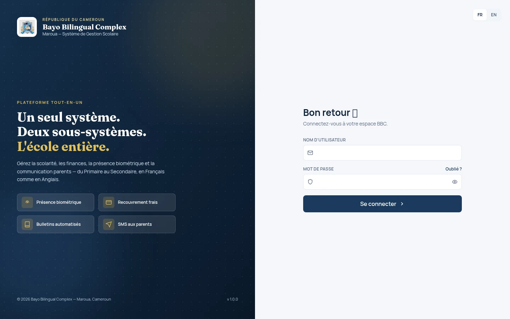
   *Écran de connexion — le panneau de gauche rappelle les grandes fonctions du système.*

2. Saisissez votre **identifiant** et votre **mot de passe**. L'icône en forme d'œil affiche le mot de passe en clair pour vérifier une faute de frappe.

   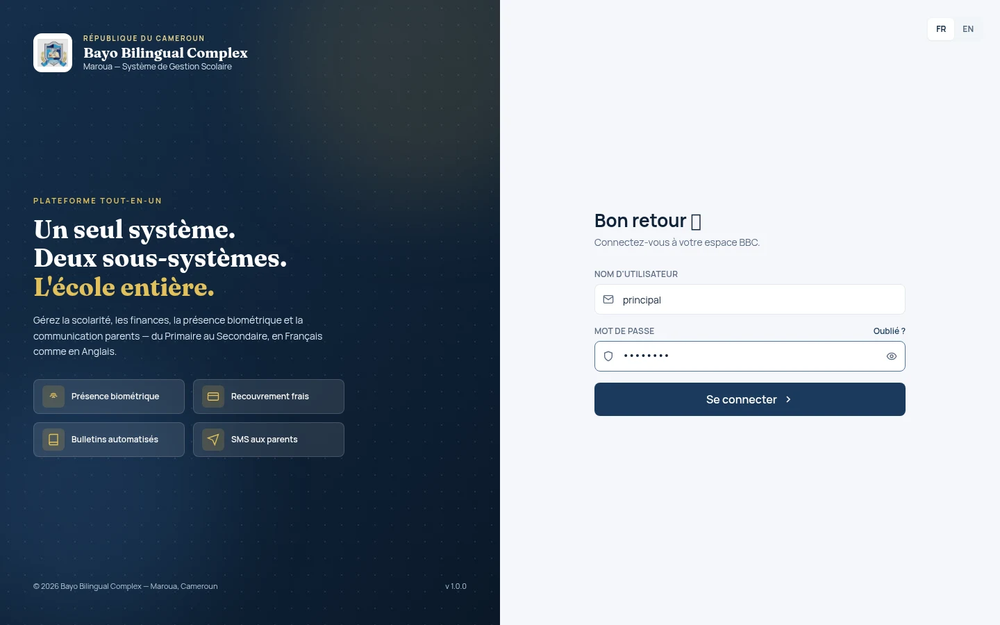
   *Identifiants saisis, prêt à valider.*

3. Cliquez sur **Se connecter**. Le personnel arrive sur le choix du parcours (§1.2), un compte parent arrive directement sur son portail (chapitre 19).

> **À savoir** — La session reste ouverte 8 heures et se prolonge silencieusement pendant que vous travaillez. Après une longue inactivité, l'application vous ramène à l'écran de connexion avec le message « Votre session a expiré ».

### 1.2 Mot de passe oublié

1. Sur l'écran de connexion, cliquez sur **Oublié ?** à droite du champ mot de passe.

   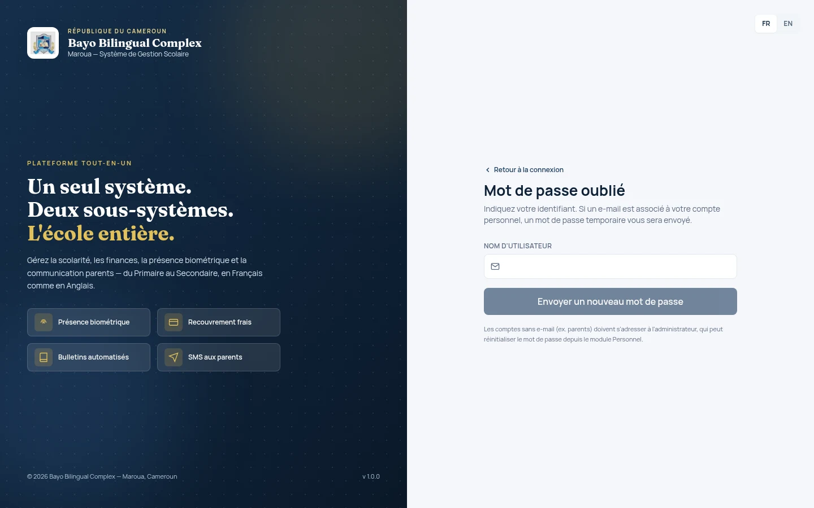
   *Demande de réinitialisation : seul l'identifiant est demandé.*

2. Saisissez votre identifiant puis **Envoyer un nouveau mot de passe**. Si une adresse e-mail est enregistrée sur votre **fiche personnel**, un mot de passe temporaire de 10 caractères y est envoyé.
3. Connectez-vous avec ce mot de passe temporaire. Demandez ensuite à l'administration de le remplacer par un mot de passe définitif (**Personnel → fiche → Réinitialiser**, §5.3).

> **Attention** — Le message de confirmation est volontairement identique que le compte existe ou non : c'est une protection contre la découverte d'identifiants. Il ne signifie donc pas à lui seul qu'un e-mail est parti.

*Qui peut réellement utiliser cette fonction, et ce qui se passe dans chaque cas.*

| Situation | Résultat |
|---|---|
| Personnel **avec** e-mail sur sa fiche | Mot de passe temporaire envoyé à cette adresse ; l'ancien cesse de fonctionner. |
| Personnel **sans** e-mail | Rien n'est modifié. Passez par l'administrateur : **Personnel → fiche → Réinitialiser** (§5.3). |
| Compte **parent** | Non couvert : un compte parent n'est pas rattaché à une fiche personnel. L'administrateur recrée le mot de passe depuis la fiche de l'élève (§4.4). |
| Messagerie **non configurée ou en panne** | **Votre mot de passe actuel reste valable** — rien n'est changé tant que l'e-mail n'est pas réellement parti. Contactez l'administration. |

> **À savoir** — Côté administration : cette fonction dépend entièrement du **SMTP** de l'établissement (**Paramètres → Messagerie**, §3.7). Testez l'envoi après toute modification — sans messagerie opérationnelle, la réinitialisation en libre-service reste sans effet et tout passe par vous.

### 1.3 Choisir un parcours

Un **parcours** est la combinaison d'un niveau (Maternelle, Primaire, Secondaire) et d'un sous-système (Francophone, Anglophone). C'est le concept central du système : il **filtre** partout les sections, classes, élèves et bulletins. Une classe créée en « Primaire FR » n'apparaît pas si vous travaillez en « Secondaire EN ».

1. Choisissez le niveau. Vous ne voyez que les niveaux autorisés pour votre compte.

   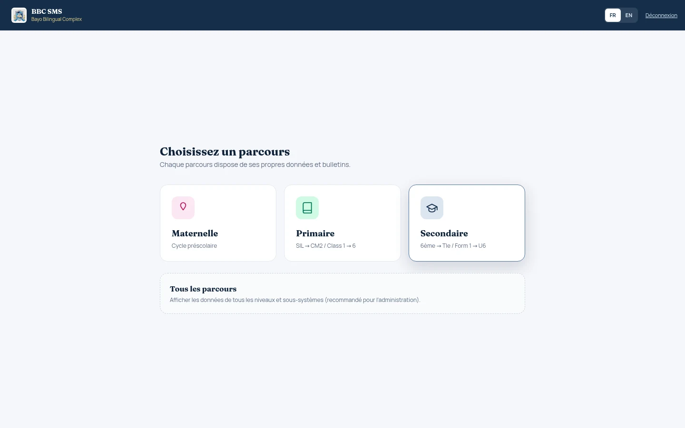
   *Étape 1 — le niveau. Les administrateurs disposent en plus de « Tous les parcours ».*

2. Choisissez la section : **Francophone** ou **Anglophone**. Si un seul sous-système vous est autorisé, cette étape est sautée automatiquement.

   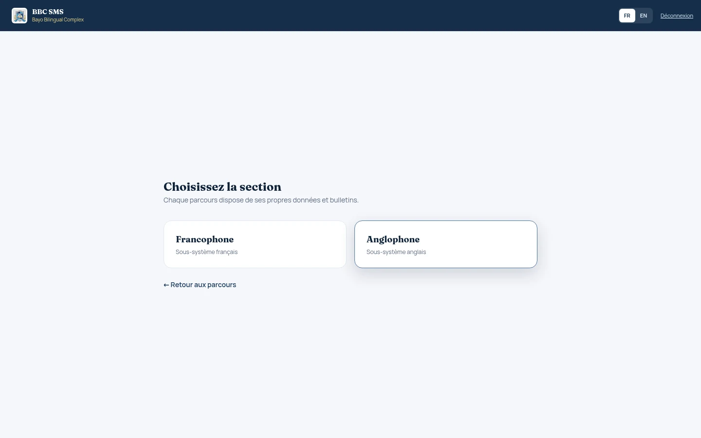
   *Étape 2 — la section. Le bouton « Retour aux parcours » revient au niveau.*

3. Les administrateurs peuvent choisir **Tous les parcours** pour voir l'école entière : aucune donnée n'est masquée, et les listes affichent des filtres Système / Niveau supplémentaires.

> **À savoir** — **Un enseignant n'a rien à choisir** : sa section (Maternelle, Primaire ou Secondaire) est celle de sa fiche personnel, et les sous-systèmes proposés sont ceux de ses classes. Quand il n'en reste qu'un, l'écran est sauté et l'enseignant arrive directement dans son cycle. Il ne verra ensuite que les données de sa section **et** les classes qui lui sont assignées — les autres classes n'apparaissent dans aucune liste, et une adresse saisie à la main est refusée par le serveur.

> **Astuce** — Le parcours actif est affiché en permanence dans la barre supérieure. Cliquez dessus à tout moment pour en changer — c'est le premier réflexe quand des données semblent « avoir disparu ».

### 1.4 Se repérer dans l'écran d'accueil

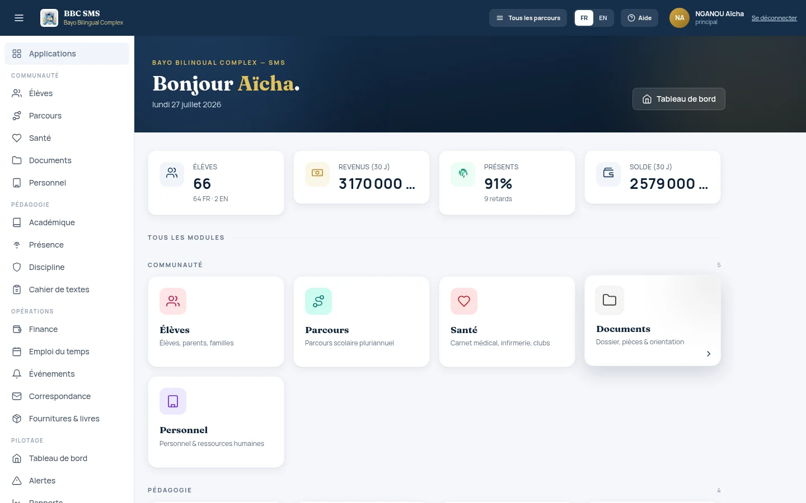
*L'accueil : barre supérieure, menu latéral et indicateurs du jour.*

| Zone | Rôle |
|---|---|
| Barre supérieure | Logo (retour à l'accueil), parcours actif, langue FR/EN, lien **Aide** (ce guide), votre nom et **Se déconnecter**. |
| Bouton ☰ | Replie le menu latéral en icônes pour gagner de la place ; sur téléphone, il ouvre le menu. |
| Menu latéral | Tous vos modules, regroupés en quatre pôles : Communauté, Pédagogie, Opérations, Pilotage. |
| Bandeau d'accueil | Salutation, date du jour et raccourci vers le tableau de bord. |
| Indicateurs | Effectif, revenus sur 30 jours, taux de présence et solde — uniquement ceux que vos droits autorisent. |
| Reprendre | Les quatre derniers modules ouverts, pour y revenir en un clic. |
| Tous les modules | Le catalogue complet, avec une courte description sous chaque module. |

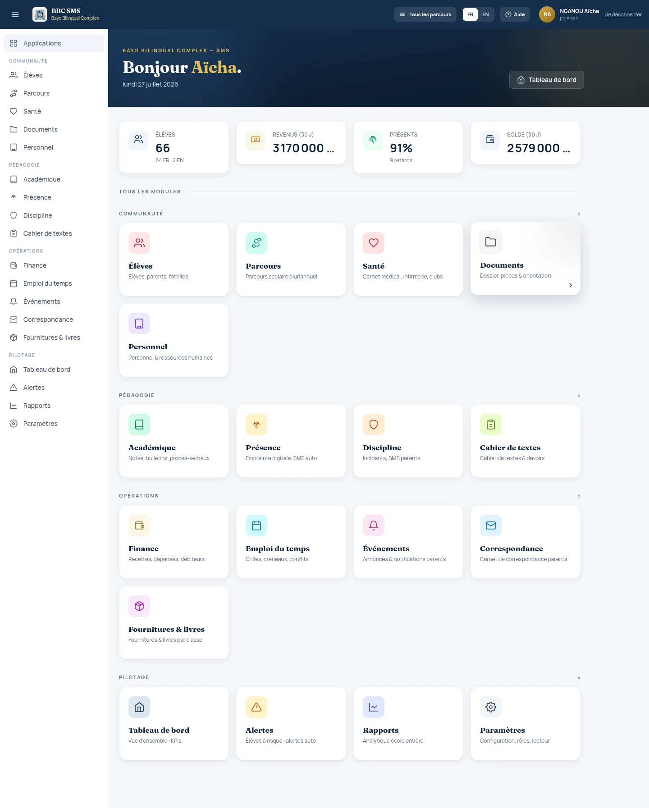
*Le catalogue complet des modules, tel que le voit un compte principal.*

> **À savoir** — Vous ne voyez que les modules autorisés par votre rôle. Un module absent du menu n'est pas un bug : c'est la matrice des permissions (chapitre 2) qui décide.

### 1.5 Quitter proprement

- **Se déconnecter** (barre supérieure) ferme la session et efface les jetons de ce navigateur.
- Sur un poste partagé — secrétariat, salle des professeurs — déconnectez-vous systématiquement.

**Fiche de test — je sais faire**

- [ ] Me connecter et changer la langue FR ↔ EN.
- [ ] Choisir un parcours, puis en changer depuis la barre supérieure.
- [ ] Retrouver un module depuis le menu latéral et depuis le catalogue.
- [ ] Ouvrir le guide via le lien **Aide**.
- [ ] Me déconnecter.

## 2 Rôles, permissions et périmètre

*Qui voit quoi, et pourquoi deux comptes n'ont pas le même menu.*

**Pour qui :** Direction et administrateurs — à lire avant de créer des comptes.

L'accès repose sur trois mécanismes indépendants qui se cumulent : le **rôle** (ce que vous avez le droit de faire), le **parcours** (les données que vous voyez) et, pour les parents, une restriction supplémentaire **à leurs seuls enfants**.

### 2.1 Les trois niveaux d'accès

| Niveau | Ce que l'utilisateur peut faire |
|---|---|
| Aucun | Le module n'apparaît ni dans le menu ni dans le catalogue ; l'URL directe est refusée. |
| Lecture | Le module s'ouvre, les listes et les fiches sont consultables, mais aucun bouton d'écriture n'est affiché. |
| Complet | Création, modification et suppression sont autorisées. |

> **À savoir** — Les droits sont vérifiés **côté serveur** à chaque appel : masquer un bouton n'est qu'un confort d'interface, contourner l'écran ne donne aucun accès supplémentaire.

### 2.2 La matrice des permissions

Elle croise **chaque rôle** avec **chaque module**. Elle se trouve dans **Paramètres → Permissions** et s'applique immédiatement, sans redémarrage.

1. Ouvrez **Paramètres → Permissions**. Chaque colonne est un rôle, chaque ligne un module. La légende en haut à droite rappelle le code couleur : gris = Aucun, orange = Lecture, vert = Complet.

   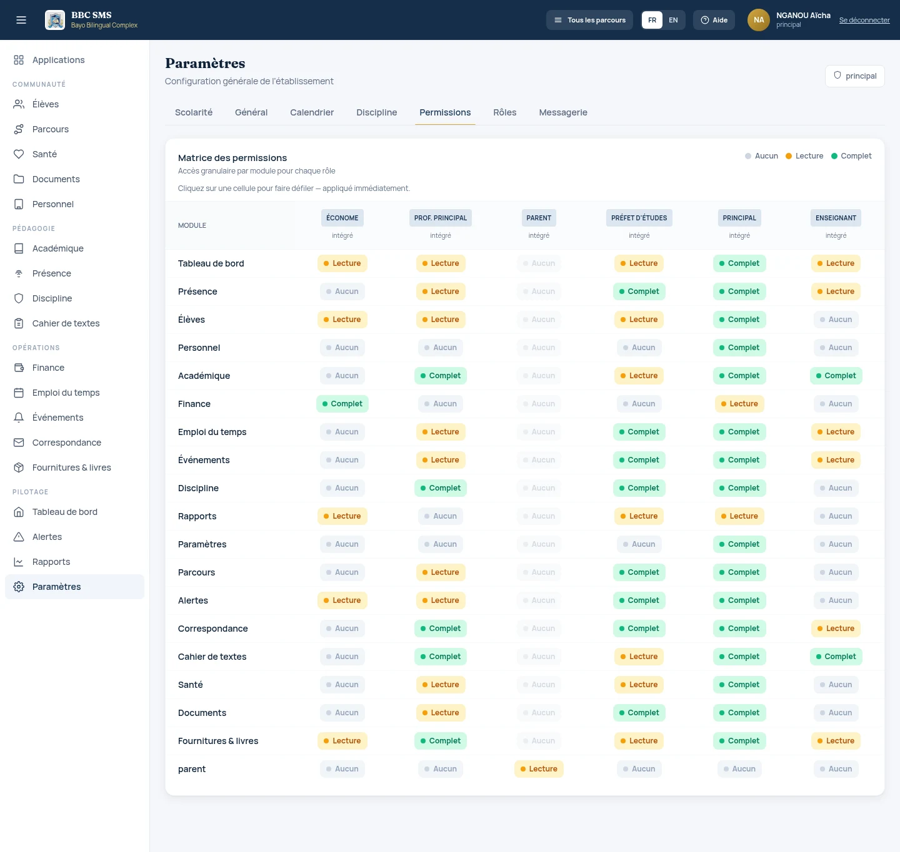
   *La matrice complète : rôles intégrés et rôles personnalisés côte à côte.*

2. **Cliquez une cellule** pour faire défiler Aucun → Lecture → Complet → Aucun. La modification est enregistrée aussitôt ; en cas d'échec réseau, la valeur du serveur est restaurée.
3. L'utilisateur concerné voit le changement à sa **prochaine connexion** (ses droits voyagent dans son jeton de session).

> **Attention** — La ligne du rôle **parent** est verrouillée : hors du module « parent », les cellules sont grisées et un message explique le refus. Un compte parent ne peut donc jamais recevoir l'accès aux modules du personnel, même par erreur de manipulation.

### 2.3 Rôles intégrés et rôles personnalisés

Les rôles **intégrés** (principal, censeur, économe, enseignant, professeur principal, parent…) ne peuvent pas être supprimés — seul leur libellé FR/EN est modifiable, pour coller au vocabulaire de l'établissement. Vous pouvez créer autant de rôles **personnalisés** que nécessaire.

**Créer un rôle « Surveillant »**
1. Ouvrez **Paramètres → Rôles**. La colonne de gauche liste les rôles existants, avec la mention « Intégré » ou « Personnalisé » sous chaque libellé.

   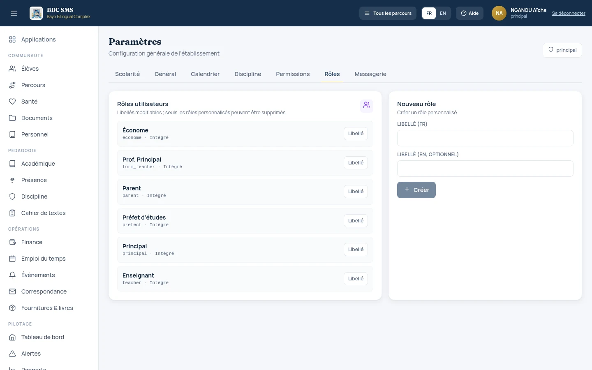
   *Rôles existants à gauche, création d'un rôle personnalisé à droite.*

2. Dans **Nouveau rôle**, saisissez le libellé français (et anglais si vous le souhaitez), puis **Créer**. Le code technique est déduit du libellé.
3. Retournez dans **Permissions** et donnez au nouveau rôle les accès voulus — par exemple Discipline en **Complet** et Présence en **Lecture**.
4. Affectez enfin le rôle à un employé depuis **Personnel** (chapitre 5). Un employé peut cumuler plusieurs rôles ; le premier de la liste sert de rôle principal pour son compte.

> **Astuce** — Renommer un rôle intégré est souvent plus simple que d'en créer un : « Censeur » peut devenir « Directeur des études » sans rien changer aux droits déjà accordés.

### 2.4 Le périmètre de données (parcours)

Le rôle dit **ce que** l'on peut faire ; le parcours dit **sur quelles données**. Un enseignant du primaire francophone avec le droit « Académique : Complet » ne verra jamais les classes du secondaire anglophone. Les parcours autorisés d'un compte sont définis à sa création ; un compte sans restriction (administrateur) peut basculer sur « Tous les parcours ».

**Fiche de test — je sais faire**

- [ ] Ouvrir la matrice et lire la ligne d'un module que je gère.
- [ ] Créer un rôle personnalisé et lui donner un droit d'écriture.
- [ ] Constater qu'une cellule du rôle parent hors « parent » est refusée.
- [ ] Renommer un rôle intégré et retrouver le nouveau libellé dans Personnel.

## 3 Paramètres — la fondation de l'année

*Sections, classes, matières, identité de l'école, calendrier, catalogues, permissions et messagerie.*

**Pour qui :** Direction et administrateurs (droit **Paramètres : Complet**).

Ce module conditionne tous les autres : sans classe, impossible d'inscrire un élève ; sans matière, pas de bulletin ; sans heure d'ouverture, pas de retard calculé. Traitez-le **en premier**, dans l'ordre des sept onglets ci-dessous.

| Onglet | Contenu |
|---|---|
| Scolarité | Sections → classes → matières et coefficients. Le squelette de l'école. |
| Général | Identité de l'établissement, devise monétaire, horaires de cours, état du lecteur d'empreintes. |
| Calendrier | Jours fériés et fermetures exceptionnelles. |
| Discipline | Catalogue des types d'incident et des sanctions. |
| Permissions | Matrice rôles × modules (chapitre 2). |
| Rôles | Création et libellés des rôles (chapitre 2). |
| Messagerie | Serveur SMTP et notifications e-mail. |

### 3.1 Sections

Une **section** regroupe les classes d'un même sous-système et d'un même niveau : « Primaire francophone », « Secondary English »… C'est le premier objet à créer.

1. Ouvrez **Paramètres → Scolarité → Sections**. Le bandeau rappelle le parcours actif et prévient que les autres parcours sont masqués.

   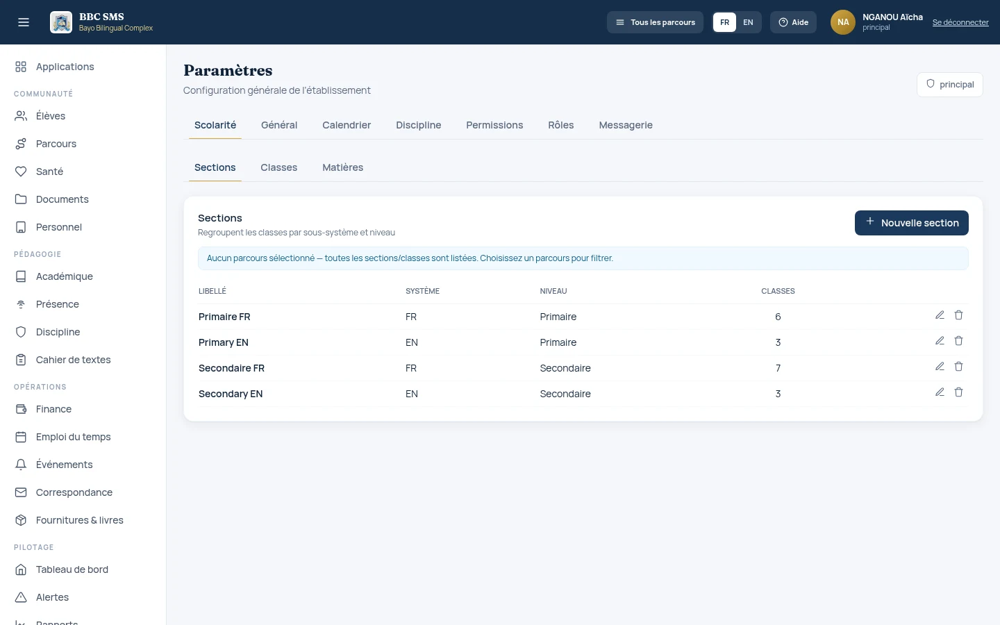
   *Liste des sections, avec le nombre de classes rattachées à chacune.*

2. Cliquez **Nouvelle section**, saisissez le libellé. Le sous-système et le niveau sont **verrouillés sur le parcours actif** — c'est ce qui garantit la cohérence des données.

   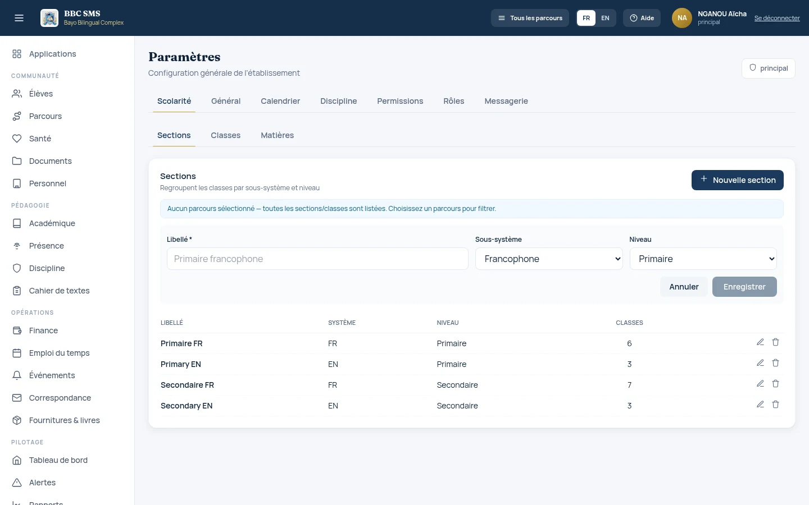
   *Création d'une section : seul le libellé est libre quand un parcours est actif.*

3. **Enregistrer**. Les icônes de la colonne de droite permettent de renommer ou de supprimer. Une section qui contient des classes ne peut pas être supprimée.

> **Astuce** — Pour créer des sections dans plusieurs parcours, changez de parcours dans la barre supérieure entre chaque création — ou passez en « Tous les parcours », où le sous-système et le niveau redeviennent modifiables dans le formulaire.

### 3.2 Classes et enseignants

1. Ouvrez l'onglet **Classes**. Le tableau affiche pour chaque classe sa section, son niveau, son effectif et le nombre d'enseignants rattachés.

   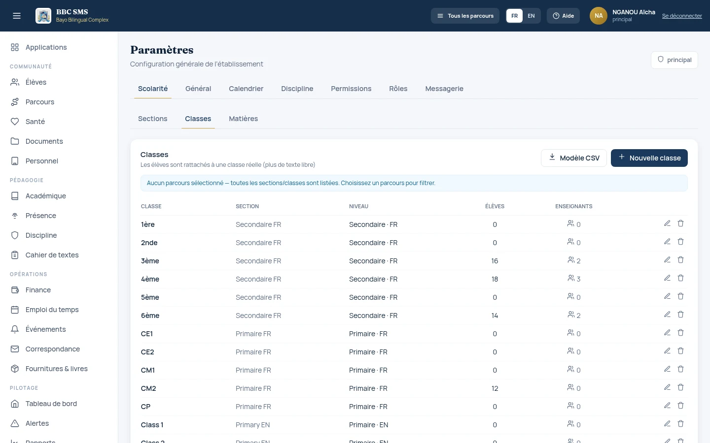
   *Les classes du parcours actif. Le bouton **Modèle CSV** télécharge un gabarit de saisie.*

2. **Nouvelle classe** : donnez le nom exact utilisé par l'école (« 6ème A », « Form 1 ») et choisissez la section de rattachement.

   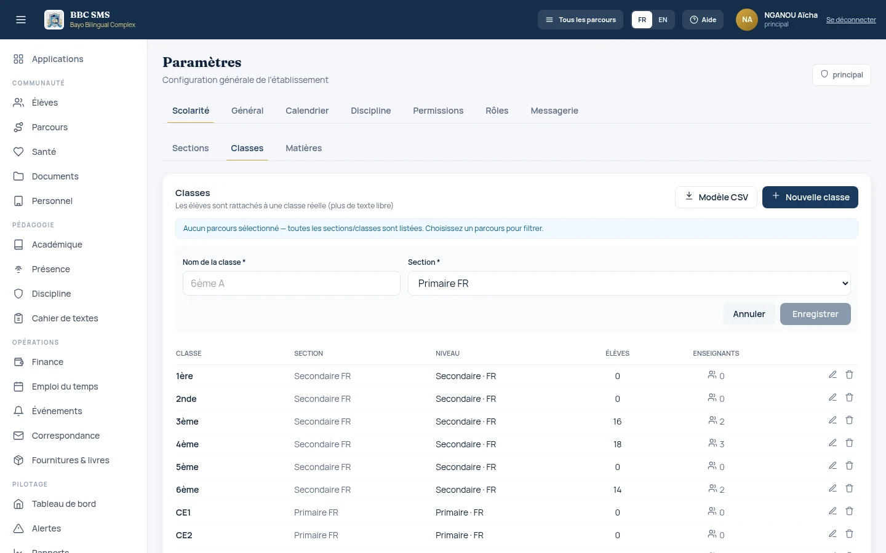
   *Le nom de la classe est repris tel quel sur les bulletins et les listes.*

3. Cliquez le **compteur d'enseignants** d'une ligne pour ouvrir le panneau d'affectation, cochez les enseignants concernés puis **Enregistrer**. Une classe peut avoir zéro, un ou plusieurs enseignants. Le panneau ne propose que les enseignants de **la section de la classe** — un professeur du primaire n'apparaît pas pour une classe du secondaire.

   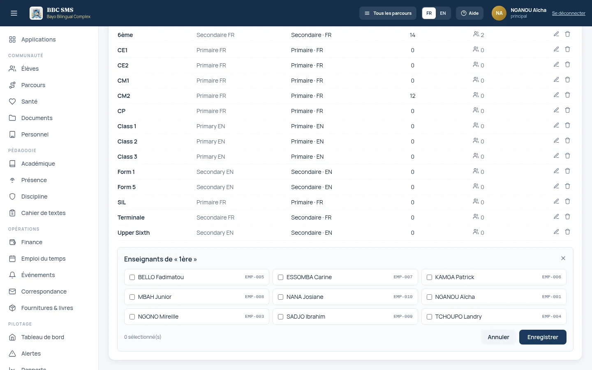
   *Affectation des enseignants à une classe (liste issue du module Personnel).*

> **À savoir** — Affecter une classe à un enseignant **sans section** le rattache définitivement à celle de la classe : c'est la première affectation qui fixe son cycle. Toute tentative de l'affecter ensuite à une classe d'une autre section est refusée, avec un message qui rappelle sa section actuelle.

> **Attention** — Le bouton **Nouvelle classe** reste inactif tant qu'aucune section n'existe dans le parcours courant. C'est la cause n°1 de blocage en début d'année : créez la section d'abord.

### 3.3 Matières et coefficients

Chaque sous-système a **sa propre liste** de matières ; une matière peut aussi être déclarée commune aux deux. Le coefficient sert au calcul de la moyenne pondérée du bulletin.

1. Ouvrez l'onglet **Matières** et choisissez la liste à afficher : **Francophone**, **Anglophone** ou **Toutes**. Le compteur de chaque bouton indique le nombre de matières.

   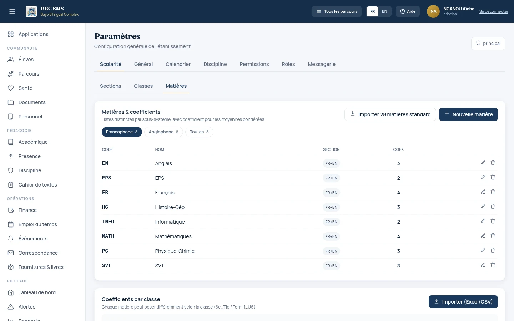
   *Liste des matières du sous-système francophone, avec leur coefficient.*

2. Le bouton **Importer N matières standard** crée en une fois le catalogue officiel de l'établissement (liste MATIÈRE EXCEL) pour la liste affichée. Les codes déjà présents sont ignorés.
3. **Nouvelle matière** pour un ajout manuel : code court (MATH, ENG…), sous-système, nom FR, nom EN et coefficient par défaut. Le code n'est plus modifiable après création.

   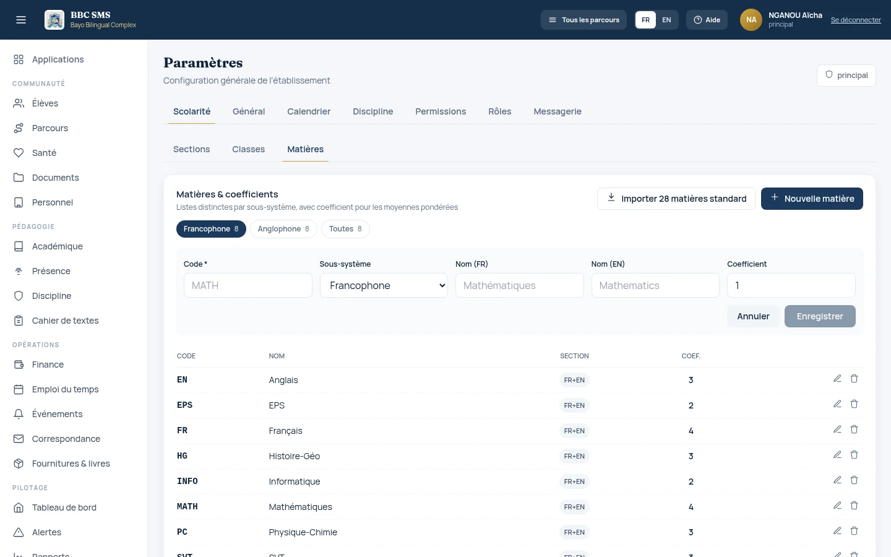
   *Formulaire matière : les deux libellés servent à l'affichage FR/EN.*

Le coefficient saisi ici est un **défaut**. En pratique une matière ne pèse pas pareil en 6ème et en Terminale : la carte **Coefficients par classe**, en bas de l'onglet, permet d'importer la grille réelle depuis un fichier Excel ou CSV.

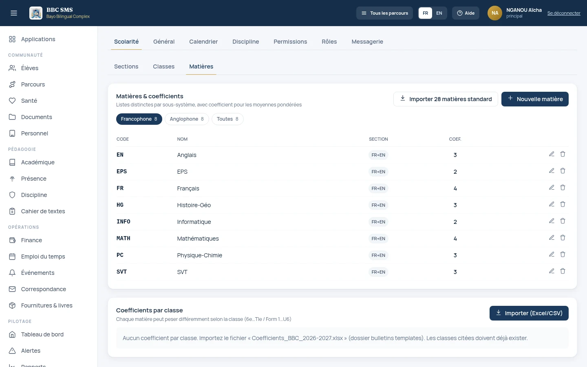
*Coefficients par classe : colonnes attendues — sous-système, code, matière, classe, coefficient.*

> **À savoir** — À l'import, les classes citées dans le fichier **doivent déjà exister**. Le rapport d'import indique le nombre de coefficients enregistrés, de matières créées au passage et de lignes ignorées, avec le motif ligne par ligne.

### 3.4 Général — identité et horaires

1. Renseignez le nom de l'école, sa devise, la ville, le pays, le téléphone et l'e-mail : ces informations sont imprimées sur les **bulletins** et les **reçus**, et affichées aux parents dans leur portail.

   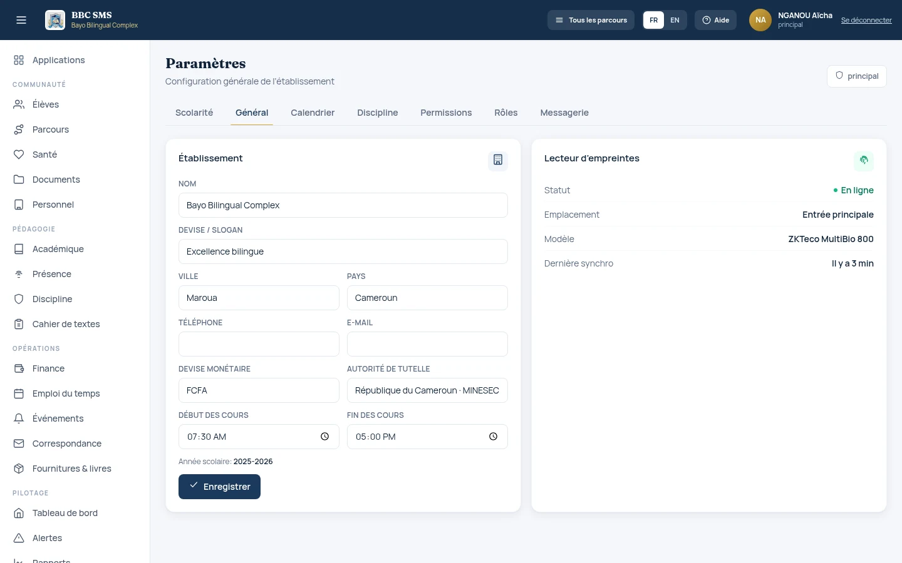
   *Identité de l'établissement et horaires ; à droite, l'état du lecteur d'empreintes.*

2. **Devise monétaire** (XAF/FCFA par défaut) et **Autorité de tutelle** (ex. « République du Cameroun · MINESEC ») apparaissent en en-tête des documents officiels.
3. ****Début des cours** est le seuil de retard** : tout pointage postérieur à cette heure est compté en retard, avec le nombre de minutes. Réglez-le avant la rentrée.
4. **Enregistrer** ; un message vert confirme la prise en compte.

### 3.5 Calendrier — jours fériés

1. Ouvrez l'onglet **Calendrier**, saisissez une **date** et un **libellé** (« Fête de la Jeunesse »), puis **Ajouter**.

   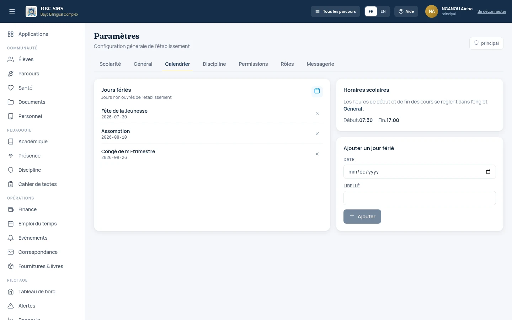
   *Jours fériés à gauche, ajout et rappel des horaires à droite.*

2. Un jour férié **ne génère jamais de retard ni d'absence**. Les samedis et dimanches sont exclus automatiquement, sans avoir à les déclarer.

### 3.6 Catalogue Discipline

Les listes déroulantes du module Discipline (chapitre 8) sont alimentées ici : à gauche les **types d'incident**, à droite les **sanctions**. Chaque entrée porte un libellé FR et un libellé EN.

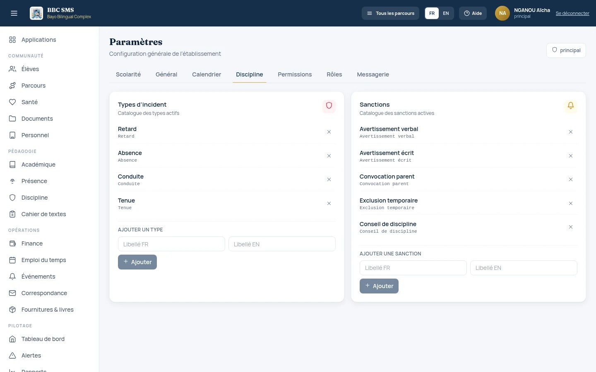
*Types d'incident et sanctions — ajoutez ceux du règlement intérieur de l'école.*

> **À savoir** — Tant que le catalogue est vide, Discipline propose une liste de secours (Retard, Absence, Conduite, Tenue…). Dès qu'une entrée est créée, c'est votre catalogue qui prend le relais.

### 3.7 Messagerie (SMTP)

1. Cochez **Activer l'envoi d'e-mails**, puis renseignez l'hôte, le port, l'utilisateur et le mot de passe du serveur SMTP, ainsi que l'adresse et le nom d'expéditeur.

   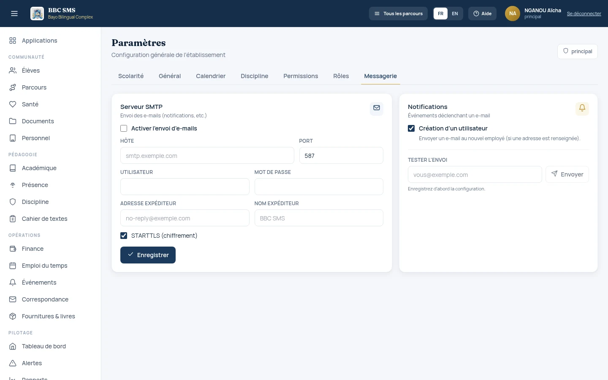
   *Configuration SMTP à gauche, notifications et test d'envoi à droite.*

2. Laissez **STARTTLS** coché sauf indication contraire de votre hébergeur. Le mot de passe n'est jamais réaffiché : laissez le champ vide pour conserver l'ancien.
3. **Enregistrer**, puis utilisez **Tester l'envoi** avec votre propre adresse pour valider la configuration avant de créer des comptes.
4. L'option **Création d'un utilisateur** envoie automatiquement ses identifiants au nouvel employé, si sa fiche porte un e-mail.

> **Attention** — Sans SMTP configuré, la création de compte fonctionne quand même, mais **aucun identifiant n'est envoyé** : vous devez communiquer le mot de passe autrement. La réinitialisation en libre-service (§1.2) est alors indisponible.

**Fiche de test — je sais faire**

- [ ] Créer une section puis une classe dans le parcours actif.
- [ ] Importer les matières standard et modifier un coefficient.
- [ ] Affecter deux enseignants à une classe.
- [ ] Régler l'heure de début des cours et enregistrer.
- [ ] Ajouter un jour férié et vérifier qu'il apparaît dans la liste.
- [ ] Ajouter un motif d'incident et le retrouver dans Discipline.

## 4 Élèves

*Registre, fiche complète, comptes parents et import en masse du registre officiel.*

**Pour qui :** Secrétariat, direction, préfet (lecture pour la plupart des autres rôles).

### 4.1 Lire la liste

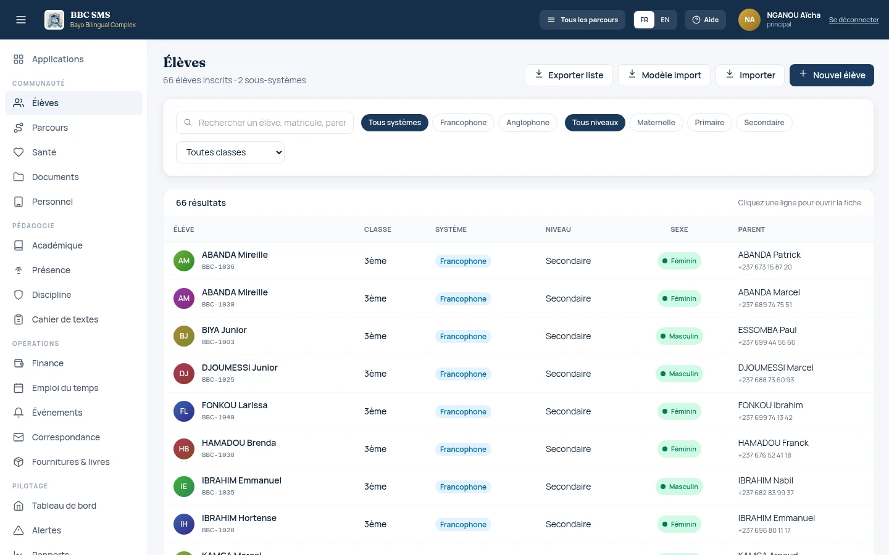
*Le registre : recherche, filtres, tableau dense et fiche détaillée sous le tableau.*

- La **recherche** porte sur le nom, le matricule et le nom du parent.
- Le filtre **Classe** est groupé par série (toutes les « 4ème » ensemble) et affiche l'effectif de chaque sous-classe.
- En mode « Tous les parcours », deux filtres supplémentaires apparaissent : **Système** (Francophone / Anglophone) et **Niveau**.
- La liste est triée par classe puis par nom ; le compteur au-dessus du tableau indique le nombre de résultats.
- **Exporter liste** produit un CSV des lignes affichées, avec **toutes les colonnes de la fiche élève** (matricule, nom, prénom, sexe, naissance, lieu, NIU, redouble, classe, sous-système, niveau, père, mère, tuteur). Ses en-têtes sont ceux du modèle d'import : un export corrigé dans un tableur se réimporte tel quel.

### 4.2 La fiche élève

Cliquez une ligne : la fiche s'ouvre sous le tableau avec l'en-tête d'identité, le contact parent, les comptes parents rattachés et l'état civil complet.

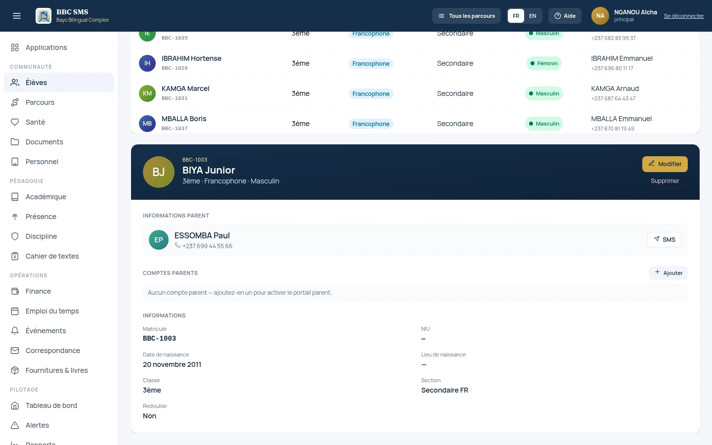
*Fiche élève — matricule, classe, contact principal et comptes parents.*

> **À savoir** — Le **contact principal** affiché (et utilisé pour les SMS) est déduit automatiquement : père, sinon mère, sinon tuteur. Il suffit donc de renseigner correctement la section « Famille / tuteur ».

### 4.3 Créer ou modifier un élève

1. Cliquez **Nouvel élève** (ou **Modifier** sur une fiche ouverte). Le formulaire occupe toute la page et se referme par la flèche en haut à gauche.

   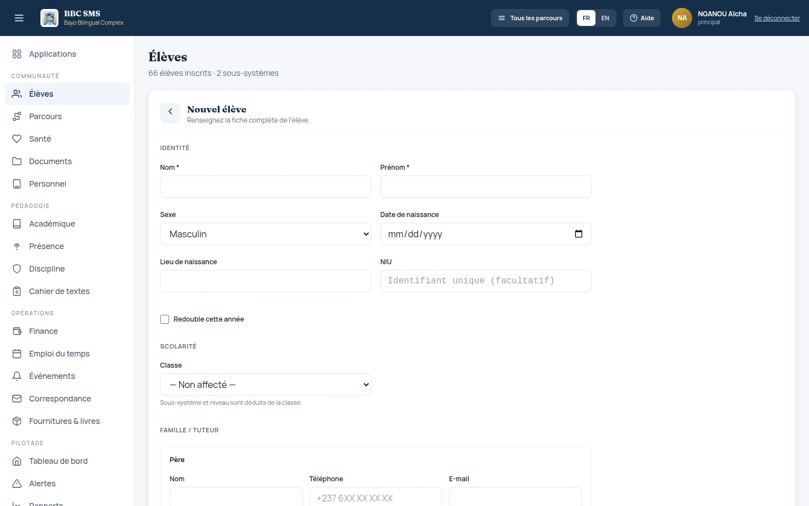
   *Bloc Identité : nom, prénom, sexe, naissance, NIU et case « Redouble ».*

2. **Identité** — nom et prénom sont obligatoires. Le NIU (identifiant unique national) est facultatif. Cochez **Redouble cette année** le cas échéant.
3. **Scolarité** — choisissez la classe dans la liste déroulante. Le sous-système et le niveau en sont déduits : il n'y a pas de saisie libre possible, donc pas de classe fantôme. « — Non affecté — » reste valable pour une préinscription.
4. **Famille / tuteur** — trois blocs séparés (père, mère, tuteur) avec nom, téléphone et e-mail. Le tuteur porte en plus un champ « lien / relation ».

   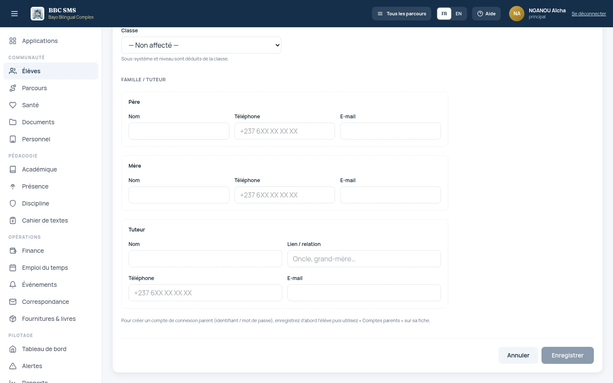
   *Coordonnées familiales : la ligne la plus complète devient le contact principal.*

5. **Enregistrer**. La fiche créée est immédiatement sélectionnée dans la liste.

> **Attention** — La suppression d'un élève (**Supprimer** sur la fiche, avec confirmation) retire l'élève **et ses données associées** du registre. Les paiements déjà encaissés restent visibles en finance, mais sans nom d'élève.

### 4.4 Créer un compte parent

C'est ce compte qui donne accès au **portail parent** (chapitre 19). Il se crée depuis la fiche de l'élève, pas depuis le module Personnel.

1. Sur la fiche de l'élève, section **Comptes parents**, cliquez **Ajouter**.

   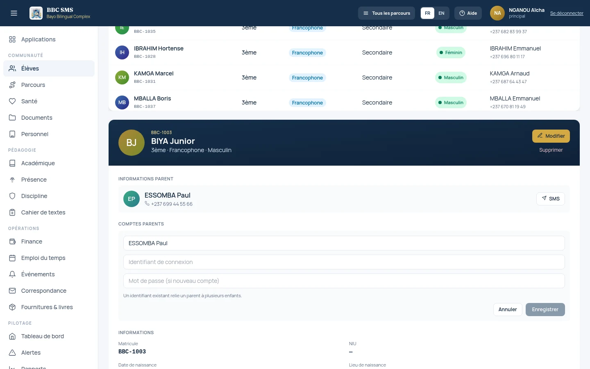
   *Création du compte : nom affiché, identifiant et mot de passe.*

2. Saisissez le **nom complet du parent**, un **identifiant** de connexion et un **mot de passe**. Le nom est prérempli avec le contact principal de l'élève.
3. Pour une **fratrie**, réutilisez le **même identifiant** sur la fiche du deuxième enfant : le compte existant est simplement rattaché, sans mot de passe à ressaisir. La liste affiche alors « 2 enfants ».
4. L'icône corbeille **détache** le parent de cet élève (le compte n'est pas supprimé s'il reste rattaché à d'autres enfants).

### 4.5 Importer un registre complet

L'import traite une classe à la fois et accepte le registre officiel tel quel : Excel (.xls, .xlsx), CSV, ou simple copier-coller depuis un tableur.

1. Cliquez **Importer**. Choisissez la **classe cible** : une classe existante (filtrable par système, niveau et série) ou **Nouvelle classe**, qui la crée à la volée avec sa section.

   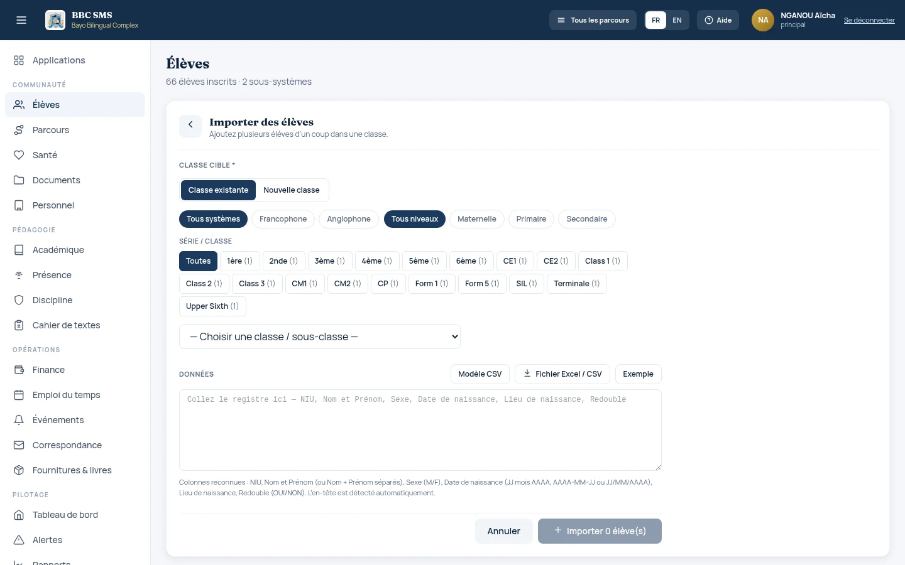
   *Écran d'import : classe cible en haut, zone de données au milieu.*

2. Alimentez la zone de données : bouton **Fichier Excel / CSV**, collage direct, ou **Exemple** pour voir le format attendu. **Modèle CSV** télécharge un gabarit dont les colonnes sont **exactement les champs du formulaire de création** (identité puis père / mère / tuteur), avec une ligne d'exemple à remplacer.
3. Vérifiez l'**aperçu** : chaque ligne reçoit une coche verte (importable) ou une croix rouge (nom manquant). Le compteur indique « valides / total ».

   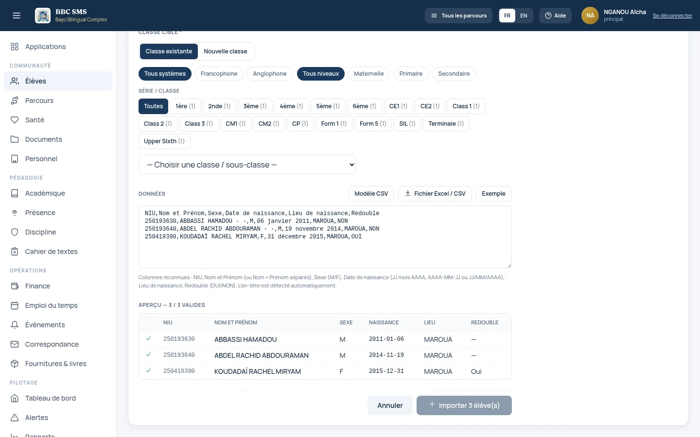
   *Aperçu avant import — les lignes en rouge seront ignorées.*

4. Cliquez **Importer N élève(s)**. Le rapport final indique le nombre de créations et, ligne par ligne, le motif des lignes ignorées.

*Colonnes reconnues — les mêmes champs que la fiche élève (l'en-tête est détecté automatiquement ; l'ordre importe peu ; toute colonne absente reste vide).*

| Colonne du modèle | Champ de la fiche | Formats acceptés |
|---|---|---|
| `nom` | Identité → Nom | Obligatoire. Ou une seule colonne « Nom et Prénom » : le 1ᵉʳ mot devient le nom. |
| `prenom` | Identité → Prénom | Obligatoire (sauf colonne « Nom et Prénom »). |
| `sexe` | Identité → Sexe | M, F, Masculin, Féminin, Male, Female, garçon, fille. |
| `date_naissance` | Identité → Date de naissance | `06 janvier 2011`, `2011-01-06` ou `06/01/2011`. |
| `lieu_naissance` | Identité → Lieu de naissance | Texte libre. |
| `niu` | Identité → NIU | Texte libre — identifiant unique national, facultatif. |
| `redouble` | Identité → Redouble cette année | OUI / NON, YES / NO, 1 / 0, VRAI / FAUX. |
| `pere_nom`, `pere_telephone`, `pere_email` | Famille / tuteur → Père | Texte libre. |
| `mere_nom`, `mere_telephone`, `mere_email` | Famille / tuteur → Mère | Texte libre. |
| `tuteur_nom`, `tuteur_lien`, `tuteur_telephone`, `tuteur_email` | Famille / tuteur → Tuteur | Texte libre — `tuteur_lien` = oncle, grand-mère… |

> **À savoir** — La **classe** n'est pas une colonne : elle est choisie une fois pour tout le lot, en haut de l'écran d'import. Les en-têtes en anglais (`last name`, `first name`, `father phone`…) sont également reconnus, de même que les registres officiels intitulés « NIU / Nom et Prénom / Sexe / Date de naissance / Lieu de naissance / Redouble ».

> **Astuce** — Si aucun en-tête n'est reconnu, le système suppose l'ordre du registre officiel : NIU, Nom et Prénom, Sexe, Date de naissance, Lieu de naissance, Redouble. Vérifiez toujours l'aperçu avant de valider.

**Fiche de test — je sais faire**

- [ ] Créer un élève avec père et mère renseignés, puis l'affecter à une classe.
- [ ] Créer un compte parent et me connecter avec sur le portail.
- [ ] Rattacher un deuxième enfant au même identifiant parent.
- [ ] Importer 3 lignes dans une classe et lire le rapport d'import.
- [ ] Exporter la liste filtrée d'une classe.

## 5 Personnel & ressources humaines

*Annuaire, comptes de connexion, import, portail d'inscription, départements, congés et masse salariale.*

**Pour qui :** Direction et administration (droit **Personnel : Complet**).

Le module s'organise en cinq onglets : **Annuaire**, **Candidatures**, **Départements**, **Congés** et **Masse salariale**. Quatre indicateurs restent affichés en permanence : effectif, permanents, vacataires et masse salariale mensuelle.

### 5.1 L'annuaire

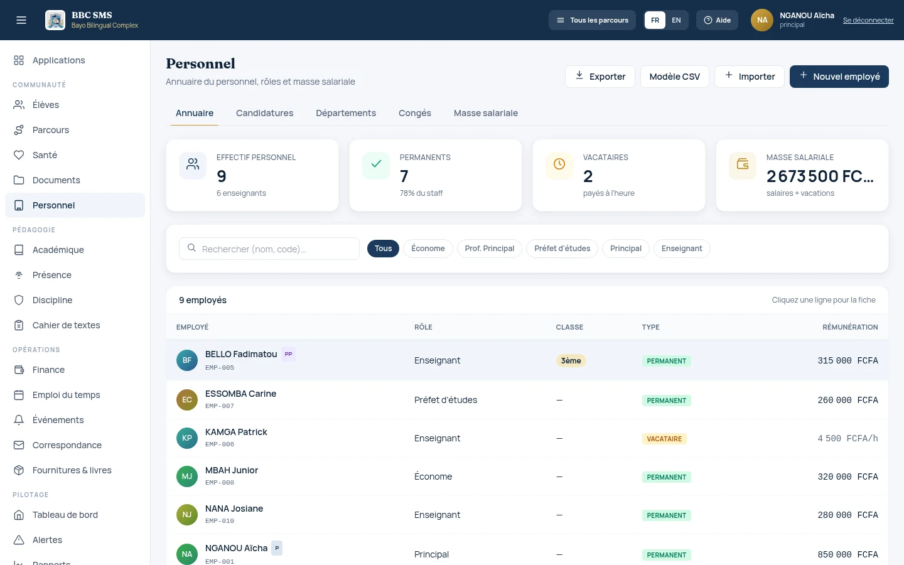
*Annuaire : recherche par nom ou code, filtre par rôle, tableau dense.*

Les badges **P** (principal) et **PP** (professeur principal) signalent les responsabilités d'un coup d'œil. La colonne Rémunération affiche le salaire mensuel pour un permanent, le taux horaire pour un vacataire.

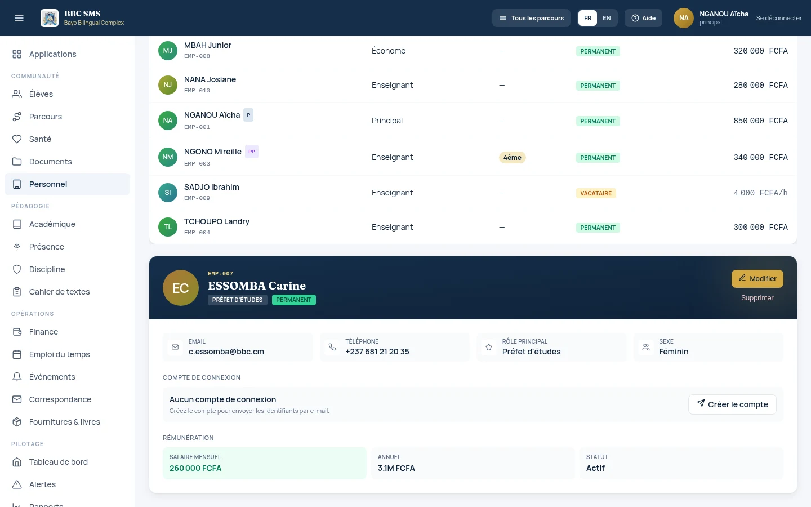
*Fiche employé : contact, compte de connexion et rémunération.*

### 5.2 Créer un employé

> **Attention** — **Changer la section d'un enseignant le détache des classes de son ancien cycle.** C'est voulu : une mutation du primaire vers le secondaire ne doit pas laisser traîner d'anciennes affectations. Réaffectez-le ensuite à ses nouvelles classes.

1. **Nouvel employé** ouvre le formulaire pleine page. **Identité & contact** : nom (obligatoire), sexe, e-mail, téléphone.

   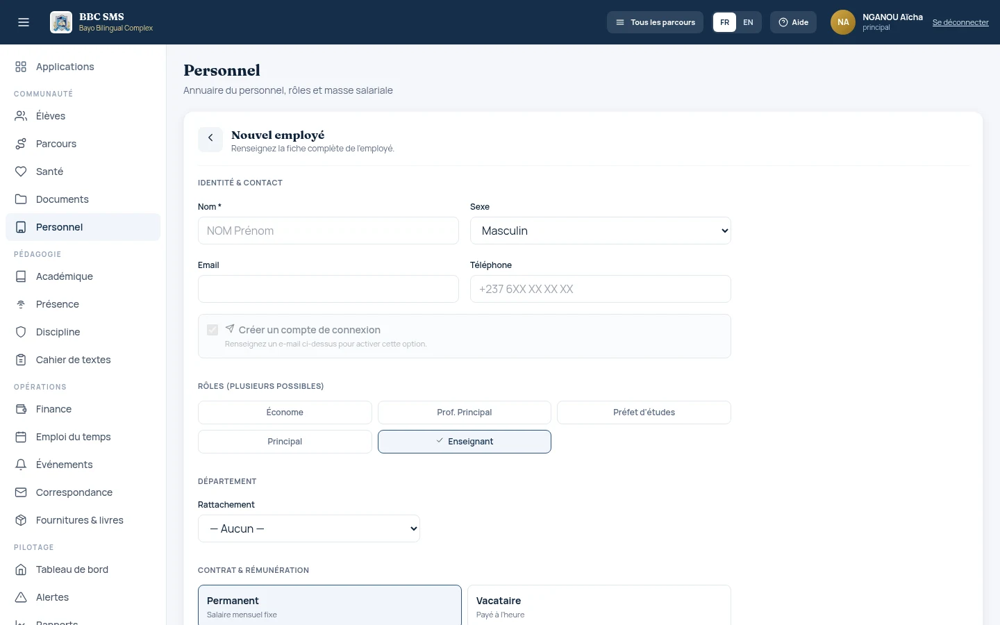
   *Identité, contact et option de création du compte de connexion.*

2. **Rôles** — cliquez autant de rôles que nécessaire ; ils proviennent du catalogue des rôles (chapitre 2). Si vous cochez « professeur principal », un champ **Classe** apparaît.
3. **Section (cycle)** — dès qu'un rôle enseignant est coché, choisissez **Maternelle**, **Primaire** ou **Secondaire**. Un enseignant n'exerce que dans **une** section : il ne verra que les classes de ce cycle qui lui sont assignées, et sera orienté dedans dès sa connexion. Laissée vide, la section sera fixée par sa première affectation de classe.
4. **Département** — rattachement facultatif, à créer au préalable dans l'onglet Départements.
5. **Contrat & rémunération** — choisissez **Permanent** (salaire mensuel) ou **Vacataire** (taux horaire). Le champ affiché s'adapte au choix.

   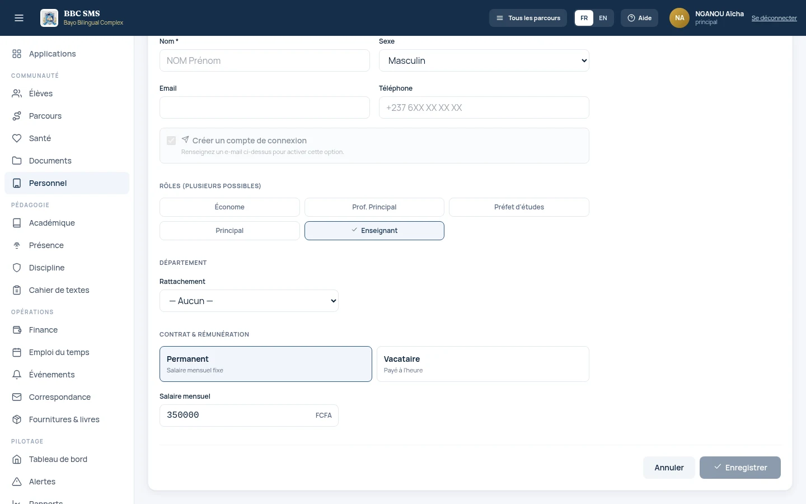
   *Le type de contrat détermine le mode de rémunération.*

6. Cochez éventuellement **Créer un compte de connexion** — l'option ne s'active que si un e-mail est renseigné —, puis **Enregistrer**.

### 5.3 Comptes de connexion et réinitialisation

- La fiche indique si l'employé possède un compte et affiche son **identifiant**. Le mot de passe n'est jamais affiché.
- **Créer le compte** (employé sans compte) génère les identifiants et les envoie par e-mail.
- **Réinitialiser** (employé avec compte) génère un nouveau mot de passe et l'envoie. C'est la procédure à suivre pour un parent ou un employé sans e-mail qui a perdu son accès.
- Le message de retour précise si l'e-mail est effectivement parti — utile pour diagnostiquer un SMTP mal configuré.

### 5.4 Importer le personnel

1. **Importer** ouvre le même type d'écran que pour les élèves : fichier Excel/CSV, collage ou **Exemple**.

   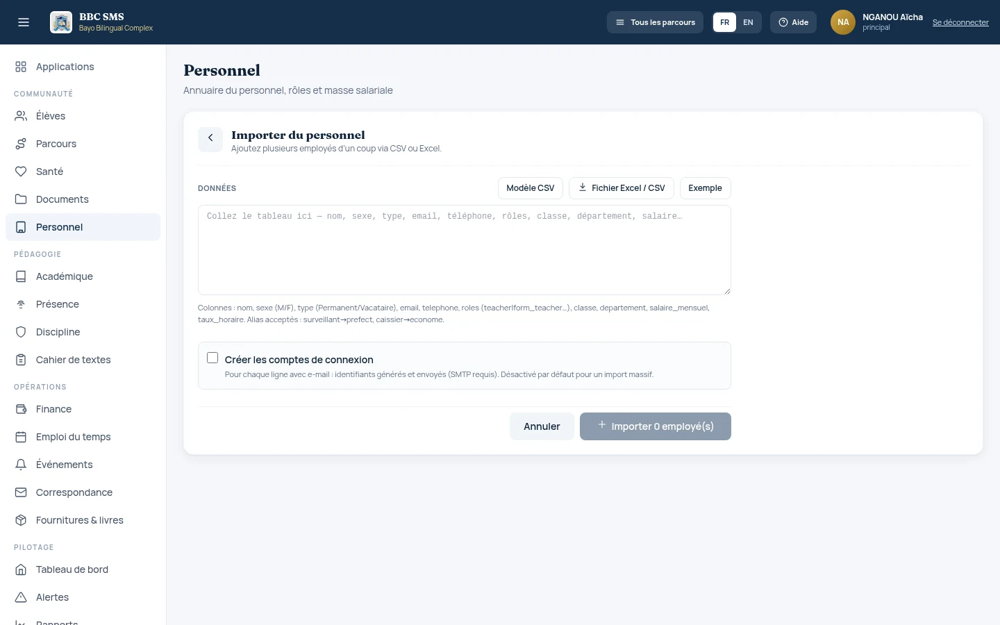
   *Zone de données et rappel des colonnes reconnues.*

2. Colonnes reconnues : `nom`, `sexe`, `type` (Permanent/Vacataire), `email`, `telephone`, `roles` (séparés par `|`), `classe`, `section` (Maternelle/Primaire/Secondaire), `departement`, `salaire_mensuel`, `taux_horaire`. Des alias sont acceptés : *surveillant* → prefect, *caissier* → econome.
3. L'option **Créer les comptes de connexion** est **désactivée par défaut** pour un import massif : activez-la seulement si le SMTP est prêt et que chaque ligne porte un e-mail.
4. Vérifiez l'aperçu, puis **Importer N employé(s)**.

   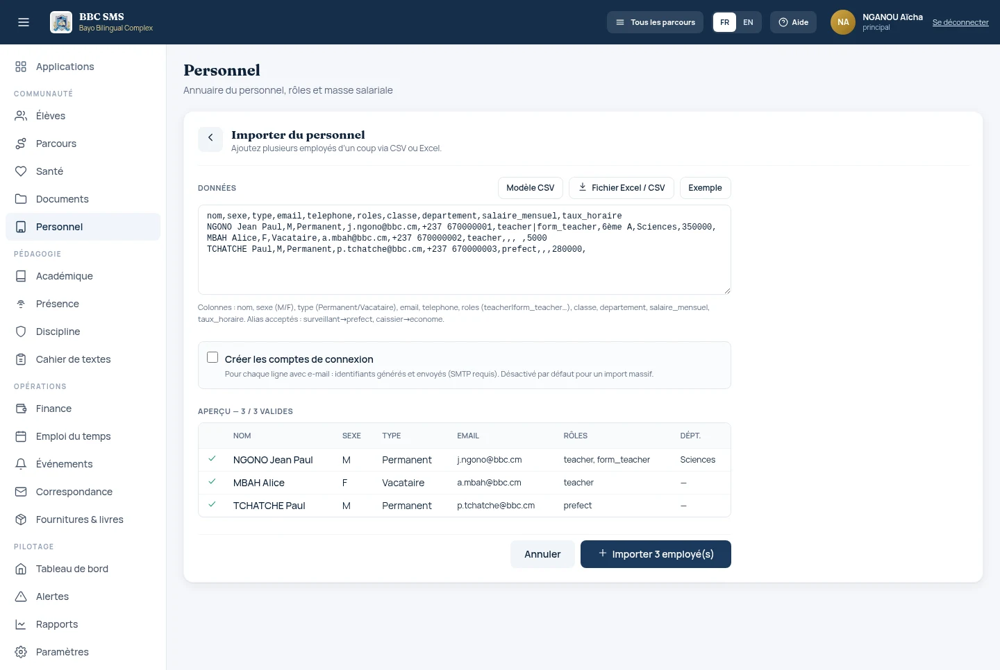
   *Aperçu de l'import du personnel avec validation ligne à ligne.*

### 5.5 Portail d'inscription et candidatures

Plutôt que de saisir cinquante fiches à la rentrée, ouvrez un **lien public temporaire** : chaque membre du personnel remplit lui-même ses informations, l'administration valide ensuite.

1. Onglet **Candidatures** : cochez **Portail activé**. Un lien apparaît ; **Copier le lien** le place dans le presse-papiers.

   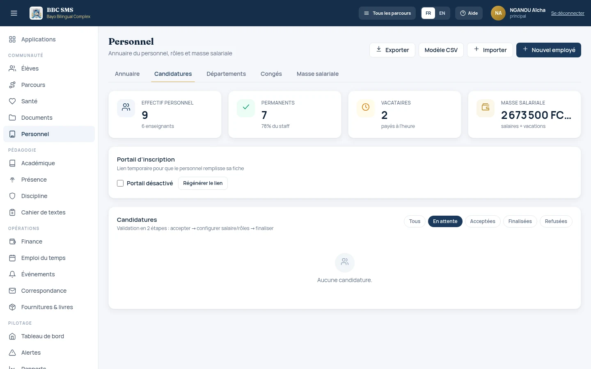
   *Activation du portail, lien public et file des candidatures.*

2. Diffusez le lien (WhatsApp, e-mail, affichage). Le candidat remplit un formulaire simple : nom, sexe, type de contrat, e-mail, téléphone, classe, département et rôles souhaités.

   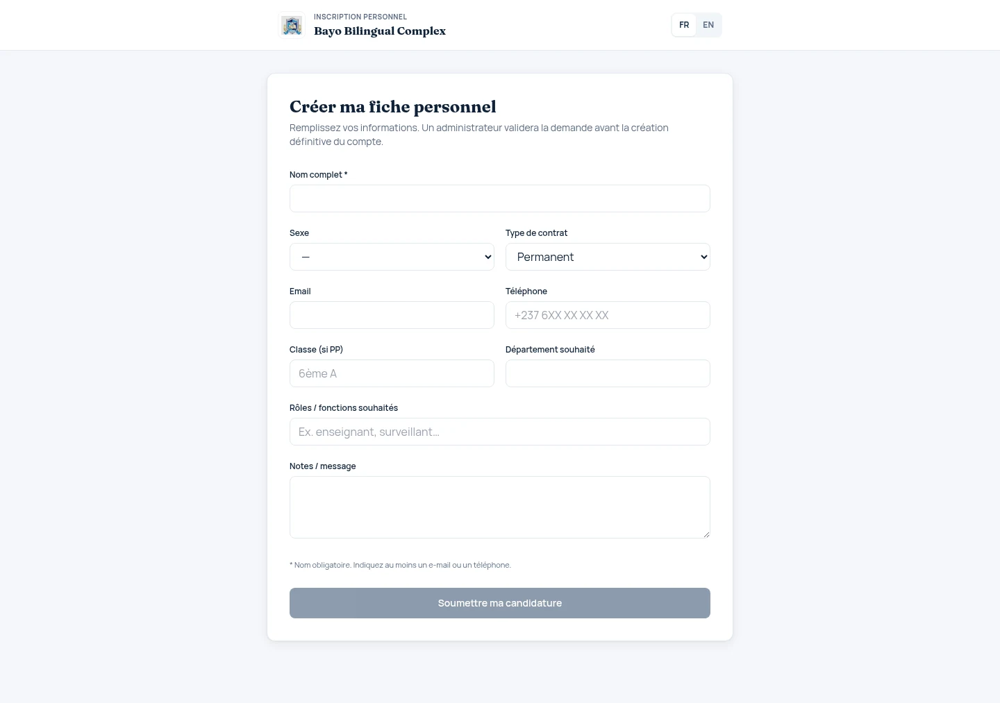
   *Le formulaire public, vu par le candidat — aucune connexion requise.*

3. Dans la file des candidatures, filtrez par statut (En attente, Acceptées, Finalisées, Refusées). **Accepter** ou **Refuser** (avec motif) une demande en attente.
4. Sur une candidature acceptée, **Finaliser** ouvre la fenêtre de configuration : type de contrat, département, salaire ou taux horaire, classe de PP, rôles définitifs et création éventuelle du compte. C'est cette étape qui crée réellement la fiche employé.
5. Une fois le recrutement terminé, **désactivez le portail** ou utilisez **Régénérer le lien** pour invalider l'ancienne adresse.

> **Attention** — Le lien contient un jeton secret : toute personne qui l'obtient peut déposer une candidature. Il ne donne toutefois **aucun accès aux données** de l'école et ne crée aucun compte tant qu'un administrateur n'a pas finalisé.

### 5.6 Départements, congés, masse salariale

1. **Départements** — créez les entités de l'école (Sciences, Lettres, Administration…), désignez un responsable et suivez l'effectif de chacune.

   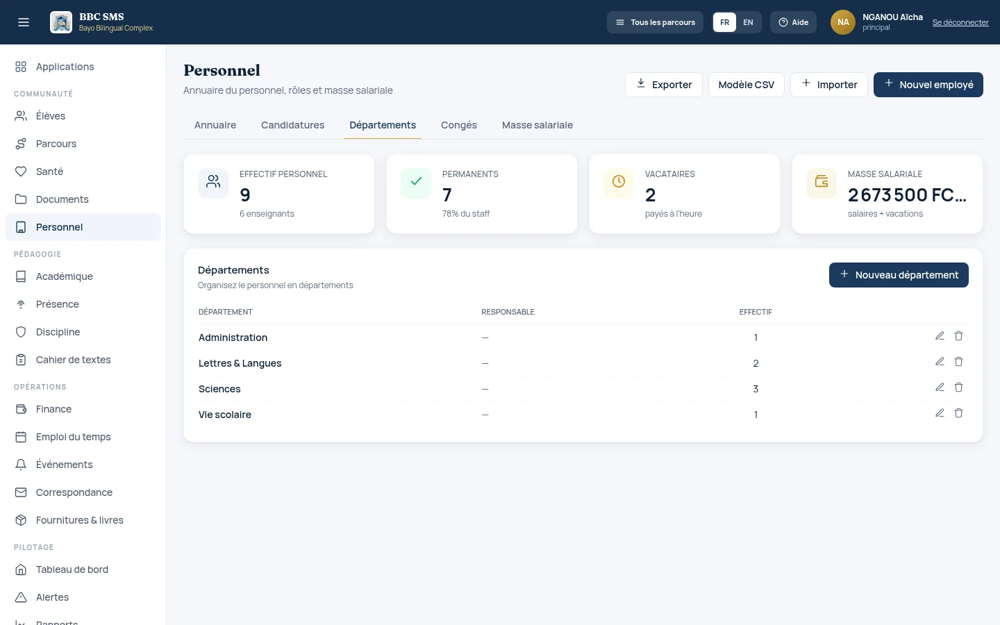
   *Départements avec responsable et effectif.*

2. **Congés** — **Nouvelle demande** : employé, type (annuel, maladie, maternité, sans solde, autre), dates et motif. Le nombre de jours est calculé automatiquement.

   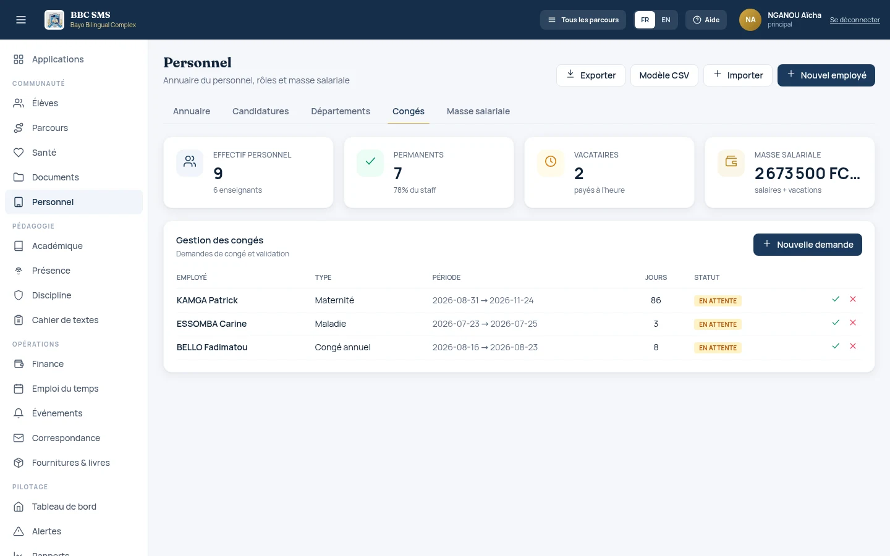
   *File des congés : approuver (✓) ou refuser (✗) une demande en attente.*

3. **Masse salariale** — récapitulatif trié du plus coûteux au moins coûteux, avec le total en pied de tableau. Utile avant la préparation du budget.

   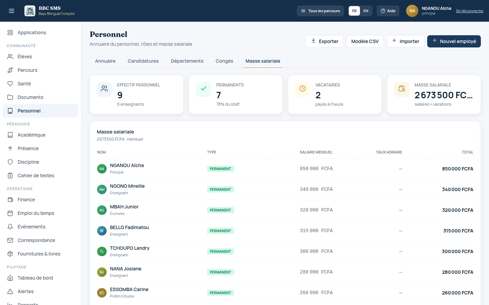
   *Masse salariale mensuelle, permanents et vacataires confondus.*

**Fiche de test — je sais faire**

- [ ] Créer un enseignant avec deux rôles et un salaire.
- [ ] Créer son compte de connexion et vérifier le message d'envoi.
- [ ] Activer le portail, déposer une candidature de test, l'accepter puis la finaliser.
- [ ] Créer un département et y rattacher deux employés.
- [ ] Saisir une demande de congé et l'approuver.

## 6 Présence

*Tableau temps réel du lecteur d'empreintes, journal du jour et historique.*

**Pour qui :** Préfet, vie scolaire, direction ; lecture pour les enseignants.

Le module affiche les pointages **au fil de l'eau** : chaque passage de badge remonte à l'écran sans rafraîchir la page. Il ne demande aucune saisie quotidienne.

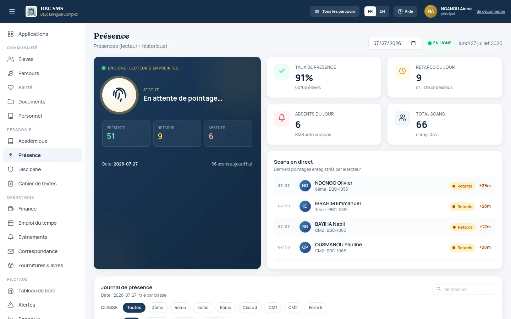
*En haut : le lecteur et le dernier élève scanné. À droite : les quatre indicateurs et le flux en direct.*

### 6.1 Lire le tableau

| Élément | Signification |
|---|---|
| Carte lecteur | État de la liaison et **dernier élève scanné** : nom, classe, heure et statut. |
| Taux de présence | (présents + retards) ÷ total des pointages du jour. |
| Retards du jour | Arrivées après l'heure de début des cours, avec le nombre de minutes. |
| Absents du jour | Élèves attendus sans pointage. |
| Scans en direct | Les douze derniers passages, du plus récent au plus ancien. |

> **À savoir** — Le statut **retard** se calcule à partir de **Paramètres → Général → Début des cours**. Les **week-ends** et les **jours fériés** du calendrier ne produisent jamais de retard ni d'absence.

### 6.2 Le journal de présence

1. Faites défiler jusqu'au **Journal de présence** : une ligne par élève, avec matricule, classe, heure de scan, statut, source du pointage et minutes de retard.

   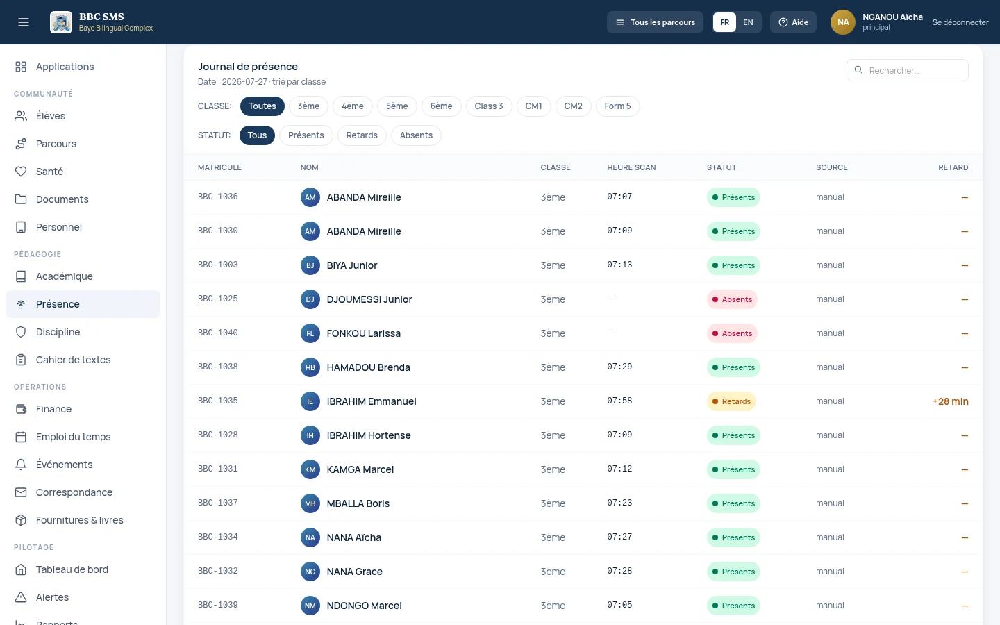
   *Journal du jour, filtrable par classe et par statut.*

2. Filtrez par **classe** puis par **statut** (Présents / Retards / Absents), ou cherchez un élève par nom ou matricule. Les lignes restent triées par classe puis par nom.

### 6.3 Consulter une journée passée

1. Choisissez une date dans le sélecteur en haut à droite de l'écran. Le tableau et le journal rechargent la journée demandée.

   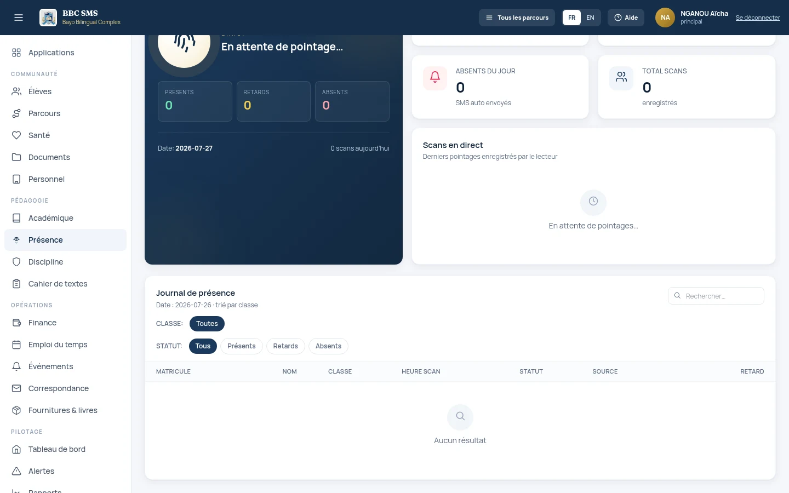
   *Historique : la même vue, sur une date antérieure.*

2. La mise à jour en direct ne concerne que la **journée du jour** : sur une date passée, la vue reste figée, ce qui est le comportement attendu pour une consultation.

> **Limite actuelle** — Il n'existe pas d'écran de **saisie manuelle** des présences : les pointages proviennent du lecteur d'empreintes installé au portail (ou d'un appel technique équivalent). Pour un relevé mensuel par élève, utilisez **Rapports → Présence mensuelle** (chapitre 18).

**Fiche de test — je sais faire**

- [ ] Lire le taux de présence du jour et le nombre de retards.
- [ ] Filtrer le journal sur une classe puis sur « Retards ».
- [ ] Afficher la journée d'hier.
- [ ] Modifier l'heure de début des cours et vérifier l'effet sur le seuil de retard.

## 7 Académique — bulletins et procès-verbaux

*Bulletin individuel par séquence, appréciation, validation, PV de classe et impression en lot.*

**Pour qui :** Direction, censeur, professeurs principaux (droit **Académique : Complet** pour valider).

Le module comporte deux onglets : **Bulletin** (un élève) et **Procès-verbal** (toute la classe). Les deux travaillent sur le couple **classe + séquence** choisi dans la barre d'outils.

### 7.1 Ouvrir un bulletin

1. Choisissez la **classe** dans la liste déroulante, puis la **séquence** (Séq. 1 à 6) sur la ligne de boutons.

   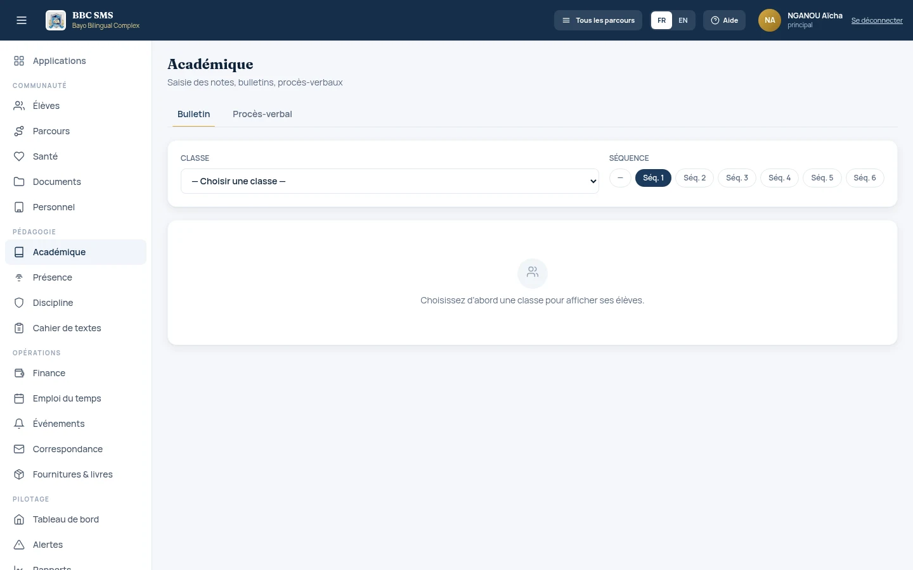
   *Barre d'outils : classe à gauche, séquence à droite.*

2. La liste des élèves de la classe apparaît à gauche, avec un champ de recherche.

   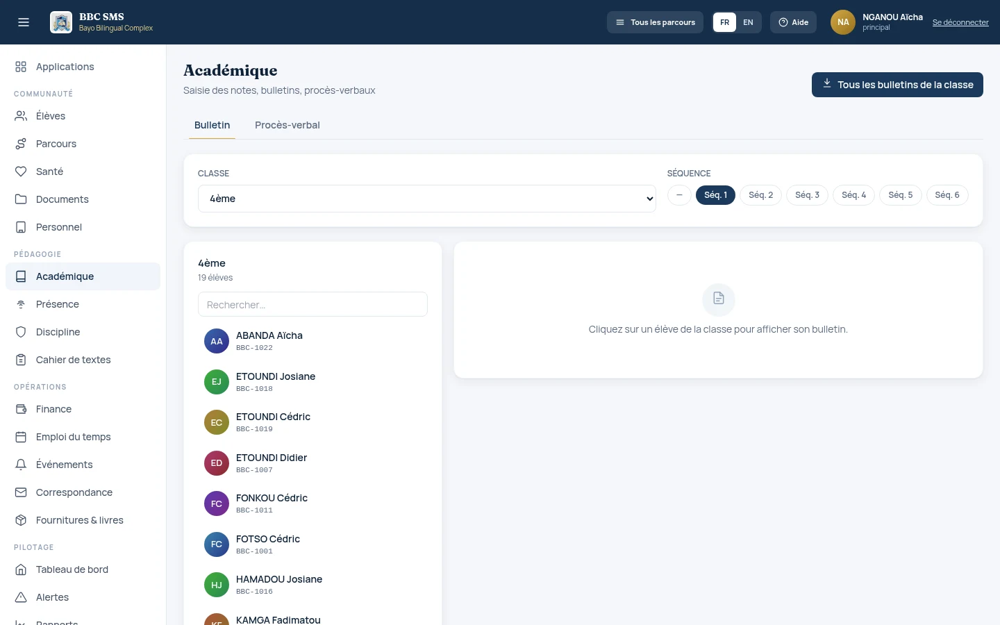
   *Liste de classe — cliquez un élève pour afficher son bulletin.*

3. Cliquez l'élève : son bulletin s'affiche à droite, en-tête officiel compris.

   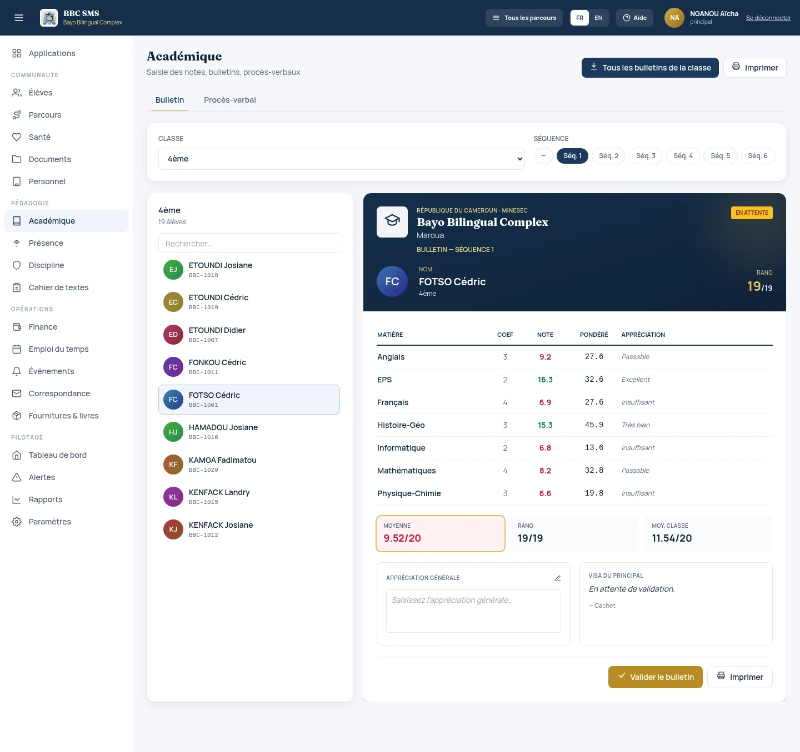
   *Bulletin complet — matières, coefficients, notes, pondération, moyennes et rang.*

| Bloc | Contenu |
|---|---|
| En-tête | Autorité de tutelle, nom et ville de l'école, séquence, badge « Validé » ou « En attente ». |
| Identité | Nom de l'élève, classe et rang sur l'effectif. |
| Tableau | Une ligne par matière : coefficient, note /20, note pondérée et appréciation automatique. |
| Synthèse | Moyenne de l'élève, rang, moyenne de la classe. |
| Appréciation générale | Zone de saisie libre tant que le bulletin n'est pas validé. |
| Visa | Emplacement du visa et du cachet du principal. |

> **À savoir** — L'appréciation par matière est déduite de la note : Excellent (≥ 16), Très bien (≥ 14), Bien (≥ 12), Assez bien (≥ 10), Passable (≥ 8), Insuffisant en dessous.

### 7.2 Valider et imprimer

1. Rédigez l'**appréciation générale** dans la zone prévue.
2. Cliquez **Valider le bulletin** : le badge passe à « Validé », l'appréciation est figée et le visa affiche « Bulletin validé ».
3. **Imprimer** ouvre la boîte d'impression du navigateur avec une mise en page dédiée (menus et barres masqués). Choisissez « Enregistrer au format PDF » pour archiver.
4. **Tous les bulletins de la classe** charge et met en page les bulletins de **tous** les élèves, puis lance une seule impression. Les bulletins bloqués pour impayés sont automatiquement exclus.

### 7.3 Bulletin bloqué pour impayés

Si l'élève a un solde de frais impayé, le bulletin s'affiche mais porte un bandeau rouge « Bulletin verrouillé ». La validation et l'impression sont désactivées jusqu'au règlement.

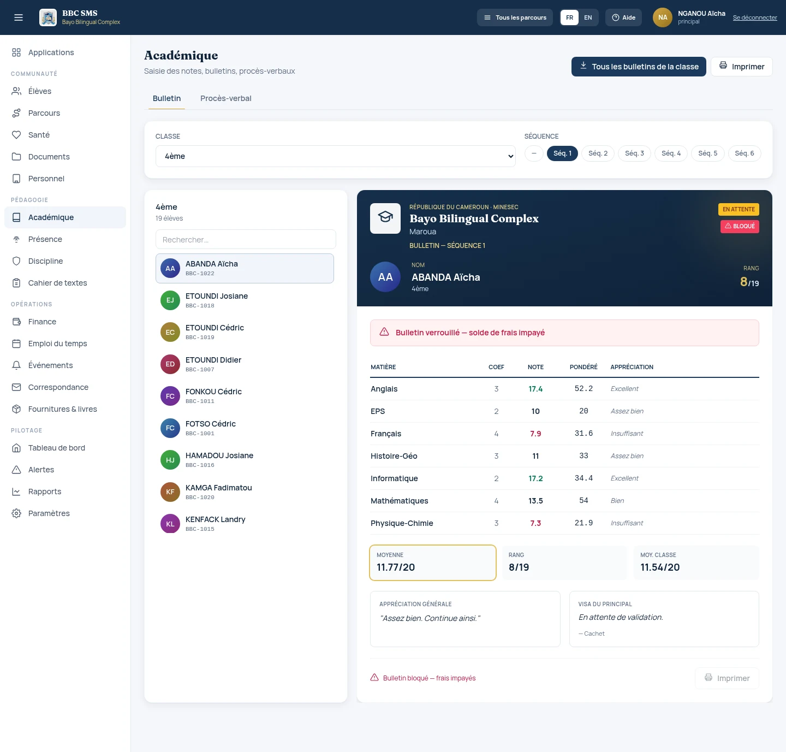
*Bulletin verrouillé : le blocage vient du solde suivi dans le module Finance.*

> **Astuce** — Pour débloquer, enregistrez le versement dans **Finance → Nouveau paiement** (chapitre 11) puis rouvrez le bulletin : le bandeau disparaît immédiatement.

### 7.4 Le procès-verbal de classe

1. Onglet **Procès-verbal**, vérifiez la classe et la séquence, puis cliquez **Charger le PV**.

   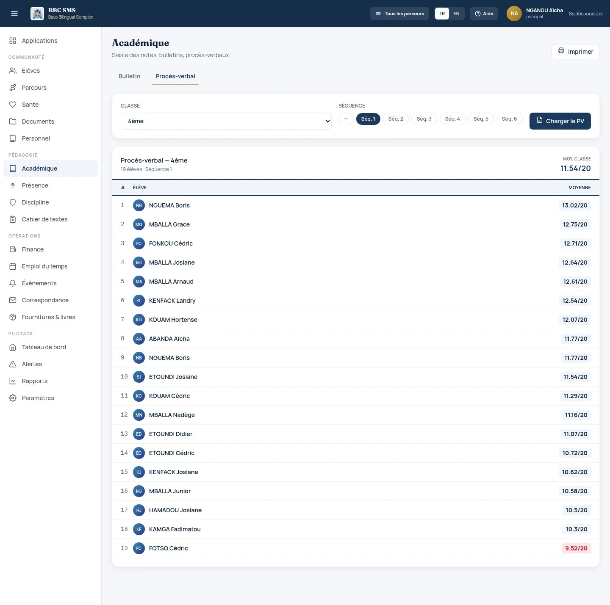
   *Classement de la classe par moyenne, avec la moyenne générale en haut à droite.*

2. Le tableau donne le rang, l'élève et sa moyenne, trié du premier au dernier. **Imprimer** produit le document à afficher ou à archiver.

### 7.5 Maternelle et primaire : le bulletin APC

Quand le parcours actif est **Maternelle** ou **Primaire**, l'application affiche automatiquement le bulletin par **compétences** (APC), conforme aux modèles officiels : six compétences, leurs sous-compétences, les types d'évaluation (orale, écrite, pratique, savoir-être) avec leur barème, un total général sur 280 et les trois trimestres.

> **Limite actuelle** — Le bulletin APC est aujourd'hui une **feuille imprimable conforme** : les cases de notes sont laissées vides pour un remplissage manuel. Les moyennes chiffrées automatiques restent réservées au secondaire.

> **Limite actuelle** — Il n'y a pas encore d'écran de **saisie des notes** dans l'interface : les notes sont alimentées par l'intégration technique (import ou service de saisie). Ce module se concentre sur la **restitution** — bulletin, PV, validation, impression.

**Fiche de test — je sais faire**

- [ ] Afficher le bulletin d'un élève pour la séquence 1.
- [ ] Saisir une appréciation générale et valider le bulletin.
- [ ] Repérer un bulletin bloqué et expliquer pourquoi.
- [ ] Charger le PV de la classe et vérifier la cohérence du rang.
- [ ] Lancer l'impression de tous les bulletins de la classe.

## 8 Discipline

*Incidents, sanctions et notification immédiate des parents.*

**Pour qui :** Préfet, surveillance, direction.

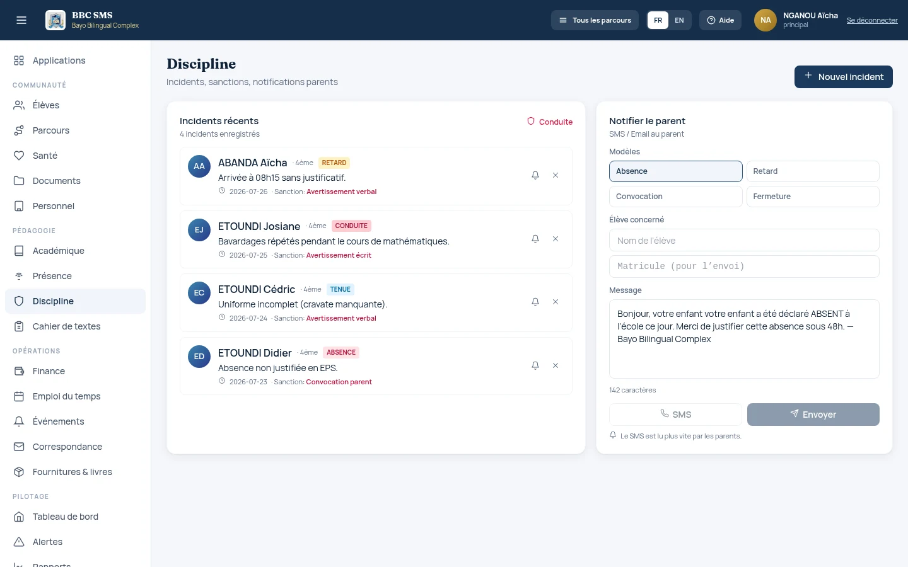
*À gauche les incidents récents, à droite le panneau de notification des parents.*

### 8.1 Enregistrer un incident

1. Cliquez **Nouvel incident**. Choisissez d'abord la **classe**, puis l'**élève** dans la liste déroulante qui se remplit : la fiche de l'élève s'affiche pour confirmer votre choix.

   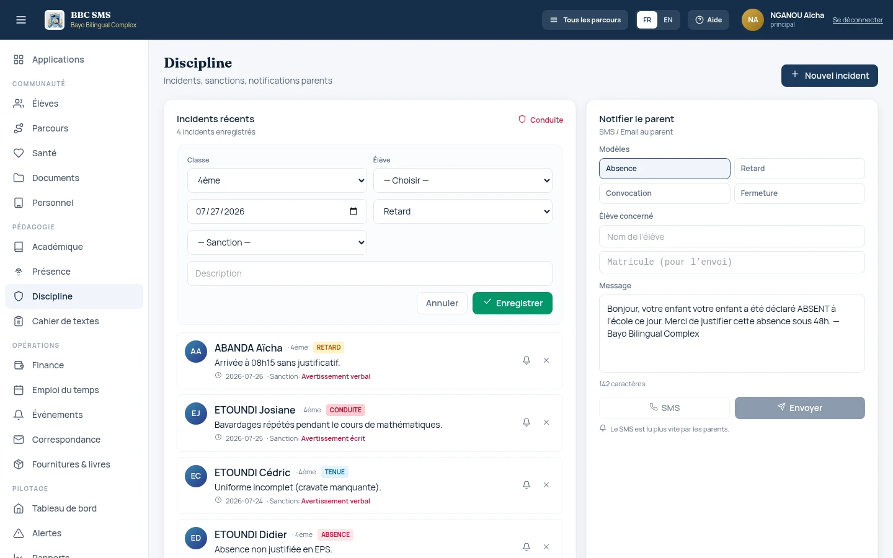
   *Sélection classe → élève, puis date, motif, sanction et description.*

2. Renseignez la **date** (par défaut aujourd'hui), le **motif** et éventuellement la **sanction**. Ces deux listes proviennent du catalogue **Paramètres → Discipline** (§3.6).
3. Ajoutez une **description** factuelle — c'est elle qui sera relue en conseil de discipline — puis **Enregistrer**.

Chaque incident enregistré affiche l'élève, sa classe, un badge coloré selon le motif, la description, la date et la sanction. La croix rouge supprime l'incident (droit d'écriture requis).

### 8.2 Notifier le parent

1. Cliquez l'icône **cloche** sur la ligne de l'incident : le panneau de droite se pré-remplit avec l'élève et le modèle de message correspondant au motif.

   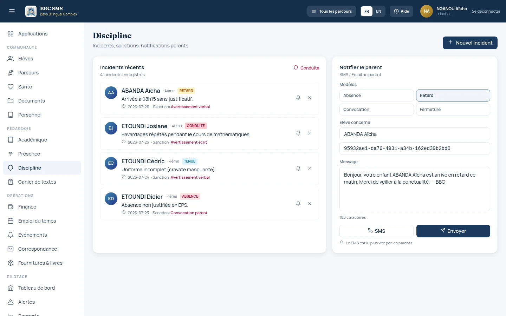
   *Message prêt à partir — modèle Absence, Retard, Convocation ou Fermeture.*

2. Choisissez le **modèle** voulu ; le texte se réécrit avec le nom de l'élève et le compteur de caractères se met à jour (utile pour le coût d'un SMS).
3. Envoyez par **SMS** (numéro du contact principal) ou par **Envoyer** (e-mail). Le résultat s'affiche aussitôt : message envoyé, ou motif d'échec — le plus souvent « pas de téléphone renseigné ».

> **À savoir** — Le destinataire est le contact principal de la fiche élève (père → mère → tuteur). Si l'envoi échoue faute de numéro, complétez la fiche dans **Élèves** puis relancez.

**Fiche de test — je sais faire**

- [ ] Enregistrer un incident avec un motif du catalogue.
- [ ] Ajouter une sanction personnalisée dans Paramètres et la retrouver ici.
- [ ] Pré-remplir une notification depuis un incident et l'envoyer.
- [ ] Lire le message de résultat et le comprendre.

## 9 Cahier de textes

*Journal de classe et devoirs, jour par jour et par matière.*

**Pour qui :** Enseignants et professeurs principaux ; consultation pour la direction.

1. Choisissez la **classe** : les entrées sont regroupées par jour, du plus récent au plus ancien. Deux compteurs indiquent le nombre d'entrées et le nombre de devoirs.

   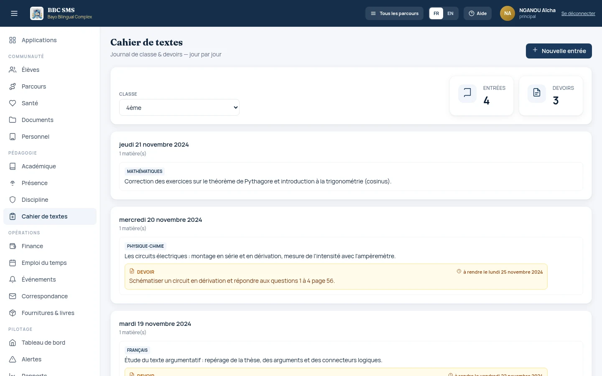
   *Cahier de textes d'une classe : une carte par journée, une entrée par matière.*

2. **Nouvelle entrée** : choisissez la **matière** (limitée au sous-système de la classe), la **date du cours**, puis décrivez le **contenu traité**.

   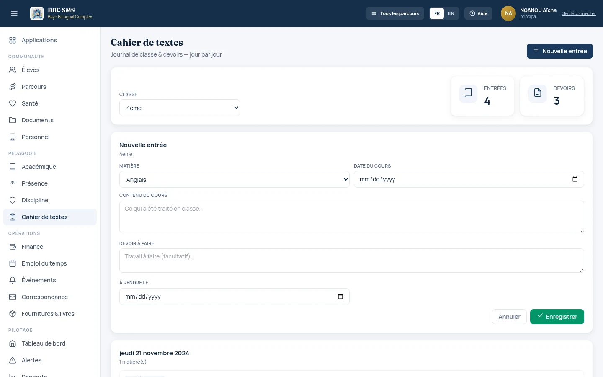
   *Formulaire : contenu du cours, devoir facultatif et date de remise.*

3. Renseignez le **devoir à faire** et sa **date de remise** si nécessaire — ils apparaissent en encadré sous le contenu du cours.
4. **Enregistrer**. Les icônes crayon et corbeille de chaque entrée permettent de la corriger ou de la supprimer.

> **Astuce** — Renseigner le cahier au fil des séances prend deux minutes et rend service à tout le monde : les collègues remplaçants, les parents qui appellent, et l'inspection.

**Fiche de test — je sais faire**

- [ ] Ajouter une entrée avec un devoir et une date de remise.
- [ ] Corriger une entrée existante.
- [ ] Vérifier que les matières proposées correspondent au sous-système de la classe.

## 10 Emploi du temps

*Grille hebdomadaire par classe ; un enseignant ne peut pas être dans deux salles à la même heure.*

**Pour qui :** Direction, censeur ; lecture pour les enseignants.

La grille couvre **six jours** (lundi → samedi) et **neuf créneaux** horaires, de 07:30 à 15:30. Chaque case porte la matière, l'enseignant et la salle, avec une couleur par matière.

1. Choisissez la **classe** : sa grille s'affiche. En lecture seule, l'affichage s'arrête là.

   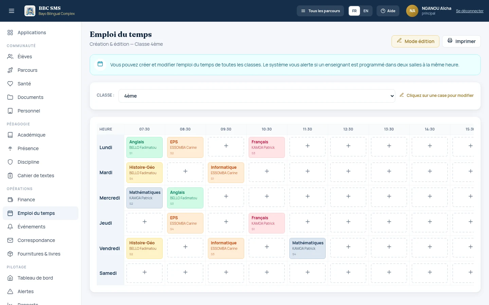
   *Grille d'une classe ; les cases vides portent un « + » en mode édition.*

2. **Cliquez une case** — vide ou occupée — pour ouvrir l'éditeur de créneau sous la grille.

   
   *Éditeur : matière, enseignant et salle pour le jour et l'heure indiqués.*

3. Renseignez la **matière** (liste filtrée sur le sous-système de la classe), l'**enseignant** et la **salle** — le champ salle propose les salles déjà utilisées.
4. **Enregistrer**. Sur un créneau existant, **Supprimer** le libère.

> **Attention** — **Un enseignant ne peut pas être dans deux salles à la même heure.** Si le professeur choisi assure déjà un cours sur ce créneau dans une autre classe, l'enregistrement est **refusé** : l'éditeur reste ouvert et affiche la classe, la matière et la salle qui l'occupent déjà. Corrigez l'enseignant ou l'heure — ou, si les deux classes sont réellement regroupées, cliquez **Forcer l'enregistrement**.

Les chevauchements **déjà présents** dans la grille (import, saisie antérieure, enregistrement forcé) sont recalculés à chaque ouverture du module : un bandeau rouge en haut de page les liste tous — jour, heure, enseignant, puis les cours qui se chevauchent avec leur salle — et les cases concernées de la classe affichée sont cerclées de rouge avec un triangle d'alerte. Le bandeau disparaît de lui-même dès que le dernier chevauchement est résolu.

**Fiche de test — je sais faire**

- [ ] Créer un créneau avec matière, enseignant et salle.
- [ ] Tenter de placer un enseignant déjà occupé sur ce créneau et lire le refus.
- [ ] Forcer un regroupement de classes, puis retrouver le chevauchement dans le bandeau rouge.
- [ ] Supprimer un créneau puis vérifier la case libérée.

## 11 Finance

*Encaissements et reçus, débiteurs, dépenses et grille des frais.*

**Pour qui :** Économe (écriture) ; direction en lecture. Les captures de ce chapitre sont prises avec un compte économe.

Cinq onglets : **Encaissements**, **Débiteurs**, **Dépenses**, **Frais** et **Moyens de paiement**. Chaque onglet charge ses données à la première visite, et le bouton **Exporter** produit un CSV de l'onglet courant.

> **À savoir** — Un compte en **lecture seule** voit les mêmes chiffres, sans aucun bouton d'écriture : le bandeau « Lecture seule » le rappelle en haut de page.

### 11.1 Configurer les moyens de paiement

L'école encaisse par **espèces**, **Orange Money**, **MTN Mobile Money**, **SARA**, **carte bancaire (MPGS)** et **virement**. Chaque canal porte les coordonnées que les familles utiliseront pour payer : c'est cette configuration qui rend le paiement progressif possible depuis la maison.

1. Ouvrez l'onglet **Moyens de paiement**. Les six canaux sont livrés préconfigurés ; trois interrupteurs les pilotent.

   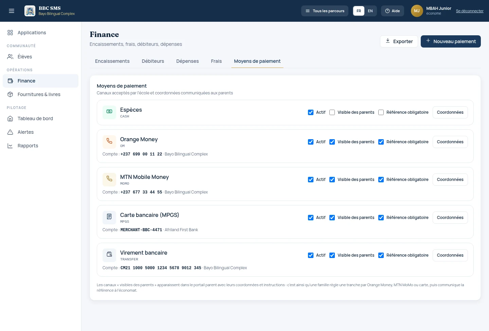
   *Chaque canal : actif, visible des parents, référence obligatoire, et ses coordonnées.*

2. **Actif** autorise l'encaissement par ce canal. **Visible des parents** le publie dans le portail parent avec ses coordonnées. **Référence obligatoire** impose la saisie de l'identifiant de transaction : laissez-la cochée pour OM, MoMo, SARA, MPGS et virement — c'est la preuve du versement.
3. Cliquez **Coordonnées** pour saisir le **numéro à créditer** (Orange Money, MoMo, SARA), l'**identifiant marchand** (MPGS) ou le **RIB** (virement), l'intitulé du compte et les instructions affichées au parent, en français et en anglais.

   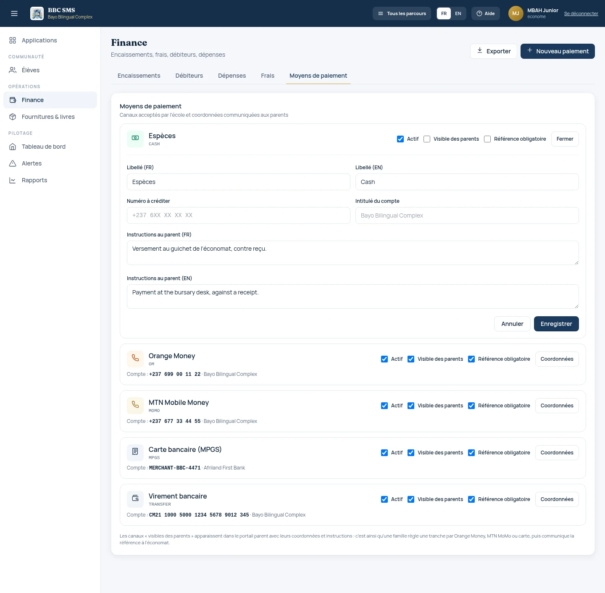
   *Coordonnées et instructions : elles s'affichent telles quelles dans le portail parent.*

4. **Enregistrer**. Le parent voit immédiatement le canal dans son espace, onglet **Frais & paiements**.

> **Attention** — Ces canaux servent à **enregistrer et tracer** un versement, pas à le déclencher : le parent paie depuis son téléphone ou à la banque, puis transmet la référence à l'économat qui saisit l'encaissement. Aucun débit n'est initié par l'application.

### 11.2 Définir la grille des frais (par niveau ou par classe)

Une grille décrit ce qu'un élève doit sur l'année et **comment ce montant se découpe en tranches**. Elle se définit à deux niveaux : une grille par **niveau** (le cas général) et, si les frais diffèrent, une **surcharge par classe** qui prime pour les élèves de cette classe.

1. Onglet **Frais** → **Nouvelle grille**. Le tableau distingue les grilles de niveau des surcharges de classe, repérées par une pastille « classe ».

   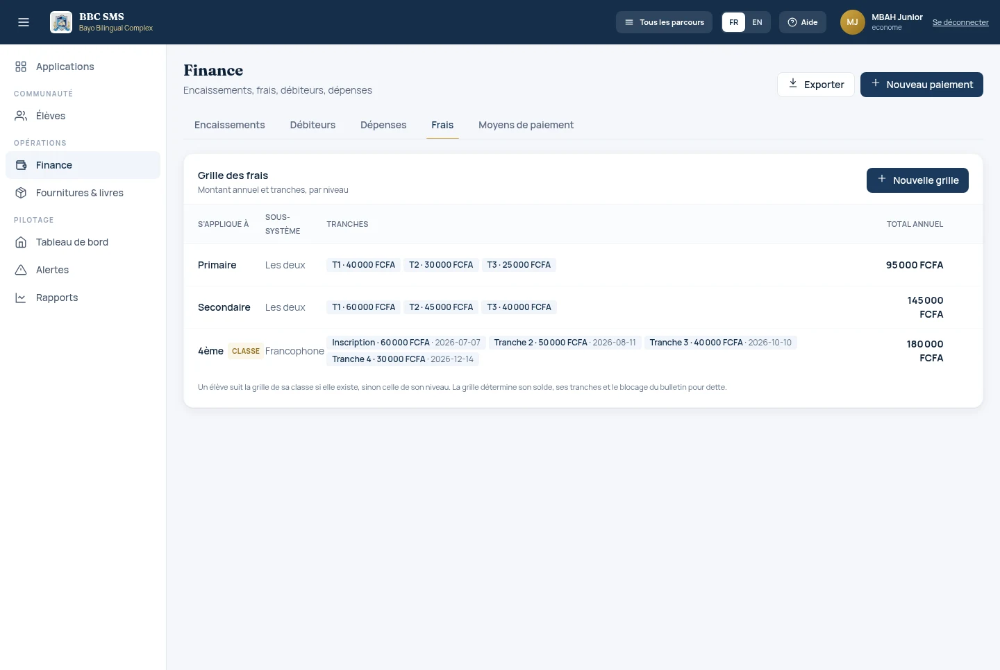
   *Grilles de l'établissement : par niveau, et la surcharge de la classe 4ème.*

2. Choisissez la portée : **Grille du niveau** (niveau + sous-système) ou **Surcharge par classe**, puis la classe concernée. Le niveau et le sous-système suivent alors automatiquement la classe.

   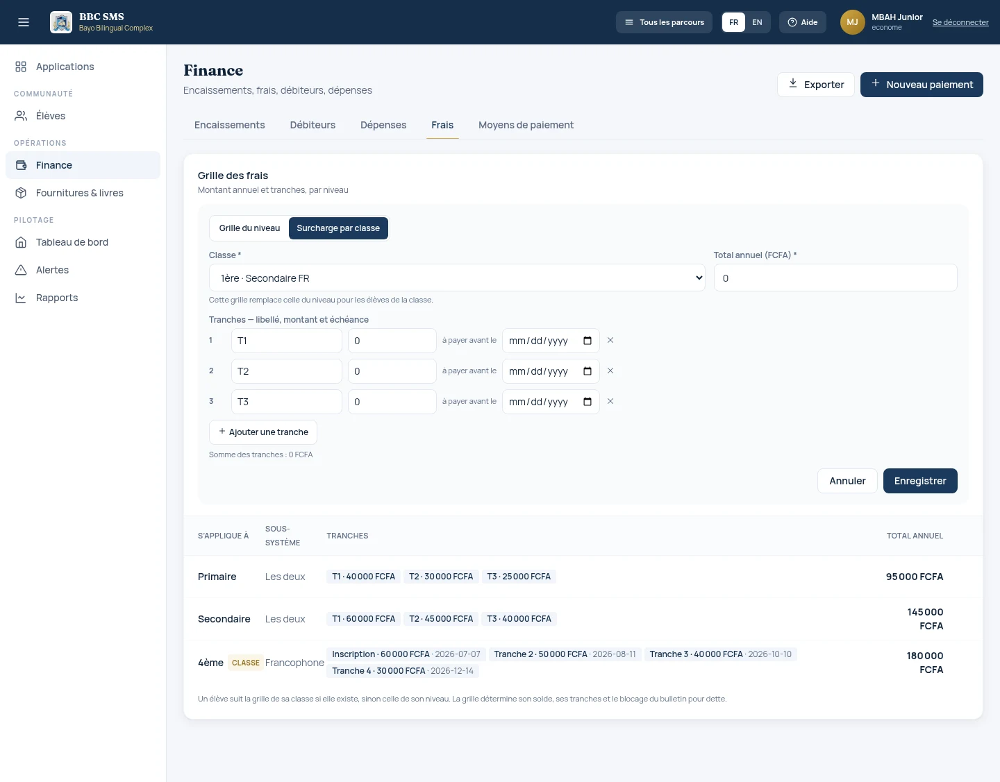
   *Surcharge de classe : total annuel et tranches nommées avec leur échéance.*

3. Saisissez le **total annuel**, puis les **tranches** : un **libellé** (« Inscription », « Tranche 2 »…), un **montant** et une **échéance**. **Ajouter une tranche** en crée une de plus, la croix en retire une. Il peut y en avoir autant que nécessaire.
4. La somme des tranches doit **égaler** le total annuel : un rappel s'affiche sous les champs et le serveur refuse un écart.
5. **Enregistrer**. Les soldes de tous les élèves concernés sont recalculés immédiatement, et la corbeille d'une surcharge fait retomber la classe sur la grille de son niveau.

> **À savoir** — L'échéance sert au parent : une tranche non réglée après sa date apparaît **en retard** dans son espace, en rouge. Laissez le champ vide si l'école ne fixe pas de date.

> **Attention** — Cette grille sert de référence à **tout le reste** : solde de chaque élève, liste des débiteurs, taux de recouvrement et blocage des bulletins. Renseignez-la avant le premier encaissement de l'année.

### 11.3 Encaisser un paiement

1. Cliquez **Nouveau paiement**. Choisissez la **classe** puis l'**élève** : la seconde liste se remplit après la première.

   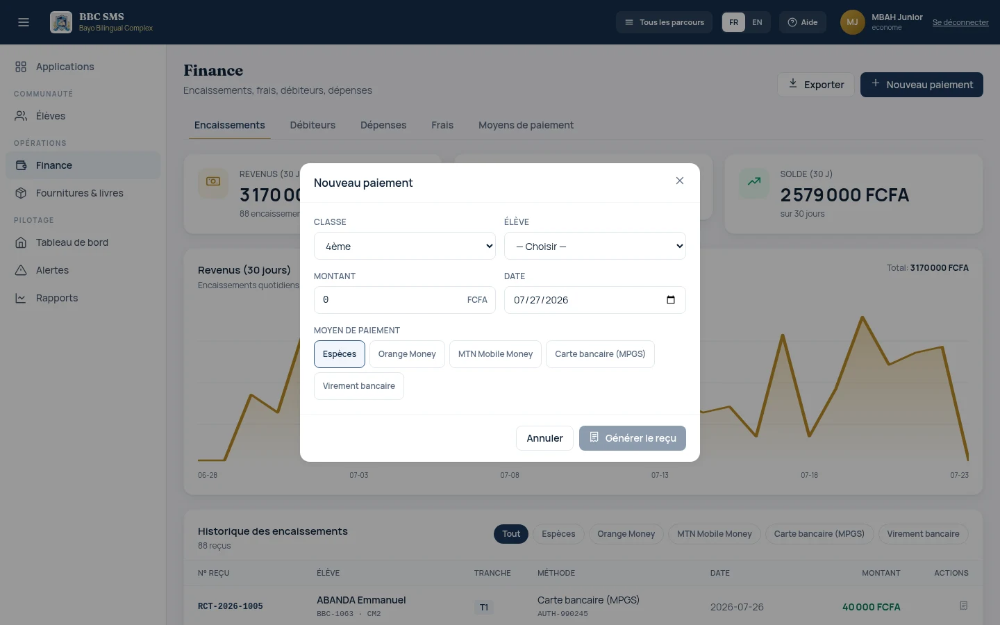
   *La situation de l'élève s'affiche : grille appliquée, reste à payer et tranches.*

2. La **situation de l'élève** apparaît aussitôt : grille appliquée (classe ou niveau), reste à payer et **état de chaque tranche** — verte si réglée, rouge si en retard. La première tranche non soldée est présélectionnée et le montant restant pré-rempli ; cliquez une autre tranche pour changer.
3. Ajustez le **montant** si le parent verse une somme partielle, et la **date** si l'encaissement est antérieur.
4. Choisissez le **moyen de paiement** parmi les canaux actifs (§11.1). Pour Orange Money, MTN MoMo, MPGS ou un virement, saisissez la **référence de transaction** communiquée par le parent : sans elle, l'enregistrement est refusé. Le numéro du compte de l'école est rappelé sous le champ.
5. **Générer le reçu** enregistre le paiement et ouvre immédiatement le reçu numéroté.

   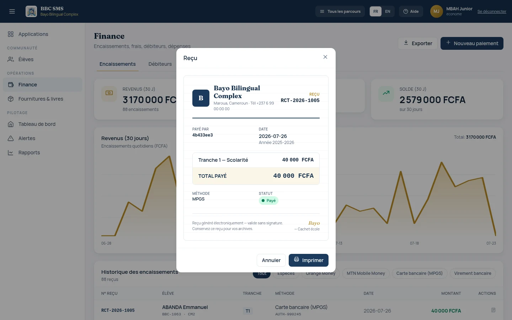
   *Reçu : numéro, date, tranche, montant, méthode et cachet de l'école.*

6. **Imprimer** envoie le reçu à l'imprimante ou au PDF. Il reste consultable à tout moment via l'icône reçu de l'historique.

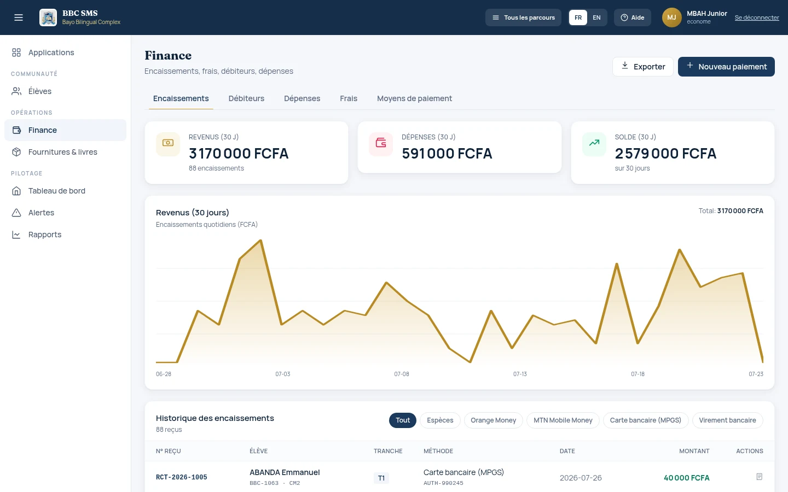
*Onglet Encaissements : indicateurs 30 jours, courbe des recettes et historique — chaque ligne porte son canal et sa référence.*

> **Astuce** — La référence saisie est reprise dans l'historique, dans l'export CSV et dans l'espace du parent : en cas de contestation, elle permet de retrouver la transaction chez l'opérateur.

### 11.4 Suivre les débiteurs

1. Onglet **Débiteurs** : trois indicateurs — total impayé, montant déjà encaissé et **taux de recouvrement** (encaissé ÷ attendu, sur toute l'école).

   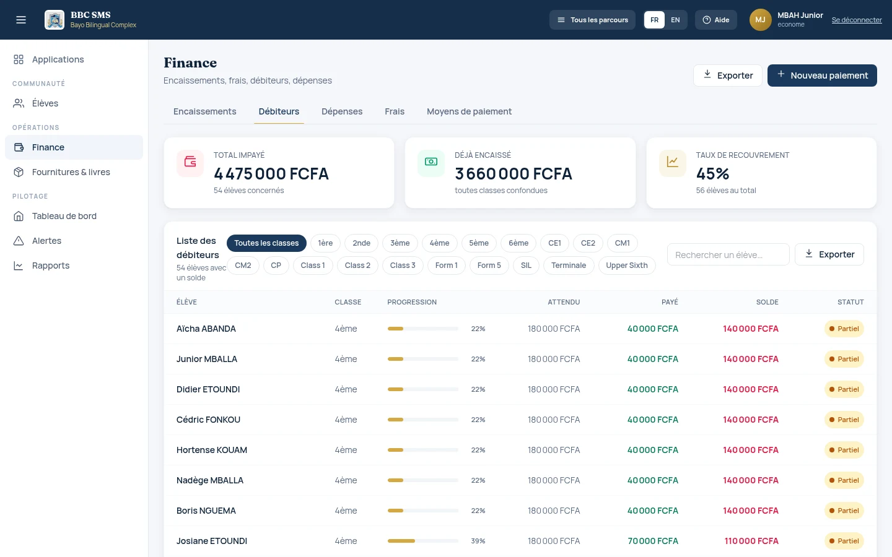
   *Liste des débiteurs, avec barre de progression et statut par élève.*

2. Filtrez par **classe** ou cherchez un élève par son nom. Chaque ligne indique l'attendu, le payé, le solde et un statut : payé, partiel ou impayé.
3. **Exporter** produit la liste de relance au format CSV.

### 11.5 Enregistrer une dépense

1. Onglet **Dépenses** → **Nouvelle dépense** : date, **catégorie** (salaires, fournitures, énergie, eau, maintenance, transport, cantine, internet, examens, sport, santé, divers), libellé et montant.

   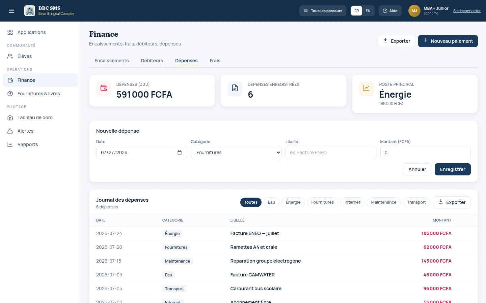
   *Saisie d'une dépense — les trois champs sont obligatoires.*

2. Le journal affiche le total en pied de tableau et se filtre par catégorie. L'indicateur **Poste principal** met en évidence la catégorie la plus lourde.

   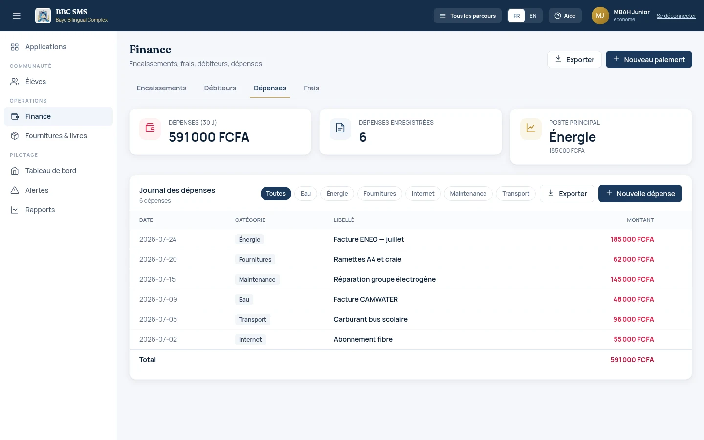
   *Journal des dépenses avec total et filtre par catégorie.*

3. La corbeille supprime une dépense après confirmation ; les indicateurs 30 jours se recalculent aussitôt.

**Fiche de test — je sais faire**

- [ ] Renseigner le numéro Orange Money et MTN MoMo de l'école, puis les rendre visibles des parents.
- [ ] Créer une grille de niveau dont les tranches totalisent le montant annuel.
- [ ] Créer une surcharge pour une classe avec quatre tranches datées, et vérifier qu'un élève de cette classe la suit.
- [ ] Encaisser une tranche par Orange Money avec sa référence, et constater le refus si la référence manque.
- [ ] Imprimer le reçu correspondant.
- [ ] Retrouver l'élève dans la liste des débiteurs et lire son solde.
- [ ] Enregistrer une dépense et vérifier l'effet sur le solde 30 jours.
- [ ] Exporter la liste des débiteurs.

## 12 Événements

*Annonces de l'école et notification groupée des parents.*

**Pour qui :** Direction, secrétariat.

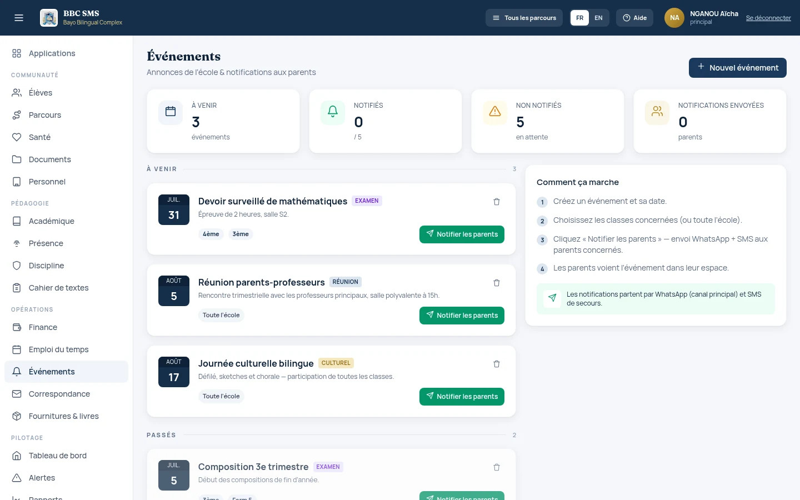
*Événements à venir et passés, avec l'état de notification de chacun.*

1. **Nouvel événement** : **titre**, **type** (Réunion, Examen, Culturel, Annonce), **date** et **description**.

   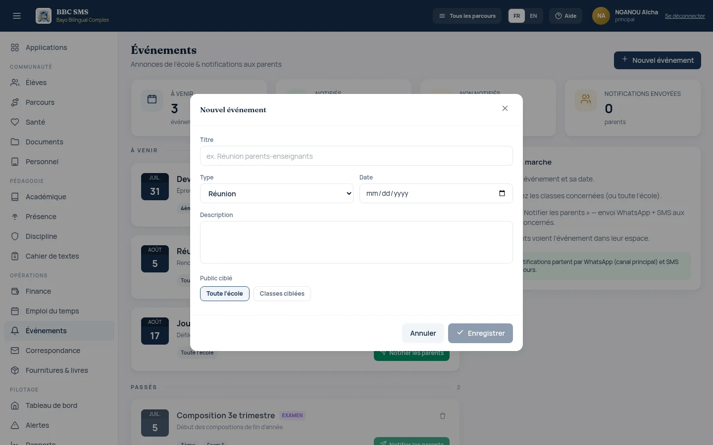
   *Formulaire : le public ciblé se choisit en bas de la fenêtre.*

2. Choisissez le **public** : **Toute l'école**, ou **Classes ciblées** puis cochez les classes concernées.
3. **Enregistrer**. L'événement rejoint la colonne « À venir », trié par date.
4. Cliquez **Notifier les parents** sur la carte de l'événement. Le nombre de parents touchés s'affiche à côté du badge « Notifié ».

- Les quatre indicateurs du haut résument : événements à venir, notifiés, non notifiés et nombre total de parents prévenus.
- Les événements passés restent consultables (cinq derniers), légèrement estompés.
- Un événement ne peut être notifié **qu'une fois** : le bouton disparaît au profit du badge.

**Fiche de test — je sais faire**

- [ ] Créer un événement pour toute l'école et le notifier.
- [ ] Créer un événement ciblé sur deux classes.
- [ ] Vérifier le compteur de parents notifiés.

## 13 Carnet de correspondance

*Notes individuelles école ↔ parents, avec accusé de lecture.*

**Pour qui :** Professeurs principaux, vie scolaire, direction.

Là où le module Événements s'adresse à un groupe, la correspondance s'adresse à **un élève** : convocation, information, signalement d'absence, félicitations.

1. Choisissez la **classe** dans le sélecteur de gauche, puis l'**élève**. L'historique de ses notes s'affiche à droite, avec trois compteurs : notes, accusés en attente, notes signées.

   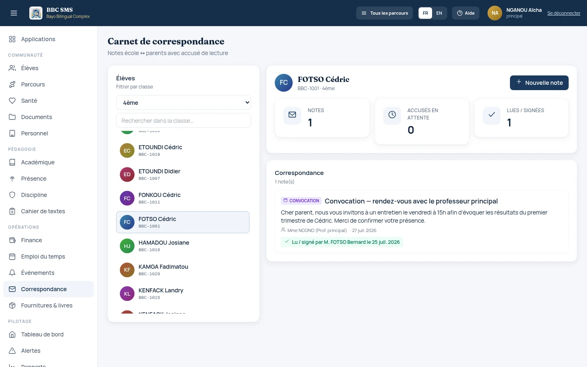
   *Correspondance d'un élève : chaque note porte sa catégorie et son état de lecture.*

2. **Nouvelle note** : choisissez la **catégorie** (Information, Convocation, Absence, Rappel, Félicitations), l'**objet** et le **message**.

   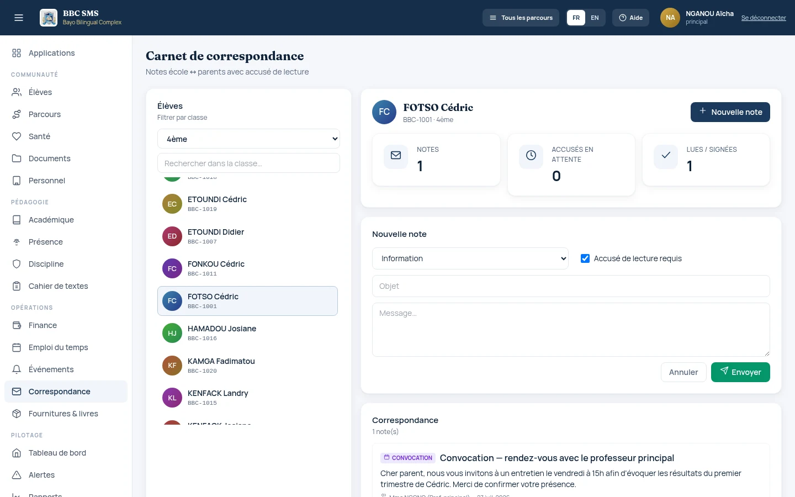
   *Rédaction d'une note, avec la case « accusé de lecture requis ».*

3. Laissez cochée la case **Accusé de lecture requis** pour les notes importantes, puis **Envoyer**.
4. Quand le parent renvoie le carnet signé, cliquez **Marquer comme lu** et saisissez le **nom du parent signataire** : la note affiche alors « Lu / signé par … le … ».

> **Astuce** — Le compteur **Accusés en attente** donne en un coup d'œil les familles à relancer.

**Fiche de test — je sais faire**

- [ ] Envoyer une convocation avec accusé de lecture.
- [ ] Marquer une note comme lue au nom du parent.
- [ ] Lire le compteur d'accusés en attente d'un élève.

## 14 Fournitures & manuels

*Listes de rentrée par classe, préparées puis publiées aux parents.*

**Pour qui :** Direction, professeurs principaux, économat.

Deux listes distinctes par classe : les **fournitures** (cahiers, matériel) et les **manuels scolaires** (avec prix). Chaque liste a son propre état brouillon / publié.

1. Choisissez l'onglet **Fournitures** ou **Manuels scolaires**, puis la **classe**.

   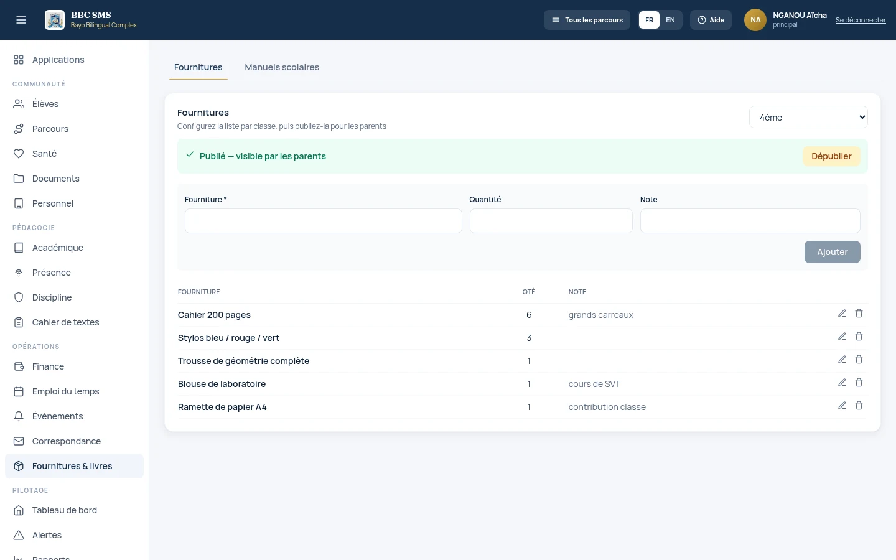
   *Liste de fournitures : libellé, quantité et note par article.*

2. Ajoutez les articles. Pour une **fourniture** : libellé, quantité, note. Pour un **manuel** : titre, prix, matière, auteur / édition et case « manuel obligatoire ».

   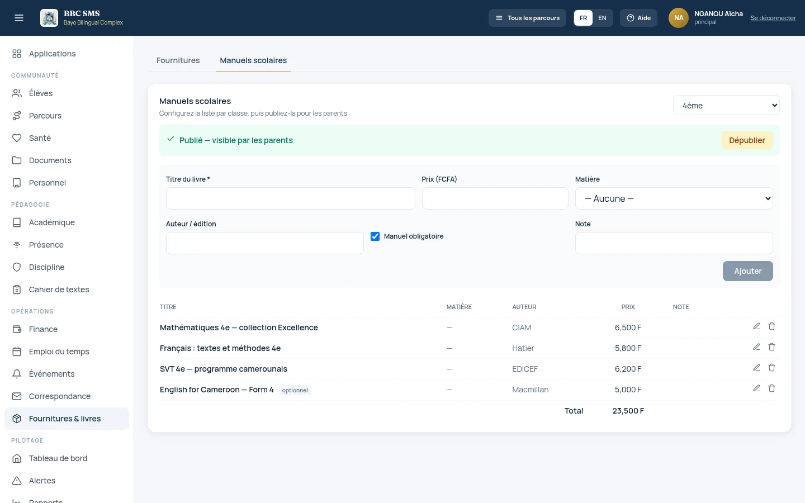
   *Liste des manuels : le total du coût est calculé automatiquement.*

3. Le bandeau du haut indique l'état. Cliquez **Publier** : la liste devient visible dans le portail parent. **Dépublier** la masque à nouveau.

> **Attention** — Tant qu'une liste est en **brouillon**, les parents ne la voient pas. Vérifiez prix et quantités avant de publier : la publication est immédiate.

**Fiche de test — je sais faire**

- [ ] Constituer la liste de fournitures d'une classe et la publier.
- [ ] Ajouter trois manuels avec prix et vérifier le total.
- [ ] Vérifier la liste dans le portail parent, puis la dépublier.

## 15 Parcours scolaire

*Historique pluriannuel d'un élève : classes, moyennes, décisions.*

**Pour qui :** Direction, professeurs principaux, orientation.

1. Choisissez la classe puis l'élève. Trois indicateurs résument son parcours : années suivies, meilleure moyenne et nombre de redoublements.

   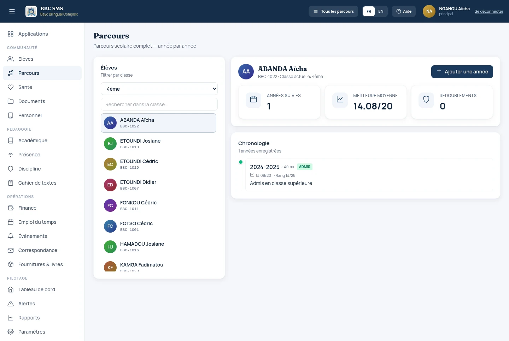
   *Parcours d'un élève : indicateurs, courbe de progression et chronologie.*

2. **Ajouter une année** : année scolaire (ex. 2024-2025), classe, **résultat** (En cours, Admis, Redoublé, Arrivée, Départ, Diplômé, Exclu), moyenne générale, rang, effectif et décision du conseil de classe.
3. Dès qu'au moins deux années portent une moyenne, une **courbe de progression** s'affiche au-dessus de la chronologie.
4. Chaque entrée de la chronologie se modifie (crayon) ou se supprime (croix). La pastille de couleur reprend le résultat de l'année.

**Fiche de test — je sais faire**

- [ ] Ajouter une année antérieure avec moyenne et rang.
- [ ] Vérifier la courbe de progression sur deux années.

## 16 Santé & vie scolaire

*Dossier médical, passages à l'infirmerie et activités extrascolaires.*

**Pour qui :** Infirmerie, vie scolaire, direction — données sensibles, accès à restreindre.

1. Choisissez la classe puis l'élève. L'en-tête rappelle le groupe sanguin, le nombre de passages à l'infirmerie et le nombre d'activités.

   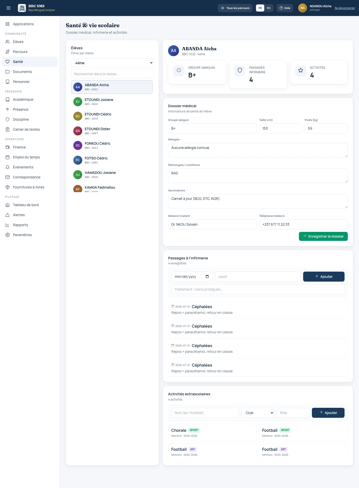
   *Dossier médical, passages à l'infirmerie et activités sur une seule page.*

2. **Dossier médical** : groupe sanguin, taille, poids, allergies, pathologies, vaccinations, médecin traitant et son téléphone. **Enregistrer le dossier** valide l'ensemble.
3. **Passages à l'infirmerie** : date, motif et soins prodigués, puis **Ajouter**. Chaque passage reste horodaté dans la liste.
4. **Activités extrascolaires** : nom, catégorie (Club, Sport, Art, Autre), rôle et saison.

> **Attention** — Les données de santé sont confidentielles. Réservez le droit d'écriture à l'infirmerie et n'accordez la lecture qu'aux personnes qui en ont besoin (matrice des permissions, chapitre 2).

**Fiche de test — je sais faire**

- [ ] Compléter le dossier médical d'un élève et l'enregistrer.
- [ ] Ajouter un passage à l'infirmerie.
- [ ] Inscrire l'élève à un club.

## 17 Documents & orientation

*Pièces du dossier administratif et décisions d'orientation.*

**Pour qui :** Secrétariat, direction, orientation.

1. Choisissez la classe puis l'élève : deux compteurs indiquent le nombre de pièces et de décisions d'orientation.

   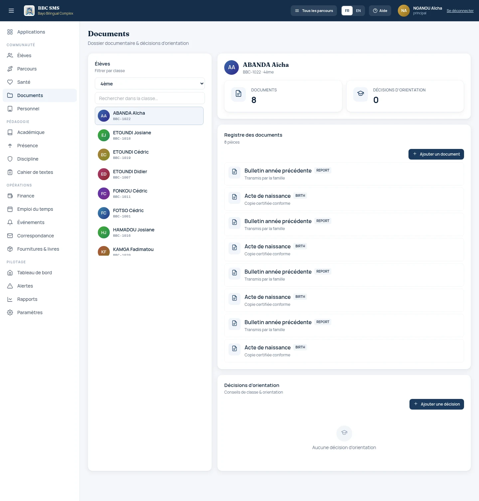
   *Registre des pièces et décisions d'orientation d'un élève.*

2. **Ajouter un document** : **type** (acte de naissance, bulletin, certificat…), **titre**, **référence ou URL** et une note. Si la référence est une adresse web, elle devient un lien cliquable.
3. **Ajouter une décision** d'orientation : année scolaire, étape (« Orientation 3ème »), recommandation, décision et date du conseil.

> **Limite actuelle** — Le module tient un **registre** des pièces : il enregistre leur existence, leur type et une référence (numéro de classeur ou lien). Le téléversement de fichiers dans l'application n'est pas encore disponible — utilisez un lien vers votre espace de stockage.

**Fiche de test — je sais faire**

- [ ] Enregistrer deux pièces au dossier d'un élève.
- [ ] Ajouter une décision d'orientation datée.

## 18 Pilotage — tableau de bord, alertes, rapports

*Les trois écrans de la direction : la journée, les risques, les tendances.*

**Pour qui :** Direction et censeur.

### 18.1 Tableau de bord

Vue du jour, composée uniquement des blocs que vos droits autorisent : effectif et répartition, recettes et dépenses sur 30 jours, présence en direct, retardataires du jour et derniers encaissements.

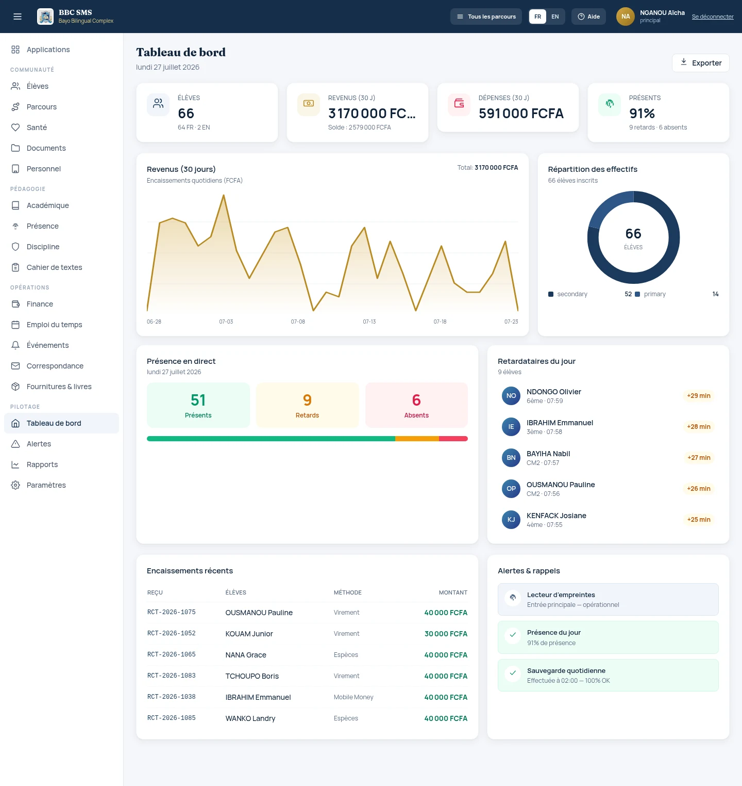
*Tableau de bord : indicateurs, courbe des recettes, répartition des effectifs et présence du jour.*

> **À savoir** — Un compte qui n'a pas accès à Finance ne voit ni la courbe des recettes ni les encaissements : le tableau de bord se recompose automatiquement selon les droits.

### 18.2 Alertes proactives

Le système détecte automatiquement quatre familles de risques : **chute de résultats**, **absences répétées**, **discipline** et **impayés**. Chaque alerte porte une gravité — Critique, À surveiller ou Information.

1. Ouvrez **Alertes**. Les trois compteurs du haut donnent la volumétrie par gravité ; la ligne de filtres permet d'isoler une famille.

   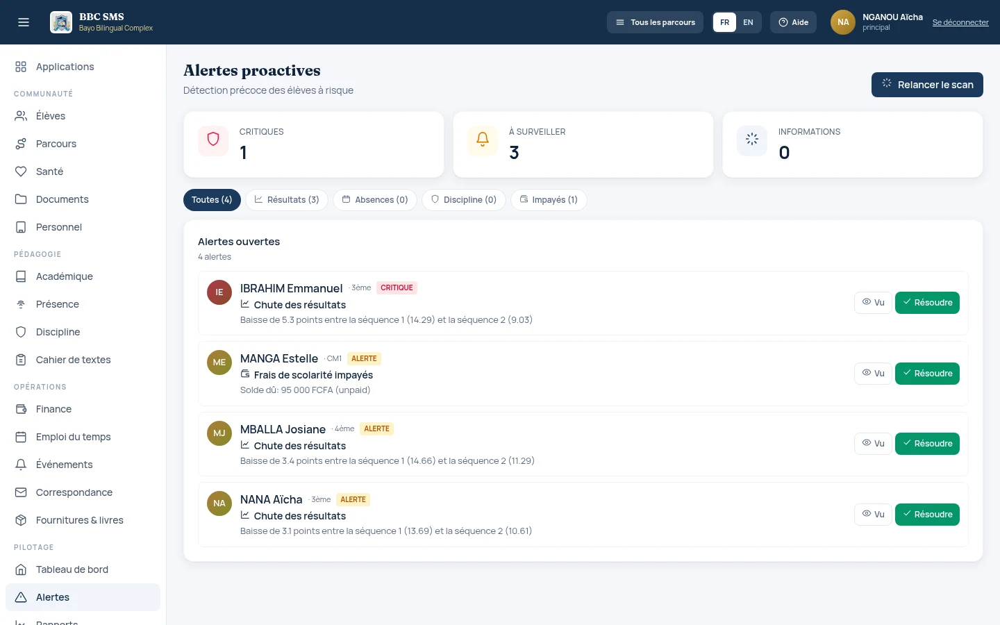
   *File des alertes ouvertes, filtrable par type.*

2. **Relancer le scan** recalcule les alertes à la demande — utile après un import de notes ou une campagne d'encaissement.
3. **Vu** marque l'alerte comme prise en compte (elle reste dans la liste, signalée). **Résoudre** la retire de la file.

### 18.3 Rapports

Analytique école entière, indépendante du parcours : bilan financier, démographie et présence mensuelle.

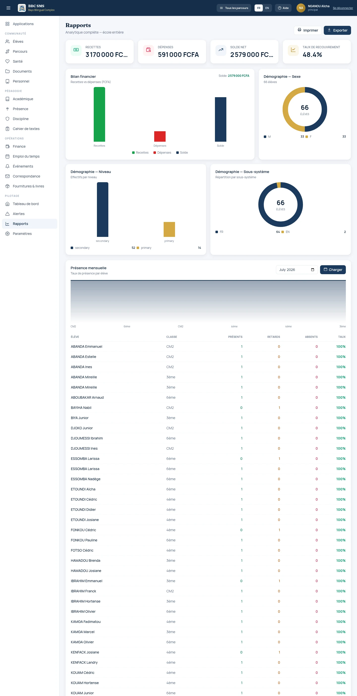
*Rapports : recettes/dépenses/solde, taux de recouvrement, démographie par sexe, niveau et sous-système.*

1. Les quatre indicateurs du haut donnent recettes, dépenses, solde net et **taux de recouvrement** — le même chiffre que l'onglet Débiteurs de Finance.
2. Pour la **présence mensuelle**, choisissez un mois puis cliquez **Charger** : le tableau donne, par élève, le nombre de présences, retards, absences et le taux.
3. **Exporter** produit un CSV et **Imprimer** une version papier de la page.

**Fiche de test — je sais faire**

- [ ] Lire le taux de présence et le solde du jour sur le tableau de bord.
- [ ] Relancer un scan d'alertes et traiter une alerte.
- [ ] Charger la présence mensuelle du mois en cours et l'exporter.

## 19 Portail parent

*Ce que voit une famille — et ce qu'elle ne peut pas voir.*

**Pour qui :** Parents (compte créé depuis la fiche élève, §4.4).

Un compte parent se connecte à la **même adresse** que le personnel, avec le même écran de connexion, mais arrive directement sur son espace : il n'a ni menu latéral, ni choix de parcours, ni accès aux modules du personnel.

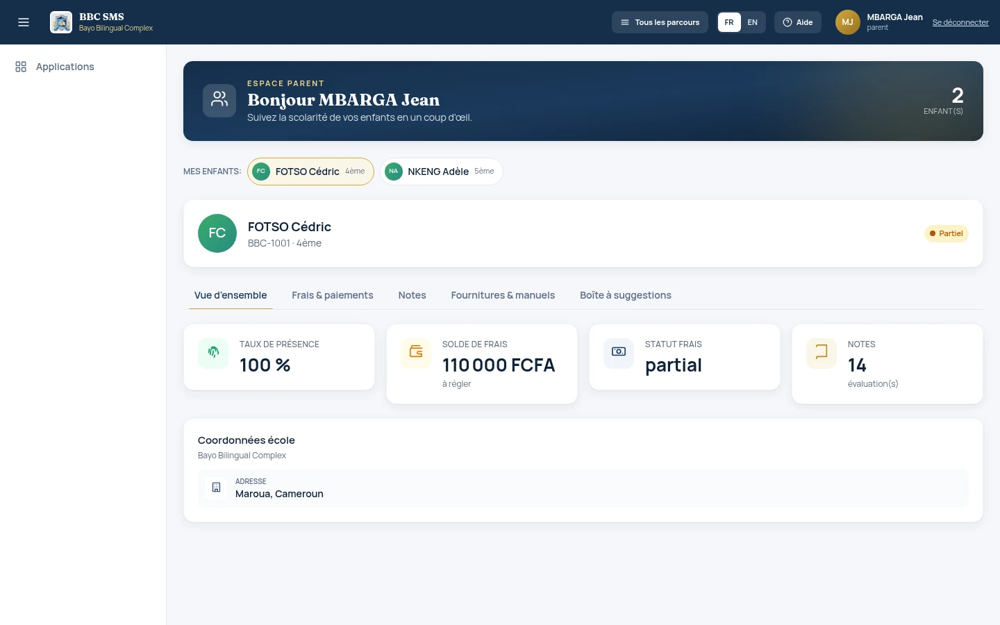
*Accueil du portail : sélecteur d'enfants, taux de présence, solde et coordonnées de l'école.*

**Les cinq onglets**
1. **Vue d'ensemble** — taux de présence, solde de frais avec son statut (à jour, partiel, impayé), nombre d'évaluations et coordonnées de l'établissement.
2. **Frais & paiements** — la **situation de scolarité** de l'enfant selon la grille de sa classe : montant annuel, part déjà réglée, reste à payer, **échéancier tranche par tranche** (réglée, partielle, à venir, en retard), **moyens de paiement** acceptés avec leurs coordonnées, et l'historique des reçus avec leur référence de transaction.

   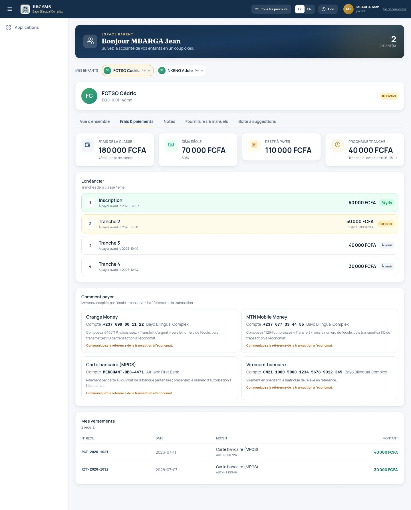
   *Frais & paiements : échéancier de la classe, comment payer, et les reçus déjà émis.*

3. **Notes** — le détail par matière, coefficient et séquence, avec la **moyenne pondérée** calculée exactement comme sur le bulletin officiel.

   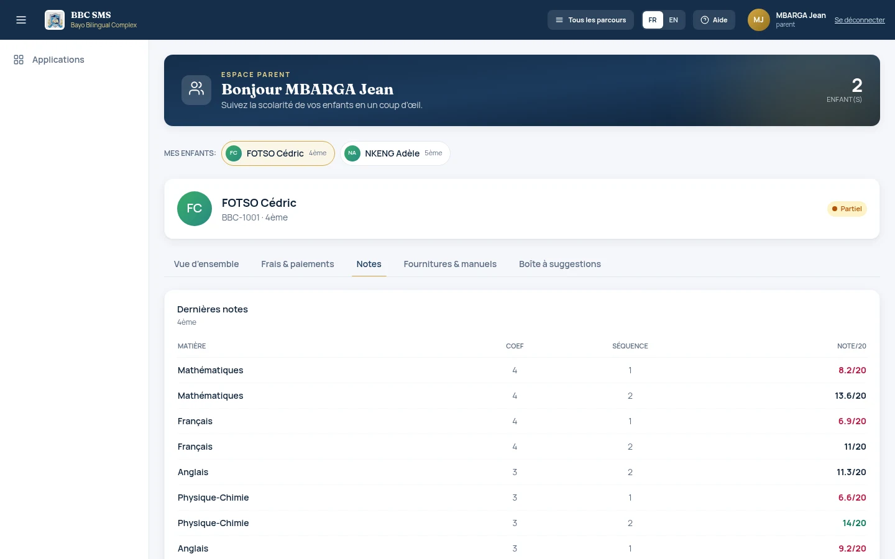
   *Notes de l'enfant sélectionné, avec moyenne pondérée en pied de tableau.*

4. **Fournitures & manuels** — les listes **publiées** par l'école pour la classe de l'enfant (chapitre 14), avec le coût total des manuels.

   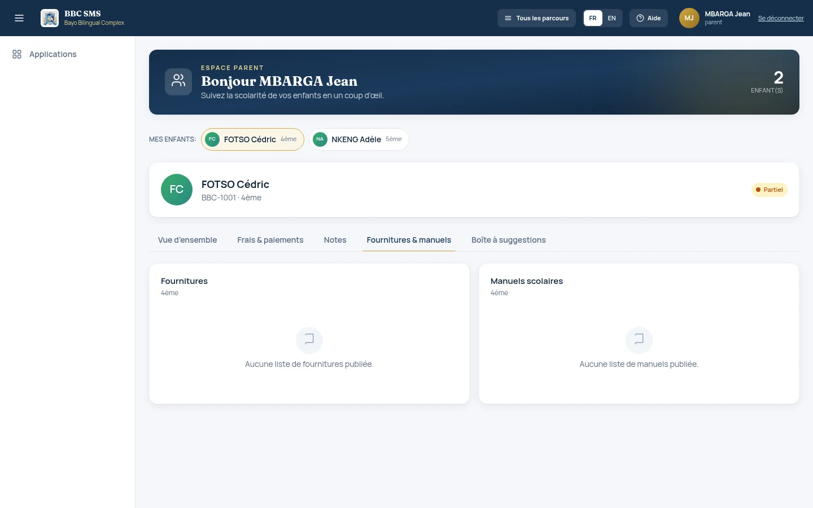
   *Listes de rentrée telles que les voit la famille.*

5. **Boîte à suggestions** — message à l'école, classé en Suggestion, Question, Réclamation ou Remerciement. Le parent suit l'état de chacun de ses messages : en attente de lecture, lu, traité, clôturé.

   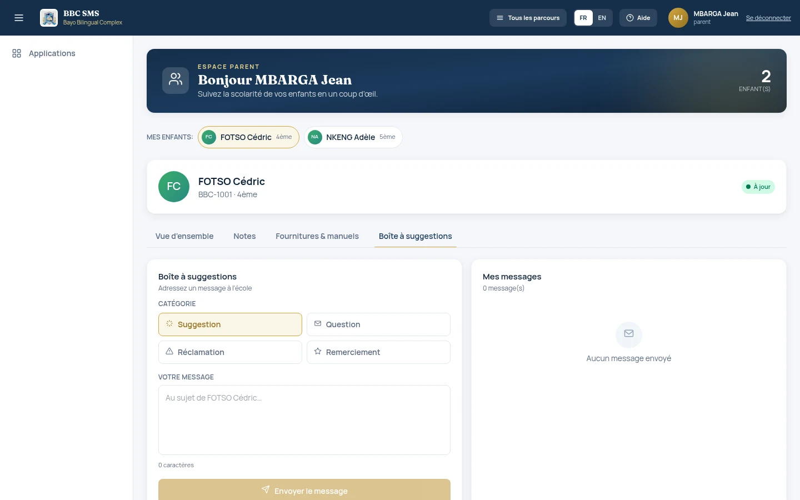
   *Boîte à suggestions : rédaction à gauche, historique et statuts à droite.*

> **À savoir** — Le parent **ne paie pas depuis l'application** : il règle par Orange Money, MTN MoMo, SARA, carte ou virement avec les coordonnées affichées, puis transmet la **référence de transaction** à l'économat, qui enregistre le versement. La situation se met à jour dès l'enregistrement.

> **À savoir** — Quand plusieurs enfants sont rattachés au même compte, une barre de sélection apparaît en haut : changer d'enfant recharge notes, listes et soldes.

> **Attention** — Le cloisonnement est appliqué **par le serveur** : un parent ne peut atteindre que les données de ses propres enfants. Une adresse du personnel saisie à la main renvoie vers son portail. C'est aussi pourquoi le rôle parent ne peut recevoir aucun module du personnel (§2.2).

**Fiche de test — je sais faire**

- [ ] Me connecter avec un compte parent et consulter les notes.
- [ ] Ouvrir **Frais & paiements** et lire l'échéancier de la classe de l'enfant.
- [ ] Retrouver le numéro Orange Money de l'école et les instructions de paiement.
- [ ] Vérifier qu'un versement enregistré par l'économat apparaît dans « Mes versements ».
- [ ] Basculer d'un enfant à l'autre.
- [ ] Vérifier qu'une liste non publiée n'apparaît pas.
- [ ] Envoyer un message depuis la boîte à suggestions.
- [ ] Saisir à la main l'adresse d'un module du personnel et constater le refus.

## 20 Démarrer une nouvelle année

*L'ordre des opérations, de la base vide à la première journée de classe.*

**Pour qui :** Direction et administrateur — comptez une demi-journée à deux.

Chaque étape dépend de la précédente. Suivre cet ordre évite les blocages classiques du type « impossible de créer une classe » ou « bulletin vide ».

1. **Identité et horaires** — **Paramètres → Général** : nom, ville, devise, autorité de tutelle et surtout l'**heure de début des cours** (§3.4).
2. **Calendrier** — saisissez les jours fériés connus (§3.5).
3. **Sections puis classes** — pour chaque parcours : la section d'abord, les classes ensuite (§3.1 et §3.2).
4. **Matières et coefficients** — importez le catalogue standard, ajustez, puis chargez les coefficients par classe (§3.3).
5. **Catalogue discipline** — motifs et sanctions du règlement intérieur (§3.6).
6. **Messagerie** — configurez et testez le SMTP avant toute création de compte (§3.7).
7. **Rôles et permissions** — créez les rôles particuliers de l'établissement puis réglez la matrice (chapitre 2).
8. **Personnel** — import ou portail d'inscription, puis création des comptes de connexion (chapitre 5).
9. **Élèves** — import classe par classe depuis le registre officiel (§4.5).
10. **Comptes parents** — créez-les au fil des inscriptions, en réutilisant le même identifiant pour les fratries (§4.4).
11. **Grille des frais** — avant le premier encaissement (§11.1).
12. **Emploi du temps** — classe par classe, en surveillant les conflits d'enseignant (chapitre 10).
13. **Fournitures et manuels** — préparez les listes, puis publiez-les aux familles (chapitre 14).
14. **Premier jour** — la présence remonte toute seule ; discipline, cahier de textes et correspondance s'utilisent au fil de l'eau.

> **Astuce** — Faites l'essai complet sur **un seul parcours** (par exemple Secondaire FR) avant de dérouler les autres : les erreurs de paramétrage se voient beaucoup plus vite sur un périmètre réduit.

**Fiche de test — je sais faire**

- [ ] Dérouler les 14 étapes sur un parcours de test sans blocage.
- [ ] Vérifier qu'un bulletin de ce parcours affiche bien des notes et un rang.
- [ ] Vérifier qu'un parent ne voit que son enfant.

## 21 Questions fréquentes & dépannage

*Les blocages les plus courants et leur cause réelle.*

| Symptôme | Cause la plus fréquente et solution |
|---|---|
| Un module a disparu de mon menu. | Vos droits ont changé. Vérifiez la matrice (**Paramètres → Permissions**) et **reconnectez-vous** : les droits sont chargés à la connexion. |
| Mes élèves / classes ont disparu. | Vous n'êtes pas dans le bon **parcours**. Cliquez le parcours actif dans la barre supérieure, ou choisissez « Tous les parcours ». |
| Le bouton « Nouvelle classe » est grisé. | Aucune **section** n'existe dans ce parcours. Créez-la d'abord (§3.1). |
| Un élève n'apparaît pas dans une liste de classe. | Il est « Non affecté » : ouvrez sa fiche et choisissez une classe (§4.3). |
| Le bulletin est vide. | Aucune note n'existe pour la séquence choisie, ou la classe n'a pas de matières avec coefficient (§3.3). |
| Le bulletin est verrouillé. | L'élève a un solde impayé. Enregistrez le versement dans Finance (§11.2), puis rouvrez le bulletin. |
| Des retards apparaissent un dimanche ou un jour férié. | Le jour n'est pas déclaré dans le calendrier (§3.5). Les week-ends, eux, sont exclus d'office. |
| Tout le monde est en retard depuis ce matin. | L'**heure de début des cours** a été modifiée dans Paramètres → Général (§3.4). |
| Le SMS au parent n'est pas parti. | Le contact principal n'a pas de numéro. Complétez père / mère / tuteur sur la fiche élève (§4.3). |
| Le nouvel employé n'a pas reçu ses identifiants. | SMTP absent ou mal configuré, ou fiche sans e-mail. Testez l'envoi (§3.7) puis utilisez **Réinitialiser** (§5.3). |
| « Mot de passe oublié » : je ne reçois rien. | Trois causes possibles : aucune adresse sur votre fiche personnel, compte parent (non couvert), ou messagerie hors service. Dans tous les cas **votre mot de passe actuel reste valable** ; l'administrateur réinitialise (§1.2 et §5.3). |
| Les parents ne voient pas la liste de fournitures. | La liste est restée en **brouillon**. Cliquez **Publier** (chapitre 14). |
| Impossible d'accorder un module au rôle parent. | C'est volontaire et non contournable : le rôle parent est limité à son portail (§2.2). |
| « Votre session a expiré ». | Inactivité prolongée ou poste en veille. Reconnectez-vous ; le travail enregistré n'est pas perdu. |
| Un élève n'a pas le bon montant de frais. | Il suit la grille de sa classe si elle existe, sinon celle de son niveau. Vérifiez qu'il est bien affecté à sa classe (§4.3) et regardez la portée des grilles (§11.2). |
| Impossible d'enregistrer un paiement Orange Money. | La référence de transaction est obligatoire pour ce canal, ou le canal a été désactivé dans **Finance → Moyens de paiement** (§11.1). |
| Le parent ne voit pas comment payer. | Le canal n'est pas coché « Visible des parents », ou ses coordonnées sont vides (§11.1). |
| Le taux de recouvrement semble faux. | Il rapporte l'encaissé à l'attendu **de toute l'école**, d'après la grille des frais. Vérifiez que chaque niveau a bien sa grille (§11.1). |

## 22 Annexes

*Glossaire, comptes de démonstration et mise à jour du guide.*

### 22.1 Glossaire

| Terme | Définition |
|---|---|
| Parcours | Niveau (Maternelle / Primaire / Secondaire) × sous-système (Francophone / Anglophone). Filtre global des données. |
| Section | Regroupement de classes d'un même parcours, ex. « Primaire francophone ». |
| Séquence | Période d'évaluation (1 à 6) sur laquelle porte un bulletin. |
| PV | Procès-verbal : classement d'une classe par moyenne pour une séquence. |
| APC | Approche par compétences — format de bulletin de la maternelle et du primaire. |
| Tranche | Fraction du montant annuel des frais, avec son libellé et son échéance. |
| Canal de paiement | Moyen accepté par l'école : espèces, Orange Money (OM), MTN Mobile Money (MOMO), SARA, carte bancaire (MPGS), virement. |
| Référence de transaction | Identifiant fourni par l'opérateur (ID Orange Money, ID MoMo, n° d'autorisation MPGS) : la preuve du versement. |
| Matricule | Identifiant interne de l'élève, attribué par le système. |
| NIU | Identifiant unique national, saisi depuis le registre officiel. |
| Contact principal | Responsable retenu pour les SMS : père, sinon mère, sinon tuteur. |
| Permanent / Vacataire | Employé au salaire mensuel / payé au taux horaire. |

### 22.2 Comptes de démonstration

La pile de démonstration (`make demo`) contient un jeu de données complet et trois comptes, tous avec le mot de passe `password`. Les captures de ce guide en sont issues.

| Identifiant | Rôle | Sert à illustrer |
|---|---|---|
| `principal` | Direction | Tous les modules, écriture — sauf Finance en lecture. |
| `econome` | Économe | Finance en écriture : encaissements, dépenses, grille des frais. |
| `parent1` | Parent | Le portail parent et son cloisonnement. |

> **Attention** — Ces comptes n'existent **que** dans le profil de démonstration. Une installation de production démarre avec le seul administrateur défini dans le fichier `.env`.

### 22.3 Support d'atelier

Un **support projetable** accompagne ce guide pour les séances de formation : `/guide/atelier.html`. Il déroule la journée module par module — objectif, démonstration animateur, exercice participants, critères de réussite et pièges fréquents. Flèches ← → pour naviguer, **S** pour le sommaire, **P** pour imprimer (une diapositive par page).

### 22.4 Mettre le guide à jour

Le guide est **généré**, il ne s'édite pas à la main. Tout vit dans `tools/guide/` :

- `content.py` et `chapters_*.py` — le texte bilingue et l'enchaînement des procédures.
- `capture.js` — la campagne de captures d'écran, rejouée sur la pile de démonstration.
- `seed-demo.py` — le jeu de données de documentation (élèves, notes, paiements…).
- `build.py` — produit `frontend/public/guide/index.html` et `GUIDE_UTILISATEUR.md`.
- `atelier.py` et `build-atelier.py` — le support d'atelier projetable.
- Le mode d'emploi complet est dans `tools/guide/README.md`.

