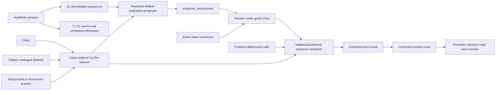

# Implementation handoff: class-scoped evaluations and computed result milestones

## 1. Handoff metadata

- Prepared: 2026-08-10
- Repository worktree: `C:\Users\joe tech\.codex\worktrees\4f3d\bbcomplex`
- Branch: `codex/report-card-fidelity`
- Safe baseline before this planning work: `c427e3f Add production simulation database tooling`
- Previous report-card implementation baseline: `b333542 Implement secondary report-card fidelity workflow`
- Intended implementer: a fresh coding agent working in this same branch/worktree

This document is an implementation specification, not a description of the current behavior. Items labelled **Current gap** describe behavior that must be replaced.

## 2. Outcome to deliver

An administrator must be able to select an academic session, a class, and either one sequence or all six sequences, then prepare a friendly review screen containing exactly one default evaluation for every subject assigned to that class.

For example, after selecting `6ème A` and `Séquence 1`, the administrator sees one editable row for Mathematics, one for French, one for History, and so on—but only if those subjects are in `6ème A`'s session curriculum. Every row exposes the proposed evaluation code and name. Nothing is created until the administrator confirms the reviewed list.

The generated evaluations must feed the existing manual grade-entry roster and the report-card calculation. A trimester must never accept its own evaluations or marks: `T1` is calculated from `S1 + S2`, `T2` from `S3 + S4`, `T3` from `S5 + S6`, and the annual result from `T1 + T2 + T3`.

## 3. Non-negotiable domain decisions

1. `academic_curriculum_subject` is the source of truth for the subjects taught in a class during a session.
2. The coefficient printed on the report card comes from the class-subject curriculum relationship, not the default coefficient on `subject`.
3. Only `SEQUENCE` periods can own evaluations and raw marks.
4. `TERM_RESULT` and `ANNUAL_RESULT` records remain in the database because they provide dependency, snapshot, validation, publication, audit, and document identities. They are computed milestones, not grading periods.
5. A default template means one evaluation per assigned subject per selected sequence. Administrators may add more evaluations later, but default generation must not create duplicates.
6. The class subsystem determines academic content language:
   - `FR` class -> French evaluation names/model locale.
   - `EN` class -> English evaluation names/model locale.
   - The current interface language must not change this rule.
   - There must be no editable “model language” selector in the normal evaluation workflow.
7. `mandatory` does **not** mean that the student must pass that subject to be promoted. It means that a valid mark/status is required before the teacher can submit that subject's sequence sheet.
8. Promotion is based on the configured final/annual average rule and any explicit promotion rules. A subject's `pass_threshold` may drive an appreciation such as acquired/not acquired, but must not silently become an independent promotion gate.
9. Default generation is preview-first and non-destructive. Existing evaluations are shown and kept; they are never silently overwritten.
10. All database changes must be Flyway migrations. Do not add, remove, or alter production columns manually.
11. Never show a raw fingerprint, UUID, SQL constraint, or stack trace as the primary user message. Technical identifiers may be logged and optionally exposed under a collapsed support-details section.

## 4. Current implementation findings

### 4.1 Current live screen

The current path is:

`Paramètres` -> `Scolarité` -> `Compétences secondaire`

The live screen currently asks for:

- Session
- Période
- Classe secondaire
- Matière
- Langue du modèle

It then creates one subject/model at a time and offers CSV mark import.

### 4.2 Current gaps to correct

- The period selector includes `S1` through `S6`, `T1_RESULT` through `T3_RESULT`, and `ANNUAL` as if all were independently gradable.
- The subject selector is based on the global subject catalog and subsystem compatibility. It is not based on the selected class curriculum.
- An administrator can choose a locale that conflicts with the class subsystem.
- The setup flow is subject-by-subject and does not provide a whole-class review.
- Secondary marks use `secondary_competency_model` / `secondary_competency_mark`, while the normal `Académique -> Saisie des notes` roster uses `academic_assessment` / `academic_grade`.
- `BulletinSnapshotService` currently ignores canonical `academic_grade` evidence for secondary classes and requires a published secondary competency model.
- `SessionAcademicService.createAssessment` verifies that the class and subject exist globally, but not that the subject is assigned to that class/session.
- Assessment creation and grade updates do not consistently reject computed result periods.
- Session readiness currently expects teacher-submission windows on all period types, including computed results.
- The current “Langue du modèle” and “Obligatoire” labels do not explain their actual domain meaning.

### 4.3 Existing pieces to reuse

- `SetupApi.curriculum(sessionId, classId)` already returns the assigned curriculum, including subject code/label, display order, coefficient, maximum score, mandatory flag, pass threshold, remark requirement, and responsible teacher.
- `GradeEntryService` already uses class curriculum to expose available subjects for grade entry.
- `academic_assessment` already supports class- and subject-scoped definitions with code, label, max score, weight, mandatory, and display order.
- `academic_grade` already supports scored, missing, absent, and exempt values.
- The standard session structure already stores six sequence periods, three term-result milestones, one annual-result milestone, and dependency weights.
- `BulletinSnapshotService` already calculates term results from frozen sequence snapshots and annual results from frozen term snapshots.
- Attendance is already aggregated by reporting-period date range and included in report-card inputs/snapshots.

## 5. Target domain model and data flow



### 5.1 Standard dependency graph

| Result product | Required source products | Default formula | Raw marks allowed? |
|---|---|---:|---|
| Sequence 1 | Evaluations in S1 | Weighted evaluation average | Yes |
| Sequence 2 | Evaluations in S2 | Weighted evaluation average | Yes |
| Trimestre 1 | S1 and S2 | `(S1 × 0.5) + (S2 × 0.5)` | No |
| Sequence 3 | Evaluations in S3 | Weighted evaluation average | Yes |
| Sequence 4 | Evaluations in S4 | Weighted evaluation average | Yes |
| Trimestre 2 | S3 and S4 | `(S3 × 0.5) + (S4 × 0.5)` | No |
| Sequence 5 | Evaluations in S5 | Weighted evaluation average | Yes |
| Sequence 6 | Evaluations in S6 | Weighted evaluation average | Yes |
| Trimestre 3 | S5 and S6 | `(S5 × 0.5) + (S6 × 0.5)` | No |
| Annual | T1, T2, and T3 | `(T1 + T2 + T3) / 3` | No |

The weights must still come from `academic_reporting_period_dependency`; the calculation engine must not hard-code the period codes. The table above is the standard structure generated by the session wizard.

### 5.2 End-of-year output policy

The school must be able to choose which final parent-facing products are published:

- `TRIMESTER_3_ONLY`
- `ANNUAL_ONLY`
- `TRIMESTER_3_AND_ANNUAL` (recommended default)

This policy controls publication actions and batch-document choices. It must not prevent the annual result from being calculated internally when promotion rules need it.

## 6. Exact administrator flow: prerequisites

The new flow must guide the administrator to prerequisites instead of returning generic conflicts.

### 6.1 Verify the session and periods

1. Open `Paramètres`.
2. Open the top tab `Années & périodes`.
3. Select the intended session, for example `2026-2027`.
4. In `Périodes et fenêtres de publication`, verify the standard structure.
5. The screen must visually separate:
   - `Séquences avec saisie de notes`: S1, S2, S3, S4, S5, S6.
   - `Résultats calculés`: T1, T2, T3, Annuel.
6. Verify the dependency summary shown under every computed result.
7. Configure grade-entry and teacher-submission windows only for S1-S6.
8. Configure review, validation, publication, and correction windows for computed results.
9. Select the end-of-year publication policy.
10. Open the session only after readiness has no true blockers.

### 6.2 Verify subjects assigned to the class

1. Open `Paramètres`.
2. Open `Scolarité`.
3. Open `Matières par classe`.
4. Select the same academic session.
5. Select the class, for example `6ème A`.
6. Verify every subject that should appear on grade sheets and report cards.
7. For each row, verify:
   - order on the report card;
   - class-specific coefficient;
   - maximum score;
   - whether a mark is required to submit;
   - acquisition/pass threshold;
   - whether a subject remark is required;
   - responsible teacher for secondary, or homeroom teacher for primary.
8. The UI copy must say `Note requise pour clôturer la saisie`, not merely `Obligatoire` or `Required`.
9. The pass-threshold help text must say that it affects subject appreciation and does not independently decide promotion.

## 7. Exact administrator flow: generate defaults for one sequence

### 7.1 Entry screen

Replace the `Compétences secondaire` subtab with a subtab named `Évaluations` (`Assessments` in English). Keep any old route or tab identifier as a compatibility alias so bookmarks do not break.

At the top, show a short explanation:

> Une évaluation définit une colonne de notes. Le modèle par défaut prépare une évaluation par matière affectée à la classe, uniquement pour les séquences. Les trimestres et le résultat annuel sont calculés automatiquement.

Render the context controls in this order:

1. `Session scolaire *`
2. `Classe *`
3. read-only badge `Parcours francophone` or `Parcours anglophone`
4. segmented mode control:
   - `Une séquence`
   - `Toutes les séquences`
5. `Séquence *` when `Une séquence` is selected

Only `SEQUENCE` periods belonging to the selected session appear in the sequence selector. Sort by `displayOrder`, not by label.

The primary call to action is:

`Préparer les évaluations par défaut`

This button performs a server preview only. It must not write records.

### 7.2 Empty curriculum state

If the class has no assigned subjects, do not show an empty dropdown. Show a full-width state:

> Aucune matière n'est affectée à 6ème A pour la session 2026-2027. Affectez d'abord les matières, leurs coefficients et les enseignants.

Actions:

- `Configurer les matières de cette classe` -> open `Paramètres -> Scolarité -> Matières par classe` with session and class preserved in query/state.
- `Choisir une autre classe` -> focus the class field.

### 7.3 Friendly review screen

For `6ème A + S1`, show a single review workspace with this header:

`6ème A · Séquence 1 · 12 matières affectées`

Below it, show the source rule:

`Une évaluation proposée par matière. Coefficients et enseignants proviennent de Matières par classe.`

Desktop columns:

| Field | Behavior |
|---|---|
| Include | Checked for every missing evaluation; disabled and labelled `Déjà configurée` for an existing one |
| Matière | Read-only code and localized name from the class curriculum |
| Enseignant | Read-only responsible/homeroom teacher; warning link if missing |
| Code de l'évaluation | Editable, always visibly bordered, required |
| Nom de l'évaluation | Editable, always visibly bordered, required |
| Barème | Editable positive number; defaults from curriculum `maxScore` |
| Poids | Editable positive number; defaults to `1` |
| Note requise pour clôturer | Clear checkbox/switch with explanatory tooltip |
| État | `À créer`, `Déjà configurée`, `À compléter`, or `Conflit` |

On a narrow screen, render one card per subject with the same fields; do not force horizontal scrolling for primary actions.

Example proposal:

| Matière | Code | Nom | Barème | Poids | État |
|---|---|---|---:|---:|---|
| `MATH` · Mathématiques | `S1-MATH-E1` | `Évaluation de la séquence 1 – Mathématiques` | 20 | 1 | À créer |
| `FR` · Français | `S1-FR-E1` | `Évaluation de la séquence 1 – Français` | 20 | 1 | À créer |
| `HIST` · Histoire | `S1-HIST-E1` | `Évaluation de la séquence 1 – Histoire` | 20 | 1 | À créer |

For an anglophone class, generate names such as `Sequence 1 assessment – Mathematics`. A shared subject (`subject.subsystem = null`) uses the class language, not both languages.

### 7.4 Existing evaluations

The preview must query current class/subject/sequence assessments before proposing rows.

- If no assessment exists for a subject, propose one row marked `À créer`.
- If one or more assessments already exist, show the existing rows beneath that subject and mark the default proposal `Déjà configurée`; do not select a new duplicate.
- Never overwrite a manually created code/name/max score/weight.
- Provide `Modifier` for an existing definition only when there are no grades and no frozen snapshots depending on it.
- If grades exist, explain: `Cette évaluation contient déjà des notes. Créez une nouvelle évaluation ou ouvrez une fenêtre de correction; sa définition ne peut pas être réécrite silencieusement.`
- A separate `Ajouter une autre évaluation` action may add E2, E3, and so on for a subject. That is outside the default-generation count.

### 7.5 Review validation and confirmation

Validate each row both on blur and when the administrator clicks the final action.

- Missing code: red border and `Le code de l'évaluation est obligatoire.`
- Duplicate code in the same class/subject/sequence: red border and `Ce code est déjà utilisé pour cette matière et cette séquence.`
- Missing name: red border and `Le nom de l'évaluation est obligatoire.`
- Invalid maximum: red border and `Le barème doit être supérieur à 0.`
- Invalid weight: red border and `Le poids doit être supérieur à 0.`
- Name over 160 characters or code over 40 characters: show the allowed length beside the field.

On submit, scroll and focus the first invalid field. Also show a summary banner such as `3 champs doivent être corrigés`; the banner must not replace field-level messages.

Sticky footer:

- `12 à créer`
- `0 déjà configurée`
- `1 avertissement enseignant` when applicable
- secondary button `Retour`
- primary button `Créer les 12 évaluations`

The final click opens an application modal, not a browser `confirm()`/`prompt()`:

> Créer 12 évaluations pour 6ème A – Séquence 1 ? Cette action ajoutera une colonne de notes par matière. Elle ne créera aucune note et ne modifiera aucune évaluation existante.

Buttons:

- `Annuler — ne rien créer`
- `Créer les 12 évaluations`

A reason is not required for this additive operation. Actor, time, class, session, period, and created IDs are audited automatically.

### 7.6 Completion screen

Show a human-readable result:

> 12 évaluations créées pour 6ème A – Séquence 1. 0 existante ignorée. Les enseignants peuvent maintenant saisir les notes lorsque la fenêtre S1 est ouverte.

Actions:

- `Aller à la saisie des notes` -> `/academic`, tab `Saisie des notes`, with class and S1 preselected.
- `Configurer une autre séquence`
- `Voir les évaluations créées`

Do not display the preview fingerprint. If support information is needed, put the generation batch reference in a collapsed `Détails techniques` section.

## 8. Exact administrator flow: generate defaults for all sequences

1. Select session and class.
2. Select `Toutes les séquences`.
3. Click `Préparer les évaluations par défaut`.
4. The server includes only S1-S6 `SEQUENCE` periods; T1/T2/T3/ANNUAL are never proposals.
5. Show a top summary such as `12 matières × 6 séquences = 72 évaluations possibles`.
6. Group rows in six accessible accordions, S1 through S6.
7. Start with the first accordion expanded and show a per-sequence status chip:
   - `12 à créer`
   - `Complet`
   - `3 existantes · 9 à créer`
   - `Action requise`
8. Allow code/name edits per row.
9. Provide an explicit `Appliquer ce nom aux autres séquences` helper when a user edits a naming pattern, but never propagate silently.
10. The sticky footer shows aggregate created/existing/invalid counts.
11. Confirmation names every affected sequence and states that computed trimester/annual results receive no evaluations.
12. Apply the whole batch transactionally. If one selected row is invalid at the server, create none and return row-specific errors.
13. A repeated request with the same request ID returns the original result; it must not create duplicates.

Subject active dates must be respected. A subject is proposed for a sequence only when its `active_from`/`active_to` range overlaps that sequence's date range. Show excluded subjects under `Non applicable à cette séquence` with the date reason.

## 9. Teacher flow after generation

1. Open `Académique` from the main navigation.
2. Open `Saisie des notes`.
3. Select the class.
4. Select a sequence; the selector must contain S1-S6 only.
5. Select a subject. The list must contain only curriculum subjects the user is authorized to teach for the selected class/session.
6. The roster shows all actively enrolled students and the generated evaluation column.
7. For one default evaluation, the column heading uses the subject name and shows `/ 20` (or the configured maximum).
8. Enter a mark or choose `Absent` / `Exempté` for every required row.
9. Enter a subject remark when the class-subject relationship requires it.
10. Save a draft.
11. Submit to management only when all required cells are scored, absent, or exempt and required remarks exist.
12. Management accepts or returns the sheet with a clear reason.

The responsible teacher shown in this flow comes from the class-subject relationship. Evaluation generation must not offer another teacher selector.

## 10. Result and report-card flow from S1 through annual

### 10.1 Sequence 1

1. Complete and accept grade sheets for every S1 subject.
2. Finalize attendance calls within S1's dates.
3. Open `Académique -> Assiduité & conseil` for S1 and review automatically aggregated attendance.
4. Add only justified corrections or council/conduct data; submit and approve them.
5. Open `Académique -> Bulletin`.
6. Select class, S1, and student, or use batch generation.
7. Preview the sequence result. Every subject shows its S1 result and the class-specific coefficient.
8. Resolve blockers, validate, then optionally publish the S1 report to parents.

### 10.2 Sequence 2 and Trimestre 1

1. Repeat grade entry and sequence validation for S2.
2. Select `Résultat Trimestre 1` in the Bulletin tab—not in grade entry.
3. The screen shows read-only dependency status for S1 and S2.
4. T1 may use the latest validated or published frozen S1/S2 snapshots, matching the current calculation policy.
5. Each subject line displays S1, S2, and the calculated T1 average.
6. No input field exists for a T1 mark.
7. Validate and publish T1 after blockers are resolved.

### 10.3 Trimestre 2

- S3 is entered and may produce a sequence report.
- S4 is entered and may produce a sequence report.
- T2 is computed from the frozen S3 and S4 results.
- T2 has no assessment setup or mark-entry screen.

### 10.4 Trimestre 3 and annual

- S5 is entered and may produce a sequence report.
- S6 is entered and may produce a sequence report.
- T3 is computed from frozen S5 and S6 results.
- Annual is computed from **published** T1, T2, and T3 snapshots under the current stricter annual policy.
- Depending on the end-of-year publication policy, staff can publish T3, Annual, or both.
- Promotion consumes the configured final result and applies its own automatic threshold plus explicit manual override workflow; subject “required” flags do not make promotion decisions.

### 10.5 Result-screen UX

In `Académique -> Bulletin`, separate the milestone selector into optgroups:

- `Résultats de séquence`: S1-S6
- `Résultats calculés`: T1, T2, T3, Annuel

When a computed result is selected, show a dependency panel before the student result:

| Dependency | Expected state | Current state | Action |
|---|---|---|---|
| S1 | Validated or published | Published | View snapshot |
| S2 | Validated or published | Missing | Complete S2 |

Translate backend blockers into actions. Do not show only `FROZEN_SNAPSHOT_REQUIRED`.

## 11. Attendance interaction

Evaluation generation does not create attendance data. Attendance and grades meet only when the report snapshot is calculated.

- `Présence` remains the operational daily/hourly roster.
- Attendance sessions and marks must be finalized within the selected reporting period's start/end dates.
- `ReportCardInputService` aggregates finalized attendance records by those dates.
- `Académique -> Assiduité & conseil` shows the aggregate and supports audited adjustments.
- Sequence snapshots freeze attendance evidence with grades and conduct.
- Term/annual snapshots aggregate through their configured date ranges/dependencies; the implementer must add regression tests to prevent double-counting.
- If required attendance calls are incomplete, the report shows an actionable blocker with a link to `Présence` filtered to class/date range.

## 12. Backend API design

### 12.1 Preview endpoint

Add:

`POST /api/academic/assessment-defaults/preview`

Request:

```json
{
  "academicSessionId": "uuid",
  "classId": "uuid",
  "mode": "ONE_SEQUENCE",
  "reportingPeriodId": "uuid"
}
```

For all sequences:

```json
{
  "academicSessionId": "uuid",
  "classId": "uuid",
  "mode": "ALL_SEQUENCES"
}
```

Response shape:

```json
{
  "academicSessionId": "uuid",
  "sessionLabel": "2026-2027",
  "classId": "uuid",
  "className": "6ème A",
  "subsystem": "FR",
  "locale": "fr",
  "scopeFingerprint": "server-internal-value",
  "summary": {
    "subjectCount": 12,
    "sequenceCount": 1,
    "createCount": 12,
    "existingCount": 0,
    "warningCount": 1
  },
  "periods": [
    {
      "reportingPeriodId": "uuid",
      "code": "S1",
      "label": "Séquence 1",
      "periodType": "SEQUENCE",
      "rows": [
        {
          "clientRowId": "stable-preview-row-id",
          "subjectId": "uuid",
          "subjectCode": "MATH",
          "subjectLabel": "Mathématiques",
          "curriculumVersion": 2,
          "curriculumDisplayOrder": 1,
          "coefficient": 5,
          "teacher": {
            "employeeId": "uuid",
            "name": "Mme N.",
            "role": "RESPONSIBLE"
          },
          "proposed": {
            "code": "S1-MATH-E1",
            "label": "Évaluation de la séquence 1 – Mathématiques",
            "maxScore": 20,
            "weight": 1,
            "mandatory": true,
            "displayOrder": 1
          },
          "existingAssessments": [],
          "action": "CREATE",
          "warnings": []
        }
      ]
    }
  ]
}
```

The browser client stores `scopeFingerprint` but does not render it. Compute it from canonical, sorted source state: tenant, session/version, class, selected period IDs/versions, applicable curriculum row IDs/versions/active dates, teacher-assignment versions, and existing assessment IDs/versions.

### 12.2 Apply endpoint

Add:

`POST /api/academic/assessment-defaults/apply`

Require an `Idempotency-Key` header generated once when the review screen opens.

Request:

```json
{
  "academicSessionId": "uuid",
  "classId": "uuid",
  "mode": "ONE_SEQUENCE",
  "scopeFingerprint": "value-returned-by-preview",
  "rows": [
    {
      "clientRowId": "stable-preview-row-id",
      "reportingPeriodId": "uuid",
      "subjectId": "uuid",
      "include": true,
      "code": "S1-MATH-E1",
      "label": "Évaluation de la séquence 1 – Mathématiques",
      "maxScore": 20,
      "weight": 1,
      "mandatory": true,
      "displayOrder": 1
    }
  ]
}
```

Response:

```json
{
  "batchId": "uuid",
  "classId": "uuid",
  "createdCount": 12,
  "existingCount": 0,
  "skippedCount": 0,
  "createdAssessmentIds": ["uuid"],
  "messages": []
}
```

Apply rules:

1. Recompute the source fingerprint inside the transaction.
2. Return HTTP 409 `ASSESSMENT_PREVIEW_STALE` if curriculum, periods, teacher assignment, or existing evaluation state changed.
3. Return a friendly message telling the client to refresh the preview; do not leak the fingerprints.
4. Validate every included row before inserting any row.
5. Recheck all tenant/session/class/period/subject relationships.
6. Insert all rows in one transaction.
7. Use database uniqueness as the final race-condition guard.
8. Convert any constraint race into a row-specific `ASSESSMENT_CODE_ALREADY_EXISTS` response.
9. Store and return the first result for repeated idempotency keys.
10. Never update an existing assessment from this endpoint.

### 12.3 Supporting endpoints

Add or complete:

- `PUT /api/academic/assessments/{id}` with optimistic version checking.
- `DELETE /api/academic/assessments/{id}` only when no grades, packets, or frozen snapshots reference it.
- `GET /api/academic/assessment-setup?academicSessionId=&classId=&reportingPeriodId=` if the preview endpoint alone does not provide enough data for the existing-evaluations panel.

Keep the existing single-assessment POST for compatibility, but route it through the same domain validator.

### 12.4 Required error codes

| HTTP | Code | User-facing meaning |
|---:|---|---|
| 400 | `ASSESSMENT_SEQUENCE_ONLY` | Evaluations can only be configured for S1-S6 |
| 400 | `ASSESSMENT_CODE_REQUIRED` | Evaluation code missing |
| 400 | `ASSESSMENT_LABEL_REQUIRED` | Evaluation name missing |
| 400 | `ASSESSMENT_MAX_SCORE_INVALID` | Maximum score must be positive |
| 400 | `ASSESSMENT_WEIGHT_INVALID` | Weight must be positive |
| 404 | `ACADEMIC_SESSION_NOT_FOUND` | Session not in this school |
| 404 | `CLASS_NOT_FOUND` | Class not in this school |
| 404 | `REPORTING_PERIOD_NOT_FOUND` | Period not in the session/school |
| 409 | `CLASS_CURRICULUM_EMPTY` | No subjects assigned; provide navigation action |
| 409 | `SUBJECT_NOT_ASSIGNED_TO_CLASS` | Subject exists globally but is not in this class curriculum |
| 409 | `ASSESSMENT_CODE_ALREADY_EXISTS` | Duplicate within period/class/subject |
| 409 | `ASSESSMENT_PREVIEW_STALE` | Setup changed after preview; refresh |
| 409 | `ASSESSMENT_HAS_GRADES` | Existing definition cannot be destructively edited |
| 422 | `ROW_VALIDATION_FAILED` | Return `fieldErrors` keyed by `clientRowId` and field |

## 13. Backend implementation details

### 13.1 New application service

Create `backend/src/main/java/com/bbc/sms/academic/AssessmentDefaultsService.java`.

Responsibilities:

1. Resolve the tenant from `TenantContext`; never accept `schoolId` from the browser.
2. Load session and verify class belongs to the tenant.
3. Load one sequence or all sequence periods from that session.
4. Load class curriculum from the same source/query used by `SetupService.curriculum`.
5. Filter curriculum by active-date overlap with each sequence.
6. Load current responsible/homeroom teacher as display/readiness information.
7. Load existing scoped assessments in one query, not one query per subject.
8. Build deterministic proposals.
9. Build a stable scope fingerprint.
10. Validate edited apply rows against the current source state.
11. Insert in a transaction and write the generation batch/audit event.

Do not copy curriculum-selection logic into multiple services. Extract a read-only `CurriculumQueryService` or repository projection used by `SetupService`, `GradeEntryService`, `AssessmentDefaultsService`, timetable checks, and report calculation.

### 13.2 Shared period guard

Create one reusable guard, for example:

`AcademicPeriodRules.assertRawGradePeriod(AcademicReportingPeriod period)`

It must throw `ASSESSMENT_SEQUENCE_ONLY` unless `periodType == SEQUENCE`.

Use it in:

- assessment preview/apply;
- `SessionAcademicService.createAssessment`;
- `SessionAcademicService.upsertGrade`;
- `SessionAcademicService.upsertComment` where subject remarks are sequence-owned;
- `GradeEntryService.view/save/submit/review`;
- `SecondaryCompetencyService` compatibility methods;
- any CSV import endpoint that creates raw marks.

This backend enforcement is mandatory even after frontend filtering.

### 13.3 Subject/class/session guard

Every assessment definition must satisfy:

- period belongs to session;
- class belongs to tenant;
- curriculum row exists for tenant/session/class/subject;
- subject subsystem is either null/shared or equals the class subsystem;
- curriculum active dates overlap the period;
- subject code stored in `academic_assessment` is the code of that curriculum subject, normalized once.

Do not merely call `SubjectRepository.findBySchoolIdAndCode`.

### 13.4 Default naming algorithm

Recommended code:

`{PERIOD_CODE}-{SANITIZED_SUBJECT_CODE}-E1`

Rules:

- uppercase;
- ASCII letters, digits, and hyphens only;
- collapse repeated separators;
- maximum 40 characters;
- if truncation could collide, append a stable six-character hash of the full period/subject identity;
- compute E2/E3 by looking at existing codes only when the administrator explicitly adds another evaluation.

Recommended labels:

- FR: `Évaluation de la séquence 1 – Mathématiques`
- EN: `Sequence 1 assessment – Mathematics`

Store `assessmentType = SEQUENCE_EVALUATION`, `weight = 1`, and `displayOrder = 1` for the first default. `maxScore` and `mandatory` come from the curriculum row.

### 13.5 Required-flag semantics

Keep `academic_assessment.mandatory`, but expose it as `markRequiredForSubmission` in new DTOs so the API is self-explanatory. Map it to the existing column internally.

- Mandatory + `MISSING` blocks teacher submission.
- `ABSENT` and `EXEMPT` satisfy completeness but calculate according to the existing calculation policy.
- This flag never participates directly in promotion.
- `academic_curriculum_subject.pass_threshold` is separate and must not be copied into promotion rules.

### 13.6 Transaction and concurrency

- Use one `@Transactional` apply method.
- Lock the relevant period/class curriculum scope or rely on version fingerprint plus unique constraints; still convert races to domain errors.
- Validate all rows before the first insert.
- Persist an idempotency/generation-batch record before returning.
- Audit actor, tenant, session, class, period list, counts, and created IDs.
- Do not audit or log student marks because this operation creates definitions only.

## 14. Resolve the secondary dual-write architecture

### 14.1 Chosen target

Use one canonical operational path for every educational level:

- Evaluation definitions: `academic_assessment`
- Manual roster marks: `academic_grade`
- Subject remarks: `subject_result_comment`
- Sequence calculation evidence: canonical assessments/grades

The V76 secondary competency tables become a compatibility source for already-entered data and already-issued snapshots, not a second live mark-entry system.

This is necessary because generating a pretty secondary model while `Académique -> Saisie des notes` writes another table would leave teachers and bulletins looking at different grades.

### 14.2 Compatibility migration

Create the next Flyway migration, expected name:

`backend/src/main/resources/db/migration/V77__unify_sequence_evaluations.sql`

The implementer must first verify that V77 is still the next unused migration number.

Recommended additive schema:

- `academic_assessment.source` with values `MANUAL`, `DEFAULT_TEMPLATE`, `LEGACY_SECONDARY`.
- `academic_assessment.generation_batch_id` nullable FK.
- `academic_assessment.legacy_secondary_competency_id` nullable unique UUID.
- `academic_grade.legacy_secondary_mark_id` nullable unique UUID.
- `academic_assessment_generation_batch` containing tenant, session, class, mode, idempotency key, source fingerprint, requested/created/existing/skipped counts, actor, timestamps, and JSON result summary.

Backfill procedure:

1. Identify active competencies in published secondary models whose period type is `SEQUENCE`.
2. For each competency, find or create a class/subject/period-scoped `academic_assessment` and set `legacy_secondary_competency_id`.
3. Preserve code, description, max score, and display order; use weight 1 and source `LEGACY_SECONDARY`.
4. Copy each `secondary_competency_mark` into `academic_grade`, preserving student, enrollment, teacher, mark, status, and version where safe.
5. Set `workflow_status` conservatively. Do not mark migrated work accepted unless existing workflow evidence proves it.
6. Use `ON CONFLICT DO NOTHING` only with a documented matching rule; record conflicts for verification rather than silently discarding distinct marks.
7. Do not modify existing immutable `bulletin_version.snapshot_json` or hashes.
8. Keep old secondary tables in place for rollback/read-only audit during this release.
9. After migration, compare per school/period/class/subject counts and mark values; fail deployment validation if they differ unexpectedly.

### 14.3 Application transition

1. Change `BulletinSnapshotService.calculateSequence` to use canonical assessments and grades for both primary and secondary.
2. Remove the current branch that rejects secondary calculation when `secondaryCompetencyEvidence` is absent.
3. During one compatibility release, optionally fall back to legacy secondary evidence only when no canonical assessment exists and emit a structured warning/metric.
4. Never mix canonical and legacy evidence for the same class/subject/period; choose canonical first, fallback as an all-or-nothing scope.
5. Make `Compétences secondaire` a redirect to `Évaluations` with an informational migration banner.
6. Keep legacy CSV import temporarily, but route imported rows into canonical assessments/grades after resolving the legacy model. Mark it deprecated in UI.
7. Add a manual roster flow; CSV must never be the only method for entering secondary marks.

## 15. Session periods and publication windows

### 15.1 Settings presentation

Update `frontend/src/app/features/settings/foundation-settings.ts`.

The wizard and session detail screen must no longer say that every milestone exposes all six actions.

Show action availability by period type:

| Action | Sequence | Term result | Annual result |
|---|:---:|:---:|:---:|
| Grade entry | Yes | No | No |
| Teacher submission | Yes | No | No |
| Review | Yes | Yes | Yes |
| Validation | Yes | Yes | Yes |
| Publication | Yes | Yes | Yes |
| Correction | Yes | Yes | Yes |

For computed results, render grade entry and teacher submission as `Non applicable – résultat calculé`, not as missing windows.

### 15.2 Backend policy

Update `AcademicSessionService.readiness` so it requires valid teacher-submission windows only for `SEQUENCE` periods.

Update `AcademicWindowPolicyService` so raw-grade actions on result periods return a specific not-applicable/domain error; do not inherit a session/term grade-entry window and accidentally open T1/Annual for marks.

When computing or publishing a term/annual result, use its review/validation/publication/correction windows as configured.

### 15.3 Configuration validation

Validate the standard structure as a graph:

- six sequence nodes exist;
- each T result has exactly the configured required sequence children under the standard template;
- annual has T1/T2/T3 children;
- no dependency cycle;
- parent and child belong to the same session/tenant;
- weights are positive and normalized according to the selected calculation policy;
- computed result periods cannot be children of sequence periods;
- sequence dates remain inside their term and session.

## 16. Frontend implementation details

### 16.1 Files to change

Primary files:

- `frontend/src/app/features/setup/academic-setup.ts`
- `frontend/src/app/core/setup.api.ts`
- `frontend/src/app/features/academic/academic.api.ts`
- `frontend/src/app/features/academic/academic.ts`
- `frontend/src/app/features/settings/foundation-settings.ts`

Prefer extracting the new review workspace rather than growing the existing large inline component:

- `frontend/src/app/features/setup/assessment-defaults/assessment-defaults.ts`
- `frontend/src/app/features/setup/assessment-defaults/assessment-defaults.api-types.ts` if API types are not kept centrally
- focused component tests beside it

### 16.2 State model

Keep explicit signals/state for:

- selected session;
- selected class;
- derived subsystem/locale;
- generation mode;
- selected sequence;
- loading preview;
- preview response;
- editable row drafts keyed by `clientRowId`;
- field errors keyed by row and field;
- dirty state;
- idempotency key;
- apply confirmation;
- apply result.

When session changes:

1. clear class, period, preview, edits, and result;
2. load classes valid for that session if the endpoint is session-aware;
3. load periods and retain only `periodType === 'SEQUENCE'` for evaluation setup.

When class changes:

1. clear preview and edits;
2. load `SetupApi.curriculum(sessionId, classId)`;
3. derive locale from class subsystem;
4. never populate a global subject selector.

When mode/sequence changes with dirty edits, use an in-app discard confirmation.

### 16.3 Field visual requirements

Every input must have a visible resting boundary, not only a focus state.

- normal: white background, slate border, readable label;
- focus: brand border and focus ring;
- invalid: red border, pale red background, error text below;
- disabled/read-only: distinct grey background and lock/read-only explanation;
- required indicator beside label;
- do not use placeholder text as the label;
- preserve entered values after server validation errors.

### 16.4 API error mapping

Add one mapper from backend `code`, `field`, and `fieldErrors` to:

- row-level messages;
- top-level action banner;
- navigation actions for missing prerequisites.

Do not reduce a structured response to `Données invalides ou en conflit`.

### 16.5 Routing/context handoff

Support query parameters or navigation state:

- `/settings?tab=academic&subtab=class-subjects&sessionId=...&classId=...`
- `/settings?tab=academic&subtab=assessments&sessionId=...&classId=...&periodId=...`
- `/academic?mode=grade-entry&classId=...&periodId=...`

The destination component must validate IDs and fall back gracefully if stale.

## 17. Backend files to change

Expected touch points:

- `backend/src/main/java/com/bbc/sms/academic/AcademicController.java`
- `backend/src/main/java/com/bbc/sms/academic/SessionAcademicService.java`
- `backend/src/main/java/com/bbc/sms/academic/AcademicAssessment.java`
- `backend/src/main/java/com/bbc/sms/academic/AcademicAssessmentRepository.java`
- `backend/src/main/java/com/bbc/sms/academic/GradeEntryService.java`
- `backend/src/main/java/com/bbc/sms/academic/BulletinSnapshotService.java`
- `backend/src/main/java/com/bbc/sms/academic/dto/AcademicDtos.java`
- new `AssessmentDefaultsService.java`
- new shared `AcademicPeriodRules.java`
- a shared curriculum query/projection extracted from `SetupService`
- `backend/src/main/java/com/bbc/sms/academic/secondary/SecondaryCompetencyService.java`
- `backend/src/main/java/com/bbc/sms/academic/secondary/SecondaryCompetencyController.java`
- `backend/src/main/java/com/bbc/sms/foundation/session/AcademicSessionService.java`
- `backend/src/main/java/com/bbc/sms/foundation/session/AcademicWindowPolicyService.java`
- the next Flyway migration after V76

Do not make `AcademicController` perform proposal logic; keep controllers as request/response adapters.

## 18. Testing plan

### 18.1 Backend unit/integration tests

Create focused tests, preferably Testcontainers-backed for SQL behavior:

1. Preview with three assigned subjects returns exactly three rows in curriculum display order.
2. A compatible global subject not assigned to the class is absent.
3. A shared subject assigned to an FR class receives an FR label.
4. An EN class receives EN labels even when the logged-in UI language is French.
5. Preview rejects `TERM_RESULT` and `ANNUAL_RESULT`.
6. Existing assessment causes `KEEP_EXISTING`; no second default is proposed.
7. All-sequence preview includes only S1-S6 and yields `subjects × applicable sequences` rows.
8. Active subject date ranges exclude non-overlapping sequences.
9. Apply creates all valid rows transactionally.
10. One invalid row causes zero inserts.
11. Repeating the same idempotency key returns the first result.
12. Repeating generation with a new key creates zero duplicates and reports existing rows.
13. Curriculum change after preview returns `ASSESSMENT_PREVIEW_STALE`.
14. Cross-tenant class, period, and subject IDs are rejected.
15. Single-assessment legacy POST cannot bypass curriculum validation.
16. Grade entry cannot load/save/submit against T1/T2/T3/Annual.
17. Missing responsible teacher is surfaced as a warning/readiness issue, not a database error.
18. `mandatory` blocks submission for missing values but does not change a promotion decision.
19. Class coefficient overrides the subject catalog coefficient in sequence, term, and annual snapshots.
20. Secondary canonical assessment marks appear in secondary report cards.
21. Migrated legacy secondary marks calculate the same sequence average before and after migration.
22. Existing immutable published bulletin snapshots retain exactly the same JSON/hash.
23. T1 consumes validated or published S1/S2 snapshots.
24. Annual refuses non-published term dependencies under the current policy.
25. Attendance aggregation remains bounded to the selected period and is not double-counted in term/annual results.
26. Session readiness ignores teacher-submission windows for computed result periods but still checks their applicable publication workflow.

Suggested test classes:

- `AssessmentDefaultsServiceIT`
- `AcademicPeriodRulesTest`
- `GradeEntrySequenceOnlyIT`
- `SecondaryAssessmentMigrationIT`
- extend `AcademicCalculationEngineTest`
- extend/add `BulletinSnapshotServiceIT`
- `AcademicSessionReadinessIT`

### 18.2 Frontend component tests

1. Class change calls curriculum API and renders only assigned subjects.
2. No global subject selector remains.
3. Only sequence periods appear in evaluation setup and grade entry.
4. Locale badge derives from class and is not editable.
5. `6ème A + S1` renders all proposed rows on one screen.
6. Code and name are editable per row.
7. Invalid required fields get red border, inline message, summary, and first-invalid focus.
8. Existing rows are clearly shown and not selected for duplicate creation.
9. All-sequence mode groups S1-S6 and displays accurate totals.
10. Preview fingerprint is never rendered.
11. Cancel in every modal makes no API write.
12. Successful apply shows counts and working navigation buttons.
13. Structured backend errors map to row fields instead of a generic conflict toast.
14. Dirty review state prompts before changing class/session/mode.
15. Mobile card layout exposes all fields and actions.

### 18.3 End-to-end browser scenarios

Scenario A—single sequence:

1. Assign Mathematics, French, and History to `6ème A` for the test session.
2. Give Mathematics coefficient 5, French 4, History 2.
3. Open Evaluations, choose `6ème A`, `Une séquence`, S1.
4. Verify exactly three proposals.
5. Edit the Mathematics name.
6. Create all three.
7. Reopen preview and verify `0 à créer`, `3 déjà configurées`.
8. Navigate to grade entry and verify only those three subjects appear.
9. Enter marks and submit.
10. Generate S1 preview and verify coefficient 5 is used for Mathematics.

Scenario B—all sequences:

1. Choose the same class and `Toutes les séquences`.
2. With S1 already configured, preview must show 15 missing and 3 existing for 3 subjects × 6 sequences.
3. Apply and verify 15 creations.
4. Repeat and verify zero new rows.

Scenario C—computed trimester:

1. Complete/validate S1 and S2.
2. Open T1 in Bulletin.
3. Verify the subject row shows S1, S2, and calculated T1.
4. Verify no T1 option exists under Saisie des notes or Evaluations.
5. Change an S2 mark through the correction workflow and verify T1 requires explicit recalculation/versioning, not silent mutation.

Scenario D—annual:

1. Publish T1, T2, and T3.
2. Open Annual.
3. Verify T1/T2/T3 values and annual average.
4. Verify final-publication policy controls whether T3, Annual, or both are offered to parents.

Scenario E—attendance:

1. Finalize attendance calls inside S1 and outside S1.
2. Verify S1 includes only in-range data.
3. Add an audited attendance adjustment.
4. Approve it and recalculate the S1 snapshot.
5. Verify the updated totals are frozen and appear in the report.

## 19. Implementation order for the next agent

The agent should execute these steps in order and make small reviewable commits.

### Phase 0—baseline and characterization

1. Confirm branch `codex/report-card-fidelity` and clean status.
2. Record baseline `c427e3f`.
3. Run current backend and frontend tests.
4. Add characterization tests for current period dependencies, curriculum coefficient use, and immutable snapshots before refactoring.
5. Inspect the simulation database for existing secondary models/marks and record counts.

Suggested commit: `test: characterize academic evaluation and result behavior`

### Phase 1—domain guards and curriculum query

1. Extract the canonical curriculum query/projection.
2. Add `AcademicPeriodRules`.
3. Apply sequence-only and class-curriculum validation to current single-item endpoints.
4. Add structured domain error codes.
5. Add tests before changing UI.

Suggested commit: `refactor: centralize curriculum and sequence grading rules`

### Phase 2—schema and legacy migration

1. Add the Flyway migration and generation-batch metadata.
2. Backfill secondary definitions/marks into canonical tables.
3. Add reconciliation SQL/tests.
4. Verify migration from both a blank database and the production-clone database.
5. Do not proceed if mark counts/values are unexplained.

Suggested commit: `db: unify secondary sequence evaluations`

### Phase 3—preview/apply backend

1. Add DTOs.
2. Implement preview.
3. Implement deterministic naming and fingerprint.
4. Implement transactional/idempotent apply.
5. Add update/delete safety for existing assessments.
6. Audit generation.
7. Complete integration tests.

Suggested commit: `feat: add class assessment default preview and apply`

### Phase 4—canonical secondary calculation

1. Switch secondary sequence calculation to canonical assessments/grades.
2. Add safe legacy fallback for one compatibility release.
3. Route legacy CSV import to canonical storage.
4. Verify report-card fidelity and immutable historical snapshots.

Suggested commit: `refactor: use canonical grades for secondary bulletins`

### Phase 5—evaluation setup UX

1. Extract the dedicated component.
2. Rename the subtab.
3. Implement context controls and sequence-only filters.
4. Implement empty-curriculum guidance.
5. Implement one-screen review and all-sequence accordions.
6. Implement inline validation, confirmation modal, summaries, and navigation handoff.
7. Add responsive and accessibility behavior.
8. Add frontend tests.

Suggested commit: `feat: add reviewed default evaluation workspace`

### Phase 6—grade-entry and report-result UX

1. Filter grade entry to sequences only.
2. Ensure available subjects remain class scoped.
3. Improve no-assessment links to the new Evaluations tab with context.
4. Group Bulletin milestone options into sequence and calculated results.
5. Add computed dependency/readiness panel and friendly blocker messages.
6. Add end-of-year product selection.

Suggested commit: `feat: clarify sequence entry and computed results`

### Phase 7—session windows

1. Separate editable and computed milestones in settings.
2. Make action availability period-type aware.
3. Fix readiness and effective-window policies.
4. Add final-publication policy storage/UI if not already represented.
5. Add session integration tests.

Suggested commit: `feat: align publication windows with computed milestones`

### Phase 8—deployment and live verification

1. Run all backend tests.
2. Run all frontend tests and production build.
3. Build Docker images.
4. Apply Flyway through normal application startup against the production-clone simulation database.
5. Verify Flyway history and reconciliation counts.
6. Seed class-subject assignments through APIs/UI or a versioned fixture—never ad hoc column edits.
7. Execute all browser scenarios above.
8. Inspect logs for legacy fallback warnings, unhandled constraints, and tenant leaks.
9. Produce a screen-by-screen test report with exact navigation and test data.
10. Push only after the worktree is clean and all acceptance criteria pass.

## 20. Definition of done

The work is complete only when all statements below are true:

- Selecting a class never shows unrelated catalog subjects in evaluation setup.
- `6ème A + S1` opens one friendly review screen with one proposed evaluation per assigned, applicable subject.
- Every proposal visibly shows editable code and name.
- All-sequence generation covers S1-S6 only.
- Re-running generation is safe and creates no duplicate.
- A teacher can manually enter secondary marks in the standard roster without CSV.
- The same marks are used by the secondary report card.
- Class-subject coefficients drive weighted results.
- Language derives from class subsystem.
- T1/T2/T3/Annual cannot own assessments or raw marks through UI or API.
- T1/T2/T3 and Annual calculate through the configured dependency graph.
- Publication windows and readiness distinguish editable sequences from computed milestones.
- Attendance and conduct inputs remain traceable and frozen in snapshots.
- Existing published snapshots are unchanged.
- Existing secondary marks are migrated/reconciled or explicitly reported; none disappear silently.
- Required fields have visible borders, inline errors, and retained values.
- No primary error message is a raw constraint, hash, UUID, or generic “invalid/conflict” statement.
- Docker deployment succeeds against a database upgraded from the production clone.

## 21. Explicit non-goals for this change

- Do not redesign the subject catalog itself.
- Do not re-open the character-encoding cleanup unless it blocks this work; it was intentionally deferred.
- Do not change promotion thresholds in this implementation. Only preserve the separation between grade completeness, subject appreciation, and promotion decisions.
- Do not rewrite previously published report-card snapshots.
- Do not remove legacy secondary tables in the same release that migrates them.
- Do not make trimester rows disappear from persistence; remove only their incorrect use as raw grading periods.

## 22. Short handoff instruction for the implementation agent

Start from commit `c427e3f` on `codex/report-card-fidelity`. Read this entire document before editing. Implement from Phase 0 through Phase 8 in order. Treat `academic_curriculum_subject`, `academic_assessment`, and `academic_grade` as the canonical live path. Keep result milestones for calculation/publication but enforce sequence-only raw grading in both backend and frontend. Preserve production-clone data with Flyway and reconciliation tests. Do not consider the task finished after building the review UI; prove that manually entered secondary marks flow through to sequence, trimester, annual, attendance-enriched report cards, and promotion inputs.
