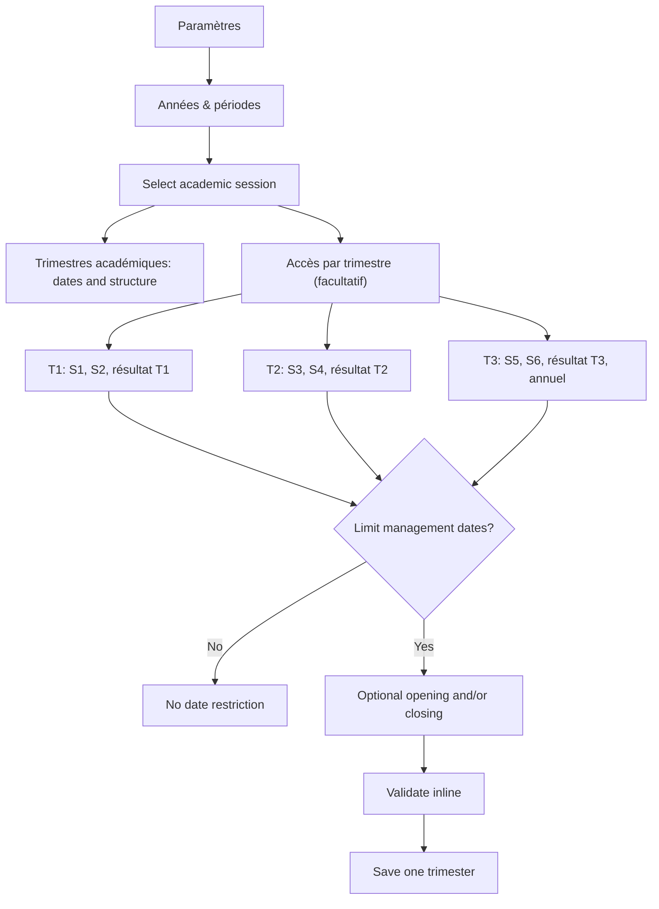

# Simplified trimester management windows — implementation handoff

## 1. Handoff metadata

- Prepared: 2026-08-11
- Repository branch: `codex/report-card-fidelity`
- Implementation baseline: `b41275a`
- Target runtime after implementation:
  - Frontend: `http://localhost:8085`
  - Backend: `http://localhost:8084`
  - Login: `admin` / `admin`
- Schema evolution: Flyway only; the next migration is `V85`.
- Intended implementer: a separate Codex task using `gpt-5.6-luna` with `max` reasoning.

Read this document completely before changing code. The goal is a deliberate replacement of the recently added per-action window system, not a second UI layered on top of it.

## 2. Product decision

The school does **not** need independent date windows for grade entry, teacher submission, review, validation, publication, and correction at session, trimester, and result-period scopes.

The new rule is:

> A session may have at most one optional management window for each trimester. While that trimester window is open, all academically applicable operations for the sequences and calculated results governed by that trimester may be performed. When no restriction is configured, there is no date-based restriction.

This means:

- T1 has zero or one management window.
- T2 has zero or one management window.
- T3 has zero or one management window.
- There is no session-wide workflow-window editor.
- There is no sequence-level or calculated-result-level window editor.
- There are no separate dates for entry, submission, review, validation, publication, or correction.
- There is no `INHERIT` concept in the user experience.
- Turning all three restrictions off means S1 through S6, all three trimester results, and the annual result have no **date** restriction.

Academic trimesters remain part of the required calculation structure. “Do not use trimester windows” means “do not impose date restrictions”; it does not remove T1/T2/T3, their dates, or their result calculations.

Permissions, session state, ownership, and workflow prerequisites remain in force. For example, an unrestricted window does not let a teacher publish a bulletin, does not make an incomplete grade packet submittable, and does not reopen an archived session.

## 3. Why the current implementation must be replaced

The live screen at `Paramètres → Années & périodes` currently renders all of the following at once:

- six session rules;
- six rules for each of three terms;
- up to six rules for every sequence, trimester result, and annual result;
- a separate emergency-override interface;
- legacy grade-entry and publication fields on the session form;
- legacy grade-entry and publication fields on each term form;
- a ten-field milestone-window modal;
- a wizard step that repeats all six actions for every milestone.

For a standard session with 10 result milestones, this exposes dozens of rows and dates to configure. The frontend also issues one effective-window request per action per period when loading the screen.

Relevant current implementation points:

- `backend/src/main/resources/db/migration/V83__session_rollover_readiness_foundation.sql`
  creates `academic_workflow_window_rule` and materializes every scope/action combination.
- `backend/src/main/java/com/bbc/sms/foundation/session/AcademicWindowPolicyService.java`
  resolves `PERIOD → TERM → SESSION`, then checks action-specific emergency overrides.
- `backend/src/main/java/com/bbc/sms/foundation/session/AcademicWindowRuleService.java`
  exposes normal CRUD for the normalized per-action rules.
- `frontend/src/app/features/settings/workflow-window-rules.ts`
  renders the large rule matrix.
- `frontend/src/app/features/settings/foundation-settings.ts`
  still exposes legacy session, term, and reporting-period window forms, overrides, the six-action wizard step, and six effective-window calls per period.
- `backend/src/main/java/com/bbc/sms/foundation/session/AcademicConfigurationCopyService.java`
  copies each workflow action and scope as a separate row.
- `backend/src/main/java/com/bbc/sms/foundation/session/AcademicSessionService.java`
  treats missing teacher-submission windows as readiness blockers.

Do not merely hide `WorkflowWindowRulesComponent`. The runtime policy, migration, rollover preview, readiness checks, APIs, errors, and all legacy editors must agree on the simpler rule.

## 4. Domain language

Use the following terms consistently in code and UI:

- **Academic term / trimester**: T1, T2, or T3, with required academic start and end dates.
- **Management window**: an optional date restriction attached to exactly one trimester.
- **Unrestricted**: no date gate for that trimester.
- **Limited**: an opening time, a closing time, or both restrict management of that trimester.
- **Governed milestones**: the sequences and calculated results controlled by a trimester’s management window.

French UI wording:

- Card title: `Accès par trimestre (facultatif)`
- Toggle: `Limiter les dates de gestion`
- Opening field: `Disponible à partir du`
- Closing field: `Disponible jusqu’au`
- Unrestricted badge: `Aucune restriction de date`
- Limited badge while active: `Gestion autorisée maintenant`
- Future badge: `Ouverture programmée`
- Expired badge: `Fenêtre terminée`

English UI wording:

- Card title: `Trimester access (optional)`
- Toggle: `Limit management dates`
- Opening field: `Available from`
- Closing field: `Available until`
- Unrestricted badge: `No date restriction`

Do not expose enum values such as `GRADE_ENTRY`, `INHERIT`, `LIMITED`, `PERIOD`, or `TERM` to administrators.

## 5. Governing map

The mapping is fixed by the academic result structure:

| Management window | Governed editable sequences | Governed calculated results |
| --- | --- | --- |
| T1 | S1, S2 | T1_RESULT |
| T2 | S3, S4 | T2_RESULT |
| T3 | S5, S6 | T3_RESULT, ANNUAL |

Resolution rules:

1. For a sequence or trimester-result period, use its `academic_term_id`.
2. Verify that the referenced term belongs to the same school and session.
3. For `ANNUAL_RESULT`, resolve the term whose `sequence_no = 3`.
4. If sequence number 3 is absent, allow a case-insensitive `code = 'T3'` fallback only to diagnose/migrate older valid data.
5. If no unique T3 can be resolved, fail with a structured `TERM_MAPPING_MISSING` configuration error. Do not silently choose another term.
6. Raw-grade actions remain not applicable to `TERM_RESULT` and `ANNUAL_RESULT`; this existing domain guard must remain.

The annual result is deliberately governed by T3. There must not be a fourth “annual window.”

## 6. Window semantics

Each trimester has one boolean product choice: restricted or unrestricted.

### 6.1 Unrestricted

- The restriction toggle is off.
- Both timestamps are null.
- Every applicable academic operation passes the date-policy check at any time.
- The UI clearly says this removes only date restrictions.

### 6.2 Opening only

- The restriction toggle is on.
- `opensAt` is set and `closesAt` is null.
- Operations are blocked before the opening instant.
- Operations remain available indefinitely after the opening instant, subject to normal permissions, states, and workflow rules.

### 6.3 Closing only

- The restriction toggle is on.
- `opensAt` is null and `closesAt` is set.
- Operations are available immediately and blocked after the closing instant.

### 6.4 Opening and closing

- The restriction toggle is on.
- Both timestamps are set.
- The closing instant must be strictly later than the opening instant.
- Operations are available inside the inclusive interval.

### 6.5 Boundary behavior

- At exactly `opensAt`, the window is open.
- At exactly `closesAt`, the window is still open.
- It becomes closed only when `now > closesAt`.
- Inject `Clock` into the policy service. Do not use hard-coded `Instant.now()` in logic that must be unit tested.

### 6.6 Relationship to academic dates

Academic term start/end dates define teaching and calculation boundaries. Management-window timestamps define operational access. Do not require the management window to be contained inside the term dates: schools may publish or correct T1 after T1 teaching has ended. Different trimester windows may overlap.

## 7. Target user flow



The administrator should understand the entire rule without opening a modal or reading technical documentation.

## 8. Persistence design

### 8.1 Flyway migration

Create:

`backend/src/main/resources/db/migration/V85__simplify_trimester_management_windows.sql`

Add these columns to `academic_term`:

```sql
management_window_limited BOOLEAN NOT NULL DEFAULT FALSE,
management_opens_at TIMESTAMPTZ,
management_closes_at TIMESTAMPTZ
```

Add a named check constraint equivalent to:

```sql
(
  management_window_limited = FALSE
  AND management_opens_at IS NULL
  AND management_closes_at IS NULL
)
OR
(
  management_window_limited = TRUE
  AND (management_opens_at IS NOT NULL OR management_closes_at IS NOT NULL)
  AND (
    management_opens_at IS NULL
    OR management_closes_at IS NULL
    OR management_closes_at > management_opens_at
  )
)
```

The term’s existing `timezone` remains authoritative. Do not add another timezone column.

Add database comments documenting that the three columns replace normal runtime use of action-specific session/term/period rules.

### 8.2 Backfill from V83 data

Existing production-like data already contains per-action windows. Preserve its broad operational intent by collapsing each term’s explicit limited rules into a single union envelope.

Candidate legacy rows for a term are:

- `TERM` rows attached to that term;
- `PERIOD` rows attached to reporting periods in that term;
- `SESSION` rows for that term’s academic session;
- for T3 only, `PERIOD` rows attached to the session’s `ANNUAL_RESULT` period.

Only rows with `mode = 'LIMITED'` participate. `INHERIT` and `UNRESTRICTED` rows do not create a new restriction.

For each term with at least one candidate:

- New opening is the earliest non-null legacy opening, except it must remain null if any participating limited row had no opening.
- New closing is the latest non-null legacy closing, except it must remain null if any participating limited row had no closing.
- If the union produces both endpoints null, store unrestricted.
- Otherwise store limited with the derived endpoints.

This intentionally fills gaps between former action phases. Once the trimester is available, the school can manage its applicable workflow at will.

For a term with no limited candidate, store unrestricted.

Do not migrate active emergency overrides into normal management windows. They are temporary historical actions, not configuration intent.

### 8.3 Legacy retention

Do not drop any of the following in V85:

- `academic_workflow_window_rule`;
- `academic_window_override`;
- legacy window columns on `academic_session`;
- legacy action-window columns on `academic_term`;
- legacy action-window columns on `academic_reporting_period`.

They may contain production history and may be required for rollback. Mark them deprecated in code comments and stop reading/writing them in normal runtime paths. A later, separately approved migration can remove them after production verification.

There must be no manual `ALTER TABLE` command outside Flyway.

## 9. Entity and DTO changes

### 9.1 `AcademicTerm`

Add:

- `boolean managementWindowLimited`
- `Instant managementOpensAt`
- `Instant managementClosesAt`

Keep the existing `@Version` field. A management-window update must increment the term version so two administrators cannot overwrite one another silently.

### 9.2 New API views

Add records similar to:

```java
TermManagementWindowView(
    UUID academicSessionId,
    UUID termId,
    String termCode,
    String termLabel,
    int termSequenceNo,
    LocalDate termStartDate,
    LocalDate termEndDate,
    boolean limited,
    Instant opensAt,
    Instant closesAt,
    String timezone,
    List<String> governedPeriodCodes,
    String state,
    Instant nextTransition,
    long version
)
```

```java
TermManagementWindowUpsert(
    boolean limited,
    Instant opensAt,
    Instant closesAt,
    Long version
)
```

Validation rules:

- `limited = false` requires both dates null.
- `limited = true` requires at least one date.
- when both are supplied, close must be after open.
- `version` is required for an existing term update.
- all IDs are tenant-scoped.

Return field-level API errors for `limited`, `opensAt`, `closesAt`, and `version` so the frontend can highlight the exact field.

### 9.3 Legacy DTOs

Do not add new uses of legacy action fields. Update normal session, term, and reporting-period forms so they no longer send those fields. Existing response properties can remain for compatibility during this release, but label them deprecated in TypeScript/Java and stop displaying them.

## 10. Backend service design

### 10.1 New authoritative service

Create `TermManagementWindowService` under `foundation/session` with:

- `list(sessionId)`
- `getForTerm(termId)`
- `update(sessionId, termId, upsert)`
- `resolveForPeriod(periodId)`
- `state(term, now)`

Responsibilities:

- tenant and session ownership checks;
- governing-period-code calculation;
- validation and optimistic locking;
- state calculation;
- before/after audit recording;
- friendly structured errors.

Audit action: `TERM_MANAGEMENT_WINDOW_UPDATED`.

Audit aggregate: `AcademicTerm`, using the term ID.

Audit before/after data must include `limited`, `opensAt`, `closesAt`, timezone, session ID, and governed period codes.

### 10.2 Policy adapter

Keep `AcademicWindowPolicyService.Action` and `assertOpen(periodId, action)` for this release because grade, report-card, validation, publication, and correction services already call that contract.

Refactor its implementation:

1. Load and tenant-check the reporting period.
2. Reject raw-grade actions on calculated result periods exactly as today.
3. Resolve the governing term through `TermManagementWindowService`.
4. Evaluate that one term window, without looking at the action.
5. Return the action in diagnostics only, so error messages can say what operation was attempted.

Every applicable action must return the same timestamps and state for a given period.

The effective source should be `TERM_MANAGEMENT_WINDOW`, never `SESSION`, `PERIOD`, `INHERIT`, or `EMERGENCY_OVERRIDE`.

### 10.3 Existing consumers

Keep date-policy calls in these services, but make them all resolve the same trimester window:

- `GradeEntryService`
  - grade draft/save: `GRADE_ENTRY`
  - send to management: `TEACHER_SUBMISSION`
  - management review: `REVIEW`
  - edits after publication: `CORRECTION`
- `SessionAcademicService`
  - assessment/grade operations: `GRADE_ENTRY`
  - post-publication changes: `CORRECTION`
- `ReportCardInputService`
  - remarks/conduct/review: `REVIEW`
  - approved/locked corrections: `CORRECTION`
- `BulletinSnapshotService`
  - validation: `VALIDATION`
  - publication: `PUBLICATION`
  - post-publication regeneration: `CORRECTION`

Do not remove these calls. The simplification is one shared time gate, not no time gate.

### 10.4 Session and workflow state

Verify every mutation still enforces its existing state rules. Add missing explicit checks if any service relied on a closed action window as its only protection.

At minimum:

- archived sessions remain immutable;
- closed sessions are not reopened by an unrestricted trimester;
- a packet cannot be submitted if required marks are incomplete;
- calculated results remain read-only inputs;
- validation precedes publication;
- correction behavior remains restricted to authorized roles and valid record states.

## 11. REST API

Add:

```text
GET /api/settings/academic-sessions/{sessionId}/term-management-windows
PUT /api/settings/academic-sessions/{sessionId}/terms/{termId}/management-window
```

Permissions:

- GET: `SESSION_VIEW`
- PUT: `SESSION_MANAGE`

The GET response must return terms in `sequenceNo` order and include the governed milestones. It should normally return exactly three rows for the standard structure.

Keep the existing effective-window endpoint temporarily:

```text
GET /api/settings/academic-sessions/{sessionId}/reporting-periods/{periodId}/effective-window?action=...
```

Its response must now be backed by the governing trimester. This preserves internal and diagnostic compatibility while the frontend moves to a single list request.

### 11.1 Deprecate per-action writes safely

The new frontend must not call:

- `GET/PUT .../{sessionId}/window-rules`
- `POST .../{sessionId}/window-overrides`

For one compatibility release:

- leave legacy GET endpoints available only for diagnostics if tests or older deployments require them;
- reject legacy PUT/POST mutation attempts with HTTP 409 and code `WORKFLOW_WINDOWS_REPLACED`;
- return a message directing administrators to `Paramètres → Années & périodes → Accès par trimestre`;
- keep override history readable/auditable;
- remove emergency overrides from effective-policy resolution immediately.

Do not silently translate an action-specific write into a trimester-wide write. That would broaden access without the caller understanding the impact.

## 12. Error contract and messages

Use stable codes and actionable messages.

### 12.1 Future opening

- HTTP: 409
- Code: `TRIMESTER_WINDOW_SCHEDULED`
- Example message:
  - French: `La gestion du trimestre T1 sera disponible à partir du 15 septembre 2026 à 07:00 (Africa/Douala). Cette restriction concerne S1, S2 et le résultat T1.`
  - English: `T1 management becomes available on 15 September 2026 at 07:00 (Africa/Douala). This restriction covers S1, S2, and the T1 result.`

### 12.2 Closed window

- HTTP: 409
- Code: `TRIMESTER_WINDOW_CLOSED`
- Message must include term, closing timestamp, governed milestones, and repair location.

### 12.3 Missing mapping

- HTTP: 409
- Code: `TERM_MAPPING_MISSING`
- Message: explain which result milestone is not linked to a valid term and direct the user to the academic configuration wizard.

### 12.4 Invalid input

- `TERM_WINDOW_ENDPOINT_REQUIRED`, field `opensAt`
- `TERM_WINDOW_RANGE_INVALID`, field `closesAt`
- `TERM_WINDOW_DATES_NOT_ALLOWED`, field `limited`
- `STALE_VERSION`, field `version`

The frontend must display the backend message and its field error rather than replacing it with a generic “invalid data” banner.

## 13. Frontend information architecture

Route remains:

`Paramètres → Années & périodes`

For the selected session, show sections in this order:

1. Session summary and status actions.
2. Readiness summary.
3. Reuse a previous session.
4. Trimestres académiques.
5. Accès par trimestre (facultatif).
6. Academic configuration wizard.
7. Results structure.
8. Calendar and expected-attendance generation.

Do not place the new cards below dozens of legacy rules. Remove the legacy rules and editors from the rendered screen.

## 14. Exact `Accès par trimestre` UX

Create a standalone Angular component, suggested name:

`frontend/src/app/features/settings/term-management-windows.ts`

It receives the selected session and permission state, loads all term windows once, and emits `changed` after a successful save.

### 14.1 Introductory copy

French:

`Ces limites sont facultatives. Sans limite, les opérations restent disponibles sans restriction de date tant que la session, vos droits et l’état du dossier les autorisent. Une seule limite couvre toutes les séquences et tous les résultats du trimestre.`

English equivalent must communicate the same distinction between date access and workflow authorization.

### 14.2 One card per term

Each card shows:

- `T1 · Trimestre 1`;
- academic term dates, read-only;
- affected milestones as readable chips;
- current access badge;
- `Limiter les dates de gestion` toggle;
- opening and closing inputs only while the toggle is on;
- a plain-language summary sentence;
- one `Enregistrer T1` button.

Examples of the summary sentence:

- Off: `S1, S2 et le résultat T1 n’ont aucune restriction de date.`
- Opening only: `Disponibles à partir du 15/09/2026 à 07:00, sans date de fermeture.`
- Closing only: `Disponibles immédiatement jusqu’au 20/12/2026 à 18:00.`
- Both: `Disponibles du 15/09/2026 à 07:00 au 20/12/2026 à 18:00.`

T3 must explicitly include `Résultat annuel` in its chips and summary.

### 14.3 Field validation

The implementation must follow the project’s improved form UX:

- fields have visible borders in normal state;
- required/invalid fields receive a red border after submit or blur;
- every invalid field has an inline message directly below it;
- focus the first invalid field after a failed submit;
- do not rely only on a disabled Save button;
- show a loading state on the card being saved, not on all three cards;
- show a success toast naming the term;
- retain entered values if the API fails.

When limited is on and both fields are empty:

- mark both inputs as needing at least one value;
- message: `Indiquez une date d’ouverture, une date de fermeture, ou les deux.`

When close is not after open:

- mark `Disponible jusqu’au` red;
- message: `La fermeture doit être postérieure à l’ouverture.`

### 14.4 Removing a restriction

If a saved limited window is switched off, clicking Save opens the application’s own confirmation modal. Do not use `window.confirm`, `prompt`, or another browser-native dialog.

The modal says which term is affected and that every governed milestone will become free of date restrictions. Confirming sends `limited=false` with null timestamps. Cancelling leaves the saved restriction unchanged.

## 15. Remove duplicate and obsolete UI

In `foundation-settings.ts`:

- remove `WorkflowWindowRulesComponent` import and rendering;
- stop rendering the action-specific override creation/history panels in normal settings;
- remove all legacy session window fields from the session form;
- rename `Périodes et fenêtres de publication` to `Trimestres académiques`;
- remove grade-entry/publication fields from term create/edit;
- remove every `Configurer les fenêtres` button from result milestones;
- delete the ten-field reporting-period window modal;
- delete related signals/methods such as `periodWindowDraft`, `editReportingPeriod`, and `saveReportingPeriodWindows`;
- stop calling effective-window API six times for every period;
- stop loading action-specific override lists for this screen;
- remove labels such as `Publication héritée`, `Soumission enseignants requise`, and action source/mode diagnostics;
- replace each result-card access line with its governing term and one friendly state summary.

Delete `workflow-window-rules.ts` and its tests if no other route imports them. Do not leave unreachable production UI code.

## 16. Academic configuration wizard

Change the wizard from six action-oriented steps to five product-oriented steps:

1. `Session / trimestres`
2. `Dates des résultats`
3. `Dépendances / calculs`
4. `Accès par trimestre (facultatif)`
5. `Vérification et confirmation`

Step 4 shows exactly three compact trimester drafts, not a period/action matrix. The drafts must use the same validation rules and wording as the standalone component.

The wizard promise says nothing is written before final confirmation; make that true:

- edits in Step 4 remain local;
- extend the standard-structure proposal/apply DTO to carry the three optional trimester-window proposals;
- include those proposals in the structure fingerprint;
- apply terms, periods, dependencies, and term windows in one backend transaction;
- write one audit summary plus the per-term before/after records;
- if the fingerprint is stale, write nothing.

Hide raw fingerprints from the main visual hierarchy. They may remain in an expandable technical-details area for support.

## 17. Result-structure display

Keep the ten standard milestones because they are real academic products:

- S1 through S6;
- T1_RESULT through T3_RESULT;
- ANNUAL.

For each card, show:

- code and readable label;
- type (`Séquence`, `Résultat du trimestre`, `Résultat annuel`), not raw enum;
- result dates;
- calculation summary for calculated periods;
- `Accès géré par T1/T2/T3`;
- the trimester’s friendly access state.

Do not show action-specific dates or an Edit windows button.

## 18. Session rollover and reuse

The feature completed in `b41275a` must remain, but its window scope must become term-oriented.

### 18.1 Scope rename

Replace `workflowWindows` with `termManagementWindows` in current frontend and backend DTOs.

For rolling compatibility, accept incoming JSON key `workflowWindows` as an alias for one release. Its meaning becomes “include trimester management limits”; do not copy the legacy rule matrix.

UI label:

`Limites d’accès par trimestre` / `Trimester access limits`

### 18.2 Preview rows

Preview at most one row per T1/T2/T3, keyed by stable sequence number and code, for example:

- `TERM_WINDOW:1:T1`
- `TERM_WINDOW:2:T2`
- `TERM_WINDOW:3:T3`

Each preview row shows:

- restricted/unrestricted toggle;
- optional opening;
- optional closing;
- source term;
- target term;
- affected milestones;
- status: `CREATE`, `KEEP`, `UPDATE`, `CONFLICT`, or `SKIP`.

Remove `WORKFLOW_WINDOW` rows and the old mode dropdown from the preview.

### 18.3 Date shifting

Map terms primarily by `sequenceNo`, then validate code.

Shift a source window relative to its source term start and apply the same local-day/time offset to the proposed target term start. This handles sessions whose trimester boundaries changed.

- Preserve local wall-clock time in the school timezone.
- Do not shift raw epoch seconds.
- Unrestricted source remains unrestricted.
- One-sided windows remain one-sided.
- If target term mapping is ambiguous, mark the row `CONFLICT` and block apply.

### 18.4 Merge and safety behavior

Keep the existing guarantees:

- target values remain unchanged by default;
- updates require the chosen merge mode/selection;
- preview is editable;
- fingerprint protects against stale apply;
- apply is idempotent;
- reason is required;
- copy run and audit records remain;
- rerunning the same apply does not duplicate rows.

Remove old action-window data from `termRows`; term academic dates and term access limits must be separate preview scopes.

## 19. Readiness

Update `AcademicSessionService.readiness()`.

Remove:

- `TEACHER_WINDOW_NOT_CONFIGURED` blockers;
- “choose unrestricted or add an opening/closing limit for S1” repair messages;
- the claim that teachers can submit only in separately configured action windows.

New access-readiness behavior:

- unrestricted is valid and ready;
- future, currently open, and expired limited windows are all valid configuration states and do not block readiness;
- invalid limited data is a blocker, although database/API constraints should normally prevent it;
- missing or ambiguous period-to-term mapping is a blocker;
- missing T3 for the annual result is a blocker;
- current time being outside a valid configured window is **not** a setup-readiness failure.

Suggested section:

- key: `TERM_ACCESS`
- label: `Trimester access`
- status: `READY`, `SCHEDULED`, or `BLOCKED`
- repair target: `term-management-windows`

Friendly ready text when all restrictions are off:

`Aucune restriction de date n’est configurée pour les trimestres.`

## 20. Security, concurrency, and audit

- Every query includes `school_id` from `TenantContext`.
- Never trust a term ID without confirming it belongs to the path’s session.
- GET requires `SESSION_VIEW`.
- PUT requires `SESSION_MANAGE`.
- Existing teacher/management role checks remain in mutation services.
- Use optimistic locking and return the current value after a stale-version conflict where the project’s error contract supports it.
- Audit normal updates and restriction removal.
- Do not log credentials, full request bodies, or unnecessary student data.
- Do not let a legacy override bypass the new term policy.

## 21. Backend tests

Add focused tests for every rule below.

### 21.1 Policy unit tests

1. T1 unrestricted allows every applicable action on S1, S2, and T1_RESULT.
2. All six applicable action checks return identical T1 timestamps/state.
3. Opening-only blocks before and allows at/after opening.
4. Closing-only allows before/at and blocks after closing.
5. Two-sided allows exactly at both boundaries.
6. T2 restriction has no effect on T1 or T3.
7. S3, S4, and T2_RESULT resolve T2.
8. S5, S6, and T3_RESULT resolve T3.
9. ANNUAL resolves T3.
10. Calculated result periods reject raw grade entry/submission as not applicable.
11. Missing/mismatched term produces `TERM_MAPPING_MISSING`.
12. Legacy rule rows no longer influence effective state.
13. Active legacy override no longer influences effective state.
14. Exact time behavior uses an injected fixed clock.

### 21.2 CRUD/API tests

1. List is tenant-scoped and ordered T1/T2/T3.
2. Unrestricted update requires null dates.
3. Limited requires at least one date.
4. Invalid range returns a field error for close.
5. Wrong-session term ID is not found/conflict without leaking another tenant.
6. Stale version is rejected.
7. Update increments version and emits audit before/after.
8. Legacy action-specific write is rejected with `WORKFLOW_WINDOWS_REPLACED`.

### 21.3 Migration tests

Test V85 against a database state equivalent to pre-V85 production:

1. No limited rows → all terms unrestricted.
2. Multiple two-sided period/action rows → earliest opening and latest closing.
3. One opening-less row → resulting opening null.
4. One closing-less row → resulting closing null.
5. Both union endpoints null → unrestricted.
6. Session limited rule participates in each term.
7. Annual limited rows participate only in T3.
8. Emergency overrides are not backfilled.
9. Legacy tables and columns remain present.
10. Re-running application startup does not alter already migrated values.

### 21.4 Rollover tests

1. Preview returns no more than three term-window rows.
2. Mapping uses sequence number safely.
3. Unrestricted copies as unrestricted.
4. One-sided dates remain one-sided.
5. Local time is preserved across shifted term boundaries.
6. Existing target remains KEEP by default.
7. Explicit selected update changes only selected term.
8. Ambiguous target mapping blocks apply.
9. Stale fingerprint writes nothing.
10. Apply is idempotent and audited.

## 22. Frontend tests

Add component/API tests covering:

1. Exactly one card per returned term; standard session shows three.
2. T3 card lists annual result.
3. Unrestricted card hides/disables date fields and displays the unrestricted message.
4. Turning restriction on reveals two clearly bordered optional fields.
5. Submitting both empty marks fields red and displays inline guidance.
6. Invalid close receives red border and precise message.
7. API field errors attach to the correct input.
8. Restriction removal uses an application modal and Cancel performs no request.
9. Saving one term does not place other cards in loading state.
10. Result cards show governing term, not action rules.
11. Wizard has five steps and stages window edits until final apply.
12. Rollover preview has trimester-access rows and no action/mode dropdown.
13. The settings screen makes one term-window list call, not 60 effective-window calls.

Add a source-level assertion or targeted test proving none of these administrator-facing strings remain in normal settings:

- `Validation opens`
- `Validation closes`
- `Publication opens`
- `Publication closes`
- `Review opens`
- `Review closes`
- `Teacher submission opens`
- `Teacher submission closes`
- `Nouvelle dérogation`
- `Configurer les fenêtres`
- `Workflow windows`

## 23. Implementation sequence

### Phase 0 — establish baseline

1. Confirm worktree is on `codex/report-card-fidelity` at or after `b41275a`.
2. Confirm it is clean before edits.
3. Run the focused existing session/window/copy tests.
4. Capture current live settings behavior for the implementation report.

### Phase 1 — schema and entity

1. Add V85 with constraints, comments, and deterministic backfill.
2. Add entity fields.
3. Add migration integration tests.
4. Verify migration on a copy of the current production-simulation database.

Suggested commit: `feat: add optional trimester management windows`

### Phase 2 — authoritative backend API

1. Add DTOs.
2. Implement `TermManagementWindowService` with injected `Clock`.
3. Add controller endpoints and permissions.
4. Add audit and optimistic-lock behavior.
5. Add service/controller tests.

Suggested commit: `feat: expose trimester access policy`

### Phase 3 — policy replacement

1. Refactor `AcademicWindowPolicyService` to resolve the governing term.
2. Remove hierarchy and emergency-override reads.
3. Preserve computed-period action applicability.
4. Verify all existing consumers.
5. Add state and action-equivalence tests.

Suggested commit: `refactor: unify academic actions under trimester access`

### Phase 4 — readiness and legacy API deprecation

1. Replace action-window readiness blockers.
2. Reject legacy writes with a structured migration message.
3. Keep history read-only.
4. Add compatibility tests.

Suggested commit: `refactor: retire per-action window configuration`

### Phase 5 — primary settings UX

1. Add `TermManagementWindowsComponent`.
2. Integrate it in the selected-session flow.
3. Remove all duplicate legacy editors, modals, requests, and labels.
4. Replace result-card access summaries.
5. Implement validation and confirmation UX.
6. Add frontend tests.

Suggested commit: `feat: simplify trimester access settings`

### Phase 6 — wizard and rollover

1. Convert the wizard to five steps.
2. Include staged trimester access in preview/fingerprint/apply.
3. Replace copy scope and rows.
4. Preserve merge, stale-preview, idempotency, and audit guarantees.
5. Add backend and frontend rollover tests.

Suggested commit: `feat: reuse trimester access across sessions`

### Phase 7 — cleanup and verification

1. Delete unreachable frontend action-window component code.
2. Search for old visible labels and legacy runtime reads.
3. Run backend tests.
4. Run frontend tests and production build.
5. Rebuild/redeploy Docker on 8085/8084.
6. Run the browser acceptance matrix below.
7. Restore test terms to unrestricted at the end unless preserving another state is explicitly needed.

Suggested commit: `test: verify simplified trimester access flow`

## 24. Docker and live acceptance matrix

Use the existing production-simulation database. Flyway must apply V85 automatically during backend startup.

### 24.1 Settings screen

1. Sign in at `http://localhost:8085` with `admin/admin`.
2. Click `Paramètres` in the left navigation.
3. Click `Années & périodes` in the top settings tabs.
4. Select `2026-2027`.
5. Verify there are no action-rule matrix, emergency override, or milestone-window buttons.
6. Verify one `Accès par trimestre (facultatif)` section with T1, T2, and T3.
7. Verify T3 explicitly lists the annual result.

### 24.2 Unrestricted behavior

1. Turn all three restriction toggles off and save each one.
2. Reload the page.
3. Confirm all three cards say `Aucune restriction de date`.
4. Confirm the readiness section does not report missing teacher-submission windows.
5. Query effective state for S1, S3, S6, T1_RESULT, and ANNUAL using at least two applicable actions each; they must be open and sourced from the governing term.

### 24.3 Future opening

1. On T1, enable restriction.
2. Set only an opening time in the future.
3. Save and reload.
4. Go to `Académique → Saisie des notes`.
5. Select S1, a class, and one assigned subject.
6. Attempt a grade mutation.
7. Verify the precise T1 scheduled message names S1/S2/T1 and the settings repair path.
8. Verify an S3 operation is unaffected.

### 24.4 Closing only and expired

1. Set T2 to closing-only with a future close; confirm S3/S4 operations work.
2. Change close to a past instant; confirm both S3 and S4 are blocked with the same T2 message.
3. Confirm T2_RESULT review/validation/publication checks share that same state.

### 24.5 T3 and annual

1. Set T3 to a currently open two-sided range.
2. Confirm S5 and S6 grade operations pass the date gate.
3. Confirm T3_RESULT validation/publication passes when workflow prerequisites are satisfied.
4. Confirm ANNUAL uses T3 and no annual-specific editor exists.

### 24.6 Remove restriction

1. Turn a saved limited term off.
2. Click Save.
3. Verify the custom confirmation modal explains the impact.
4. Click Cancel and verify no API request/state change.
5. Repeat and confirm; verify the term is immediately unrestricted.

### 24.7 Session reuse

1. Select a target session.
2. Open `Reuse a previous session`.
3. Select the source session.
4. Check `Trimester access limits`.
5. Preview.
6. Verify there are at most three access rows and no action names.
7. Edit one row, provide a reason, and apply.
8. Reload and verify only the intended target terms changed.
9. Reapply with the same idempotency context and verify no duplicates.

## 25. Completion evidence required from the implementing task

The final implementation report must include:

- branch and commit hashes;
- migration name and backfill summary;
- files added/changed/deleted;
- backend test command and counts;
- frontend test/build command and counts;
- Docker services/ports and migration startup result;
- exact live click paths tested;
- screenshots or DOM evidence showing only three term cards;
- API evidence showing S1/S2/T1 share a window and annual uses T3;
- confirmation that legacy tables remain but are not consulted by policy;
- confirmation that all temporary restrictions used in live tests were restored to a usable state;
- any residual risk or intentionally deferred cleanup.

## 26. Definition of done

This work is complete only when all statements are true:

1. An administrator sees no per-action window matrix in normal settings.
2. An administrator can configure zero or one management window for each T1/T2/T3.
3. Turning a restriction off clearly means no date restriction.
4. T1 governs S1, S2, and T1_RESULT.
5. T2 governs S3, S4, and T2_RESULT.
6. T3 governs S5, S6, T3_RESULT, and ANNUAL.
7. Every applicable action for a milestone uses the same governing term timestamps.
8. Raw-grade actions remain unavailable on calculated results.
9. Permissions, session state, and workflow prerequisites remain enforced.
10. Existing per-action production data is safely collapsed by Flyway V85.
11. Legacy rules and overrides no longer affect runtime decisions.
12. Session readiness accepts unrestricted terms and no longer requires teacher-submission windows.
13. The new-session wizard uses no action matrix and writes only at final confirmation.
14. Session reuse previews and copies at most three trimester limits.
15. Fields have visible borders, inline validation, precise errors, and a custom confirmation when removing a restriction.
16. Backend, frontend, migration, Docker, and browser tests pass.
17. No database column is added or changed manually.

## 27. Non-goals

- Do not remove the three academic terms.
- Do not remove S1–S6, term-result, or annual-result milestones.
- Do not change the result formulas or dependency weights.
- Do not weaken grade completeness, approval, validation, publication, or correction rules.
- Do not redesign teacher/class/subject assignment in this task.
- Do not drop legacy window history in V85.
- Do not reintroduce per-action controls under another name.
- Do not add an annual window.

## 28. Implementer instruction

Implement the entire document in the assigned worktree. Preserve unrelated changes. Use Flyway only for schema evolution. Commit coherent phases, but do not push unless the user explicitly asks. Rebuild the Docker stack on ports 8085/8084 and complete browser acceptance with `admin/admin`. If an existing implementation detail conflicts with this document, preserve the product rules in Sections 2, 5, and 6 and describe the technical adjustment in the final report.
